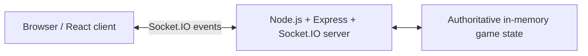

# Madiao

Madiao is a browser-based **2–6 player online multiplayer card game** built with React, Node.js, Express and Socket.IO, then containerised with Docker for deployment on a Linux server.

The game is inspired by the Chinese card game Madiao, with bluffing, declarations and challenges forming the core gameplay loop. To keep things fair and reduce cheating opportunities, the server is authoritative over the game state: it owns player hands, validates actions, resolves challenges, controls timers and decides when a game has been won, while clients receive only the public state and their own private hand.

> [**Technical documentation**](https://178.105.59.4/docs)

<!-- Here I will add a GIF of the game being played once I get it done. -->
<!-- Example:  -->

## About the Project

Madiao started as a personal project based around a simple bluffing card game to play with friends,
but gradually grew into a larger exercise in real-time multiplayer application development.

As the game became more complex, features such as hidden hands, timed turns and challenge windows introduced problems that could not safely be handled by the browser alone. 
The project therefore moved toward a server-authoritative design, with the Node.js server responsible for validating actions and controlling game progression.

This required handling issues such as delayed network messages, duplicate submissions, stale actions, disconnects and multiple clients attempting actions close to the same deadline.

## Gameplay

Madiao supports 2–6 players in a shared lobby.

During a turn, a player plays one or more cards while declaring their value.
The following player can either continue the round or challenge the previous declaration.

When a challenge is made, the server determines whether the previous declaration was honest. 
The losing player takes the pile and goes through the drinking sequence. Repeated drinking can eventually eliminate a player from the game.

The game continues until a player successfully empties their hand or only one active player remains. 
Players can then ready up for a rematch without creating a new lobby.

## Key Features

- Real-time 2–6 player multiplayer lobbies.
- Server-authoritative game state and action validation.
- Private player hands using separate public and player-specific Socket.IO state updates.
- Timed turns with client countdowns and server-owned deadlines.
- Declaration and challenge system with stale-action protection.
- Automatic submission close to the turn deadline.
- Challenge, timeout, drinking and elimination sequences.
- Rematch readiness without recreating the lobby.
- Responsive game-table layout for different player counts.
- Docker-based client/server production deployment.
- Detailed technical documentation, troubleshooting and recovery procedures.

## Architecture



The client is responsible for presentation and player input. The Node.js server remains authoritative over the game itself, including:

- lobby and player management
- private card ownership
- turn progression
- declarations and challenges
- game timers
- drinking and elimination
- win conditions and rematches

The game itself is split into separate client and server containers. The production Compose stack also includes a third container for the project documentation.

```text
Browser
   │
   ├── HTTP ───────> nginx container ───────> React production build
   │
   └── Socket.IO ──> Node.js server container

                    Docker Compose
```

## Technology Stack

| Area | Technologies |
| --- | --- |
| Front end | React, JavaScript, CSS, Socket.IO Client |
| Back end | Node.js, Express, Socket.IO |
| Deployment | Docker, Docker Compose, nginx, Linux |
| Documentation | MkDocs Material, Markdown, Mermaid |
| Version control | Git, GitHub |

## Game Flow

A normal play moves through a small number of server-controlled phases:

```text
select cards
    - declare
    - pending play
    - challenge window
    - challenge OR next declaration
    - resolve/merge into pile
    - next turn
```

Only the current pending play can be challenged. Once the next declaration is confirmed, the previous pending cards become part of the pile and can no longer be challenged.

If a challenge is made, the server reveals the submitted cards, determines whether the declaration was honest, applies the result, updates the game state and resumes play after the resolution sequence.

## Running with Docker

### Requirements

- Docker
- Docker Compose

### 1. Clone the repository

```bash
git clone https://github.com/Gearsik/madiao.git
cd madiao
```

### 2. Create the environment file

Copy the supplied example:

```bash
cp .env.example .env
```

The default local values are:

```env
CLIENT_ORIGIN=http://localhost:3000
REACT_APP_SERVER_URL=http://localhost:3001
```

### 3. Validate the Compose configuration

```bash
docker compose config
```

### 4. Build and start the application

```bash
docker compose build
docker compose up -d
```

The default local endpoints are:

- Client: `http://localhost:3000`
- Server: `http://localhost:3001`

### 5. Check the running services

```bash
docker compose ps
```

To stop the application:

```bash
docker compose down
```
And that's enough.
For more detailed explanations, please use the documentation linked below.

## Documentation
[**Technical documentation**](https://178.105.59.4/docs)

The documentation source is stored in [`docs/`](docs/) and configured through [`mkdocs.yaml`](mkdocs.yaml).

## Repository Structure

```text
madiao/
├── client/                 React browser application
├── server/                 Node.js/Socket.IO game server
├── docs/                   MkDocs technical documentation and runbook
├── compose.yaml            Production service orchestration
├── mkdocs.yaml             Documentation-site configuration
├── CHANGELOG.md            Notable fixes and project changes
└── .env.example            Example deployment configuration
```

## Current Limitations

Madiao was intentionally kept fairly small and currently has several known operational limitations:

- Active lobbies and games are stored in server memory and do not survive a server restart.
- Player reconnection is not currently implemented; refreshing creates a new Socket.IO connection.
- There is no persistent database or match history.
- Production deployment is currently performed manually with Git and Docker Compose.
- Automated test coverage is still limited.

## Project Status

Madiao is feature-complete for its original portfolio scope and is currently at version `0.3.0`.

The main gameplay, multiplayer flow, Docker deployment and project documentation are complete. 
Future work would focus primarily on automated testing, reconnection/persistent sessions and further deployment improvements rather than expanding the game into a larger product.
