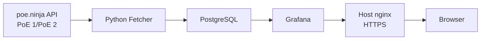

# PoE Tracker Documentation

The PoE Tracker started as a fairly small project for collecting currency data
from the poe.ninja API and storing it somewhere that could be looked at later.

Over time, the project developed into a small self-hosted data pipeline. It now
collects currency data for both Path of Exile and Path of Exile 2, stores
historical snapshots in PostgreSQL and displays the collected data through a
Grafana dashboard.

The entire stack runs in Docker containers on the same production server as
Madiao. Grafana is exposed through the existing nginx HTTPS reverse proxy, while
PostgreSQL remains inside the Docker network and pgAdmin is only made available
locally when it is needed.

Compared with Madiao, there is considerably less application-specific behaviour
to document here. Most of the useful information relates to operating the
containers, checking that data is still being collected, updating the deployed
version and recovering from problems encountered while maintaining the project.

For that reason, the PoE Tracker documentation is deliberately kept small.

## How to Use This Documentation

The documentation is split into two pages.

The operations page contains the commands and procedures used during normal
maintenance. This includes updating the deployed project, rebuilding containers,
checking logs, manually triggering a data fetch and accessing the database or
optional administration tools.

The troubleshooting page focuses on problems which have actually occurred while
developing and deploying the tracker. It records the symptoms, likely causes and
the steps used to recover from them so the same problems do not have to be
diagnosed again from the beginning.

## Where to Start

| If you want to... | Start here |
| --- | --- |
| Update the deployed tracker | [Operations](operations.md) |
| Check whether the containers are running | [Operations](operations.md) |
| Confirm that new currency data is being collected | [Operations](operations.md) |
| Manually trigger a poe.ninja API fetch | [Operations](operations.md) |
| Access PostgreSQL or pgAdmin | [Operations](operations.md) |
| Diagnose a fetcher or database problem | [Troubleshooting and Recovery](troubleshooting.md) |
| Recover from a stale Docker image or schema problem | [Troubleshooting and Recovery](troubleshooting.md) |
| Reset the project and perform a clean deployment | [Troubleshooting and Recovery](troubleshooting.md) |

## Current Production Structure

At a high level, the deployed project works as follows:

The fetcher periodically discovers the current league for each configured game,
requests the latest currency data and writes a new historical snapshot to
PostgreSQL.

Grafana reads from the same database and provides the dashboard used to inspect
currency values over time, switch between games and leagues, and compare the
latest stored prices.

The tracker runs independently on the production server. An SSH session or local
computer does not need to remain connected for scheduled data collection to
continue.