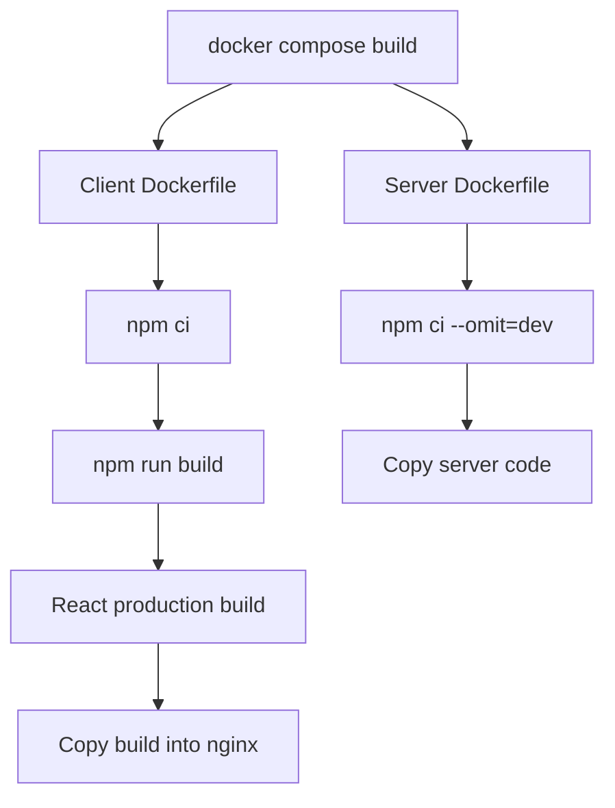
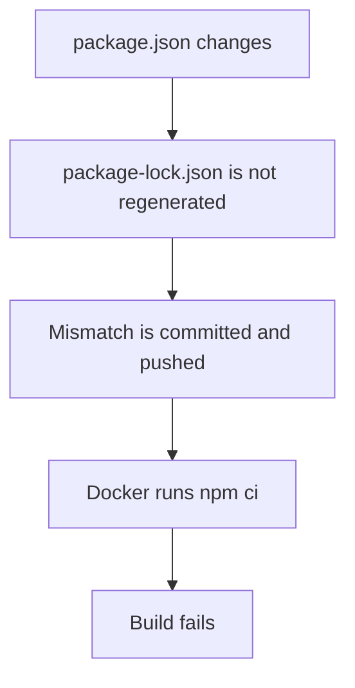
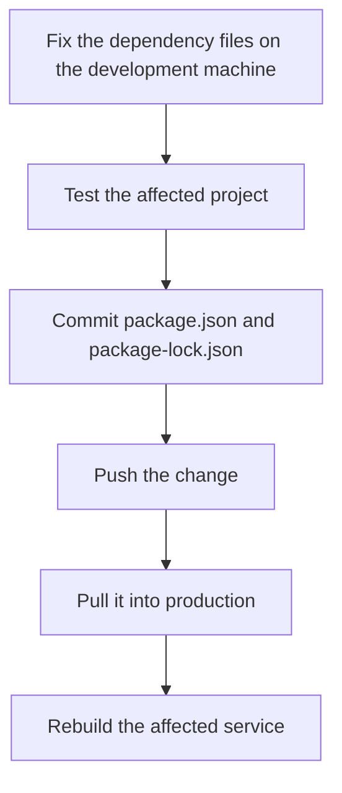
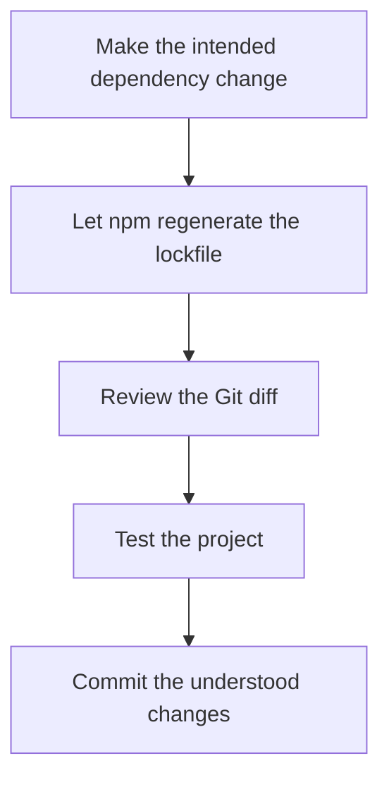
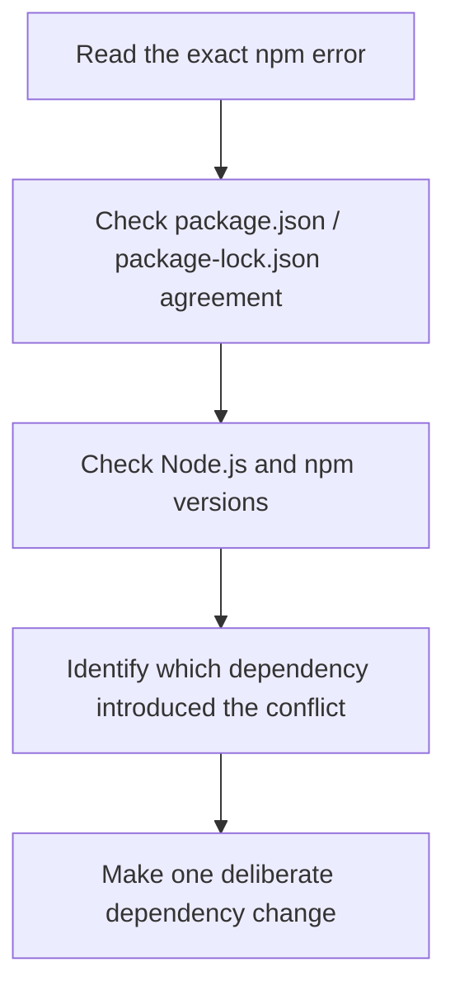
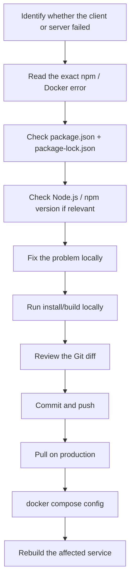
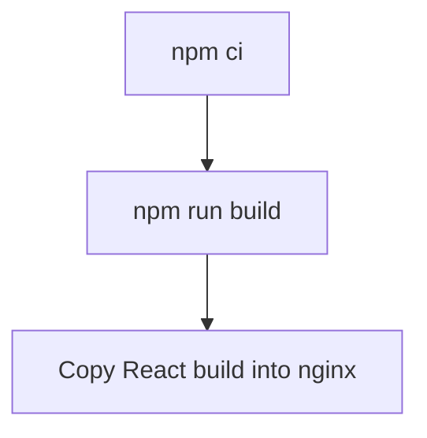
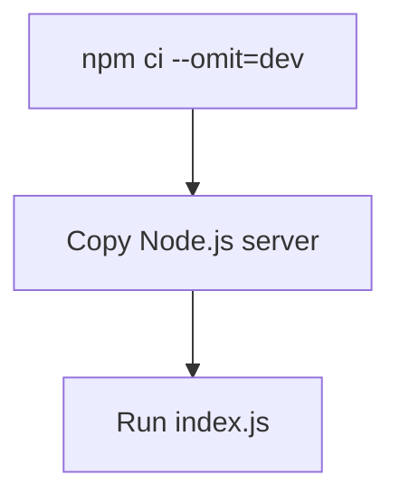

# Build and Dependency Problems

Most normal Madiao deployments are fairly uneventful once Docker has a valid
Compose file and both services have already been built successfully before.

When a deployment does fail however, the error often happens before either
container is even started.

The most common build-related areas are:

- `package.json`
- `package-lock.json`
- npm
- Node.js
- Dockerfiles
- the React production build
- Docker Compose YAML

These problems can look more complicated than they actually are because Docker
prints output from several different layers at once.

The most useful first question is therefore:

> Which exact command failed?

For Madiao, the build path is roughly:



Finding which step failed normally reduces the problem considerably.


## `npm ci` Failure

Both Madiao Dockerfiles currently use `npm ci`.

The client build contains:

```dockerfile
COPY package*.json ./
RUN npm ci
```

while the server uses:

```dockerfile
COPY package*.json ./
RUN npm ci --omit=dev
```

The difference is intentional.

The React client needs its development/build tooling, including
`react-scripts`, while the production server does not need development-only
packages such as `nodemon`.


### Why `npm ci` is used

`npm ci` is stricter than a normal:

```bash
npm install
```

It expects:

`package.json` **and** `package-lock.json`

to already agree with each other.

That is useful for production builds because Docker should reproduce the
dependency tree which was committed to Git rather than quietly resolving a new
one during deployment.


### Typical lockfile mismatch

A common error looks roughly like:

```text
npm ci can only install packages when
package.json and package-lock.json are in sync
```

This normally means one of the dependency files was changed without the other
being updated correctly.

For example:




### Do not fix this by changing the Dockerfile to `npm install`

Replacing:

```dockerfile
RUN npm ci
```

with:

```dockerfile
RUN npm install
```

may make the build continue, but it removes the useful check which exposed the
problem.

It also allows production to resolve a dependency tree which may not match what
was tested during development.

!!! warning "Do not weaken the production install just to make the build pass"
    Replacing `npm ci` with `npm install` can hide the mismatch rather than fix
    it. The safer approach is to repair the dependency files, test them and
    commit the corrected `package-lock.json`.

The better fix is to correct the package files themselves.


### Fix the relevant project, not the repository root

Madiao has separate package files for:

- `client/`
- `server/`

so first move into the side which failed.

For the client:

```bash
cd client
```

For the server:

```bash
cd server
```

Then inspect:

```bash
git diff package.json package-lock.json
```

If an intentional dependency change was made, update the lockfile on the
development machine using npm, test the project and commit both files together.

For example:

```bash
npm install
```

or, when only the lockfile deliberately needs to be recalculated:

```bash
npm install --package-lock-only
```

Afterwards:

```bash
git diff package.json package-lock.json
```

should be reviewed before committing.


### Avoid repairing the lockfile directly on production

!!! note "Repair dependency files on the development machine"
    Production should normally consume package files which were already tested
    and committed. Generating a different lockfile directly on the live server
    makes the deployed copy harder to reproduce.

The production server should normally consume the dependency files already
stored in Git.

Generating a different lockfile directly on the live server makes the production
copy diverge from the repository and makes the next deployment harder to
understand.

A better flow is:




## `package.json` and `package-lock.json`

Each side of Madiao has its own dependency definition.

The client currently depends on packages including:

- `react`
- `react-dom`
- `react-scripts`
- `socket.io-client`
- Testing Library packages
- `web-vitals`

The server is considerably smaller and mainly uses:

- `express`
- `socket.io`

with:

`nodemon`

as a development dependency.


### What `package.json` does

`package.json` describes the dependencies and scripts the project expects.

For example, the client defines:

```json title="client/package.json"
"scripts": {
    "start": "react-scripts start",
    "build": "react-scripts build",
    "test": "react-scripts test",
    "eject": "react-scripts eject"
}
```

The Docker client build eventually runs:

```bash
npm run build
```

which therefore resolves to:

`react-scripts build`


### What `package-lock.json` does

The lockfile stores the resolved dependency tree in considerably more detail.

A dependency written in `package.json` may allow a range of versions.

For example:

```json title="client/package.json"
"socket.io-client": "^4.8.3"
```

The lockfile records the exact packages npm resolved within that allowed range,
including their own transitive dependencies.

This is why the lockfile should remain committed.


### Update both together when necessary

If a dependency is deliberately added or changed, the normal result is a change
to both:

- `package.json`
- `package-lock.json`

Commit them together.

If only one unexpectedly changed, it is worth understanding why before
deploying.


### Do not manually edit the lockfile unless there is a very specific reason

`package-lock.json` is generated by npm.

It is large and contains relationships which are easy to damage by hand.

Normally the safer approach is:




## Node and npm Version Differences

A dependency installation can behave differently under different Node/npm
versions.

This matters because there are potentially several environments involved:

| Environment | Node/npm source |
| --- | --- |
| Development machine | Locally installed Node.js/npm |
| Docker client build | Client Docker base image |
| Docker server build | Server Docker base image |

The current Dockerfiles use:

```dockerfile title="server/Dockerfile"
FROM node:24-alpine
```

for the server and:

```dockerfile title="client/Dockerfile"
FROM node:24-alpine AS build
```

for the React build.

That means the production dependency installation happens inside Node 24-based
Docker images rather than using whatever Node version happens to be installed on
the host machine.


### Check versions when behaviour differs

Useful commands are:

```bash
node --version
npm --version
```

On the development machine these show the local environment.

Inside Docker, the version comes from the selected Node base image.

If something installs locally but fails during:

```bash
docker compose build
```

the version difference becomes worth checking.


### The Docker tag is still a range

Although:

`node:24-alpine`

fixes the Node major version, it does not permanently pin one exact patch
release or one exact npm release forever.

A later Docker pull may therefore contain a newer Node 24 patch/npm combination.

That is normally fine, however, if dependency reproducibility becomes a recurring
problem, the base image can be pinned more tightly later.


### Do not add random dependencies only to silence an npm error

Peer-dependency or lockfile errors sometimes tempt us to install whatever npm
mentions until the warning disappears.

That can create a package tree which technically installs but no longer reflects
what the application actually needs.

A better order is:




### Be careful with forced audit fixes

A command such as:

```bash
npm audit fix --force
```

can upgrade packages across breaking version boundaries.

It should therefore not be used as a routine way of fixing a Docker build.

!!! warning "Do not use `npm audit fix --force` as a generic build repair"
    A forced audit fix can move dependencies across breaking-version
    boundaries. Review security findings separately from the immediate build
    error and make deliberate dependency changes.

Security warnings should be reviewed, but a dependency audit and a broken build
are not automatically the same problem.


## Docker Build Failure

A Docker build error can come from npm, the application build, a missing file,
the Dockerfile itself or the machine running Docker.

The most useful thing is to identify the failing service first.


### Build one service at a time

Client:

```bash
docker compose build client
```

Server:

```bash
docker compose build server
```

This removes a large amount of unrelated output and makes it obvious which image
cannot be built.


### Read the last successful Dockerfile step

For the current server Dockerfile the rough sequence is:

```dockerfile
FROM node:24-alpine
WORKDIR /app
COPY package*.json ./
RUN npm ci --omit=dev
COPY . .
EXPOSE 3001
CMD ["node", "index.js"]
```

For the client:

```dockerfile
FROM node:24-alpine AS build
WORKDIR /app
COPY package*.json ./
RUN npm ci
COPY . .
RUN npm run build

FROM nginx:alpine
COPY --from=build /app/build /usr/share/nginx/html
EXPOSE 80
CMD ["nginx", "-g", "daemon off;"]
```

If the output says failure happened during:

`RUN npm ci`

the problem is probably dependency-related.

If it happens during:

`RUN npm run build`

the dependency install already succeeded and the React build itself is the more
interesting area.

If it happens during:

`COPY`

look at the build context, file path and `.dockerignore`.


### Remember the build contexts

Docker Compose currently builds from:

- `./client`
- `./server`

That means the client Dockerfile can only access files inside the client build
context and the server Dockerfile can only access files inside the server build
context.

A Dockerfile cannot casually copy a file from:

`../some-root-file`

outside its build context.


### Check `.dockerignore`

Files ignored by `.dockerignore` are not sent into the build context.

If Docker says a required file does not exist even though it is visible on the
development machine, check whether it is being excluded.


### Get more detailed build output

If the normal output hides useful detail:

```bash
docker compose build --progress=plain client
```

or:

```bash
docker compose build --progress=plain server
```

can make the build steps easier to follow.


### Use `--no-cache` only when there is a reason

Docker's cache is normally useful.

If there is evidence that a stale cached layer is hiding a change, rebuild with:

```bash
docker compose build --no-cache client
```

or:

```bash
docker compose build --no-cache server
```

!!! tip "Use `--no-cache` only when cache is actually suspicious"
    A no-cache rebuild is useful when there is evidence that Docker reused a
    stale layer. It does not repair invalid dependencies, missing files or
    broken application code.

This should not be the first response to every build problem because it makes the
build slower without fixing an invalid dependency or broken source file.


### Check available disk space

A server which has been rebuilding Docker images for a long time can also simply
run out of space.

Useful checks are:

```bash
df -h
docker system df
```

If disk use is the real issue, clean unused Docker resources carefully rather
than changing application code. The safer cleanup commands and the difference
between Docker resources are covered in
[Cleaning Up Old Docker Resources](docker-operations.md#cleaning-up-old-docker-resources).


## React Build Failure

The client has one additional build stage which the server does not have:

```bash
npm run build
```

This runs:

```text
react-scripts build
```

and produces the static files later copied into nginx.


### Reproduce the React build separately

If the Docker error points specifically at:

```text
RUN npm run build
```

try the build from the client project itself:

```bash
cd client
npm run build
```

If it fails in the same way, Docker is probably only exposing an ordinary React
compile/build problem.


### Typical causes

Useful things to check include:

- syntax errors;
- broken imports;
- missing files;
- wrong relative paths;
- case differences in file names;
- ESLint/build errors;
- environment variables;
- dependency incompatibilities.


### File-name case can matter

Linux file systems are normally case-sensitive.

That means:

```js
import PlayerFrame from './PlayerFrame';
```

and:

`playerFrame.jsx`

are not the same path on Linux.

A case mismatch can therefore survive on a case-insensitive development file
system and then fail when the Docker build runs on Linux.

If a module is reported as missing even though the file appears to exist, check
the exact spelling and capitalisation.


### Environment variables are read during this build

The production client reads:

`client/.env.production`

during:

```bash
npm run build
```

That is when:

`REACT_APP_SERVER_URL`

becomes part of the generated JavaScript bundle.

If the build succeeds but the finished application points to the wrong server,
the issue may not be a failed build at all.

It may simply have been built successfully using the wrong production value.

The client variable and the reason it is applied during the React build are
covered in
[`REACT_APP_SERVER_URL`](../technical/environment-configuration.md#react_app_server_url)
and
[Why the Client Variable Is a Build-Time Setting](../technical/environment-configuration.md#why-the-client-variable-is-a-build-time-setting).


### Build succeeds locally but fails in Docker

Compare:

- Node.js version;
- npm version;
- file-name case;
- installed dependencies;
- files actually included in the Docker build context.

A local `node_modules` directory is not copied into the image.

The Docker build starts from the dependency definition stored in the package
files, which is exactly why it can reveal problems hidden by an old local
installation.


## Docker Compose YAML Errors

Some problems happen before Docker even reaches a Dockerfile.

The first command to run after changing Compose is:

```bash
docker compose config
```

The normal configuration check is explained in
[Checking the Final Docker Configuration](../technical/environment-configuration.md#checking-the-final-docker-configuration).

If this fails, fix the YAML before attempting:

```bash
docker compose build
```


### Indentation matters

YAML uses indentation to describe structure.

For example:

```yaml title="docker-compose.yml"
services:
  server:
    ports:
      - "3001:3001"
```

is not equivalent to moving `ports` to the wrong indentation level.


### `ports` must be a list

Correct:

```yaml title="docker-compose.yml"
ports:
  - "3001:3001"
```

A malformed structure can produce errors similar to:

`services.<service>.ports must be an array`

The error is basically telling us Docker expected a list of port mappings but
received a different YAML type.


### Quotes are useful for port mappings

Writing:

```yaml
- "3000:80"
```

and:

```yaml
- "3001:3001"
```

keeps the mapping clearly treated as a string.


### Validate after every Compose edit

A useful small routine is:

```bash
docker compose config
```

immediately after saving `docker-compose.yml`.

Only once that succeeds move to:

```bash
docker compose build
```

This keeps YAML errors separate from application build errors.


## Build Argument Problems

The current Madiao Compose file does **not** use a `build.args` section.

The React production URL currently comes from:

`client/.env.production`

which is read when:

```text
npm run build
```

runs inside the client image. The current configuration path is documented in
[Development and Production Environments](../technical/environment-configuration.md#development-and-production-environments).

This section is still worth keeping because an earlier deployment approach used
a Docker build argument, and build arguments may become useful again in the
future.


### Correct mapping form

If a build argument is reintroduced, a normal Compose structure looks like:

```yaml
client:
  build:
    context: ./client
    args:
      REACT_APP_SERVER_URL: ${REACT_APP_SERVER_URL}
```

A malformed version such as:

```yaml
args:
  - REACT_APP_SERVER_URL: ${REACT_APP_SERVER_URL}
```

can cause an error similar to:

```text
services.client.build.args.[0]:
unexpected type map[string]interface {}
```

The dash turns that line into a list item containing a mapping, which is not the
shape expected there.


### The Dockerfile must also use the argument

Passing a build argument through Compose is only half of the setup.

The Dockerfile must declare/use it before the React build, for example:

```dockerfile title="client/Dockerfile"
ARG REACT_APP_SERVER_URL
ENV REACT_APP_SERVER_URL=$REACT_APP_SERVER_URL

RUN npm run build
```

Otherwise Compose can pass the argument successfully while the React build never
uses it.


### Do not mix two configuration methods accidentally

For the current project the production value is provided through:

```text
client/.env.production
```

If build arguments are added later, decide which method is the actual source of
truth.

Having:

| Source | Problem |
| --- | --- |
| `.env.production` | Supplies one address |
| Docker build argument | Supplies a different address |

That creates two competing sources of truth.

makes troubleshooting unnecessarily confusing.

!!! note "The current project uses `.env.production`, not `build.args`"
    The build-argument examples in this section are historical/reference
    material. The current client production URL comes from
    `client/.env.production` during `npm run build`.

One clear configuration path is better than two competing ones.


## A Clean Dependency Repair Process

When a build has failed around packages, a sensible repair sequence is:




### Client example

From the development machine:

```bash
cd client

npm install
npm run build

git diff package.json package-lock.json
```

Once the changes are understood and committed, production can use:

```bash
cd ~/madiao
git pull

docker compose config
docker compose build client
docker compose up -d client
```


### Server example

For an intentional server dependency change:

```bash
cd server

npm install

git diff package.json package-lock.json
```

After committing and pulling:

```bash
docker compose build server
docker compose up -d server
```

Remember that replacing the server clears active games. The reason for that is
covered in
[In-Memory Game State](../technical/limitations.md#in-memory-game-state).


## Quick Build Diagnosis

The error location normally gives a strong hint about where to look.

Once the build problem itself is resolved, return to
[Normal Production Updates](production-updates.md#normal-update-command-sequence) for the usual production
deployment sequence.

| Failure point | First thing to check |
| --- | --- |
| `docker compose config` | Compose YAML structure |
| `COPY package*.json` | Build context / missing package files |
| `npm ci` | `package.json` / lockfile / npm compatibility |
| `npm ci --omit=dev` | Server dependency files |
| `npm run build` | React source/build/environment |
| `COPY . .` | Build context / `.dockerignore` / file paths |
| nginx copy stage | Did React actually produce `/app/build`? |
| Build says no space left | `df -h`, `docker system df` |
| Local build works, Docker fails | Node/npm version, Linux path case, build context |
| Build succeeds but old behaviour remains | Container may not have been recreated |


## Chapter Summary

The main build path for both Madiao services begins with the package files.

The client currently performs:



while the server performs:



Both Dockerfiles currently use Node 24 Alpine for their Node stages.

`npm ci` is deliberately strict. If `package.json` and `package-lock.json` do
not agree, the correct fix is normally to repair and commit the dependency files
rather than replacing `npm ci` with a looser production install.

When a Docker build fails, identify the exact Dockerfile step first. Dependency
errors, React compile errors, missing build-context files and Compose YAML errors
all require different fixes even though they may initially appear under the same
`docker compose build` command.

For Compose itself:

```bash
docker compose config
```

should be used before every build after editing the YAML.

Lastly, the current project does not need a Docker build argument for
`REACT_APP_SERVER_URL` because `client/.env.production` is read during the React
build. If build arguments are introduced again later, keep that configuration
path clear and avoid having two different sources supplying conflicting values.
