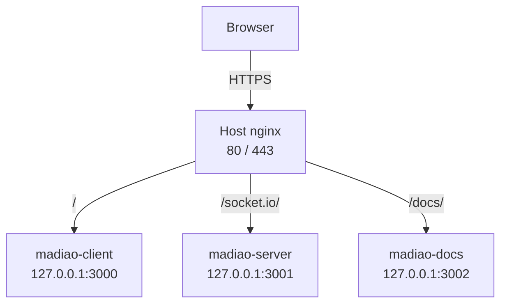

# Changes After HTTPS

The earlier deployment and operations pages describe Madiao using its original
direct-port setup.

In that version of the deployment, the browser reaches the React client through
port `3000`, connects to the Node.js / Socket.IO server through port `3001`, and
the documentation is available through port `3002`.

That setup is useful because it allows each part of the application to be tested
separately before anything else is placed in front of it.

The [HTTPS and Reverse Proxy](https-and-reverse-proxy.md) setup adds another
layer after the original deployment is already working.

Once that has been completed, some of the addresses, Docker port mappings and
health checks shown in the earlier pages are no longer the ones used by the
final production server.

This page records those differences.

It is not another HTTPS setup guide. The actual nginx, Certbot and certificate
configuration is covered in
[HTTPS and Reverse Proxy](https-and-reverse-proxy.md).

The purpose here is simply to show what changes in the rest of the
documentation once that setup has been applied.

## Before and After

The easiest way of looking at the difference is:

| Area | Original deployment | After HTTPS |
| --- | --- | --- |
| Game | `http://<server-ip>:3000` | `https://<server-ip>/` |
| Socket.IO | `http://<server-ip>:3001` | `https://<server-ip>/socket.io/` |
| Documentation | `http://<server-ip>:3002` | `https://<server-ip>/docs/` |
| Client host binding | `3000:80` | `127.0.0.1:3000:80` |
| Server host binding | `3001:3001` | `127.0.0.1:3001:3001` |
| Documentation host binding | `3002:80` | `127.0.0.1:3002:80` |
| Public web ports | `3000`, `3001`, `3002` | `80`, `443` |
| Public entry point | Individual Docker services | Host nginx |
| TLS | None | Let's Encrypt certificate |

The Docker containers have not stopped using ports `3000`, `3001` and `3002`.

What changed is where those ports can be reached from.

Before the reverse proxy they can be used as public entry points.

Afterwards they are bound to `127.0.0.1`, which means the host nginx process can
still reach them but another machine on the internet cannot.

The final path therefore becomes:

