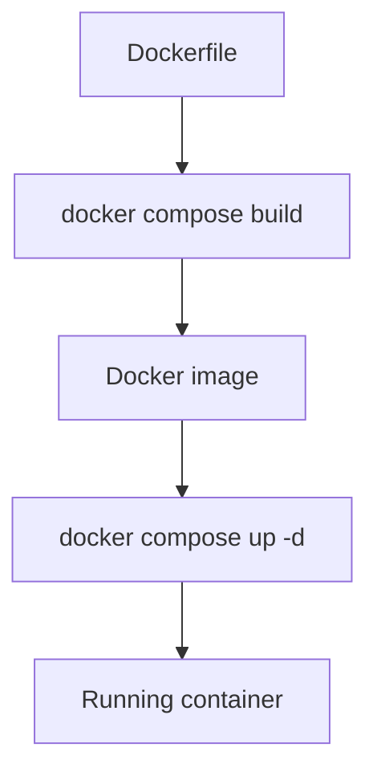
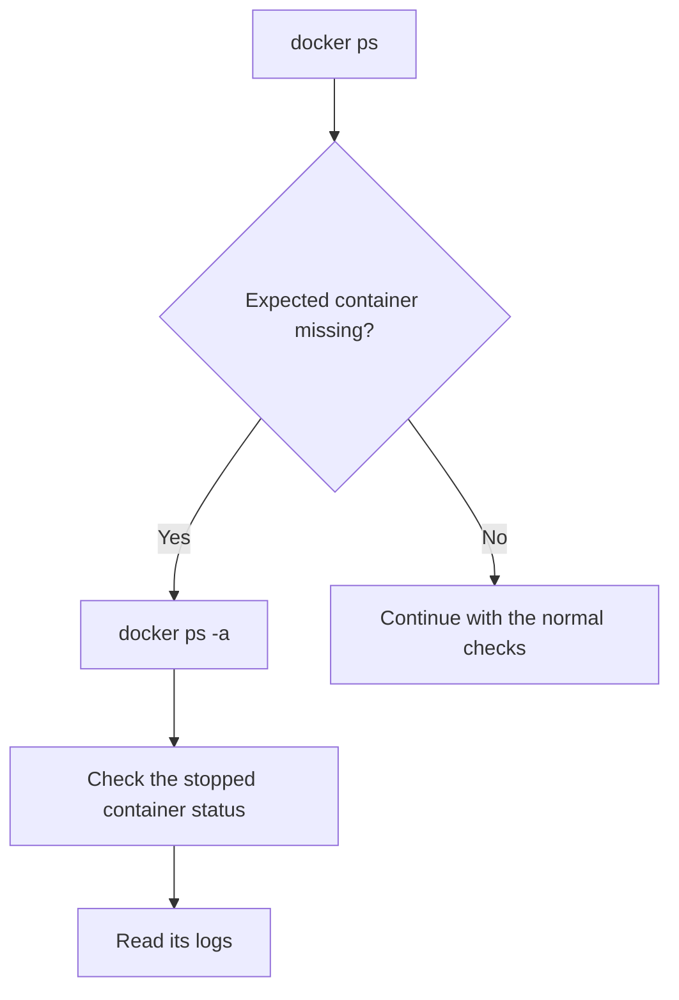
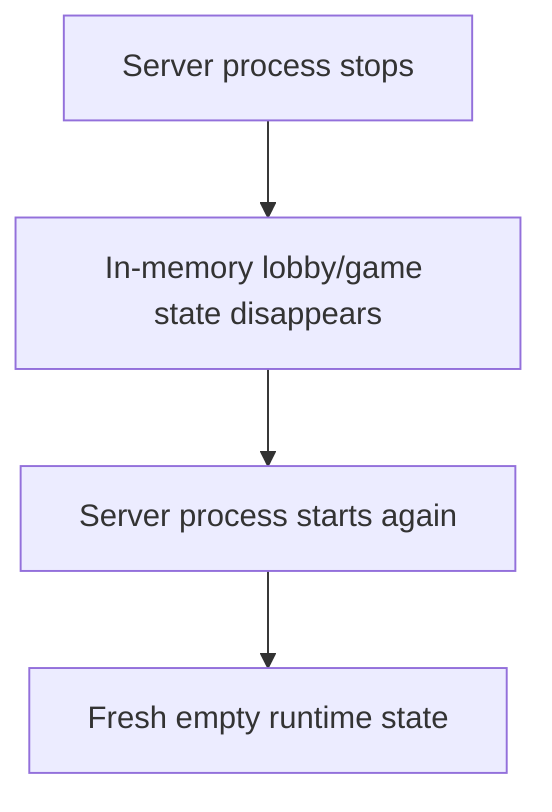
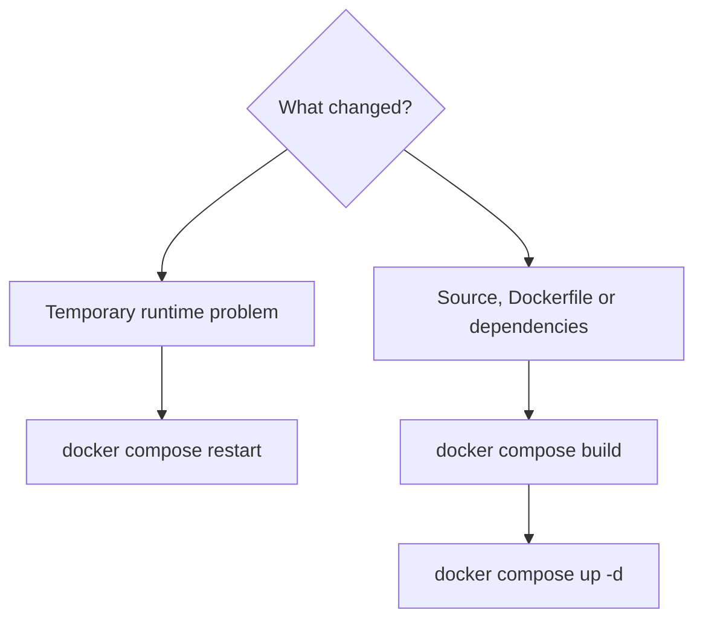
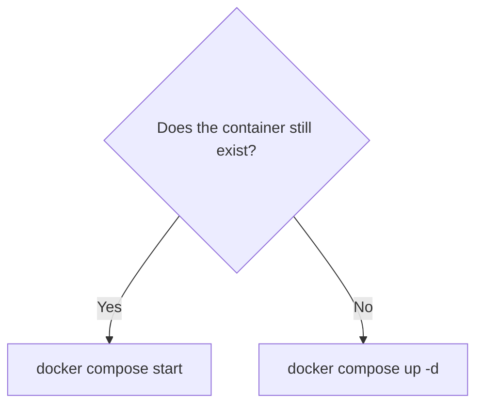
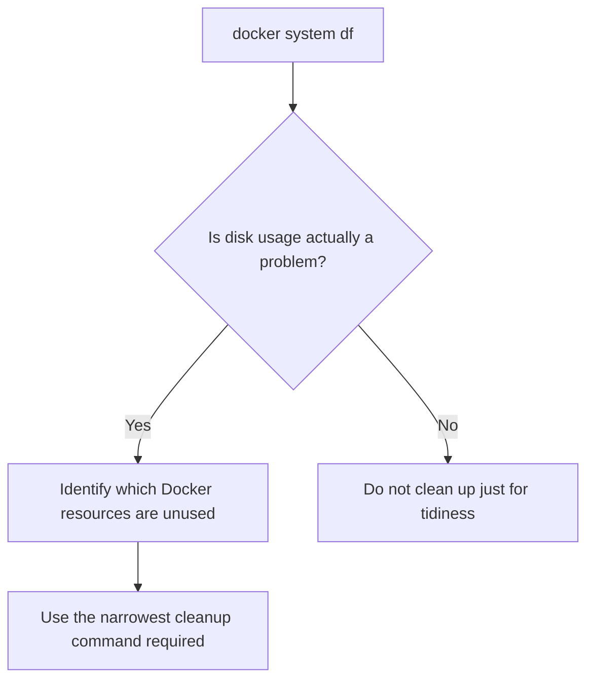
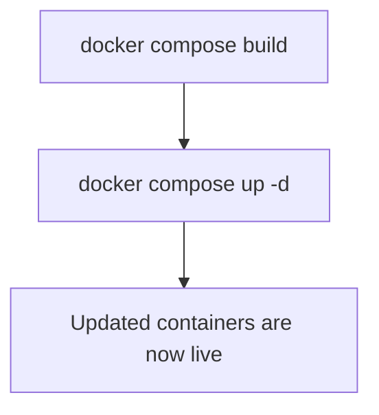

# Docker Operations

[First-Time Production Setup](first-time-setup.md#building-the-images) covers how Docker is used
during the initial deployment, while
[Normal Production Updates](production-updates.md#replacing-the-running-containers) covers the usual rebuild and
replacement process after the application is already live.

This chapter is slightly different.

Rather than describing one complete deployment process from beginning to end, it
acts more as a practical reference for the Docker commands which are useful once
Madiao is already running.

Most of the time there is no need to remember every Docker command available.
The important part is knowing how to answer a few fairly common questions:

- Are the containers running?
- Why did one stop?
- What are the logs showing?
- How do I restart one service?
- How do I rebuild only the service I changed?
- How do I stop the application safely?
- What can be cleaned up without touching unrelated projects?

Madiao currently runs as three Docker Compose services:

| Service | Container | Host Port | Container Port |
| --- | --- | --- | --- |
| `client` | `madiao-client` | `3000` | `80` |
| `server` | `madiao-server` | `3001` | `3001` |
| `docs` | `madiao-docs` | `3002` | `80` |

The client and server are the two services which make up the game itself.

The documentation service sits beside them and serves the generated MkDocs site.
It does not take part in the multiplayer communication or game state.

The Compose file also gives the services:

```yaml
restart: unless-stopped
```

which means Docker will normally bring them back after the Docker service or
host restarts, unless they were deliberately stopped.


## Containers and Images

Before getting into the commands, it is useful to separate two terms which are
easy to use interchangeably.

An **image** is the built package used to create a container.

A **container** is the running or stopped instance created from that image.

A simplified way of looking at it is:



This distinction matters because rebuilding an image does not automatically
change a container which is already running.

For example:

```bash
docker compose build server
```

can successfully create a new server image while the old
`madiao-server` container continues running the previous version.

The new version is applied when Compose recreates the container:

```bash
docker compose up -d server
```

The same applies to the client and documentation services.

This is the same distinction used during
[Rebuilding the Application](production-updates.md#rebuilding-the-application)
and
[Replacing the Running Containers](production-updates.md#replacing-the-running-containers),
but it becomes particularly useful when working with individual Docker commands.


## Checking Running Containers

The quickest Madiao-specific check is:

```bash
docker ps --filter "name=madiao"
```

This shows running containers whose names contain `madiao`.

The three expected containers are:

```text
madiao-client
madiao-server
madiao-docs
```

The important columns are normally `NAMES`, `STATUS` and `PORTS`.

All three containers should show as `Up`.

The published ports should correspond to:

| Container | Expected published port |
| --- | --- |
| `madiao-client` | host `3000` → container `80` |
| `madiao-server` | host `3001` → container `3001` |
| `madiao-docs` | host `3002` → container `80` |

Because Madiao is managed through Compose, another useful command is:

```bash
docker compose ps
```

Run this from `~/madiao`.

This shows the services belonging specifically to the Compose project.

For normal checks, either command is fine.

`docker ps` is useful when looking at Docker generally, while
`docker compose ps` is useful when working specifically from the Madiao
repository.


## Checking Stopped Containers

Normal:

```bash
docker ps
```

only displays containers which are currently running.

If a service is missing, use:

```bash
docker ps -a --filter "name=madiao"
```

The `-a` includes stopped containers.

This is particularly useful when a container starts, encounters an error and
exits immediately.

In that situation it may disappear from the normal running-container list even
though Docker still has the stopped container and its logs.

A useful troubleshooting order is therefore:



This is usually much more informative than repeatedly trying to start the same
broken service.


## Viewing Logs

The server log can be checked with:

```bash
docker logs madiao-server --tail 50
```

the client with:

```bash
docker logs madiao-client --tail 50
```

and the documentation container with:

```bash
docker logs madiao-docs --tail 50
```

`--tail 50` means only the most recent 50 lines are displayed.

This is generally more useful than printing everything the container has logged
since it was created.

If more context is needed, increase the number:

```bash
docker logs madiao-server --tail 200
```

To watch new log lines as they happen, use:

```bash
docker logs -f madiao-server
```

The `-f` means follow.

This can be useful while reproducing a problem from another browser because the
terminal shows new server output immediately.

Stop following the log with `Ctrl + C`.

This only stops the log viewer.

It does **not** stop the container.


### Compose logs

The same idea can also be used through Compose:

```bash
docker compose logs --tail 50
```

or for one service:

```bash
docker compose logs --tail 50 server
```

For example, the documentation logs can be checked with:

```bash
docker compose logs --tail 50 docs
```

To follow:

```bash
docker compose logs -f server
```

There is no major difference in the information itself.

The direct `docker logs` commands use the container names, while the Compose
commands use service names.


## Restarting Containers

A running service can be restarted through Compose.

For the client:

```bash
docker compose restart client
```

For the server:

```bash
docker compose restart server
```

For the documentation:

```bash
docker compose restart docs
```

Or all services:

```bash
docker compose restart
```

A restart stops the process and starts it again using the same existing
container.

It does **not** rebuild the image.

| Situation | Is restart enough? |
| --- | --- |
| Temporary runtime/process problem | Often yes |
| React/Node source changed | No |
| Documentation source changed | No |
| Dockerfile changed | No |
| Dependencies changed | No |

A restart is therefore useful for a temporary process problem, but not for
applying new files which have not been built into the image.


!!! warning "Restarting the server clears active games"
    Restarting or recreating `madiao-server` stops the Node.js process. Because
    live game state currently exists only in memory, every active lobby and game
    is lost when the server starts again.

The Node process stores that live state in memory using Maps such as:

```js
const lobbies = new Map();
const gameStates = new Map();
const gameTimers = new Map();
const socketLobbies = new Map();
```

When the process starts again, all of those Maps are empty.

Therefore:

```bash
docker compose restart server
```

means:



The fact that Docker reused the same container does not preserve JavaScript
memory.

Restarting the client or documentation container does not have this particular
server-side consequence.

The reason the server cannot preserve an active match across a restart is covered
in more detail in
[In-Memory Game State](../technical/limitations.md#in-memory-game-state) and
[What Happens When the Server Restarts](../technical/server-runtime-state.md#what-happens-when-the-server-restarts).


## Restarting Is Not Rebuilding

This is worth separating clearly because the commands sound as though they might
do similar things.

```bash
docker compose restart client
```

means:

> Stop and start the current client container.

It does not reread the source code and it does not run the Dockerfile again.

If the React source has changed, use:

```bash
docker compose build client
docker compose up -d client
```

Likewise, a changed server should normally be applied with:

```bash
docker compose build server
docker compose up -d server
```

If the documentation has changed, use:

```bash
docker compose build docs
docker compose up -d docs
```

This is required because the Markdown files are converted into the static MkDocs
site while the documentation image is being built.

Simply restarting `madiao-docs` would continue serving the files already inside
the existing image.

A useful rule is:



This avoids the common situation where a file is changed, the container is
restarted, and nothing appears different because the container is still using
the old image.


## Rebuilding Individual Services

There is no requirement to rebuild every service whenever only one part of the
project has changed.

To rebuild only the client:

```bash
docker compose build client
```

Then apply it:

```bash
docker compose up -d client
```

This is useful for clearly client-only changes such as:

- CSS;
- layout;
- React components;
- images;
- client production configuration.

To rebuild only the server:

```bash
docker compose build server
docker compose up -d server
```

This is useful for server-only changes such as:

- lobby handling;
- game rules;
- Socket.IO handlers;
- server timers;
- server dependencies.

The same warning applies here: recreating `madiao-server` resets all active
games.

To rebuild only the documentation:

```bash
docker compose build docs
docker compose up -d docs
```

This is useful for changes to:

- Markdown documentation;
- `mkdocs.yaml`;
- documentation CSS;
- the documentation Dockerfile.

The documentation service is independent from the game containers, so rebuilding
it does not interrupt an active match.

If there is any doubt about which services have changed, rebuilding the complete
Compose project is perfectly reasonable for a project of this size:

```bash
docker compose build
docker compose up -d
```


## Stopping and Starting the Application

To stop the running services without removing the containers:

```bash
docker compose stop
```

The containers still exist, but their processes are stopped.

They can later be started again with:

```bash
docker compose start
```

It is also possible to target one service:

```bash
docker compose stop client
docker compose start client
```

or:

```bash
docker compose stop server
docker compose start server
```

or:

```bash
docker compose stop docs
docker compose start docs
```

Again, stopping the server destroys the live JavaScript state.

Starting the same container later does not restore the old lobbies or games.

Stopping the client or documentation container does not clear the server's
in-memory game state, although players obviously cannot use whichever service is
stopped while it remains unavailable.


### `stop` compared with `down`

There is an important difference between:

```bash
docker compose stop
```

and:

```bash
docker compose down
```

`stop` stops the containers but leaves them in place.

`down` stops and removes the Compose containers and its default network.

For Madiao, the difference is:

| Command | What happens to the containers? |
| --- | --- |
| `docker compose stop` | Containers remain, but their processes stop |
| `docker compose down` | Compose containers are stopped and removed |

The images are not normally removed by a basic `docker compose down`, so the
services can usually be created again with:

```bash
docker compose up -d
```

without rebuilding if the required images are still present.

For everyday maintenance there is usually no reason to use `down` when a simple
stop or restart is enough.


## Starting a Service After It Has Stopped

If the existing container is still present, use:

```bash
docker compose start client
```

or:

```bash
docker compose start server
```

or:

```bash
docker compose start docs
```

If the container no longer exists because `docker compose down` was used, use:

```bash
docker compose up -d
```

This difference comes back to the fact that `start` operates on an existing
container, while `up` can create the required container when one does not
already exist.




## Checking Published Ports

If there is any doubt about which host port a container is exposing, Docker can
show it directly.

For example:

```bash
docker port madiao-client
```

should show a mapping for container port `80` to host port `3000`.

Similarly:

```bash
docker port madiao-server
```

should show container port `3001` published on host port `3001`.

The documentation container can be checked with:

```bash
docker port madiao-docs
```

which should show container port `80` published on host port `3002`.

This is useful when the service itself appears healthy but the expected address
cannot be reached.

For the wider production checks, see
[Website Does Not Load](troubleshooting.md#website-does-not-load) and
[Client Loads but Cannot Connect to Server](troubleshooting.md#client-loads-but-cannot-connect-to-server).

The base Compose configuration defines the mappings as:

```yaml
client:
  ports:
    - "3000:80"

server:
  ports:
    - "3001:3001"

docs:
  ports:
    - "3002:80"
```

so anything different from that would be worth investigating at this stage of
the deployment.


## Inspecting a Container

For more detailed Docker information, use:

```bash
docker inspect madiao-server
```

or:

```bash
docker inspect madiao-client
```

or:

```bash
docker inspect madiao-docs
```

This produces a large amount of JSON and is not something which needs to be read
during every normal check.

It can however be useful when looking for information such as:

- container configuration;
- environment variables;
- network information;
- the image being used;
- restart policy;
- port bindings.

If the full output is too large, it is usually better to use a more specific
Docker command first.

For example, use `docker port` for ports and `docker logs` for application
output rather than starting with `docker inspect` for every problem.


## Checking Docker Disk Usage

Docker keeps old image layers and build cache over time.

After many rebuilds it can therefore use considerably more disk space than the
three currently running containers might suggest.

A safe first check is:

```bash
docker system df
```

This shows how much space is currently being used by images, containers,
local volumes and build cache.

The command only reports usage.

It does not delete anything.

That makes it the right place to start before deciding whether cleanup is
actually necessary.


## Cleaning Old Docker Resources

Cleanup should be done deliberately, especially if the production machine is
used by more than one project.

To remove unused dangling images:

```bash
docker image prune
```

Docker asks for confirmation before deleting them.

Old build cache can be cleaned with:

```bash
docker builder prune
```

Again, Docker shows what it intends to do and asks for confirmation.

These commands are generally preferable to immediately using a broad cleanup
command.


### Be careful with system-wide pruning

Docker also provides commands such as:

```bash
docker system prune
```

and the more aggressive:

```bash
docker system prune -a
```

These operate across Docker as a whole, not only Madiao.

!!! danger "System-wide prune commands affect other projects too"
    On a server which hosts other projects, `docker system prune` and especially
    `docker system prune -a` can remove unused images, networks or cache which
    belong to something completely unrelated to Madiao.

For that reason they should not be used as a routine Madiao maintenance command.

A better order is:



There is rarely any benefit in deleting working Docker resources simply to make
the output look tidy.


## Useful Docker Command Reference

The commands used most often for Madiao are:

| Purpose | Command |
| --- | --- |
| Show running Madiao containers | `docker ps --filter "name=madiao"` |
| Show running Compose services | `docker compose ps` |
| Include stopped Madiao containers | `docker ps -a --filter "name=madiao"` |
| Check server logs | `docker logs madiao-server --tail 50` |
| Check client logs | `docker logs madiao-client --tail 50` |
| Check documentation logs | `docker logs madiao-docs --tail 50` |
| Follow server logs | `docker logs -f madiao-server` |
| Restart client | `docker compose restart client` |
| Restart server | `docker compose restart server` |
| Restart documentation | `docker compose restart docs` |
| Build client | `docker compose build client` |
| Apply client image | `docker compose up -d client` |
| Build server | `docker compose build server` |
| Apply server image | `docker compose up -d server` |
| Build documentation | `docker compose build docs` |
| Apply documentation image | `docker compose up -d docs` |
| Stop all services | `docker compose stop` |
| Start stopped services | `docker compose start` |
| Remove Compose containers | `docker compose down` |
| Validate Compose | `docker compose config` |
| Check Docker disk use | `docker system df` |

Most of these commands should be run from `~/madiao` when they use
`docker compose`, because Compose needs to find the Madiao
`compose.yaml` file.


## Chapter Summary

Docker operations become much easier once images and containers are treated as
two separate things.

The Dockerfile is used to build an image, while the running service exists
inside a container created from that image.

For Madiao, the client and server containers make up the game itself:

```text
madiao-client
madiao-server
```

The documentation is served through a third production container:

```text
madiao-docs
```

The most useful everyday checks are:

```bash
docker ps --filter "name=madiao"
docker ps -a --filter "name=madiao"

docker logs madiao-server --tail 50
docker logs madiao-client --tail 50
docker logs madiao-docs --tail 50
```

A restart can solve a temporary runtime problem, however, it does not rebuild
changed source files.

For code or documentation changes the normal pattern is:



Lastly, any operation which stops or replaces the Node server clears Madiao's
active in-memory games.

Docker may preserve the container or image, but it does not preserve the
JavaScript memory inside a stopped process.

The client and documentation services do not contain that live game state, so
restarting either of them does not clear the server's active lobbies.

Docker cleanup should also be kept conservative.

Check disk usage first and avoid broad system-wide pruning unless it is actually
understood what Docker is about to remove.