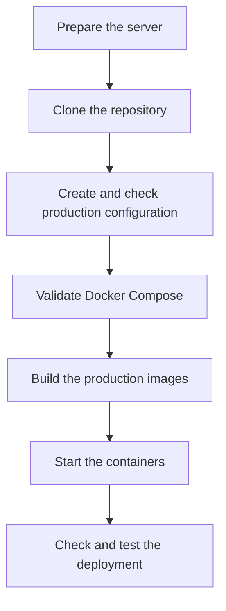
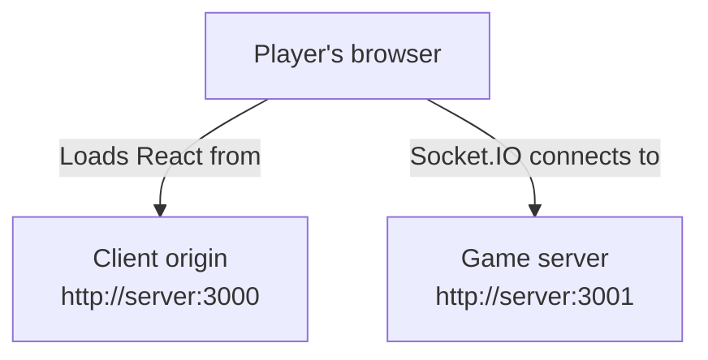
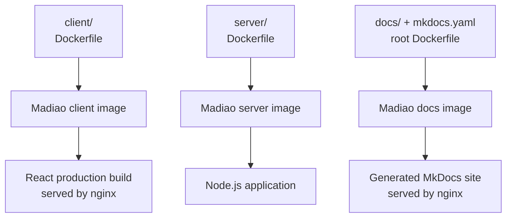
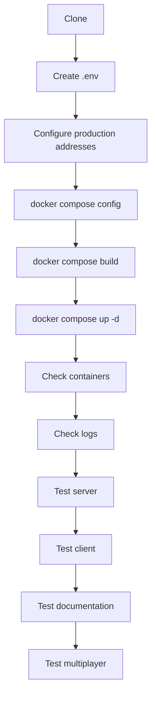

# First-Time Production Setup

The previous technical pages explain what Madiao is made out of and where its
configuration comes from. The next useful step is putting those pieces together
and going through what is required to get a completely fresh production copy of
the game and its documentation running.

This chapter is specifically about deploying Madiao for the first time on a
server which has already been prepared for application hosting.

If the Linux machine itself still needs to be prepared, start with
[Server Setup and Administration](server-setup-and-administration.md). That page
covers the initial SSH key, sudo user, SSH hardening, automatic security updates
and basic `systemd` setup.

Normal Madiao updates are slightly different because most of the application
setup has already been completed. Those are covered in
[Normal Production Updates](production-updates.md#normal-update-command-sequence).

The general process is:



There are not actually many steps involved, however, doing them in this order
makes it easier to catch a configuration problem before reaching the point where
containers are already running.


## Server Requirements

This section assumes the basic Linux and SSH preparation from
[Server Setup and Administration](server-setup-and-administration.md) has already
been completed.

The production machine does not need the same development setup as the computer
used to write the game.

In particular, Node.js, npm, Python and MkDocs do not need to be installed
directly on the server just for Madiao.

The Docker images already define the environments required by the client,
server and documentation services.

The production server mainly needs:

| Requirement | Why it is needed |
| --- | --- |
| Git | Obtains and updates the project from the repository |
| Docker Engine | Builds and runs the production containers |
| Docker Compose plugin | Manages the production services together |

The application dependencies are installed inside their respective Docker
images rather than directly on the host.


### Checking Git

Git can be checked with:

```bash
git --version
```

A version number means it is available.


### Checking Docker

Docker can be checked with:

```bash
docker --version
```

and the Compose plugin with:

```bash
docker compose version
```

The important detail here is that the project uses the newer:

```bash
docker compose
```

form rather than the older standalone:

```text
docker-compose
```

command.


### Network access

The server also needs to allow incoming traffic to the ports used by the base
Madiao deployment.

At this stage the three services use:

| Port | Purpose |
| ---: | --- |
| `3000` | React client served through nginx |
| `3001` | Node.js / Socket.IO server |
| `3002` | MkDocs documentation served through nginx |

!!! warning "Running containers do not guarantee external access"
    If ports `3000`, `3001` or `3002` are blocked by the host firewall or the
    hosting provider's firewall, the containers can be healthy while the
    relevant service is still unreachable from another computer.

This is therefore worth checking early rather than assuming every failed browser
connection is a Docker problem.

The ports used here describe the base deployment.

The live server can later be placed behind HTTPS and a host-level reverse proxy.
That is deliberately treated as a separate production-hardening stage rather
than something required before the application has been tested.


## Cloning the Repository

The production copy should come from the Git repository rather than from a
folder manually copied from the development computer.

This gives us a clean source of truth and makes future updates much easier.

A typical clone looks like:

```bash
cd ~
git clone <repository-url> madiao
cd madiao
```

The exact repository URL is deliberately not written into this public runbook.
It can be copied from the repository itself when needed.

Using a predictable folder name such as `~/madiao` is useful because later
deployment commands can assume the same project location.

Once inside the new clone, the first thing worth checking is:

```bash
git status
```

A brand-new clone should normally report a clean working tree.

It is useful to establish that before making any server-specific configuration
changes because the production repository should stay as close to the Git
version as possible.


## Creating the Production Environment File

The live `.env` file is deliberately not tracked by Git.

Instead, the repository contains:

```text
.env.example
```

which shows the variables the production deployment expects.

After cloning the repository, create the real environment file from that
example:

```bash
cp .env.example .env
```

The new file can then be edited with:

```bash
nano .env
```

or another text editor.

The two application-specific values are:

| Value | What it controls |
| --- | --- |
| `REACT_APP_SERVER_URL` | Where the browser should connect for Socket.IO |
| `CLIENT_ORIGIN` | Which browser origin the server is allowed to accept |

For the base production deployment they should use the externally reachable
server address.

For example:

```env title=".env"
REACT_APP_SERVER_URL=http://<server-address>:3001
CLIENT_ORIGIN=http://<server-address>:3000
```

These values are used differently.

`REACT_APP_SERVER_URL` is passed into the React image while the client is being
built.

`CLIENT_ORIGIN` is passed into the Node.js container when the server runs.

The documentation service does not need either variable because the generated
MkDocs site does not communicate with the game server.

The full distinction is explained in
[Environment and Configuration](../technical/environment-configuration.md).


### Client production address

The value:

```env
REACT_APP_SERVER_URL=http://<server-address>:3001
```

must point to an address which the player's browser can actually reach.

!!! warning "Do not use localhost for the public client build"
    `REACT_APP_SERVER_URL` must contain an address the player's browser can
    reach. Using `http://localhost:3001` in a public production build would make
    each player's browser try to connect to port `3001` on their own machine.

The production value should therefore use the externally reachable server
address.


### Server allowed origin

The second value:

```env
CLIENT_ORIGIN=http://<server-address>:3000
```

should match the address from which players load the React client.

For the base deployment, the client and server are hosted on the same machine,
however, they still use different ports:



Docker Compose reads both values from the root `.env` file when the production
configuration is resolved.


## Validating Docker Compose

Before starting a build, validate the Compose file:

```bash
docker compose config
```

!!! tip "Validate before building"
    Run `docker compose config` after changing the Compose file or its
    configuration. It catches YAML and Compose-structure problems before time is
    spent building the images.

This is one of the safest checks in the deployment process because it does not
start or replace anything.

It simply asks Docker Compose to read the configuration and show the final
result it understands.

A successful result should contain the three production services:

```text
server
client
docs
```

and the expected base port mappings:

| Service | Expected mapping |
| --- | --- |
| `client` | `3000 -> 80` |
| `server` | `3001 -> 3001` |
| `docs` | `3002 -> 80` |

It is also worth checking the resolved values for:

```text
REACT_APP_SERVER_URL
CLIENT_ORIGIN
```

while looking through the output.

If Docker Compose reports a YAML or configuration error here, fix that before
continuing.

There is very little value in trying to build containers from a configuration
Docker already says is invalid.


## Building the Images

Once the configuration looks correct, build the production services:

```bash
docker compose build
```

Docker builds the client, server and documentation images separately.

At a simplified level:



The client and server use their own Dockerfiles inside their respective
application folders.

The documentation build is slightly different.

Its Dockerfile lives at the project root because the build needs access to both:

```text
mkdocs.yaml
docs/
```

MkDocs first converts the Markdown documentation into a static site. That site
is then copied into an nginx image which becomes the documentation container.

The first build may take longer than later ones because Docker has no previous
layers cached yet.

The client also has to install its npm dependencies and run the React production
build, while the documentation image needs to install MkDocs Material and build
the documentation site.

A successful build should finish without an npm, React, MkDocs or Docker error.

If one service fails, do not immediately move on to `docker compose up`.

The failed image needs to be fixed first.

If the build fails, [Build and Dependency Problems](build-problems.md) covers
the main places worth checking.


## Starting the Containers

Once the images have built successfully, start the deployment with:

```bash
docker compose up -d
```

!!! note "Building and deploying are separate steps"
    `docker compose build` creates the images. The new version is not applied to
    the running services until `docker compose up -d` recreates or starts the
    relevant containers.

The `-d` means detached mode.

Without it, the terminal stays attached to the container output.

With it, Docker starts the services in the background and returns control of the
terminal.

The expected containers are:

```text
madiao-client
madiao-server
madiao-docs
```

The Compose setup also uses:

```yaml
restart: unless-stopped
```

which means Docker will normally try to bring the containers back after a host
restart unless they were deliberately stopped.


## Checking the Running Containers

After starting the deployment, check what is actually running:

```bash
docker ps --filter "name=madiao"
```

All three containers should appear.

The important information is mainly the container name, status and published
ports.

The expected result is roughly:

| Container | State | Published port |
| --- | --- | --- |
| `madiao-client` | `Up` | `0.0.0.0:3000 -> 80` |
| `madiao-server` | `Up` | `0.0.0.0:3001 -> 3001` |
| `madiao-docs` | `Up` | `0.0.0.0:3002 -> 80` |

The exact formatting depends on the Docker version, but all three containers
should be in an `Up` state.

The same deployment can also be checked through Compose:

```bash
docker compose ps
```

If one container is missing, check all Madiao containers including stopped
ones:

```bash
docker ps -a --filter "name=madiao"
```

A container which starts and immediately exits will often appear there even
though it is absent from the normal `docker ps` output.


## Checking the Logs

A container being listed as `Up` is a good sign, but it does not automatically
prove the application inside it is behaving correctly.

Check the server log:

```bash
docker logs madiao-server --tail 50
```

The server should eventually report that it is listening on port `3001`.

Then check the client:

```bash
docker logs madiao-client --tail 50
```

and the documentation container:

```bash
docker logs madiao-docs --tail 50
```

For the two nginx containers there may not be much interesting output before
somebody visits the relevant site.

The main point is that there should not be a repeating crash, missing-file error
or another obvious startup failure.


## Testing the Server Directly

Before testing the full game, it is useful to check the server separately.

The Node server has a basic Express route on port `3001`.

Opening:

```text
http://<server-address>:3001
```

should return the simple Madiao server page.

This does not test Socket.IO gameplay, but it confirms several useful things at
once:

- the server container is running;
- the Node.js process started;
- port `3001` is published;
- the network allows the connection.

If this page cannot be reached, there is little point debugging the React game
screen yet.

The problem is further down the stack.


## Testing the Client

Next, open:

```text
http://<server-address>:3000
```

The Madiao client should load.

If the server page on `3001` works but the client does not load on `3000`, the
problem is much more likely to be on the client/nginx side.

If the client loads but cannot create or join lobbies, the visual part of the
site is already working and the Socket.IO connection becomes the next thing to
check.


## Testing the Documentation

The documentation should also be checked independently through:

```text
http://<server-address>:3002
```

The MkDocs site should load with its normal navigation, styling and internal
links.

This confirms that:

- the documentation image built successfully;
- MkDocs generated the static site;
- the documentation nginx process is running;
- port `3002` is published correctly.

It is worth opening more than only the home page.

For example, move between a few technical and runbook pages to make sure the
generated navigation and relative links behave normally.


## Basic Multiplayer Test

A first deployment should not really be considered finished just because the
home screen loads.

Madiao is a multiplayer application, so the final application check should
involve the actual game flow.

A small test is enough:

1. Open the client in one browser window.
2. Create a lobby.
3. Open the client from another browser or device.
4. Join using the lobby code.
5. Confirm both players appear in the lobby.
6. Start the game.
7. Confirm both players receive their hands.
8. Play at least one declaration.
9. Confirm the state updates on both clients.

There is no need to play an entire match after every first deployment.

The purpose is simply to prove that nginx is serving the React client,
Socket.IO is connected, lobby events work, server state reaches both clients,
private hands are delivered correctly and gameplay events are accepted.

If all of those work, the core application deployment is operating properly.


## Useful First-Deployment Command Sequence

Once the setup is understood, the main commands can be reduced to a fairly short
sequence:

```bash
cd ~/madiao

git status

cp .env.example .env
nano .env

docker compose config

docker compose build

docker compose up -d

docker compose ps

docker logs madiao-server --tail 50
docker logs madiao-client --tail 50
docker logs madiao-docs --tail 50
```

The `cp` command is only required when creating the production `.env` file for
the first time.

After that, test:

```text
http://<server-address>:3001
http://<server-address>:3000
http://<server-address>:3002
```

and then perform a small multiplayer test.

It is deliberately better to keep these checks separate rather than putting
everything into one large command.

If something fails, the point at which it failed immediately gives us a clue
about which part of the deployment needs attention.


## Chapter Summary

A fresh Madiao production setup does not require a particularly complicated
server.

The host mainly needs Git, Docker and the Docker Compose plugin.

The project is cloned from the repository, the production `.env` file is created
from `.env.example`, and Docker Compose is validated before anything is built.

The main first-time deployment sequence is:



The three base production containers should end up as:

| Container | Host → container |
| --- | --- |
| `madiao-client` | `:3000 -> :80` |
| `madiao-server` | `:3001 -> :3001` |
| `madiao-docs` | `:3002 -> :80` |

The client and server make up the actual multiplayer application.

The documentation container exists alongside them and serves the generated
MkDocs site independently.

Lastly, a working web page is only part of the application test.

Because the client and multiplayer server are separate, the first deployment
should always be checked far enough to prove that two players can actually
connect to the same lobby and exchange game state.

!!! info "Base production setup complete"
    At this point Madiao should be working through the directly published Docker
    ports.

    The game should be available through port `3000`, the Node.js server through
    port `3001`, and the documentation through port `3002`.

    This is the base production deployment described throughout the earlier
    deployment and troubleshooting pages.

    The live Madiao server adds HTTPS, a host-level nginx reverse proxy,
    automated certificate renewal and restricted application ports as a final
    production-hardening step.

    Once the base deployment is working correctly, continue to
    [HTTPS and Reverse Proxy](https-and-reverse-proxy.md).