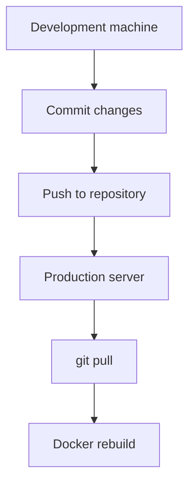
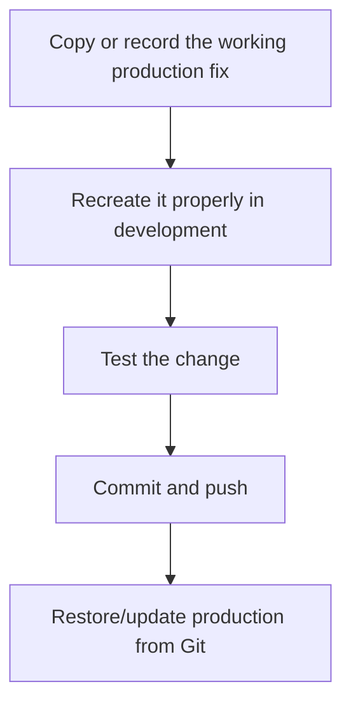
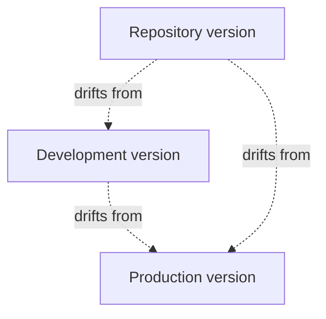
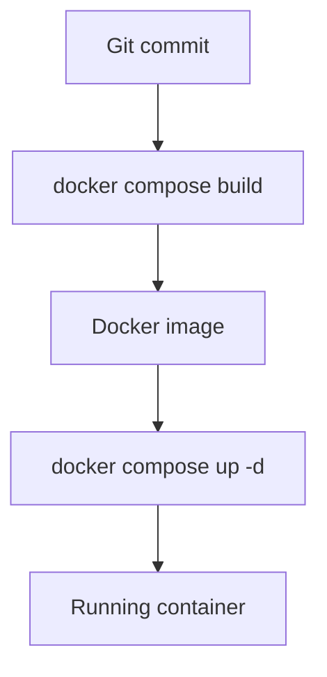
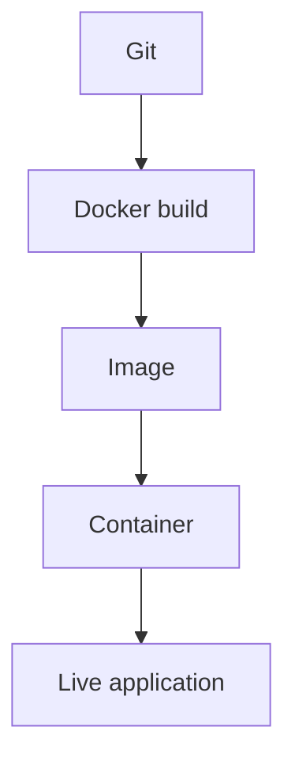

# Git Problems

The production version of Madiao is deployed from a Git repository.

The normal update process is covered in
[Normal Production Updates](production-updates.md#checking-git-before-pulling). Under normal circumstances
the Git part of that process is fairly simple:



Most Git problems on production begin when that simple relationship becomes less
clear.

For example, somebody may have edited a file directly on the server, the working
tree may contain an old temporary change, the production copy may be on the wrong
commit or `git pull` may refuse to continue because it would overwrite local
work.

The safest general rule is:

> The repository should remain the source of truth, while the production server
> should normally only receive committed versions of the project.

That does not mean a file can never be inspected or temporarily changed on the
server.

It simply means any deliberate permanent code change should eventually be made
properly in the development copy, committed and deployed through Git rather than
quietly becoming a production-only version of the game.


## Dirty Production Repository

Before every normal update, run:

```bash
cd ~/madiao
git status
```

The ideal result is:

```text
nothing to commit, working tree clean
```

A **dirty working tree** simply means the files on the server no longer match the
currently checked-out Git commit.

Git may show something such as:

```text
modified:   server/index.js
modified:   compose.yaml
```

or:

```text
untracked files:
    some-test-file.txt
```

This is not automatically a disaster.

| Git state | What it means |
| --- | --- |
| Modified tracked file | A committed file has been changed locally |
| Staged change | A change has been added to Git's staging area |
| Untracked file | Git can see the file, but it is not part of the repository |
| Ignored file | Git intentionally leaves the file out of normal status/commits |

The important thing is to understand the difference before trying to remove it.


### Tracked changes

A tracked file is already part of the repository but has been changed locally.

Check the actual difference with:

```bash
git diff
```

For one file:

```bash
git diff server/index.js
```

This only displays the change.

It does not modify anything.


### Staged changes

If `git status` says a file is staged for commit, inspect it with:

```bash
git diff --staged
```

This matters because a normal:

```bash
git diff
```

does not show changes which have already been staged.


### Untracked files

Untracked files are files Git can see but which are not currently part of the
repository.

They may be:

- temporary notes;
- test files;
- accidental copies;
- local configuration.

Before deleting an untracked file, check what it actually contains.

Do not assume that **untracked** means **useless**.

A local configuration file may deliberately be outside Git.


### Ignored files are different

Files covered by `.gitignore` normally do not appear in `git status`.

Examples can include:

- `node_modules/`;
- local environments;
- generated build output;
- editor files;
- private keys;
- local-only configuration.

Those files do not make the repository dirty.

This is exactly why something such as `.venv-docs/` can exist locally without
being committed.


## `git pull` Cannot Continue

One of the most common Git messages on a production server is roughly:

```text
Your local changes to the following files
would be overwritten by merge
```

Git is deliberately refusing to continue because pulling the repository would
destroy a local change.

Do not work around this immediately with a destructive command.

First inspect the situation:

```bash
git status
git diff
```

The next step depends on what the local change actually is.


### Local change was accidental

If the file was accidentally edited and the repository version is definitely the
one which should be used, restore that file:

```bash
git restore path/to/file
```

For example:

```bash
git restore server/index.js
```

Then check:

```bash
git status
```

If the working tree is clean, pull normally:

```bash
git pull
```


### Local change is useful and should be kept

Do not simply overwrite it.

!!! note "Preserve useful production work before cleaning the repository"
    If a live-server edit contains something worth keeping, copy or record it
    somewhere safe before restoring the tracked file. The long-term fix should
    then be recreated and committed through the normal development workflow.

The safest option is normally to copy the useful change somewhere outside the
repository or recreate it properly on the development machine, then commit it
through the normal workflow.

For example:

```bash
cp server/index.js ~/index.js.production-backup
```

After the useful work has been preserved, the tracked production file can be
restored and the repository updated normally.


### Local change is temporary

Git also provides:

```bash
git stash
```

which temporarily stores tracked working-tree changes and returns the repository
to a clean state.

A simple flow is:

```bash
git stash
git pull
```

and the saved work can later be inspected with:

```bash
git stash list
```

However, stashing production edits should not become the normal deployment
workflow.

It is better used as a temporary safety tool while deciding what to do with an
unexpected change.


## Temporary Changes Made on the Server

Occasionally it is useful to change something directly on production while
diagnosing a problem.

For example:

```text
adding one temporary console.log
testing one configuration change
checking whether a tiny code adjustment changes the behaviour
```

There is nothing technically preventing this.

The danger is forgetting that the production copy now contains code which does
not exist in Git.


### Before making a temporary edit

Start with:

```bash
git status
```

This establishes whether the repository was already clean.

If it was clean before the test, any new tracked modification afterwards is much
easier to identify.


### After the test

Use:

```bash
git diff
```

to see exactly what changed.

If the experiment is not needed:

```bash
git restore path/to/file
```

If the change genuinely fixes the problem:



This keeps the repository as the long-term record of the actual fix.


### Avoid turning production into the development copy

Editing directly on the live server can be tempting because the result is
immediate.

However, if several fixes accumulate there, the repository, development copy
and production copy can all become different versions of the project.



At that point every future deployment becomes risky because nobody can easily
tell which copy contains the correct code.

The goal should always be to return production to a **clean working tree**
at a **known Git commit**.


## Restoring Files

Git provides several different restore operations depending on what needs to be
undone.


### Restore one modified tracked file

If a tracked file has local changes which are definitely not needed:

```bash
git restore path/to/file
```

For example:

```bash
git restore compose.yaml
```

This returns the working-tree version to the currently checked-out commit.


### Restore several tracked files

Several paths can be supplied together:

```bash
git restore server/index.js compose.yaml
```

Or, if every tracked working-tree change is definitely disposable:

```bash
git restore .
```

Be careful with this.

It removes all unstaged tracked changes in the current repository.


### Unstage a file without deleting its changes

If a file was accidentally staged:

```bash
git restore --staged path/to/file
```

The file remains modified, but it is removed from the staging area.


### Restore to the remote version

Sometimes the current local commit itself is not what production should be using.

!!! danger "Do not jump straight to `git reset --hard`"
    It is deliberately destructive. First establish which branch, commit and
    local changes are present so there is no useful work to lose.

First establish the situation:

```bash
git status
git branch --show-current
git log -1 --oneline
git fetch
git log --oneline --decorate -5
```

Deliberately moving production between commits is covered in
[Returning to a Previous Commit](rollback.md#returning-to-a-previous-commit)
and [Returning to `main`](rollback.md#returning-to-main).

This chapter is mainly about returning ordinary working-tree edits to a known
clean state.


### Untracked files are not removed by `git restore`

This is important.

If:

```bash
git status
```

shows an untracked file, running:

```bash
git restore .
```

does not delete it.

Git has separate cleanup commands for untracked files, but they can be
destructive.

For production it is normally safer to inspect the file and remove it manually
only when its purpose is understood.


## Checking the Current Commit

When production behaviour does not match what was expected, confirm which Git
version actually exists on the server.

The quickest command is:

```bash
git log -1 --oneline
```

This shows the short commit ID and commit message.

For example:

```text
abc1234 Fix timeout sequence
```

To check the current branch:

```bash
git branch --show-current
```

For the normal production deployment this should normally be the intended
production branch, such as `main`.


### Check the configured remote

If there is any doubt about where `git pull` is retrieving code from:

```bash
git remote -v
```

This shows the fetch and push URLs for the configured remote.


### Fetch without changing production

A useful safe command is:

```bash
git fetch
```

This retrieves information about newer remote commits without merging them into
the current branch.

Afterwards:

```bash
git status
```

can tell us whether the local branch is behind its upstream branch.


### Check a full commit ID

For a full immutable commit hash:

```bash
git rev-parse HEAD
```

This can be useful when recording exactly which source revision was deployed.


### Remember that Git and Docker are separate

Even if:

```bash
git log -1 --oneline
```

shows the correct new commit, the running application may still be using an old
Docker image.

The deployment chain is:



Checking Git only proves the first part.

The build and replacement stages are covered in
[Rebuilding the Application](production-updates.md#rebuilding-the-application)
and
[Replacing the Running Containers](production-updates.md#replacing-the-running-containers).


## Using a Fresh Clone

Sometimes repairing a production working tree is more confusing than simply
creating a clean copy of the repository.

This is particularly useful when:

- many tracked files have unexplained edits;
- old temporary files are mixed throughout the project;
- the current branch/history is unclear;
- a previous deployment attempt left the folder in an uncertain state.

The important part is not to immediately delete the existing copy.

Keeping it temporarily gives us a fallback while the new clone is checked.


### Create a new clean clone

From the home directory:

```bash
cd ~
git clone <repository-url> madiao-new
```

Then:

```bash
cd madiao-new
git status
```

A fresh clone should normally be clean.


### Check the branch and commit

Use:

```bash
git branch --show-current
git log -1 --oneline
```

Confirm that this is the version intended for production.


### Recreate any required local-only configuration

A fresh clone only contains files which exist in Git.

Anything deliberately ignored must be recreated separately if production needs
it.

Do not blindly copy every ignored file from the old directory.

Copy only the local configuration which is actually understood and required.


### Validate before replacing anything

From the new clone:

```bash
docker compose config
```

Then build:

```bash
docker compose build
```

Do not remove the old repository simply because the new clone finished
downloading.

The new copy should first prove that:

- the Git state is correct;
- the Compose configuration is valid;
- the Docker images build successfully.

If the Docker build fails at this stage, use
[Build and Dependency Problems](build-problems.md) before replacing the existing
production folder.


### Move to the clean production folder

Once the new copy is confirmed, the folders can be renamed so the normal
production path remains predictable.

For example, from the home directory:

```bash
mv madiao madiao-old
mv madiao-new madiao
```

Then:

```bash
cd ~/madiao
git status
docker compose config
```

and start/apply the production containers:

```bash
docker compose up -d
```


### Keep the old copy temporarily

Do not immediately delete `~/madiao-old`.

The old directory may still contain a forgotten local file which turns out to
be useful.

Once the clean production deployment has been tested and the old copy is no
longer needed, it can be removed deliberately.


### Important Docker point

The folder name is not the only thing Docker cares about.

After switching to the new clean repository, always run the Compose commands
from the intended production directory:

```bash
cd ~/madiao
docker compose config
docker compose up -d
```

This avoids accidentally managing containers from an abandoned clone.

Once the clean repository is in place, return to
[Normal Production Updates](production-updates.md#checking-git-before-pulling) for the normal deployment and
testing sequence.


!!! tip "Prefer diagnosis before modification"
    Commands such as `git status`, `git diff`, `git log`, `git branch` and
    `git remote -v` are useful because they tell you what is happening without
    changing the repository. Use those first, then choose the narrowest command
    which fixes the actual problem.

## A Safe Git Problem Workflow

When Git behaves unexpectedly on production, the following order is a good
default:

```bash
cd ~/madiao

pwd
git status
git diff
git diff --staged
git branch --show-current
git log -1 --oneline
git remote -v
```

Those commands are all mainly diagnostic.

They tell us:

- which repository we are in;
- what has changed;
- what is staged;
- which branch is checked out;
- which commit is active;
- which remote is configured.

Only after that should a modifying command such as `git restore`, `git stash` or
`git pull` be chosen.


## Quick Git Problem Reference

| Problem | First action |
| --- | --- |
| `git pull` says local changes would be overwritten | `git status` + `git diff` |
| Production has one accidental file edit | `git restore <file>` after checking it |
| File accidentally staged | `git restore --staged <file>` |
| Need to preserve temporary local work | Copy it elsewhere or `git stash` |
| Unsure which version is checked out | `git log -1 --oneline` |
| Unsure which branch is active | `git branch --show-current` |
| Unsure which repository remote is used | `git remote -v` |
| Want to see remote changes without merging | `git fetch` |
| Production folder is badly confused | Create and validate a fresh clone |
| Git is correct but app still looks old | Rebuild/recreate the Docker service |


## Chapter Summary

The production Git repository should normally be a clean copy of committed
project code.

Before an update:

```bash
git status
```

should ideally report:

```text
working tree clean
```

If it does not, inspect the change before pulling or deleting anything.

Useful diagnostic commands include:

```bash
git diff
git diff --staged
git branch --show-current
git log -1 --oneline
git remote -v
```

An accidental tracked edit can normally be restored with:

```bash
git restore path/to/file
```

while useful production-only work should be preserved and then recreated
properly through the normal development and commit process.

`git stash` can temporarily protect tracked changes, but it should not become the
normal way Madiao is deployed.

If the production repository becomes too difficult to trust, creating a fresh
clone is often safer than applying increasingly destructive Git commands to an
uncertain working tree.

The old copy can be kept temporarily while the new clone is validated, built and
tested.

Lastly, a correct Git commit does not automatically mean the live Docker
containers are running that commit.

The full path remains:



Keeping each stage clear makes both deployment and recovery considerably easier.
