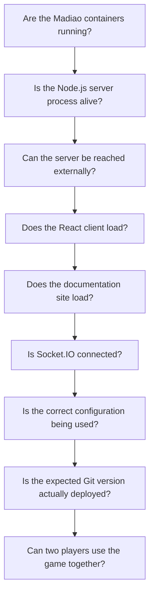
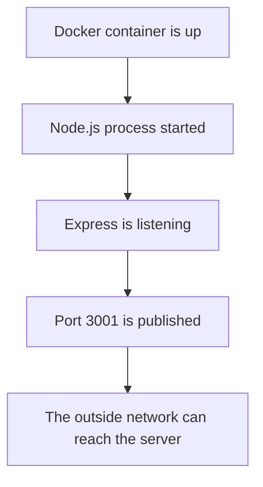
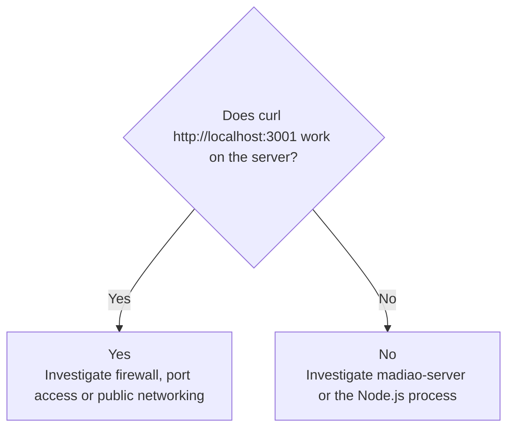
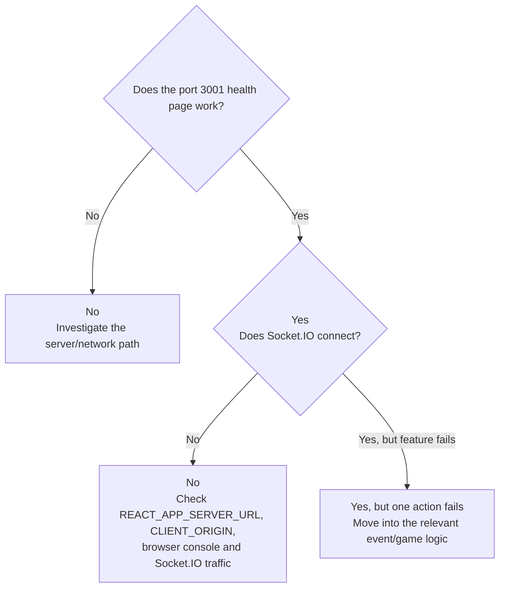
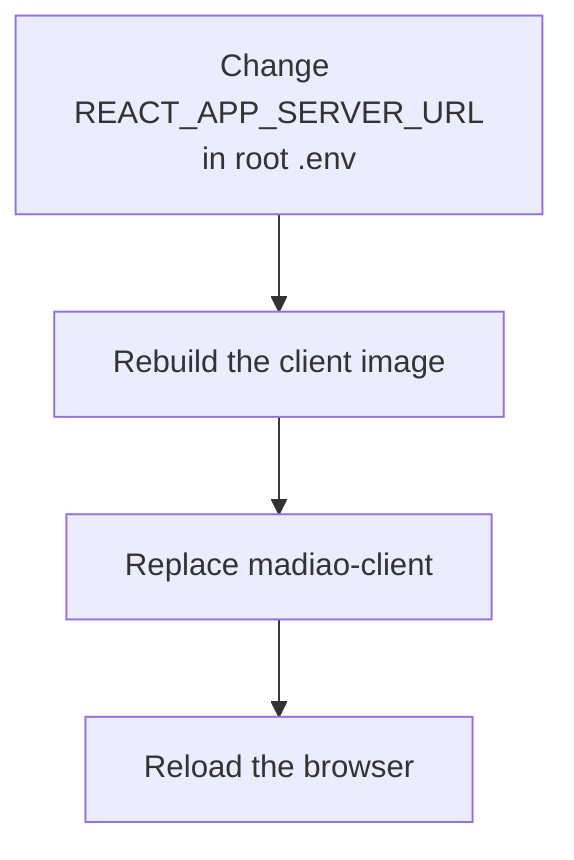
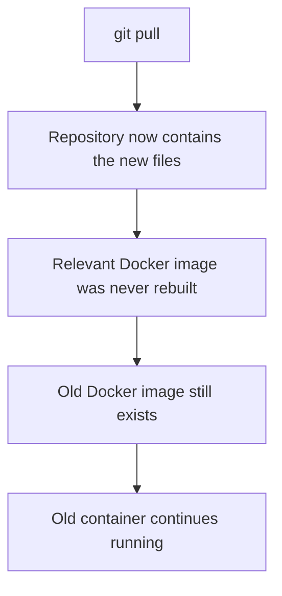
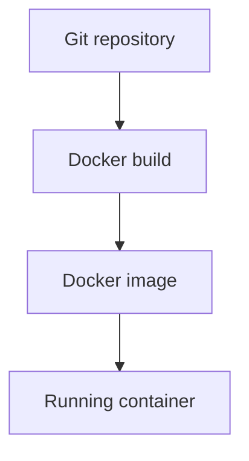

# Basic Health Checks

[Normal Production Updates](production-updates.md#normal-update-command-sequence) explains the normal
deployment process, while
[Main Gameplay Code Paths](../technical/gameplay-code-paths.md#following-a-bug-through-a-code-path) follows the main
gameplay actions through the application.

This chapter is meant to be much more practical.

Rather than tracing one particular bug immediately, the aim here is to answer a
few basic questions in the quickest possible order:



These checks are useful because quite a few different problems can look similar
from the browser.

For example, a player being unable to create a lobby could come from:

- the server container being stopped;
- the wrong server address being built into the client;
- the Socket.IO connection being blocked;
- a `CLIENT_ORIGIN` mismatch;
- an old production build still being live;
- an actual lobby bug.

The documentation service is independent from that multiplayer path, however,
checking it at the same time is useful because it is part of the same production
Compose deployment.

Running a short health check first prevents jumping into game logic before we
know the underlying deployment is actually healthy.


## Are the Containers Running?

The first Docker check is:

```bash
docker ps --filter "name=madiao"
```

The three expected containers are:

```text
madiao-client
madiao-server
madiao-docs
```

All three should show a status beginning with:

```text
Up
```

The expected base port mappings are:

| Container | Host | Container | Purpose |
| --- | ---: | ---: | --- |
| `madiao-client` | `3000` | `80` | nginx serving the React production build |
| `madiao-server` | `3001` | `3001` | Node.js / Express / Socket.IO server |
| `madiao-docs` | `3002` | `80` | nginx serving the generated MkDocs site |

The same deployment can also be checked through Compose:

```bash
docker compose ps
```

If one of the expected containers is missing from the normal running list, check
stopped containers:

```bash
docker ps -a --filter "name=madiao"
```

A container which starts and exits immediately may no longer appear under
`docker ps`, even though Docker still has the stopped container and its logs.

At that point, check the logs for whichever service is missing:

```bash
docker logs madiao-client --tail 50
docker logs madiao-server --tail 50
docker logs madiao-docs --tail 50
```

This first check answers a fairly simple question:

> Did Docker actually manage to keep all of the expected production services
> running?

If the answer is no, there is normally little reason to start debugging the
application itself yet.


## Is the Client Running?

For the client specifically, `madiao-client` should show as `Up` and its
published port should correspond to:

| Host | Container | Purpose |
| ---: | ---: | --- |
| `3000` | `80` | nginx serving the React production build |

If the client is stopped, check:

```bash
docker logs madiao-client --tail 50
```

The client container is nginx serving the already-built React files.

That means a client container failure is normally more about:

- nginx;
- missing build output;
- bad container startup;
- a port conflict;

rather than React runtime logic.


### Browser check

If Docker says the client is running, open:

```text
http://<server-address>:3000
```

The Join screen should appear.

This proves several things at once:

- the client container is running;
- port `3000` is published;
- the network/firewall allows the connection;
- nginx is serving the React build;
- the browser can download the application.

If the page does not load at all, there is little point debugging a declaration
or lobby event yet.

The problem is still at the client/container/network level.


## Is the Server Running?

The expected server container is:

```text
madiao-server
```

and it should also show as `Up`.

Its published port should correspond to:

| Host | Container | Purpose |
| ---: | ---: | --- |
| `3001` | `3001` | Node.js / Express / Socket.IO server |

If it is missing:

```bash
docker ps -a --filter "name=madiao"
```

will show whether it exists but exited.

Then check:

```bash
docker logs madiao-server --tail 50
```

The server should eventually report that it is running on port `3001`, for
example:

```text
Server running on http://localhost:3001
```


## Is the Server Responding?

A running Docker container does not automatically prove the application inside
it is usable.

The next check is therefore the server's basic Express route.

From another machine or browser, open:

```text
http://<server-address>:3001
```

The current server should return the simple Madiao health page containing:

```text
Madiao server is alive again
```

This route does not test the actual game, but it proves a useful chain:



If the server container is shown as running but this page cannot be reached,
the problem is probably not inside `declareCards` or `challenge`.

It is more likely to be something around:

- the published port;
- the host firewall;
- the hosting provider's firewall;
- the wrong public address;
- container networking;
- the server process not actually listening as expected.


### Checking locally from the server

If necessary, the production machine can test the route itself:

```bash
curl http://localhost:3001
```

If this works on the server but the same service cannot be reached externally,
that strongly suggests the Node process itself is healthy and the problem is
between the server and the outside network.

That distinction is useful:




## Is the Documentation Running?

The documentation container should appear as:

```text
madiao-docs
```

and should show as `Up`.

Its base port mapping is:

| Host | Container | Purpose |
| ---: | ---: | --- |
| `3002` | `80` | nginx serving the generated MkDocs site |

If the container is stopped, check:

```bash
docker logs madiao-docs --tail 50
```

The documentation container is similar to the client in one important way.

By the time the container starts, MkDocs has already generated the static site
during the image build. nginx is simply serving those generated files.

A problem here is therefore more likely to involve:

- the documentation image build;
- missing generated files;
- nginx;
- a port conflict;
- the container startup;

rather than the Node.js game server.


### Browser check

Open:

```text
http://<server-address>:3002
```

The documentation home page should load.

It is worth opening more than one page so that the navigation and generated
links are also tested.

For example, move between a technical page and one of the runbook pages.

This proves that:

- `madiao-docs` is running;
- port `3002` is published;
- nginx is serving the generated MkDocs site;
- the browser can reach the documentation independently from the game.

The documentation service does not need to be working for an active Madiao game
to function.

Likewise, a documentation failure does not automatically suggest a problem with
Socket.IO or the game server.

It is simply another production service which can fail independently.


## Is Socket.IO Connecting?

The client can load perfectly while multiplayer is completely broken.

This is possible because the browser gets the React application from port
`3000`, but the React application then creates a separate Socket.IO connection
to port `3001`.

!!! note "A working website does not prove multiplayer is connected"
    nginx can serve the React application successfully while Socket.IO is still
    failing. Client delivery and multiplayer communication are separate network
    paths.


### Quick functional check

The easiest Socket.IO test is usually not a special tool.

Simply try to create a lobby.

If the connection is working and the server accepts the request, the client
should receive `lobby_created` and move into the waiting room.

If the Join screen remains stuck or reports a connection-related failure, check
the server logs while trying again:

```bash
docker logs -f madiao-server
```

Then reproduce the action from the browser.

If the server receives the Socket.IO connection or event, something should reach
the Node process.

If absolutely nothing appears while the health page on `3001` still works, the
client may be trying to connect to the wrong server address.


### Browser developer tools

The browser developer tools can also help.

Open **Developer Tools → Network** and look for Socket.IO traffic.

Depending on the transport currently in use, entries may include `socket.io`,
`polling` or `websocket`.

A failing connection may show repeated requests or errors rather than one stable
connection.

The browser console can also show CORS or connection errors which are not
obvious from the game screen itself.


### Useful distinction

A practical way of separating the possibilities is:



That order avoids treating every multiplayer problem as a Socket.IO library
problem.


## Is Docker Reading the Correct Environment?

If the client loads and the server responds but the two still cannot communicate,
configuration becomes one of the first things worth checking.

There are two important values: `REACT_APP_SERVER_URL` and `CLIENT_ORIGIN`.

The two values are explained in more detail in
[`REACT_APP_SERVER_URL`](../technical/environment-configuration.md#react_app_server_url)
and
[`CLIENT_ORIGIN`](../technical/environment-configuration.md#client_origin):

| Value | What it controls |
| --- | --- |
| `REACT_APP_SERVER_URL` | Where the browser tries to reach the game server |
| `CLIENT_ORIGIN` | Which browser origin the server allows |

The documentation service does not use either value because it does not connect
to the game server.


### Checking the server environment

The production server receives `CLIENT_ORIGIN` through Docker Compose.

The safest first check is:

```bash
docker compose config
```

Look for the server's environment section and confirm that `CLIENT_ORIGIN`
matches the address players are actually using to load the client.

For the base deployment, if players open:

```text
http://<server-address>:3000
```

the server origin needs to match that browser origin.


### Checking the running container

If there is doubt about what the running server container actually received,
Docker can inspect its environment:

```bash
docker inspect madiao-server
```

The output is large, so this is normally a second step after:

```bash
docker compose config
```

The important distinction is between **what the current Compose configuration
resolves to** and **what the running container was actually created with**.


### Checking the client server address

The client is different.

`REACT_APP_SERVER_URL` is a React build-time value.

The production value comes from the root:

```text
.env
```

Docker Compose passes it into the client build.

That means changing `REACT_APP_SERVER_URL` in the root `.env` file without
rebuilding the client does not change the JavaScript which nginx is already
serving.

If the value was changed, the client needs:

```bash
docker compose build client
docker compose up -d client
```

before the browser can receive the new configuration.

This is one of the more common configuration traps because restarting the
existing client container uses the same old image.

The correct sequence after a build-time change is:




## Is the Correct Git Version Deployed?

A deployment can look healthy while still running the wrong version of the code
or documentation.

This is particularly easy to do if there is more than one copy of the repository
on the server.

The normal production folder should be:

```text
~/madiao
```

First check the location:

```bash
pwd
```

Then check Git:

```bash
git status
```

The production working tree should normally be clean.

To see the current commit:

```bash
git log -1 --oneline
```

This gives something similar to:

```text
abc1234 Fix challenge result timing
```

Compare that with the commit expected from the repository.


### Source code vs running container

There is another important distinction here.

Having the correct Git commit in `~/madiao` does not automatically prove the
container was rebuilt from it.

The possible situation is:



This applies to all three services.

For example, new Markdown files can exist in the Git repository while
`madiao-docs` continues serving the previous generated site if the docs image
was never rebuilt.

Likewise, changed React source does not become part of `madiao-client` until the
client image is rebuilt.

So if the source version is correct but the behaviour or documentation still
looks like the previous version, check whether the relevant service was actually
rebuilt and replaced.

The distinction is covered in more detail in
[Rebuilding the Application](production-updates.md#rebuilding-the-application)
and
[Replacing the Running Containers](production-updates.md#replacing-the-running-containers).


### Useful deployment chain

The version path is:



A healthy Git repository only proves the first step.


## Basic Multiplayer Test

The final application health check should test the actual purpose of Madiao.

That means at least two clients successfully sharing one game.

A useful quick test is:

1. Open the client.
2. Create a lobby.
3. Open the client from another browser or device.
4. Join using the lobby code.
5. Confirm both players appear.
6. Start the game.
7. Confirm both players receive hands.
8. Confirm the same current player is shown on both screens.
9. Make one valid declaration.
10. Confirm both clients update.

If that works, a large part of the system has already been proven:

- client serving;
- server serving;
- Socket.IO connection;
- lobby creation;
- lobby joining;
- Socket.IO room broadcasting;
- game creation;
- private hand delivery;
- public game-state updates;
- declaration request/acknowledgement.

The documentation container is not part of this test.

A healthy `madiao-docs` service proves the documentation deployment works, but
it does not tell us anything about the multiplayer state or Socket.IO flow.


### Slightly deeper test

If there has recently been a gameplay change, extend the health check.

For example:

1. make another declaration;
2. challenge it;
3. confirm the real cards appear;
4. confirm the loser takes the pile;
5. confirm drinking happens;
6. confirm the next turn starts afterwards.

This is not necessary after every CSS or documentation adjustment.

However, it is useful after changes involving:

- `server/index.js`;
- `game/deck.js`;
- `game/rules.js`;
- shared timing constants;
- Socket.IO event handling.


## Quick Health Check Order

When the production deployment seems broken and the cause is not obvious, the
following order is usually enough:

```bash
cd ~/madiao

git status
git log -1 --oneline

docker compose config

docker ps --filter "name=madiao"

docker logs madiao-server --tail 50
docker logs madiao-client --tail 50
docker logs madiao-docs --tail 50
```

Then check:

1. `http://<server-address>:3001`
2. `http://<server-address>:3000`
3. `http://<server-address>:3002`

Finally, for the application:

1. create a lobby;
2. join from a second client;
3. start the game;
4. make one play.

The useful part of this order is that every successful step rules out a whole
group of possible causes.

If the only failure is the documentation site, there is no reason to continue
debugging Socket.IO.

Likewise, if the documentation works but the server health page fails, the docs
container has simply confirmed that Docker and external networking are not
completely unavailable. The server still needs to be investigated separately.


## Reading the Result of the Checks

A short diagnosis table is:

| Result | Most likely area to investigate next |
| --- | --- |
| None of the Madiao containers are running | Docker/Compose/host |
| Client stopped, server and docs running | Client image/nginx |
| Server stopped, client and docs running | Node server/server image |
| Docs stopped, game containers running | MkDocs build/docs nginx/docs image |
| Server works locally but not publicly | Firewall/network/port access |
| Client page does not load | Client/nginx/port `3000` |
| Documentation does not load | Docs container/nginx/port `3002` |
| Client loads, server health page fails | Server/network/port `3001` |
| Client and server HTTP work, Socket.IO fails | `REACT_APP_SERVER_URL`, `CLIENT_ORIGIN`, browser connection |
| Socket.IO works, lobby creation fails | Lobby event/server validation |
| Lobby works, game start fails | `startGame` path |
| Game starts, one gameplay feature fails | Relevant gameplay code path |
| Git is current but one service looks old | Relevant image/container was not rebuilt |
| Documentation source is current but site looks old | `madiao-docs` image was not rebuilt |

!!! tip "Stop once the failing layer becomes clear"
    The purpose of a health check is to narrow the fault domain. Once one stage
    clearly fails, there is no need to keep testing deeper gameplay behaviour
    until that underlying layer is fixed.

This is not meant to replace
[Troubleshooting by Problem](troubleshooting.md#quick-troubleshooting-reference).

It is simply a way of narrowing the problem down before starting that deeper
investigation.


## Chapter Summary

The basic health checks should move from the outside of the deployment towards
the actual game logic.

Start by checking that all three production containers are running:

```text
madiao-client
madiao-server
madiao-docs
```

Then confirm that:

```text
http://<server-address>:3001
```

reaches the Node server,

```text
http://<server-address>:3000
```

loads the React application,

and:

```text
http://<server-address>:3002
```

loads the generated documentation.

After that, check whether Socket.IO can actually create a lobby.

If normal HTTP works but multiplayer does not, the main configuration values to
check are `REACT_APP_SERVER_URL` and `CLIENT_ORIGIN`.

Remember that `CLIENT_ORIGIN` is a server runtime setting, while
`REACT_APP_SERVER_URL` is passed into the React build and therefore requires a
client rebuild when changed.

It is also worth confirming the production Git commit with:

```bash
git log -1 --oneline
```

while remembering that the correct source files do not become live until the
corresponding Docker image and container have also been rebuilt and replaced.

This applies to the documentation as well. A new Markdown file can exist in Git
while the live site still shows the previous version if `madiao-docs` has not
been rebuilt.

Finally, a proper application health check for Madiao should end with at least
two players creating a lobby, joining, starting a match and successfully
completing one normal play.

If that basic multiplayer path works, the application deployment itself is
probably healthy and any remaining problem can be investigated much closer to
the specific game feature which is misbehaving.