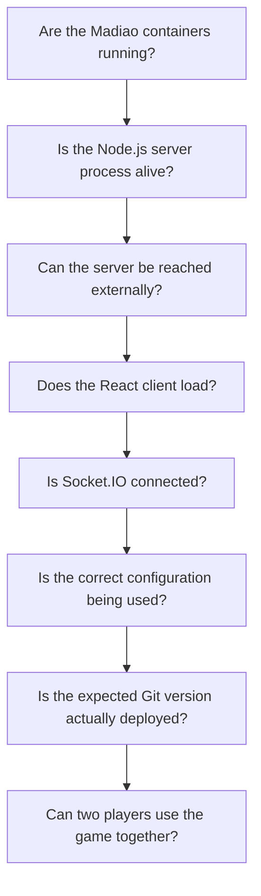
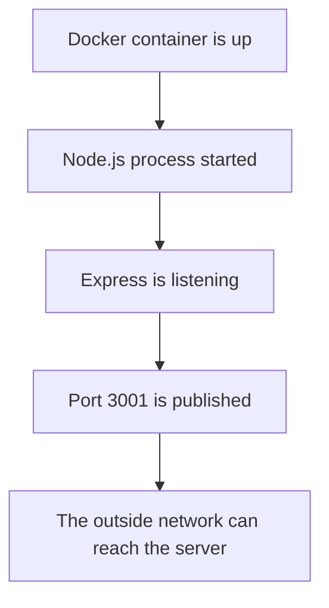
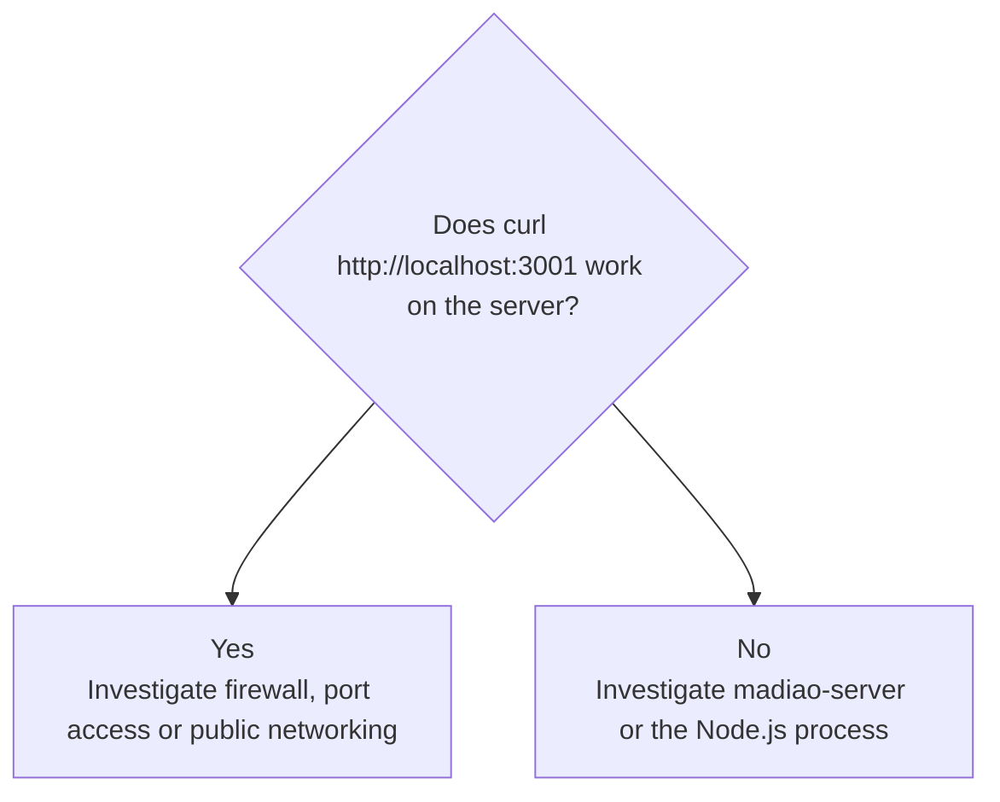
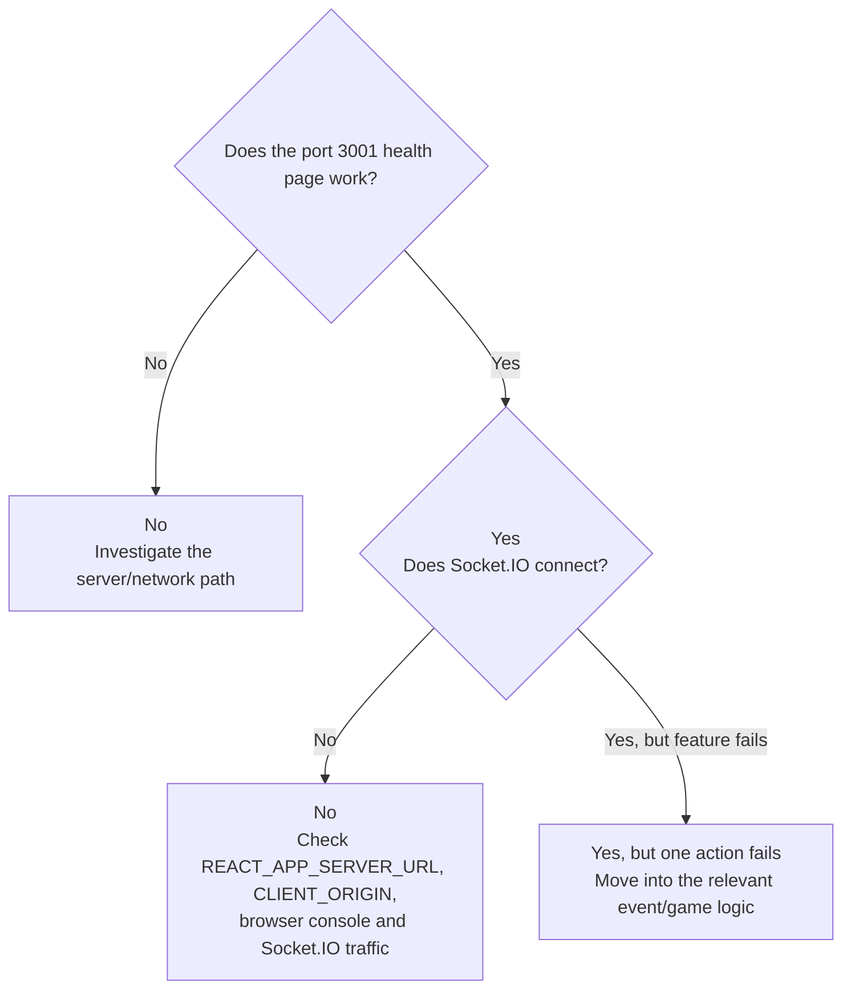
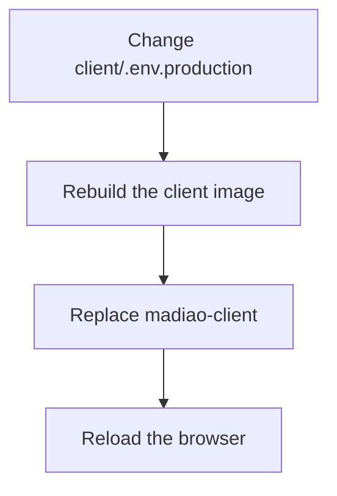
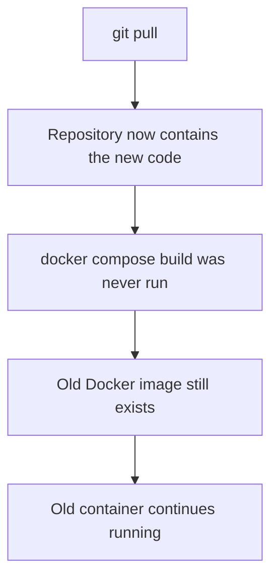
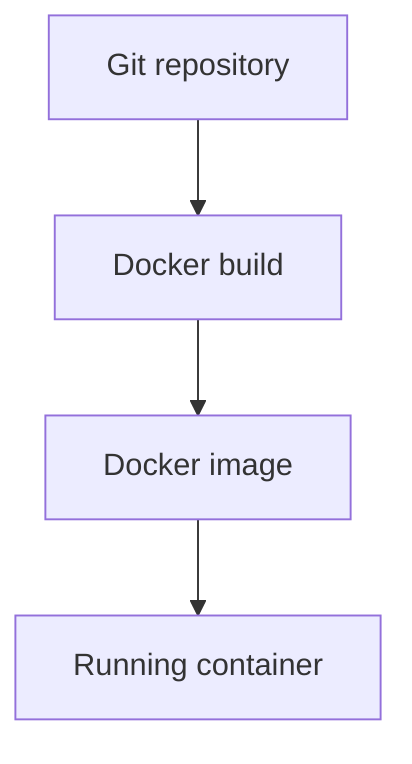

# Basic Health Checks

[Normal Production Updates](production-updates.md#normal-update-command-sequence) explains the normal
deployment process, while
[Main Gameplay Code Paths](../technical/gameplay-code-paths.md#following-a-bug-through-a-code-path) follows the main
gameplay actions through the application.

This chapter is meant to be much more practical.

Rather than tracing one particular bug immediately, the aim here is to answer a
few basic questions in the quickest possible order:



These checks are useful because quite a few different problems can look similar
from the browser.

For example, a player being unable to create a lobby could come from:

- the server container being stopped;
- the wrong server address being built into the client;
- the Socket.IO connection being blocked;
- a `CLIENT_ORIGIN` mismatch;
- an old production build still being live;
- an actual lobby bug.

Running a short health check first prevents jumping into game logic before we
know the underlying deployment is actually healthy.


## Is the Client Running?

The first Docker check is:

```bash
docker ps --filter "name=madiao"
```

Both expected containers should appear: `madiao-client` and `madiao-server`.

For the client specifically, `madiao-client` should show a status beginning with
`Up`, and the published port should correspond to:

| Host | Container | Purpose |
| ---: | ---: | --- |
| `3000` | `80` | nginx serving the React production build |

If the client is missing from the normal running list, check stopped containers:

```bash
docker ps -a --filter "name=madiao"
```

If `madiao-client` appears there as stopped or exited, check its logs:

```bash
docker logs madiao-client --tail 50
```

The client container is nginx serving the already-built React files.

That means a client container failure is normally more about:

- nginx;
- missing build output;
- bad container startup;
- a port conflict;

rather than React runtime logic.


### Browser check

If Docker says the client is running, open
`http://<server-address>:3000`.

The Join screen should appear.

This proves several things at once:

- the client container is running;
- port `3000` is published;
- the network/firewall allows the connection;
- nginx is serving the React build;
- the browser can download the application.

If the page does not load at all, there is little point debugging a declaration
or lobby event yet.

The problem is still at the client/container/network level.


## Is the Server Running?

The same Docker command checks the server:

```bash
docker ps --filter "name=madiao"
```

The expected server container is `madiao-server`, and it should also show as
`Up`.

Its published port should correspond to:

| Host | Container | Purpose |
| ---: | ---: | --- |
| `3001` | `3001` | Node.js / Express / Socket.IO server |

If it is missing:

```bash
docker ps -a --filter "name=madiao"
```

will show whether it exists but exited.

Then check:

```bash
docker logs madiao-server --tail 50
```

The server should eventually report that it is running on port `3001`, for
example:

```text
Server running on http://localhost:3001
```

## Is the Server Responding?

A running Docker container does not automatically prove the application inside
it is usable.

The next check is therefore the server's basic Express route.

From another machine or browser, open
`http://<server-address>:3001`.

The current server should return the simple Madiao health page containing:

```text
Madiao server is alive again
```

This route does not test the actual game, but it proves a useful chain:



If the server container is shown as running but this page cannot be reached,
the problem is probably not inside `declareCards` or `challenge`.

It is more likely to be something around:

- the published port;
- the host firewall;
- the hosting provider's firewall;
- the wrong public address;
- container networking;
- the server process not actually listening as expected.


### Checking locally from the server

If necessary, the production machine can test the route itself:

```bash
curl http://localhost:3001
```

If this works on the server but the same address cannot be reached externally,
that strongly suggests the Node process itself is healthy and the problem is
between the server and the outside network.

That distinction is useful:




## Is Socket.IO Connecting?

The client can load perfectly while multiplayer is completely broken.

This is possible because the browser gets the React application from port
`3000`, but the React application then creates a separate Socket.IO connection
to port `3001`.

!!! note "A working website does not prove multiplayer is connected"
    nginx can serve the React application successfully while Socket.IO is still
    failing. Client delivery and multiplayer communication are separate network
    paths.


### Quick functional check

The easiest Socket.IO test is usually not a special tool.

Simply try to create a lobby.

If the connection is working and the server accepts the request, the client
should receive `lobby_created` and move into the waiting room.

If the Join screen remains stuck or reports a connection-related failure, check
the server logs while trying again:

```bash
docker logs -f madiao-server
```

Then reproduce the action from the browser.

If the server receives the Socket.IO connection or event, something should reach
the Node process.

If absolutely nothing appears while the health page on `3001` still works, the
client may be trying to connect to the wrong server address.


### Browser developer tools

The browser developer tools can also help.

Open **Developer Tools → Network** and look for Socket.IO traffic.

Depending on the transport currently in use, entries may include `socket.io`,
`polling` or `websocket`.

A failing connection may show repeated requests or errors rather than one stable
connection.

The browser console can also show CORS or connection errors which are not
obvious from the game screen itself.


### Useful distinction

A practical way of separating the possibilities is:



That order avoids treating every multiplayer problem as a Socket.IO library
problem.


## Is Docker Reading the Correct Environment?

If the client loads and the server responds but the two still cannot communicate,
configuration becomes one of the first things worth checking.

There are two important values: `REACT_APP_SERVER_URL` and `CLIENT_ORIGIN`.

The two values are explained in more detail in
[`REACT_APP_SERVER_URL`](../technical/environment-configuration.md#react_app_server_url)
and
[`CLIENT_ORIGIN`](../technical/environment-configuration.md#client_origin):

| Value | What it controls |
| --- | --- |
| `REACT_APP_SERVER_URL` | Where the browser tries to reach the game server |
| `CLIENT_ORIGIN` | Which browser origin the server allows |


### Checking the server environment

The production server receives `CLIENT_ORIGIN` through Docker Compose.

The safest first check is:

```bash
docker compose config
```

Look for the server's environment section and confirm that `CLIENT_ORIGIN`
matches the address players are actually using to load the client.

For example, if players open `http://example-address:3000`, the server origin
needs to match that browser origin.


### Checking the running container

If there is doubt about what the running server container actually received,
Docker can inspect its environment:

```bash
docker inspect madiao-server
```

The output is large, so this is normally a second step after:

```bash
docker compose config
```

The important distinction is between **what the Compose file currently says**
and **what the running container was actually created with**.


### Checking the client server address

The client is different.

`REACT_APP_SERVER_URL` is a React build-time value.

That means changing `client/.env.production` without rebuilding the client
does not change the JavaScript already being served by nginx.

If the value was changed, the client needs:

```bash
docker compose build client
docker compose up -d client
```

before the browser can receive the new configuration.

This is one of the more common configuration traps because restarting the
client uses the same old image.

The correct sequence after a build-time change is:




## Is the Correct Git Version Deployed?

A deployment can look healthy while still running the wrong version of the code.

This is particularly easy to do if there is more than one copy of the repository
on the server.

The normal production folder should be `~/madiao`.

First check the location:

```bash
pwd
```

Then check Git:

```bash
git status
```

The production working tree should normally be clean.

To see the current commit:

```bash
git log -1 --oneline
```

This gives something similar to:

```text
abc1234 Fix challenge result timing
```

Compare that with the commit expected from the repository.


### Source code vs running container

There is another important distinction here.

Having the correct Git commit in `~/madiao` does not automatically prove the
container was rebuilt from it.

The possible situation is:



So if the source version is correct but behaviour still looks like the previous
version, check whether the relevant service was actually rebuilt and replaced.
The distinction is covered in more detail in
[Rebuilding the Application](production-updates.md#rebuilding-the-application)
and
[Replacing the Running Containers](production-updates.md#replacing-the-running-containers).


### Useful deployment chain

The version path is:



A healthy Git repository only proves the first step.


## Basic Multiplayer Test

The final health check should test the actual purpose of the application.

For Madiao, that means at least two clients successfully sharing one game.

A useful quick test is:

1. Open the client.
2. Create a lobby.
3. Open the client from another browser or device.
4. Join using the lobby code.
5. Confirm both players appear.
6. Start the game.
7. Confirm both players receive hands.
8. Confirm the same current player is shown on both screens.
9. Make one valid declaration.
10. Confirm both clients update.

If that works, a large part of the system has already been proven:

- client serving;
- server serving;
- Socket.IO connection;
- lobby creation;
- lobby joining;
- Socket.IO room broadcasting;
- game creation;
- private hand delivery;
- public game-state updates;
- declaration request/acknowledgement.


### Slightly deeper test

If there has recently been a gameplay change, extend the health check.

For example:

1. make another declaration;
2. challenge it;
3. confirm the real cards appear;
4. confirm the loser takes the pile;
5. confirm drinking happens;
6. confirm the next turn starts afterwards.

This is not necessary after every CSS adjustment.

However, it is useful after changes involving:

- `server/index.js`;
- `game/deck.js`;
- `game/rules.js`;
- shared timing constants;
- Socket.IO event handling.


## Quick Health Check Order

When the live game seems broken and the cause is not obvious, the following
order is usually enough:

```bash
cd ~/madiao

git status
git log -1 --oneline

docker compose config

docker ps --filter "name=madiao"

docker logs madiao-server --tail 50
docker logs madiao-client --tail 50
```

Then check:

1. `http://<server-address>:3001`
2. `http://<server-address>:3000`

Finally:

1. create a lobby;
2. join from a second client;
3. start the game;
4. make one play.

The useful part of this order is that every successful step rules out a whole
group of possible causes.


## Reading the Result of the Checks

A short diagnosis table is:

| Result | Most likely area to investigate next |
| --- | --- |
| Neither container is running | Docker/Compose/host |
| Client stopped, server running | Client image/nginx |
| Server stopped, client running | Node server/server image |
| Server works locally but not publicly | Firewall/network/port access |
| Client page does not load | Client/nginx/port `3000` |
| Client loads, server health page fails | Server/network/port `3001` |
| Both HTTP endpoints work, Socket.IO fails | `REACT_APP_SERVER_URL`, `CLIENT_ORIGIN`, browser connection |
| Socket.IO works, lobby creation fails | Lobby event/server validation |
| Lobby works, game start fails | `startGame` path |
| Game starts, one gameplay feature fails | Relevant gameplay code path |
| Behaviour looks like an older version | Git/image/container version chain |

!!! tip "Stop once the failing layer becomes clear"
    The purpose of a health check is to narrow the fault domain. Once one stage
    clearly fails, there is no need to keep testing deeper gameplay behaviour
    until that underlying layer is fixed.

This is not meant to replace
[Troubleshooting by Problem](troubleshooting.md#quick-troubleshooting-reference).

It is simply a way of narrowing the problem down before starting that deeper
investigation.


## Chapter Summary

The basic health checks should move from the outside of the application towards
the actual game logic.

Start by checking that `madiao-client` and `madiao-server` are both running.

Then confirm that the Node server responds directly on port `3001` and that the
React application loads on port `3000`.

After that, check whether Socket.IO can actually create a lobby.

If normal HTTP works but multiplayer does not, the main configuration values
to check are `REACT_APP_SERVER_URL` and `CLIENT_ORIGIN`.

Remember that `CLIENT_ORIGIN` is a server runtime setting, while
`REACT_APP_SERVER_URL` is built into the React client and therefore requires a
client rebuild when changed.

It is also worth confirming the production Git commit with:

```bash
git log -1 --oneline
```

while remembering that the correct source code does not become live until the
corresponding Docker image and container have also been rebuilt/replaced.

Finally, a proper health check for Madiao should end with at least two players
creating a lobby, joining, starting a match and successfully completing one
normal play.

If that basic multiplayer path works, the deployment itself is probably healthy
and any remaining problem can be investigated much closer to the specific game
feature which is misbehaving.
