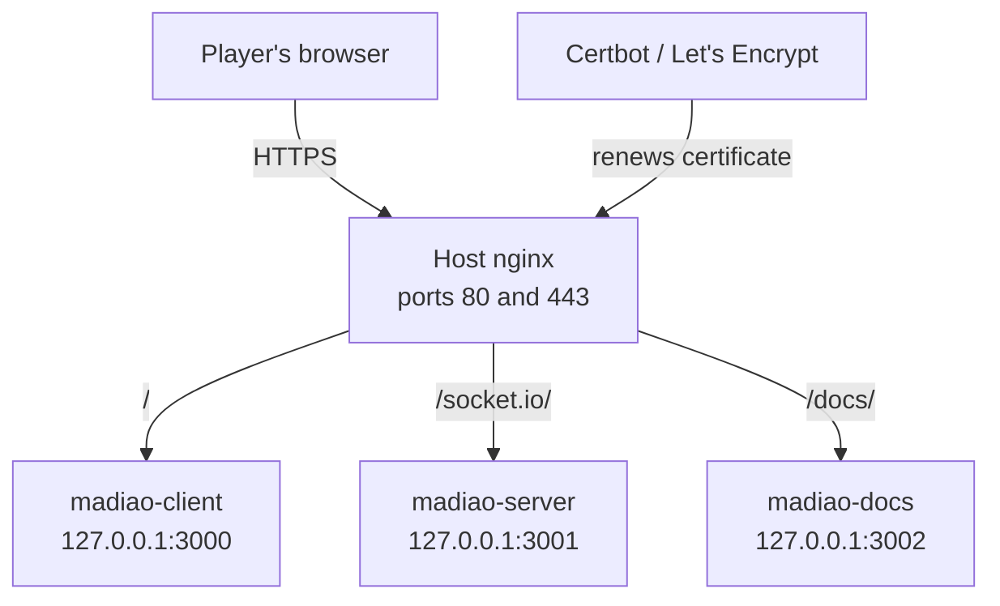
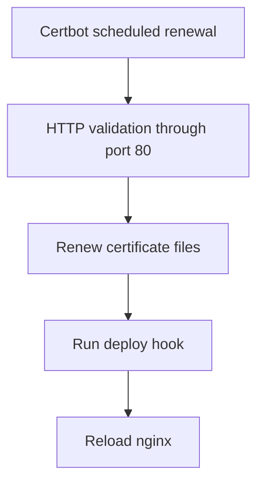

# HTTPS and Reverse Proxy Setup
!!! warning "Complete the original deployment first"
    Do not start this section until the client, server and documentation are all
    working through ports `3000`, `3001` and `3002`.

    This section changes a working deployment rather than replacing the original
    setup process.
    
The basic production setup is enough to get Madiao online, however, it leaves
three separate application ports exposed to the internet. That works perfectly
fine while the project is first being deployed and tested, but it is not the
setup used by the current production server anymore.

The next step was therefore to put a normal nginx installation on the host
machine and use it as the main entry point for the whole application. Instead
of asking the browser to connect directly to ports `3000`, `3001` and `3002`,
nginx now accepts the public traffic on ports `80` and `443` and sends it to the
correct container internally.

This also gave us a place to handle HTTPS without having to configure a
certificate separately inside every container.

The current production path looks like this:



The end result is fairly simple from the outside:

```text
https://<server-ip>/
```

loads the game, while:

```text
https://<server-ip>/docs/
```

loads the documentation.

The three Docker services are still running on their original ports, but those
ports are now bound to `127.0.0.1` and are no longer supposed to be reached
directly from the public internet.

The certificate used by the current server comes from Let's Encrypt and is
issued directly for the server's public IP address. These IP certificates are
short lived, which makes automatic renewal an important part of the setup rather
than something that can be left for later.


## Before Starting

It is worth getting the normal HTTP deployment working first before adding HTTPS
on top of it.

At this point the following should already work:

- the React client on port `3000`;
- the Node.js / Socket.IO server on port `3001`;
- the documentation site on port `3002`;
- the Docker Compose configuration;
- normal SSH access to the server.

There is not much value in troubleshooting TLS and the application itself at the
same time. If the game does not work over the old direct ports, fix that first
and only then move on to the reverse proxy.

!!! warning "Keep the old application ports available for now"
    Do not close ports `3000`, `3001` and `3002` at the beginning of this
    process.

    They are useful as a fallback while nginx and HTTPS are being configured.
    Only remove the public access once the game, Socket.IO connection and
    documentation have all been tested through the new HTTPS path.


## Check Ports 80 and 443

The reverse proxy needs two normal web ports:

| Port | Purpose |
| ---: | --- |
| `80` | HTTP, Let's Encrypt validation and redirect to HTTPS |
| `443`| Normal HTTPS traffic |

Before installing or changing anything, first check whether another process is
already using either of them:

```bash
sudo ss -ltnp | grep -E ':(80|443)\s'
```

The host firewall can be checked with:

```bash
sudo ufw status
```

If UFW is active and the ports are not already allowed:

```bash
sudo ufw allow 80/tcp
sudo ufw allow 443/tcp
```

The hosting provider can also have its own firewall outside the Linux machine.
That was relevant for the Madiao server, so the same two ports also need to be
allowed there.

One thing worth remembering is that port `80` is still useful after HTTPS is
working. Normal users will be redirected to HTTPS, but Certbot can continue to
use the HTTP path when proving control of the IP during certificate renewal.

!!! danger "Do not confuse the web ports with SSH"
    Closing the old Madiao application ports later does not mean the server
    should only have `80` and `443` open under every circumstance.

    The SSH rule used for administration still needs to remain reachable.


## Install Host nginx

Madiao already uses nginx inside the React client container and inside the
documentation container. The nginx installed here is a separate one running on
the Ubuntu host itself.

Its job is not to replace those containers. It sits in front of them and decides
where each public request should go.

```text
Internet
   |
host nginx
   |
   +-> React container
   +-> Socket.IO server
   +-> documentation container
```

Install nginx with:

```bash
sudo apt update
sudo apt install -y nginx
```

Then enable and start it:

```bash
sudo systemctl enable --now nginx
sudo systemctl status nginx --no-pager
```

At this stage, opening:

```text
http://<server-ip>
```

should normally return the default nginx page, unless another server block is
already configured.

This is enough to confirm that nginx itself is reachable before it is asked to
do anything more complicated.


## Prepare the ACME Challenge Directory

Before Let's Encrypt can issue a certificate, it needs to verify that the server
actually controls the IP address being requested.

For this setup Certbot uses the `webroot` method. In practice this means Certbot
places a temporary file in a known directory and Let's Encrypt tries to download
that file over HTTP.

Create the directory with:

```bash
sudo mkdir -p /var/www/certbot/.well-known/acme-challenge
```

and make sure nginx can read it:

```bash
sudo chmod -R 755 /var/www/certbot
```

Now create the first Madiao nginx configuration:

```text
/etc/nginx/sites-available/madiao
```

At this point it only needs to serve the challenge path. There is no reason to
configure the full reverse proxy before we even know whether certificate
validation works.

```nginx
server {
    listen 80 default_server;
    listen [::]:80 default_server;

    server_name _;

    location ^~ /.well-known/acme-challenge/ {
        root /var/www/certbot;
        default_type text/plain;
    }

    location / {
        return 200 "Madiao HTTPS setup\n";
        add_header Content-Type text/plain;
    }
}
```

Disable the default nginx site and enable the new one:

```bash
sudo rm -f /etc/nginx/sites-enabled/default
sudo ln -s /etc/nginx/sites-available/madiao /etc/nginx/sites-enabled/madiao
```

Before reloading nginx, always check the configuration first:

```bash
sudo nginx -t
```

If the syntax test succeeds:

```bash
sudo systemctl reload nginx
```

The `nginx -t` check becomes useful throughout this page. A bad nginx
configuration can stop the reload, so it is much better to catch that before
replacing a working configuration with a broken one.


## Test the Challenge Path

Before asking Certbot to contact Let's Encrypt, it is worth testing the same
HTTP path ourselves.

Create a temporary file:

```bash
echo "madiao-acme-test" | sudo tee /var/www/certbot/.well-known/acme-challenge/test
```

Then, from another computer, open:

```text
http://<server-ip>/.well-known/acme-challenge/test
```

The page should contain:

```text
madiao-acme-test
```

This small test saves a fair amount of guesswork later.

If the file works locally on the server but cannot be opened from another
computer, the problem is more likely to be nginx, UFW or the hosting provider's
firewall than Certbot itself.

There is no point repeatedly requesting a certificate while the validation URL
is not reachable in the first place.


## Install Certbot

The current Madiao server uses Certbot through Snap.

Install it with:

```bash
sudo snap install --classic certbot
```

If required, expose the command through a normal system path:

```bash
sudo ln -s /snap/bin/certbot /usr/local/bin/certbot
```

If the link already exists, it does not need to be created again.

Check the installed version with:

```bash
certbot --version
```

For the IP-address `webroot` setup used here, Certbot `5.4` or newer is needed.


## Request a Staging Certificate First

The first certificate should be requested from Let's Encrypt's staging
environment.

This certificate is intentionally not trusted by normal browsers. The point of
it is simply to prove that the server, nginx challenge path and Certbot command
all work before using the production certificate service.

Run:

```bash
sudo certbot certonly \
  --staging \
  --preferred-profile shortlived \
  --webroot \
  --webroot-path /var/www/certbot \
  --ip-address <server-ip>
```

The `--ip-address` value is just the address itself.

For example:

```text
203.0.113.10
```

not:

```text
http://203.0.113.10/
```

That distinction is easy to miss because most of the addresses used while
setting up the game are complete URLs. Certbot is expecting an IP value here,
not a web address.

If the staging request succeeds, Let's Encrypt was able to reach the challenge
file and verify the server.

That is the main thing we wanted to prove before moving on.


## Replace the Staging Certificate with Production

Once the staging request works, remove the temporary certificate lineage:

```bash
sudo certbot delete --cert-name <server-ip>
```

Then repeat the request without `--staging`:

```bash
sudo certbot certonly \
  --preferred-profile shortlived \
  --webroot \
  --webroot-path /var/www/certbot \
  --ip-address <server-ip>
```

After a successful request Certbot reports where it stored the certificate and
private key.

For this setup they normally look like:

```text
/etc/letsencrypt/live/<server-ip>/fullchain.pem
/etc/letsencrypt/live/<server-ip>/privkey.pem
```

The currently known certificates can also be checked with:

```bash
sudo certbot certificates
```

!!! note "The IP certificate is supposed to expire quickly"
    The Let's Encrypt IP certificate uses the short-lived profile and lasts for
    roughly 160 hours.

    Seeing an expiry date only a few days away is therefore normal. The setup is
    designed around automatic renewal rather than manually requesting a new
    certificate every week.


## Configure the HTTPS Reverse Proxy

Once the real certificate exists, the temporary nginx configuration can be
replaced with the actual production setup.

There are two server blocks.

The first one continues listening on port `80`. The ACME challenge path stays
available for Certbot and everything else is redirected to HTTPS:

```nginx
server {
    listen 80 default_server;
    listen [::]:80 default_server;

    server_name _;

    location ^~ /.well-known/acme-challenge/ {
        root /var/www/certbot;
        default_type text/plain;
    }

    location / {
        return 301 https://$host$request_uri;
    }
}
```

The second server block handles the real application traffic on port `443`:

```nginx
server {
    listen 443 ssl default_server;
    listen [::]:443 ssl default_server;

    server_name _;

    ssl_certificate /etc/letsencrypt/live/<server-ip>/fullchain.pem;
    ssl_certificate_key /etc/letsencrypt/live/<server-ip>/privkey.pem;

    # React client
    location / {
        proxy_pass http://127.0.0.1:3000;

        proxy_set_header Host $host;
        proxy_set_header X-Real-IP $remote_addr;
        proxy_set_header X-Forwarded-For $proxy_add_x_forwarded_for;
        proxy_set_header X-Forwarded-Proto https;
    }

    # Socket.IO server
    location /socket.io/ {
        proxy_pass http://127.0.0.1:3001;

        proxy_http_version 1.1;
        proxy_set_header Upgrade $http_upgrade;
        proxy_set_header Connection "upgrade";

        proxy_set_header Host $host;
        proxy_set_header X-Real-IP $remote_addr;
        proxy_set_header X-Forwarded-For $proxy_add_x_forwarded_for;
        proxy_set_header X-Forwarded-Proto https;
    }

    # Keep the documentation URL consistent
    location = /docs {
        return 301 /docs/;
    }

    # MkDocs documentation
    location /docs/ {
        proxy_pass http://127.0.0.1:3002/;

        proxy_set_header Host $host;
        proxy_set_header X-Real-IP $remote_addr;
        proxy_set_header X-Forwarded-For $proxy_add_x_forwarded_for;
        proxy_set_header X-Forwarded-Proto https;
    }
}
```

The routing is now:

| Public path | Internal destination |
| --- | --- |
| `/` | `127.0.0.1:3000` |
| `/socket.io/` | `127.0.0.1:3001` |
| `/docs/` | `127.0.0.1:3002` |

The Socket.IO section needs a little more configuration than the other two.
Socket.IO can upgrade the connection to WebSocket, so nginx has to pass the
upgrade headers through rather than treating it like a normal static request.

!!! warning "Keep the Socket.IO upgrade headers"
    Removing `proxy_http_version`, `Upgrade` or `Connection` can leave the game
    page working while the multiplayer connection itself fails.

    This is one of those cases where a healthy React page does not necessarily
    mean the whole application is healthy.

Check nginx again before applying the change:

```bash
sudo nginx -t
sudo systemctl reload nginx
```


## Update the Production Application Addresses

Getting the HTTPS page to load is only part of the change.

The React client also needs to connect to Socket.IO through HTTPS. If it still
tries to use:

```text
http://<server-ip>:3001
```

then the browser is loading a secure page and immediately trying to create an
insecure connection from it. Modern browsers can block that as mixed content.

The current production values therefore use the public HTTPS address:

```env
REACT_APP_SERVER_URL=https://<server-ip>
CLIENT_ORIGIN=https://<server-ip>
```

There is no `:3001` in the browser-facing server URL anymore.

From the browser's point of view, Socket.IO is available at:

```text
https://<server-ip>/socket.io/
```

nginx then forwards that request internally to:

```text
127.0.0.1:3001
```

The difference between these two addresses is important. The browser only knows
about the public HTTPS endpoint. Port `3001` is now an implementation detail on
the server.

`REACT_APP_SERVER_URL` is a React build-time value, so changing it requires the
client image to be rebuilt.

For the current deployment:

```bash
cd ~/madiao

docker compose config
docker compose up -d --build client server
```

Then check the containers:

```bash
docker compose ps
```


## Test HTTPS Before Removing the Old Access

At this point, keep the old ports open for a little longer and test the new path
from another computer.

The two main public addresses should now be:

```text
https://<server-ip>/
https://<server-ip>/docs/
```

The game test should include more than opening the home page.

Create a lobby, join it from another browser or private window and make sure the
multiplayer connection works normally. This verifies that `/socket.io/` is also
being proxied correctly rather than only proving that nginx can serve the React
page.

If all of that works, the direct public ports have finished their job and can be
removed.


## Bind the Containers to Localhost

The Docker services still need their ports because host nginx has to reach them,
but they no longer need to listen on every host interface.

The Compose mappings can therefore be changed from normal public bindings to
localhost-only bindings:

```yaml
server:
  ports:
    # Localhost-only; public access is handled by the host nginx reverse proxy.
    - "127.0.0.1:3001:3001"

client:
  ports:
    # Localhost-only; public access is handled by the host nginx reverse proxy.
    - "127.0.0.1:3000:80"

docs:
  ports:
    # Localhost-only; public access is handled by the host nginx reverse proxy.
    - "127.0.0.1:3002:80"
```

This change belongs in the repository because it is part of the intended Docker
Compose deployment, rather than being a one-off server edit.

After pulling or applying the updated Compose file on production:

```bash
docker compose config
docker compose up -d
```

Check the result with:

```bash
docker compose ps
```

The important difference is that the mappings should now start with:

```text
127.0.0.1
```

rather than:

```text
0.0.0.0
```

The services are still reachable by host nginx, but a normal connection from
another machine can no longer go directly to those Docker ports.


## Close the Old Public Application Ports

Once HTTPS and Socket.IO have been tested properly, the hosting-provider and
host firewall rules for the old application ports can be removed.

Those are:

| Port | Previous use |
| ---: | --- |
| `3000` | Direct React client access |
| `3001` | Direct Node.js / Socket.IO access |
| `3002` | Direct documentation access |

The normal public web traffic now uses:

| Port | Purpose |
| ---: | --- |
| `80` | HTTP challenge and redirect to HTTPS |
| `443` | HTTPS application traffic |

The final layout is therefore:

```text
public internet
     |
     +--> 80 / 443 --> host nginx
                         |
                         +--> 127.0.0.1:3000
                         +--> 127.0.0.1:3001
                         +--> 127.0.0.1:3002
```

There are two separate protections here.

Docker only listens for those three application ports on localhost, and the
public firewall no longer allows direct traffic to them anyway.

That may look slightly repetitive, but it means accidentally changing one layer
later does not automatically expose all three containers again.


## Configure Automatic nginx Reload After Renewal

Certbot takes care of renewing the certificate files, but nginx still has to
start using the newly renewed files.

The easiest way to handle that is with a Certbot deploy hook.

Create:

```text
/etc/letsencrypt/renewal-hooks/deploy/reload-nginx.sh
```

with:

```bash
#!/bin/sh
systemctl reload nginx
```

Then make the file executable:

```bash
sudo chmod +x /etc/letsencrypt/renewal-hooks/deploy/reload-nginx.sh
```

The deploy hook is only run after a certificate has actually been renewed
successfully. That makes more sense than reloading nginx every time Certbot
checks whether renewal is needed.

Certbot also installs its own scheduled renewal task, so there is no need to
create a separate cron job for the current setup.

This is particularly important with the short-lived IP certificate. Manual
renewal every few days would be easy to forget and there is no real benefit in
doing something by hand which Certbot is already designed to automate.


## Test Automatic Renewal

Do not wait until the certificate is close to expiry to find out whether renewal
works.

Run:

```bash
sudo certbot renew --dry-run --run-deploy-hooks
```

A successful result proves that Certbot can repeat the validation process. The
`--run-deploy-hooks` option also runs the nginx reload hook as part of the test.

Certificate information can be checked at any time with:

```bash
sudo certbot certificates
```

The files inside:

```text
/etc/letsencrypt/live/
```

are managed by Certbot and should stay on the production server. They do not
belong in the Madiao repository.


## Final Verification

At this point the whole public route should be working through host nginx.

The expected addresses are:

| Component | Public address |
| --- | --- |
| Game | `https://<server-ip>/` |
| Documentation | `https://<server-ip>/docs/` |
| Socket.IO | `https://<server-ip>/socket.io/` |

The final check should be done from another machine rather than only from the
server itself.

Check that:

- the browser trusts the HTTPS certificate;
- opening HTTP redirects to HTTPS;
- the game loads normally;
- another browser can join a lobby;
- the Socket.IO connection stays active;
- normal gameplay still works;
- the documentation loads through `/docs/`;
- documentation navigation, search and assets still work;
- ports `3000`, `3001` and `3002` cannot be reached directly from the internet;
- `certbot renew --dry-run --run-deploy-hooks` succeeds.

If those checks pass, nginx is now the only public web entry point for Madiao.
The containers still use their normal internal ports, but the outside user does
not need to know anything about them.

## Normal Certificate Maintenance

There should not be much manual maintenance after the initial setup.

The normal renewal path is:



If HTTPS stops working later, the first useful checks are:

```bash
sudo certbot certificates
sudo certbot renew --dry-run
sudo nginx -t
sudo systemctl status nginx --no-pager
```

It is also worth checking that the ACME challenge path is still reachable over
HTTP, because future renewals depend on that route remaining available.

The main thing to remember is that the certificate itself is deliberately short
lived, but the renewal process is not supposed to be manual. Once Certbot and
the nginx deploy hook are working correctly, the certificate should normally
renew without needing any regular intervention.
