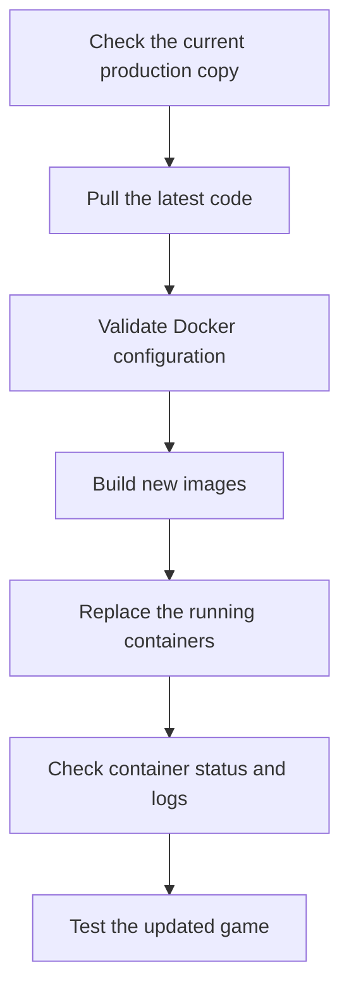
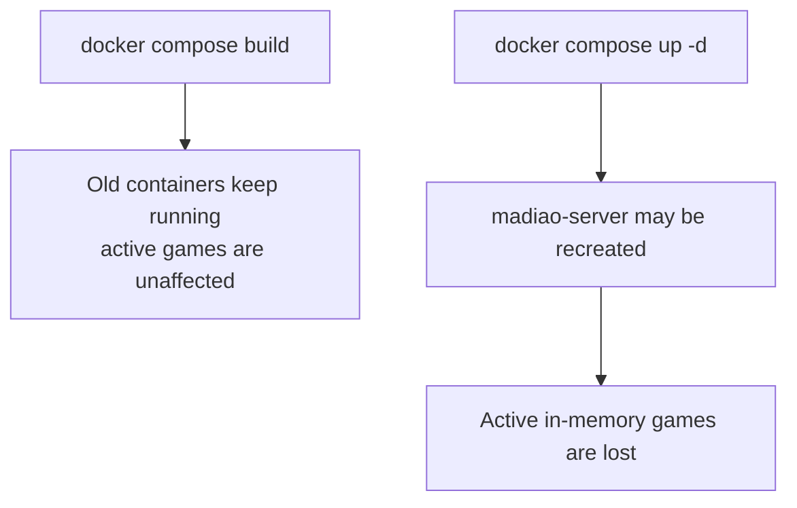
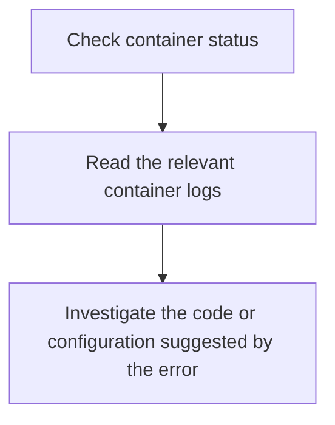
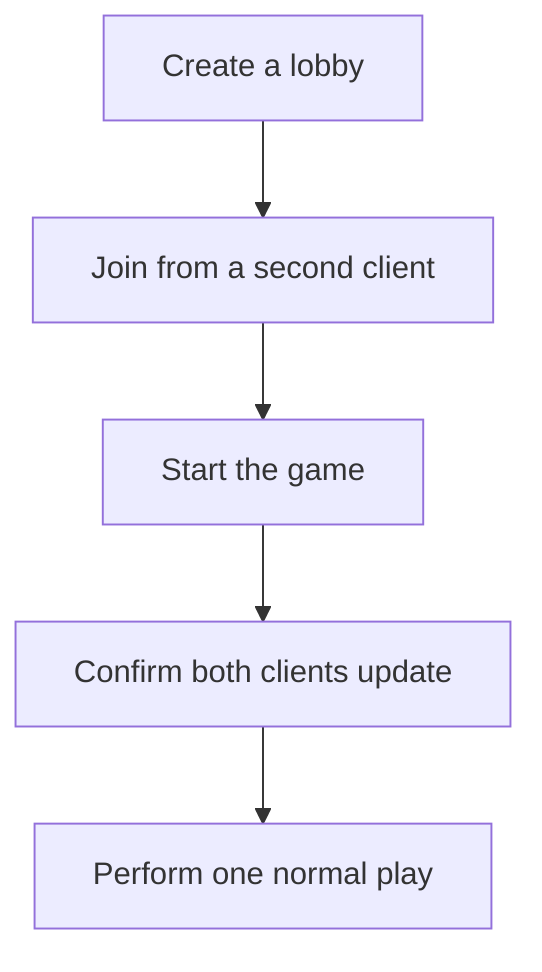
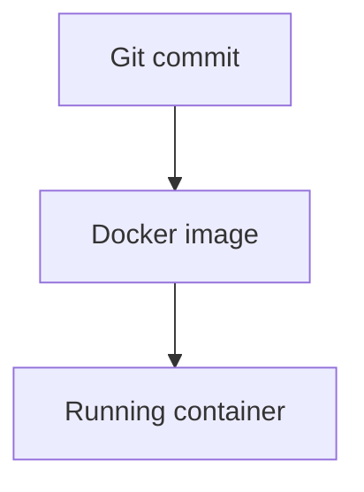
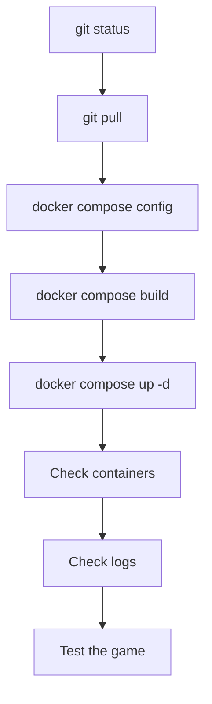

# Normal Production Updates

Once the first production setup has been completed, most future deployments are
much simpler.

There is no need to clone the repository again, recreate the Docker setup or
repeat all of the first-time preparation. The production server already has a
working copy of the project and Docker already knows how both services should
be built.

A normal update is therefore mostly a case of bringing the production repository
up to date, rebuilding the images and replacing the running containers with the
new version.

The basic flow is:



Although the process is short, it is still worth doing the checks in order.

Production is generally the worst place to discover that an unexpected local
file was changed or that the Compose configuration no longer parses correctly.


## Before Starting an Update

!!! warning "Do not replace the server during an active game"
    Madiao currently stores active lobbies, games and timers in server memory.
    Replacing or restarting `madiao-server` therefore clears all currently
    running game sessions.

    There is also no reconnection system which can restore those players
    afterwards, so production updates should preferably be done when nobody is
    in the middle of a game.

The actual Docker commands only take a relatively short amount of time once the
images are built, but from the point of view of an active player the server
replacement is still effectively a complete game reset.

A useful way of thinking about an update is:



This distinction is important.

Building a new image does not by itself restart the live game.

The interruption happens when the running container is replaced.


## Entering the Production Repository

After connecting to the production server, move into the live repository:

```bash
cd ~/madiao
```

It is worth checking the current location before running Git or Docker commands:

```bash
pwd
```

The expected location should be the active production clone, for example
`/home/<user>/madiao`.

This matters because an older clone or test folder may still exist elsewhere on
the server.

Running the correct command in the wrong copy of the project can be surprisingly
confusing because Git and Docker may both behave normally while nothing about the
actual production deployment changes.


## Checking Git Before Pulling

Before retrieving anything from the repository, run:

```bash
git status
```

Ideally the production copy should report something similar to:

```text
On branch main
Your branch is up to date with 'origin/main'.

nothing to commit, working tree clean
```

The wording may vary slightly, but the important part is `working tree clean`.

The production repository should normally match the version stored in Git.

If tracked files have unexpected local changes, do not immediately pull over
them.

First work out what changed and why.

For example:

```bash
git diff
```

can show the actual changes to tracked files.

This does not modify anything.

If the local change was only an accidental or temporary edit and the repository
version is definitely the one which should be used, it can later be restored.

The more detailed recovery steps for this situation are covered in
[Dirty Production Repository](git-problems.md#dirty-production-repository) and
[`git pull` Cannot Continue](git-problems.md#git-pull-cannot-continue).

The important rule here is simply:

> Do not treat `git pull` as the first diagnostic tool for a dirty production
> repository.


## Pulling the Latest Version

Once the working tree is clean, update the local copy:

```bash
git pull
```

This brings the production repository up to date with its configured remote
branch.

Afterwards it can be useful to run:

```bash
git status
```

again.

This gives a quick confirmation that the pull completed normally and that there
are no unexpected changes left behind.

If there is any doubt about which commit is currently checked out:

```bash
git log -1 --oneline
```

shows the most recent commit.

This becomes particularly useful when comparing the production server with the
latest commit visible in the repository.


## Validating the Updated Configuration

Before rebuilding, run:

```bash
docker compose config
```

This step may feel repetitive because the Compose file often has not changed.

It is still worth doing.

A code update can include changes to:

- `docker-compose.yml`;
- Dockerfiles;
- production configuration;
- service names;
- port mappings.

and `docker compose config` is a cheap way of catching a broken Compose file
before starting a longer build.

For the current Madiao setup the important values should still correspond to:

| Service | Expected mapping |
| --- | --- |
| `madiao-client` | host `3000` → container `80` |
| `madiao-server` | host `3001` → container `3001` |

The server should also receive the expected `CLIENT_ORIGIN`.

If the command reports an error, stop there and fix the configuration before
continuing.


## Rebuilding the Application

Build the new images with:

```bash
docker compose build
```

This processes both the client and server services.

Docker will normally reuse unchanged build layers, so later builds may be much
quicker than the first deployment.

However, whether the build takes a few seconds or several minutes depends on
what actually changed.

For example:

| Change | Likely rebuild effect |
| --- | --- |
| CSS or React source | Client image rebuild |
| `server/index.js` | Server image rebuild |
| `package-lock.json` | Dependency-installation layer may rebuild |

The important thing to remember is that a successful:

```bash
docker compose build
```

does not mean the new version is live yet.

At this point the currently running containers can still be using the previous
images.

This is useful because it gives us a natural checkpoint.

!!! tip "A failed build does not automatically break the live version"
    Until `docker compose up -d` replaces a service, the existing production
    containers can continue running the previous image. A build failure is
    therefore a reason to stop and fix the build, not to start changing the live
    containers.

If the build fails, the existing production containers have not automatically
been replaced and may still be running the previous working version.

Do not continue to the replacement step until the build finishes successfully.

If the build itself fails,
[Build and Dependency Problems](build-problems.md) covers the main failure
points, including [`npm ci` Failure](build-problems.md#npm-ci-failure),
[Docker Build Failure](build-problems.md#docker-build-failure) and
[React Build Failure](build-problems.md#react-build-failure).


## Replacing the Running Containers

Once both images have built successfully, apply them with:

```bash
docker compose up -d
```

Docker Compose compares the running services with the current configuration and
images.

If a service needs to be recreated, Compose replaces that container and starts
the new version.

The normal result should leave `madiao-client` and `madiao-server` running
again.

This is the point where the earlier warning about active games becomes relevant.

If `madiao-server` is recreated, all of the in-memory Maps used for lobbies,
game state, timers and socket/lobby links are created again from scratch.

Any active match therefore disappears.

For that reason it is usually better to think of:

```bash
docker compose up -d
```

as the actual deployment step, while:

```bash
docker compose build
```

is only preparation for the deployment.


## Checking Container Status

Immediately after the update, check the containers:

```bash
docker ps --filter "name=madiao"
```

Both should show as running.

The expected services are `madiao-client` and `madiao-server`.

If one is missing, use:

```bash
docker ps -a --filter "name=madiao"
```

This also shows stopped containers.

A service which starts and crashes immediately may disappear from normal
`docker ps`, while still being visible in `docker ps -a`.

This is usually much more useful than repeatedly running `docker compose up -d`
and hoping the next attempt behaves differently.


## Checking Logs

Once the containers are up, check the server log:

```bash
docker logs madiao-server --tail 50
```

The server should start normally and report that it is listening on port `3001`.

Then check the client:

```bash
docker logs madiao-client --tail 50
```

For nginx there may not be very much output until requests reach it.

If either service has a startup problem, the logs are normally the next place to
look. More log commands, including following output live, are collected in
[Viewing Logs](docker-operations.md#viewing-logs).

The important order is:



rather than immediately changing unrelated files.


## Testing the Updated Version

A deployment should be checked after the containers are replaced.

At minimum, confirm that the client still loads at
`http://<server-address>:3000` and that the server still responds at
`http://<server-address>:3001`.

After that, perform a small multiplayer check.

For a routine update this does not need to be a full match.

A useful minimum is:



If the update specifically changed a certain system, naturally that system
should also be tested.

For example:

| Area changed | Targeted check |
| --- | --- |
| Challenge logic/UI | Test a challenge |
| Timer behaviour | Allow a full turn/timer sequence to run |
| Game-over behaviour | Test a short match if practical |
| Lobby behaviour | Specifically test create/join/start |

The general multiplayer check proves that the deployment still works.

The targeted test proves that the feature which was actually changed works.


## Confirming the Correct Git Version Is Live

It can occasionally be useful to record or check the deployed commit.

Run:

```bash
git log -1 --oneline
```

This gives a short commit identifier and message.

For example:

```text
abc1234 Fix challenge result timing
```

This does not prove by itself that Docker rebuilt every service correctly, but
it proves which source version exists in the production repository.

Combined with:

```bash
docker compose build
docker compose up -d
```

it gives a reasonably clear deployment trail:



If something unexpected appears in production, knowing the deployed commit
makes it much easier to compare that version with Git history or a previous
release. If the new version needs to be backed out, the full procedure is covered
in [Recovery and Rollback](rollback.md).


## Updating Only One Service

Most normal deployments can simply rebuild both services:

```bash
docker compose build
docker compose up -d
```

For a small project this is straightforward and reduces the chance of forgetting
that a change affected both sides.

However, Docker Compose can also rebuild a single service when there is a good
reason to do so.

For example:

```bash
docker compose build client
docker compose up -d client
```

or:

```bash
docker compose build server
docker compose up -d server
```

This can be useful for a clearly isolated change.

A CSS-only adjustment, for example, does not require a new Node server image.

There is one important operational difference though.

Replacing only the client does not remove the server's in-memory games.

Replacing the server does.

So the operational difference is:

| Update | Effect on active games |
| --- | --- |
| Client-only update | Active server games can continue |
| Server update | In-memory server state resets |

This does not mean every update should automatically be split into individual
services.

It simply gives us an option when the change is clearly isolated and avoiding an
unnecessary server restart is useful.


## Normal Update Command Sequence

For most normal deployments the shortened procedure is:

```bash
cd ~/madiao

git status
git pull

docker compose config
docker compose build
docker compose up -d

docker ps --filter "name=madiao"

docker logs madiao-server --tail 50
docker logs madiao-client --tail 50

git log -1 --oneline
```

Then test the client and basic multiplayer flow.

The sequence is intentionally simple.

Each step answers one useful question:

| Step | Question |
| --- | --- |
| `git status` | Is the production repository safe to update? |
| `git pull` | Do I now have the latest source code? |
| `docker compose config` | Does Docker understand the configuration? |
| `docker compose build` | Can the new version be built successfully? |
| `docker compose up -d` | Is the new version now running? |
| `docker ps` | Did the containers stay up? |
| `docker logs` | Did the applications start normally? |
| Browser/game test | Does the actual product work? |

That is generally enough for a normal Madiao production update.


## Chapter Summary

Normal production updates are much shorter than the first deployment because the
server already contains a working Git clone and Docker setup.

The usual process is:



The most important operational detail is the difference between building and
replacing the containers.

`docker compose build` prepares new images but does not by itself remove the
running game.

`docker compose up -d` may recreate the server container and therefore clears
all active in-memory lobbies and matches.

For that reason server deployments should preferably happen when nobody is
playing.

Lastly, the production repository should normally remain clean and match the
version stored in Git. If unexpected tracked changes appear on the server, work
out what they are before pulling or overwriting anything.
