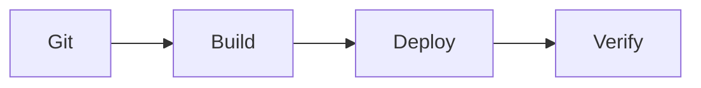

# Quick Reference

This page is deliberately short on explanation.

The rest of the documentation explains what the commands do, why they are used
and what can go wrong. This page is for situations where the system is already
understood and the only thing needed is the command, file location or normal
order of operations.

For deeper explanations, use the links beside each section.


## Normal Production Update

This is the standard production update sequence:

```bash
ssh <sudo-user>@<server-ip>

cd ~/madiao

git status
git pull

docker compose config
docker compose build
docker compose up -d

docker compose ps

docker logs madiao-server --tail 50
docker logs madiao-client --tail 50

git log -1 --oneline
```

Then test:

| Check | Address |
| --- | --- |
| Client | `http://<server-ip>:3000` |
| Server health page | `http://<server-ip>:3001` |



For the full process, see
[Normal Production Updates](production-updates.md).


## Connect to the Server

Normal SSH connection:

```bash
ssh <sudo-user>@<server-ip>
```

Initial root connection, if root SSH is still enabled:

```bash
ssh root@<server-ip>
```

Check the current Linux user:

```bash
whoami
```

Leave the SSH session:

```bash
exit
```

Switch from root to another user:

```bash
su - <username>
```

A normal shell prompt usually ends in `$`, while a root shell commonly ends
in `#`.

| Prompt | Usually means |
| --- | --- |
| `$` | Normal user |
| `#` | Root |

For the complete first-time SSH and sudo-user setup, see
[Server Setup and Administration](server-setup-and-administration.md).


## Important Project Locations

| Purpose | Location |
| --- | --- |
| Production repository | `~/madiao` |
| Client | `~/madiao/client` |
| Server | `~/madiao/server` |
| Shared timing constants | `~/madiao/server/shared/constants.js` |
| Compose file | `~/madiao/docker-compose.yml` |
| Main SSH configuration | `/etc/ssh/sshd_config` |
| SSH override directory | `/etc/ssh/sshd_config.d/` |
| User SSH directory | `/home/<username>/.ssh/` |
| Local systemd units | `/etc/systemd/system/` |
| Runtime systemd units | `/run/systemd/system/` |
| Packaged systemd units | `/lib/systemd/system/` |
| APT configuration | `/etc/apt/apt.conf.d/` |


## Git

Go to production:

```bash
cd ~/madiao
```

Check the working tree:

```bash
git status
```

Pull the latest version:

```bash
git pull
```

Fetch without changing the working tree:

```bash
git fetch
```

Check the current branch:

```bash
git branch --show-current
```

Check the current commit:

```bash
git log -1 --oneline
```

Full commit hash:

```bash
git rev-parse HEAD
```

View recent commits:

```bash
git log --oneline --decorate -10
```

Check the remote:

```bash
git remote -v
```

Show unstaged changes:

```bash
git diff
```

Show staged changes:

```bash
git diff --staged
```

Restore one unwanted tracked-file change:

```bash
git restore path/to/file
```

Unstage a file without removing its changes:

```bash
git restore --staged path/to/file
```

Temporarily store tracked changes:

```bash
git stash
```

View saved stashes:

```bash
git stash list
```

List release tags:

```bash
git tag --list
```

Temporarily switch to an older commit:

```bash
git switch --detach <commit>
```

Return to `main`:

```bash
git switch main
git pull
```

For Git problems, see [Git Problems](git-problems.md).

For deliberate rollback, see [Recovery and Rollback](rollback.md).


## Docker Compose

| Goal | Command |
| --- | --- |
| Validate configuration | `docker compose config` |
| Build images | `docker compose build` |
| Apply/start services | `docker compose up -d` |
| Show service state | `docker compose ps` |
| Stop without removing containers | `docker compose stop` |
| Start stopped containers | `docker compose start` |
| Stop and remove Compose containers | `docker compose down` |

Validate Compose:

```bash
docker compose config
```

Build both services:

```bash
docker compose build
```

Apply/start both services:

```bash
docker compose up -d
```

Show Compose service state:

```bash
docker compose ps
```

Build only the client:

```bash
docker compose build client
```

Apply only the client:

```bash
docker compose up -d client
```

Build only the server:

```bash
docker compose build server
```

Apply only the server:

```bash
docker compose up -d server
```

Restart the client:

```bash
docker compose restart client
```

Restart the server:

```bash
docker compose restart server
```

Stop both services without removing the containers:

```bash
docker compose stop
```

Start stopped services:

```bash
docker compose start
```

Stop and remove the Compose containers:

```bash
docker compose down
```

!!! warning "Server replacement clears active games"
    Restarting, recreating or replacing `madiao-server` clears active games
    because the current game state only exists in memory.

For the wider explanation, see
[Docker Operations](docker-operations.md) and
[In-Memory Game State](../technical/limitations.md#in-memory-game-state).


## Docker Container Checks

| Container | Expected host mapping |
| --- | --- |
| `madiao-client` | `3000 -> 80` |
| `madiao-server` | `3001 -> 3001` |

Show running Madiao containers:

```bash
docker ps --filter "name=madiao"
```

Include stopped containers:

```bash
docker ps -a --filter "name=madiao"
```

Check published ports:

```bash
docker port madiao-client
docker port madiao-server
```

Check Docker disk usage:

```bash
docker system df
```

Remove dangling images:

```bash
docker image prune
```

Remove unused build cache:

```bash
docker builder prune
```

For safer cleanup guidance, see
[Cleaning Up Old Docker Resources](docker-operations.md#cleaning-up-old-docker-resources).


## Logs

Latest server logs:

```bash
docker logs madiao-server --tail 50
```

More server history:

```bash
docker logs madiao-server --tail 200
```

Follow server logs:

```bash
docker logs -f madiao-server
```

Latest client logs:

```bash
docker logs madiao-client --tail 50
```

Follow client logs:

```bash
docker logs -f madiao-client
```

Both Compose services:

```bash
docker compose logs --tail 50
```

Server only through Compose:

```bash
docker compose logs --tail 50 server
```

Follow server logs through Compose:

```bash
docker compose logs -f server
```

Stop following logs with `Ctrl + C`.

!!! note
    `Ctrl + C` stops the log-following command, not the container itself.


## Build Problems

Build the client only:

```bash
docker compose build client
```

Build the server only:

```bash
docker compose build server
```

Show detailed Docker build output:

```bash
docker compose build --progress=plain client
```

or:

```bash
docker compose build --progress=plain server
```

Rebuild without cache when there is a specific reason to suspect stale layers:

```bash
docker compose build --no-cache client
```

or:

```bash
docker compose build --no-cache server
```

Check disk space:

```bash
df -h
docker system df
```

For dependency, React, Dockerfile and Compose failures, see
[Build and Dependency Problems](build-problems.md).


## Application Health Checks

Check the server locally from the production machine:

```bash
curl http://localhost:3001
```

Check the live endpoints:

| Check | Address |
| --- | --- |
| Client | `http://<server-ip>:3000` |
| Server health page | `http://<server-ip>:3001` |

If the client loads but multiplayer does not, check `REACT_APP_SERVER_URL` and
`CLIENT_ORIGIN`.

Then use:

```bash
docker compose config
docker logs madiao-server --tail 50
```

For the full checks, see
[Basic Health Checks](health-checks.md) and
[Troubleshooting by Problem](troubleshooting.md).


## Basic Multiplayer Test

After a deployment:

1. Open the client.
2. Create a lobby.
3. Join from another browser or device.
4. Confirm both players appear.
5. Start the game.
6. Confirm both players receive hands.
7. Make one valid play.
8. Confirm both clients update.

If the deployment changed a particular feature, test that feature as well.


## Rollback

!!! warning "A server rollback resets active matches"
    Rolling back `madiao-server` recreates/restarts the server process, so the
    current in-memory lobbies and games are lost.

Check the current revision first:

```bash
cd ~/madiao

git status
git log -1 --oneline
git rev-parse HEAD
```

View recent revisions:

```bash
git log --oneline --decorate -10
```

Switch temporarily to a known working commit:

```bash
git switch --detach <known-good-commit>
```

Build and apply it:

```bash
docker compose config
docker compose build
docker compose up -d
```

Return to `main` later:

```bash
git switch main
git pull

docker compose config
docker compose build
docker compose up -d
```

For the full recovery procedure, see
[Recovery and Rollback](rollback.md).


## SSH Key Commands

The full key-authentication and SSH-hardening process is documented in
[Server Setup and Administration](server-setup-and-administration.md).

Generate an Ed25519 key pair on the local machine:

```bash
ssh-keygen -t ed25519 -C "<comment>"
```

Display a public key on Linux/macOS:

```bash
cat ~/.ssh/id_ed25519.pub
```

Display it from Windows PowerShell:

```powershell
type $env:USERPROFILE\.ssh\id_ed25519.pub
```

Display the authorised keys on the server:

```bash
cat /home/<username>/.ssh/authorized_keys
```

Check SSH directory ownership and permissions:

```bash
ls -ld /home/<username>/.ssh
ls -l /home/<username>/.ssh/authorized_keys
```

Correct ownership:

```bash
sudo chown <username>:<username> /home/<username>/.ssh
sudo chown <username>:<username> /home/<username>/.ssh/authorized_keys
```

Correct permissions:

```bash
sudo chmod 700 /home/<username>/.ssh
sudo chmod 600 /home/<username>/.ssh/authorized_keys
```

Check effective SSH server settings:

```bash
sudo sshd -T | grep -E "passwordauthentication|permitrootlogin|pubkeyauthentication"
```

Restart SSH after a validated configuration change:

```bash
sudo systemctl restart ssh
```

or, on systems where the service is named differently:

```bash
sudo systemctl restart sshd
```


## Windows SSH Agent

Check the service:

```powershell
Get-Service ssh-agent
```

Set it to manual start:

```powershell
Get-Service ssh-agent | Set-Service -StartupType Manual
```

Start it:

```powershell
Start-Service ssh-agent
```

Add the private key:

```powershell
ssh-add $env:USERPROFILE\.ssh\id_ed25519
```


## User and Permission Commands

Create a user while logged in as root:

```bash
adduser <username>
```

Add the user to the `sudo` group without removing existing group memberships:

```bash
usermod -aG sudo <username>
```

Check the current user:

```bash
whoami
```

Switch user:

```bash
su - <username>
```

Run one administrative command as a normal sudo-enabled user:

```bash
sudo <command>
```


## systemd

For the explanation of service management and the main unit-file locations, see
[systemd Basics](server-setup-and-administration.md#systemd-basics).

Check a service:

```bash
sudo systemctl status <service>
```

Start it:

```bash
sudo systemctl start <service>
```

Stop it:

```bash
sudo systemctl stop <service>
```

Restart it:

```bash
sudo systemctl restart <service>
```

Start it automatically at boot:

```bash
sudo systemctl enable <service>
```

Disable automatic startup:

```bash
sudo systemctl disable <service>
```

Edit a service override:

```bash
sudo systemctl edit <service>
```


## Automatic Security Updates

For the full server configuration notes, see
[Automatic Security Updates](server-setup-and-administration.md#automatic-security-updates).

Update the APT package list:

```bash
sudo apt update
```

Install unattended upgrades:

```bash
sudo apt install unattended-upgrades
```

Check the service:

```bash
sudo systemctl status unattended-upgrades
```

Start it if needed:

```bash
sudo systemctl start unattended-upgrades
```

Relevant configuration files:

| File | Purpose |
| --- | --- |
| `/etc/apt/apt.conf.d/20auto-upgrades` | Enables the periodic update/upgrade jobs |
| `/etc/apt/apt.conf.d/50unattended-upgrades` | Controls unattended-upgrade behaviour |


## Documentation Site

From the repository root on Windows PowerShell, activate the documentation
virtual environment:

```powershell
.\.venv-docs\Scripts\Activate.ps1
```

Start the local documentation site:

```bash
mkdocs serve
```

The default local address is `http://127.0.0.1:8000/`.

Build the static documentation site:

```bash
mkdocs build
```


## Quick Problem Index

| Problem | Start here |
| --- | --- |
| Website does not load | [Website Does Not Load](troubleshooting.md#website-does-not-load) |
| Client loads but multiplayer does not | [Client Loads but Cannot Connect to Server](troubleshooting.md#client-loads-but-cannot-connect-to-server) |
| Lobby cannot be created | [Lobby Cannot Be Created](troubleshooting.md#lobby-cannot-be-created) |
| Player cannot join | [Player Cannot Join a Lobby](troubleshooting.md#player-cannot-join-a-lobby) |
| Game cannot start | [Game Cannot Be Started](troubleshooting.md#game-cannot-be-started) |
| Declaration rejected | [Declaration Is Rejected](troubleshooting.md#declaration-is-rejected) |
| Challenge broken | [Challenge Does Not Work](troubleshooting.md#challenge-does-not-work) |
| Timer wrong | [Turn Timer Is Wrong](troubleshooting.md#turn-timer-is-wrong) |
| Game stuck between turns | [Game Gets Stuck Between Turns](troubleshooting.md#game-gets-stuck-between-turns) |
| Drinking timing wrong | [Drinking Sequence Is Out of Sync](troubleshooting.md#drinking-sequence-is-out-of-sync) |
| Build fails | [Build and Dependency Problems](build-problems.md) |
| `git pull` fails | [`git pull` Cannot Continue](git-problems.md#git-pull-cannot-continue) |
| Deployment needs reverting | [Recovery and Rollback](rollback.md) |


## Things Worth Remembering

- The Node server is authoritative for the actual game state.
- The client and server are separate services on ports `3000` and `3001`.
- `REACT_APP_SERVER_URL` is applied when the React client is built.
- `CLIENT_ORIGIN` is read by the server at runtime.
- `docker compose build` creates an image; it does not replace the running container.
- `docker compose up -d` applies/recreates the service when needed.
- Restarting or replacing `madiao-server` clears active games.
- Refreshing the browser is not currently a supported player reconnect.
- Check `git status` before pulling on production.
- When troubleshooting gameplay, check the server state before changing the UI.
