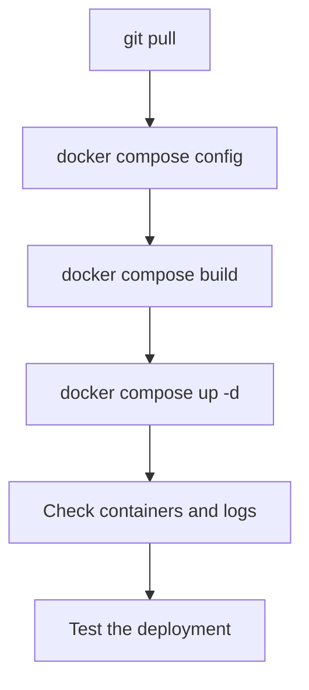
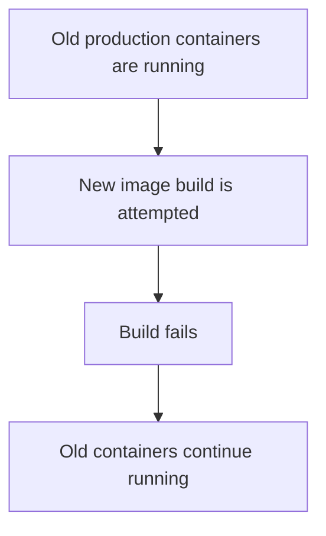
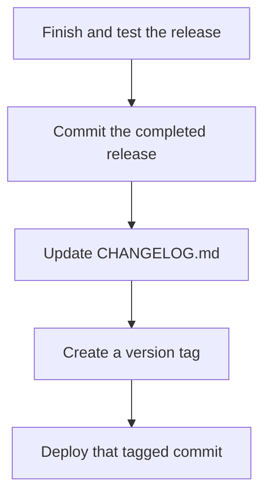
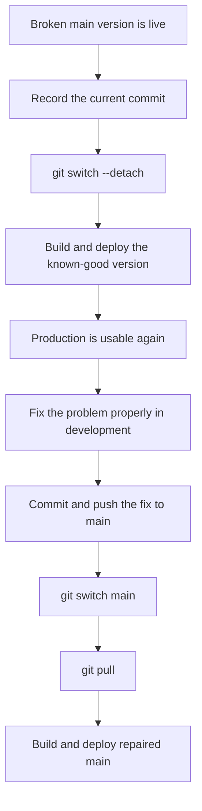
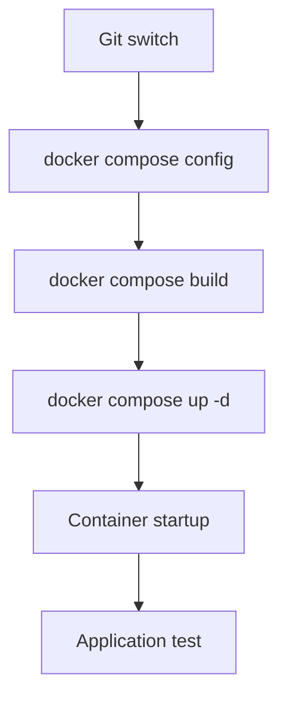

# Recovery and Rollback

Most Madiao deployments should follow the process described in
[Normal Production Updates](production-updates.md):



However, there will eventually be a situation where the newest version either
does not build, does not start correctly or starts successfully but introduces a
problem which was not noticed during development.

That is where rollback becomes useful.

The purpose of a rollback is not to repair the new version directly on the
production server.

It is to return production to a previously known version of the code so the game
can be made usable again while the actual problem is investigated separately.

The important thing is to keep the process controlled.

A rollback should answer three questions:

1. Which version is currently deployed?
2. Which older version are we returning to?
3. How do we get back onto the normal `main` branch afterwards?

It is also worth remembering one operational limitation from the beginning:

!!! warning "A server rollback resets active games"
    Replacing or restarting `madiao-server` clears all active lobbies and games
    because the current server state only exists in memory.

    A rollback which replaces the server should therefore be treated as a full
    reset of any match currently being played.

The reason for this is covered in
[In-Memory Game State](../technical/limitations.md#in-memory-game-state) and
[What Happens When the Server Restarts](../technical/server-runtime-state.md#what-happens-when-the-server-restarts).

The same warning does not apply to `madiao-client` or `madiao-docs`. Replacing
either of those containers does not restart the Node.js process which owns the
live game state.


## Failed Deployment

Not every failed deployment leaves production in the same condition.

The first thing to work out is how far the deployment got.

| Deployment stage reached | Is rollback normally required? |
| --- | --- |
| Build failed before `docker compose up -d` | Usually no; old containers are still live |
| Build succeeded but was not applied | No; simply do not deploy the bad image |
| `docker compose up -d` replaced the service | Possibly; the new version may already be live |
| Containers run but gameplay is seriously broken | Often yes; return to a known-good revision |


### Build failed before `docker compose up -d`

If:

```bash
docker compose build
```

fails, but:

```bash
docker compose up -d
```

has not been run yet, the existing production containers are normally still
using the previous images.

This is the least disruptive failure.

Conceptually:



In that situation, there may be no need to roll production back at all.

The failed source code can simply be fixed in development, committed and rebuilt
later.


### Build succeeds but the new version is not started

A successful:

```bash
docker compose build
```

also does not automatically replace the running containers.

If testing or review at that point reveals a problem, the old production
containers can continue running until a corrected image is ready.


### `docker compose up -d` was already run

Once:

```bash
docker compose up -d
```

has recreated one or more services, the new image may already be live.

Check:

```bash
docker ps --filter "name=madiao"
```

and then:

```bash
docker logs madiao-server --tail 100
docker logs madiao-client --tail 100
docker logs madiao-docs --tail 100
```

More log commands, including following the output live, are collected in
[Viewing Logs](docker-operations.md#viewing-logs).

If one container immediately exited:

```bash
docker ps -a --filter "name=madiao"
```

will normally show it.


### Application starts but gameplay is broken

This is the case where rollback is often most useful.

For example:

- containers are healthy;
- the website loads;
- Socket.IO connects;
- declarations or challenges are broken.

The deployment itself succeeded, however, the new code introduced a regression.

If the problem is serious enough to prevent normal play, returning to a previous
known working commit can be quicker and safer than trying to repair production
under pressure.


## Record the Current Version First

Before moving backwards in Git, record the version currently checked out.

From:

```bash
cd ~/madiao
```

run:

```bash
git status
git branch --show-current
git log -1 --oneline
git rev-parse HEAD
```

The short log is convenient for reading.

The full hash from:

```bash
git rev-parse HEAD
```

gives an exact identifier which can be copied somewhere temporarily if needed.

For example:

```text
Current broken deployment:
9f26b17c5f...
```

This makes it considerably easier to return to or investigate that exact version
later.


### Make sure the working tree is understood

A rollback should preferably begin from a **clean working tree**.

If:

```bash
git status
```

shows unexpected local changes, inspect them before switching commits.

If the working tree is not clean, use
[Dirty Production Repository](git-problems.md#dirty-production-repository) and
[`git pull` Cannot Continue](git-problems.md#git-pull-cannot-continue) before
moving between revisions.

!!! danger "Do not combine a rollback with unexplained production edits"
    Unknown local changes and a historical checkout are two separate problems.
    Understand, preserve or remove the local edits before switching revisions.


## Finding a Previous Commit

To view recent commits:

```bash
git log --oneline --decorate -10
```

This produces a short history such as:

```text
9f26b17 Add latest gameplay change
4b92e11 Fix challenge timing
8a131c0 Previous stable version
...
```

The exact commit messages naturally depend on the repository.

Choose a commit which is known to have worked rather than simply picking
**one commit earlier**, because several commits may belong to the same
incomplete feature.


### Inspect a commit before using it

For more information:

```bash
git show --stat <commit>
```

For example:

```bash
git show --stat 4b92e11
```

This gives a useful reminder of what changed in that revision.


### Fetch remote history first if needed

If the server has not recently fetched:

```bash
git fetch
```

updates its knowledge of the remote repository without changing the current
working tree.

This is useful when a previous working commit or tag exists remotely but is not
yet known to the local clone.


## Returning to a Previous Commit

For a temporary production rollback, it is usually clearer to check out the old
version in detached mode rather than moving the `main` branch backwards.

For example:

```bash
git switch --detach <commit>
```

such as:

```bash
git switch --detach 4b92e11
```

Git will report that the repository is now in a detached `HEAD` state.

!!! note "Detached HEAD is intentional here"
    The working tree is showing one exact historical commit instead of following
    the tip of a normal branch. For a temporary production rollback, that is
    exactly what we want.

That sounds more dramatic than it is; the important part is simply remembering
to return to `main` once the real fix is ready.

Check it with:

```bash
git log -1 --oneline
```

and:

```bash
git status
```


### Why not reset `main` backwards?

A command such as `git reset --hard <old-commit>` can move the local branch
itself and discard working-tree changes.

That may be useful in some Git workflows, but it is unnecessary for a temporary
Madiao production rollback.

Detached mode lets production build an old revision without pretending that the
repository's real `main` branch has moved backwards.


## Rebuilding the Previous Version

Switching Git commits changes the files in the production repository.

It does not change the Docker containers which are already running.

The old version therefore needs to be rebuilt.

First validate the old commit's Compose configuration:

```bash
docker compose config
```

Then build:

```bash
docker compose build
```

If the build succeeds, apply it:

```bash
docker compose up -d
```

Then check:

```bash
docker ps --filter "name=madiao"
```

and:

```bash
docker logs madiao-server --tail 50
docker logs madiao-client --tail 50
docker logs madiao-docs --tail 50
```


### Test the rollback

Do not assume the rollback worked simply because Docker started.

For a full application rollback, at minimum:

1. open the client;
2. check the server health page;
3. open the documentation site;
4. create a lobby;
5. join from a second client;
6. start the game;
7. perform one normal play.

If the rollback was specifically intended to restore a broken feature, test that
feature as well.

If only the documentation service was rolled back, there is no reason to run a
multiplayer test purely because of that change. In that case, open the
documentation site and check the pages, navigation or styling which were being
restored.


## Using a Release Tag

A Git tag gives a readable name to one exact commit.

For example, `v0.2.0` could point to the commit used for that release.

A tag is useful because remembering `v0.2.0` is considerably easier than
remembering a short commit hash such as `4b92e11`.


### Check which tags actually exist

Do not assume that a version mentioned in `CHANGELOG.md` automatically has a
Git tag.

Check:

```bash
git tag --list
```

To inspect a particular tag:

```bash
git show --stat v0.2.0
```

If that tag does not exist, Git will say so.


### Roll back to an existing tag

If a known working release tag exists:

```bash
git switch --detach v0.2.0
```

Then follow the normal rollback build:

```bash
docker compose config
docker compose build
docker compose up -d
```

and test the deployment.


### Tags should identify known releases

A useful future release workflow would be:



That would make rollback decisions easier because production versions could be
referred to by release number rather than only commit hash.

The current runbook should still work perfectly well with commit hashes if no
release tag exists yet.


## Returning to `main`

A detached historical commit should normally be treated as temporary production
recovery.

Once the broken version has been fixed and committed properly, return the
production repository to its normal branch.

First check that there are no unexpected local modifications:

```bash
git status
```

Then:

```bash
git switch main
```

Update it:

```bash
git pull
```

Confirm:

```bash
git log -1 --oneline
```

and:

```bash
git status
```


### Rebuild again

Returning Git to `main` does not change the running rollback containers.

Build the repaired current version:

```bash
docker compose config
docker compose build
docker compose up -d
```

Then repeat the normal health checks and targeted test.


### The complete temporary rollback cycle

The full idea is:



The rollback therefore does not become a new permanent branch of production.

It buys time while keeping the live version usable.


## Rolling Back Only One Service

Sometimes the regression is clearly isolated to only one side.

For example:

| Regression | Likely rollback scope |
| --- | --- |
| CSS/layout problem | Client only |
| Server declaration bug | Server |
| Broken documentation page or MkDocs build | Documentation only |

After switching the repository to the known-good commit, it is technically
possible to rebuild only the affected service.


### Client rollback

```bash
docker compose build client
docker compose up -d client
```

This avoids restarting the server and therefore avoids destroying active
server-side games.


### Server rollback

```bash
docker compose build server
docker compose up -d server
```

This replaces the Node server and therefore clears active games.


### Documentation rollback

```bash
docker compose build docs
docker compose up -d docs
```

The documentation service is independent from the game itself. Replacing
`madiao-docs` does not restart the client or server and does not clear active
lobbies or matches.

This can be useful when the problem is limited to something such as:

- a broken documentation page;
- an incorrect `mkdocs.yaml` change;
- broken navigation;
- documentation styling;
- a failed or incorrect MkDocs build.

Afterwards, check the documentation site rather than treating the rollback as a
gameplay deployment.


### Be careful with mixed versions

Running an **old client with a new server**, or a **new client with an old
server**, can be completely fine when the change was genuinely isolated.

However, it can also create an event or payload mismatch if both sides changed
together.

Before using a one-service rollback, ask:

- did this feature change the Socket.IO contract?
- did shared timing values change?
- did both client and server need the same update?

!!! warning "Avoid mixed client/server versions when the contract changed"
    A one-service rollback is only safe when the affected change was isolated.
    If Socket.IO payloads, shared timings or related client/server behaviour
    changed together, roll both services back to the same revision.

If there is any doubt, rolling both services back to the same known commit is
usually easier to reason about.

The documentation service does not share this client/server contract, so it can
usually be rolled back independently when the problem is limited to the
documentation site.


## What Is Lost During Recovery

Any recovery which restarts or recreates the Node server clears the active
runtime state.

That includes:

- lobbies;
- active games;
- hands;
- pile cards;
- pending declarations;
- current turns;
- drunkness;
- eliminations;
- active timers;
- rematch readiness;
- socket/lobby relationships.

The reason is the same as throughout the rest of the runbook:

```js title="server/index.js"
const lobbies = new Map();
const gameStates = new Map();
const gameTimers = new Map();
const socketLobbies = new Map();
```

all exist only inside the current Node process.


### What is not lost

Git history is not affected by restarting Docker.

Neither are:

- source files stored in Git;
- Dockerfiles;
- documentation;
- committed configuration;
- Docker images which have not been removed.

The loss applies to the live multiplayer session, not the source repository.

| Survives a server rollback/restart | Does not survive |
| --- | --- |
| Git history and source files | Active lobbies |
| Dockerfiles and Compose files | Current matches and hands |
| Documentation | Pending plays and pile state |
| Existing Docker images, unless removed | Turn/timer state and rematch readiness |


### Browser state is not a backup

Players may still have an old GameTable visible in their browser after the
server restarts.

That does not mean the game survived.

Their browser only holds a client-side copy of some of the old state.

The new Node process no longer has the authoritative lobby or match.


## Failed Rollback

A rollback can itself fail.

For example:

- the older commit no longer builds cleanly;
- old configuration expects something different;
- there is a Docker build-cache or disk-space problem;
- the wrong commit was chosen.

Treat the failed rollback the same way as any other deployment.

Find the exact stage:



Do not keep jumping to even older commits without understanding what actually
failed.

If the failure occurs during `docker compose build`, use
[Build and Dependency Problems](build-problems.md) before assuming the selected
rollback commit itself is unusable.


### Old commit has incompatible production configuration

If an older revision expects a different environment/configuration setup,
check that commit's:

- `compose.yaml`;
- Dockerfiles;
- root and client environment setup;
- documentation build setup;

before applying it.

A rollback means returning to the code and deployment assumptions of that
historical version, not only one JavaScript file.


## Emergency Rollback Reference

A controlled commit-based rollback can be reduced to:

```bash
cd ~/madiao

git status
git log -1 --oneline
git rev-parse HEAD

git log --oneline --decorate -10

git switch --detach <known-good-commit>

docker compose config
docker compose build
docker compose up -d

docker ps --filter "name=madiao"

docker logs madiao-server --tail 50
docker logs madiao-client --tail 50
docker logs madiao-docs --tail 50
```

Then test the affected parts of the deployment. For a full rollback, check the
client, server, documentation site and a small multiplayer flow.

To return later:

```bash
cd ~/madiao

git status
git switch main
git pull

docker compose config
docker compose build
docker compose up -d
```

Then test again.


## Recovery Decision Guide

| Situation | Best first response |
| --- | --- |
| New Docker build fails before deployment | Leave old containers running and fix build |
| New image built but has not been applied | Do not apply it; fix first |
| New containers crash immediately | Check logs; roll back if service cannot be restored quickly |
| Game works but new feature is badly broken | Consider known-good commit rollback |
| Only client UI is broken | Client-only rollback may be enough |
| Server gameplay logic is broken | Server rollback; active games will be lost |
| Documentation is broken | Documentation-only rollback may be enough |
| Client/server contract changed together | Roll both services to the same revision |
| Unsure which older version worked | Inspect Git history/tags before switching |
| `CHANGELOG` says a version but tag is missing | Use the actual commit hash |
| Rollback is now stable | Fix `main`, then return production to `main` |


## Chapter Summary

Rollback is mainly about returning production to a known working source revision
without rewriting Git history or trying to repair the new version directly on
the server.

Before doing anything, record:

```bash
git status
git log -1 --oneline
git rev-parse HEAD
```

Then identify a known working commit or existing release tag.

A temporary rollback can use:

```bash
git switch --detach <commit-or-tag>
```

followed by:

```bash
docker compose config
docker compose build
docker compose up -d
```

The affected parts of the deployment should then be tested just like any normal
deployment. A full rollback should include the game and documentation checks,
while a documentation-only rollback only needs the documentation side to be
verified.

Once the problem has been fixed properly on `main`, return production with:

```bash
git switch main
git pull
```

and rebuild the current version again using the normal
[production update process](production-updates.md).

A release name written in `CHANGELOG.md` should not be assumed to be a Git tag;
use:

```bash
git tag --list
```

to check which tags actually exist.

When a regression is clearly isolated, the client, server or documentation
service can also be rebuilt and replaced individually. The main thing to be
careful about is mixing client and server versions when their Socket.IO contract
or shared behaviour changed together. The documentation service does not share
that contract and can normally be recovered independently.

Lastly, any rollback which replaces or restarts `madiao-server` clears active
games because the current multiplayer state lives only in JavaScript memory.

The rollback restores the application code.

It cannot restore a match which disappeared when the old Node process stopped.
