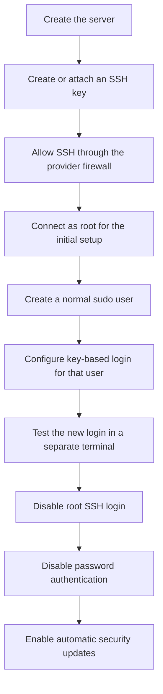
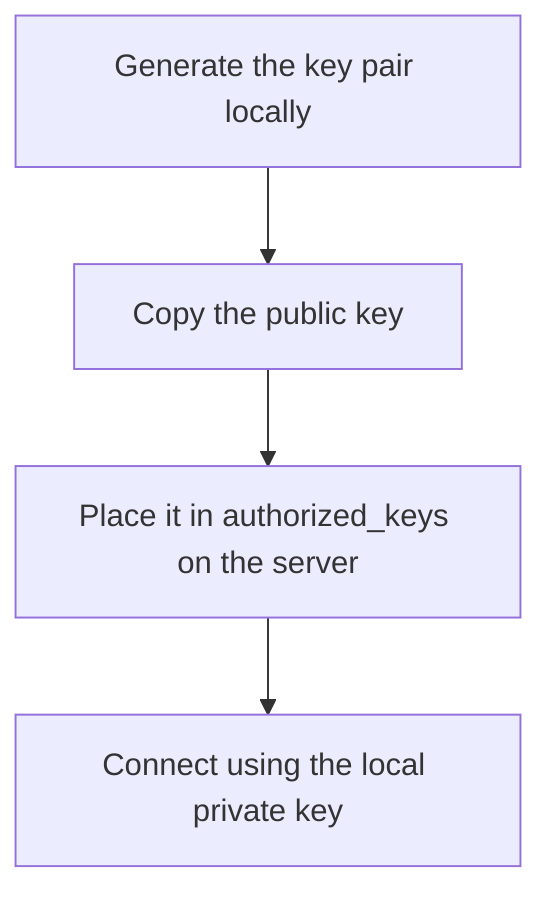
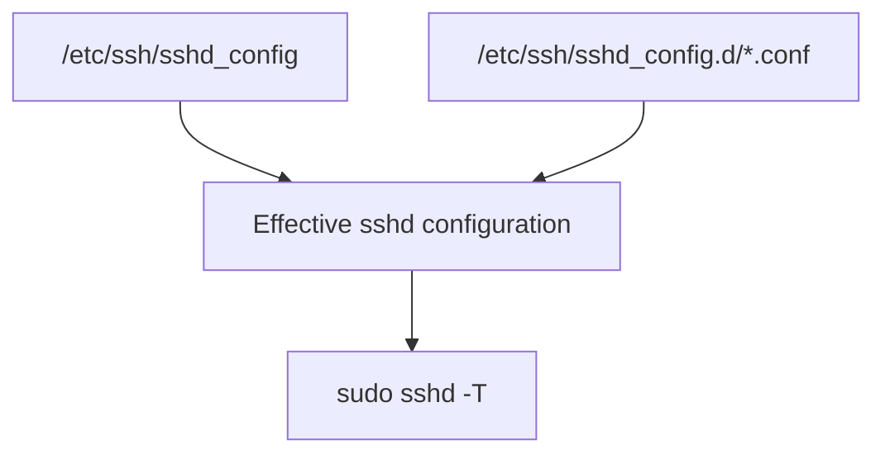

# Server Setup and Administration

This page records the main steps used to prepare and secure the Linux server
which hosts Madiao.

Some of the information is specific to the current production server, while
other parts are more general Linux administration notes which can be reused when
setting up another project later.

The aim is not to turn this into a complete Linux security guide. It is simply a
record of the setup which was actually useful while preparing the server, along
with the commands needed to repeat or troubleshoot it.

For the application deployment itself, see
[First-Time Production Setup](first-time-setup.md).

For the security considerations around credentials, SSH keys and repository
files, see
[Security and Repository Notes](../technical/security.md).


## Before Starting {#before-starting}

The exact first step depends on the hosting provider, but the general process is:



One important rule is worth keeping in mind throughout the setup:

!!! danger "Do not lock yourself out of the server"
    Do not disable root login or password authentication until key-based login
    for the new sudo user has been tested successfully in a separate terminal.

    Keep the existing working SSH session open while testing the new login. If
    the new configuration is wrong, that existing session may be the easiest
    way to correct it.


## Generate an SSH Key Pair {#generate-an-ssh-key-pair}

An SSH key pair contains two related files:

| Part | Where it belongs | Purpose |
| --- | --- | --- |
| Private key | Local machine only | Proves that this client owns the key pair |
| Public key | Server | Allows the server to recognise the matching private key |

The **private key stays on the local machine** and the **public key is copied to
the server**.

For a normal Ed25519 key:

```bash
ssh-keygen -t ed25519 -C "<comment>"
```

The comment can be something descriptive such as `madiao-server`, or the
machine/user the key belongs to.

The command creates two files similar to:

```text
id_ed25519
id_ed25519.pub
```

The file without `.pub` is the private key and should not be shared.

The `.pub` file is the public key.


### Display the public key on Windows PowerShell

```powershell
type $env:USERPROFILE\.ssh\id_ed25519.pub
```

The output can then be copied into the server's `authorized_keys` file.


### Display the public key on Linux or macOS

```bash
cat ~/.ssh/id_ed25519.pub
```


## Initial SSH Connection {#initial-ssh-connection}

The hosting provider must allow inbound TCP traffic on port `22` for SSH.

This may involve creating or editing a cloud firewall rule.

Once the server has a public IP address and SSH access is allowed, the initial
connection is usually:

```bash
ssh root@<server-ip>
```

For example, the command could look like `ssh root@xxx.xxx.xxx.xxx`.

The exact address naturally depends on the server.


### Check who is logged in

```bash
whoami
```

For the initial setup this should normally return `root`.


## Create a Normal Sudo User {#create-a-normal-sudo-user}

Using the root account for every normal administration task is unnecessary and
makes it easier to perform privileged actions without an extra check.

A better setup is to create a normal user and give that user permission to run
administrative commands through `sudo`.

While logged in as root:

```bash
adduser <username>
```

For example:

```bash
adduser gears
```

Follow the prompts to set the account password and basic account information.


### Add the user to the sudo group

```bash
usermod -aG sudo <username>
```

For example:

```bash
usermod -aG sudo gears
```

The `-aG` combination is important:

| Option | Meaning |
| --- | --- |
| `-a` | Append rather than replace existing supplementary groups |
| `-G` | Specify supplementary groups |

Using `-aG` therefore adds the user to `sudo` without removing their existing
group memberships.


### Leave the root session

```bash
exit
```

Then log in using the new account:

```bash
ssh <username>@<server-ip>
```

For example:

```bash
ssh gears@<server-ip>
```


### Switching users without disconnecting

If already logged in as root:

```bash
su - <username>
```

For example:

```bash
su - gears
```

`su` stands for **switch user**.


### Shell prompt reminder

A normal user commonly sees `$` at the end of the shell prompt, while root
commonly sees `#`.

| Prompt ending | Usually indicates |
| --- | --- |
| `$` | Normal user |
| `#` | Root |

This is only a visual convention, but it is a useful quick reminder of the
current privilege level.


## Configure SSH Key Authentication for the Sudo User {#configure-ssh-key-authentication}

In theory, the basic process is straightforward:



In practice, the first setup on this server needed a little more work because the
`.ssh` directory and `authorized_keys` file had to be created manually and their
permissions corrected.


### Create the SSH directory

Log in to the server and create:

```bash
mkdir -p /home/<username>/.ssh
```

For example:

```bash
mkdir -p /home/gears/.ssh
```


### Create the authorised keys file

```bash
touch /home/<username>/.ssh/authorized_keys
```

Then edit it:

```bash
nano /home/<username>/.ssh/authorized_keys
```

Paste the **full public key** into the file, save and exit.


### Correct ownership

```bash
sudo chown <username>:<username> /home/<username>/.ssh
sudo chown <username>:<username> /home/<username>/.ssh/authorized_keys
```

For example:

```bash
sudo chown gears:gears /home/gears/.ssh
sudo chown gears:gears /home/gears/.ssh/authorized_keys
```


### Correct permissions

The SSH directory and key file should normally use:

| Path | Permission |
| --- | ---: |
| `~/.ssh/` | `700` |
| `~/.ssh/authorized_keys` | `600` |

Apply them with:

```bash
sudo chmod 700 /home/<username>/.ssh
sudo chmod 600 /home/<username>/.ssh/authorized_keys
```


### Check ownership and permissions

```bash
ls -ld /home/<username>/.ssh
ls -l /home/<username>/.ssh/authorized_keys
```

For the current server:

```bash
ls -ld /home/gears/.ssh
ls -l /home/gears/.ssh/authorized_keys
```


### Display the key stored on the server

```bash
cat /home/<username>/.ssh/authorized_keys
```

This is useful for checking that the complete public key was copied and that it
was not accidentally split or truncated.


## Test Key-Based Login Before Hardening SSH {#test-key-based-login}

Before disabling any fallback login method, open a **new terminal window** and
test:

```bash
ssh <username>@<server-ip>
```

Do not close the existing administrative session until the new login works.

If the new SSH connection fails, check:

- the public key was copied correctly;
- the `authorized_keys` path;
- directory ownership;
- file ownership;
- `700` directory permissions;
- `600` file permissions;
- the cloud firewall;
- the SSH server configuration.

Only continue to the hardening steps once this login succeeds.


## Windows SSH Agent {#windows-ssh-agent}

If the private key has a passphrase, SSH can ask for that passphrase every time a
new connection is created.

Windows includes `ssh-agent`, which can keep the decrypted key available for the
current session after the passphrase has been entered once.


### Check the service

```powershell
Get-Service ssh-agent
```


### Set the service to manual startup

```powershell
Get-Service ssh-agent | Set-Service -StartupType Manual
```


### Start the service

```powershell
Start-Service ssh-agent
```


### Confirm the service state

```powershell
Get-Service ssh-agent
```


### Add the private key

```powershell
ssh-add $env:USERPROFILE\.ssh\id_ed25519
```

The passphrase should normally be requested when the key is first added.

After that, SSH can reuse the key through the agent rather than asking for the
passphrase on every connection.


## SSH Hardening {#ssh-hardening}

Once key-based login for the sudo user is working, SSH can be hardened by:

| Setting | Intended result |
| --- | --- |
| Remote root login | Disabled |
| Password authentication | Disabled |
| Public-key authentication | Enabled |

Older guides often edit `/etc/ssh/sshd_config` directly.

That can work, but on modern systems it is often cleaner to place local
overrides inside `/etc/ssh/sshd_config.d/`.

This keeps custom settings separate from the package-managed main configuration
file.


### Create a custom hardening file

```bash
sudo nano /etc/ssh/sshd_config.d/99-hardening.conf
```

Add:

```text title="/etc/ssh/sshd_config.d/99-hardening.conf"
PermitRootLogin no
PasswordAuthentication no
PubkeyAuthentication yes
```

Save the file.


### Why disable root SSH login?

Disabling direct root SSH login means remote administration has to begin through
a normal account rather than directly through the most privileged account.

This provides a clearer administrative boundary and is particularly useful when
different administrators have their own user accounts.


### Why disable password authentication?

Once public-key authentication is confirmed to work, disabling password login
removes SSH passwords as a remote authentication method.

That considerably reduces exposure to password-guessing attacks.


## Validate SSH Configuration Before Restarting {#validate-ssh-configuration}

Before restarting SSH, validate the effective configuration.

To check the relevant settings:

```bash
sudo sshd -T | grep -E "passwordauthentication|permitrootlogin|pubkeyauthentication"
```

The expected effective values should be similar to:

```text
passwordauthentication no
permitrootlogin no
pubkeyauthentication yes
```


### Optional syntax validation

It is also useful to ask `sshd` to validate the configuration before restarting:

```bash
sudo sshd -t
```

If the command produces no output, the configuration syntax is normally valid.

If it reports an error, fix that error before restarting the SSH service.


## Restart SSH {#restart-ssh}

After the configuration has been checked:

```bash
sudo systemctl restart ssh
```

On systems where the service is named `sshd` instead:

```bash
sudo systemctl restart sshd
```


### Test again in a separate terminal

Open a new terminal and confirm:

```bash
ssh <username>@<server-ip>
```

still works.

Then confirm root login is rejected:

```bash
ssh root@<server-ip>
```

and that password authentication is no longer available.

Keep the original working session open until these tests are complete.


## A Note About `sshd_config` Overrides {#sshd-config-overrides}

An earlier attempt to change `PermitRootLogin` directly inside
`/etc/ssh/sshd_config` did not produce the expected result on this server.

The working solution was to create a dedicated override under
`/etc/ssh/sshd_config.d/`, for example:

```text
/etc/ssh/sshd_config.d/99-hardening.conf
```

and then verify the **effective** configuration using:

```bash
sudo sshd -T
```

This is more reliable than assuming that the value visible in one configuration
file is necessarily the value the SSH daemon is actually using.




## Automatic Security Updates {#automatic-security-updates}

Ubuntu can install security updates automatically using
`unattended-upgrades`.

Start by refreshing the package list:

```bash
sudo apt update
```

Install the package if it is not already present:

```bash
sudo apt install unattended-upgrades
```


### Check the service

```bash
sudo systemctl status unattended-upgrades
```

If needed:

```bash
sudo systemctl start unattended-upgrades
```


### Check automatic-update configuration

The two main files inspected during the server setup were:

| File | Main purpose |
| --- | --- |
| `/etc/apt/apt.conf.d/20auto-upgrades` | Controls whether periodic package-list updates and unattended upgrades run |
| `/etc/apt/apt.conf.d/50unattended-upgrades` | Controls which updates are allowed and related unattended-upgrade behaviour |


### `20auto-upgrades`

Open:

```bash
sudo nano /etc/apt/apt.conf.d/20auto-upgrades
```

The periodic update settings should be enabled.

A normal configuration commonly includes values equivalent to:

```text
APT::Periodic::Update-Package-Lists "1";
APT::Periodic::Unattended-Upgrade "1";
```


### `50unattended-upgrades`

Open:

```bash
sudo nano /etc/apt/apt.conf.d/50unattended-upgrades
```

Check that the intended security-update origins are enabled.

This file also contains options controlling things such as unused dependencies
and automatic reboot behaviour.


### Automatic reboot

!!! warning "Automatic reboot also resets active games"
    An unattended automatic reboot restarts the machine and therefore restarts
    the Madiao server as well. Any active game is lost when that happens.

    If automatic reboot is enabled, that behaviour should be deliberate rather
    than simply copied from an example configuration.

The runtime consequence is explained in
[In-Memory Game State](../technical/limitations.md#in-memory-game-state).


## systemd Basics {#systemd-basics}

`systemd` manages many of the long-running services on the Linux server.

The main administration command is `systemctl`.


### Check service status

```bash
sudo systemctl status <service>
```


### Start a service

```bash
sudo systemctl start <service>
```


### Stop a service

```bash
sudo systemctl stop <service>
```


### Restart a service

```bash
sudo systemctl restart <service>
```


### Enable a service at startup

```bash
sudo systemctl enable <service>
```

This configures the service to start automatically when the machine boots.


### Disable automatic startup

```bash
sudo systemctl disable <service>
```


### Edit a service override

```bash
sudo systemctl edit <service>
```

This is generally preferable to directly modifying package-managed unit files.


## Main systemd Unit Locations {#systemd-unit-locations}

The main unit locations worth remembering are:

| Location | Purpose |
| --- | --- |
| `/etc/systemd/system/` | Local/custom administrator units and overrides; highest normal priority |
| `/run/systemd/system/` | Runtime-generated units which disappear after reboot |
| `/lib/systemd/system/` | Package-provided units on many Ubuntu/Debian systems |

The exact package-unit path can also appear as
`/usr/lib/systemd/system/` on some distributions.

For normal local administration, `/etc/systemd/system/` is the most important
location.


## Basic Python Setup on Windows {#basic-python-setup}

!!! note "Local tooling, not a production-server requirement"
    Python is not required to run the Madiao production containers. This section
    is kept because Python was useful for the local MkDocs/documentation tooling.

This is not required by the Madiao production server itself, but it was useful
when setting up local tooling and is kept here as a reusable environment note.

Check Python:

```powershell
python --version
```

Check pip:

```powershell
python -m pip --version
```

Install a package globally:

```powershell
python -m pip install requests
```

For project-specific Python tooling, a virtual environment is normally cleaner
than installing everything globally.

The documentation site itself already uses `.venv-docs/` for exactly that
reason.


## Server Setup Checklist {#server-setup-checklist}

For a new small Ubuntu server, the overall checklist is:

- [ ] Create the server.
- [ ] Create or attach an SSH key.
- [ ] Allow TCP `22` in the cloud firewall.
- [ ] Connect as root.
- [ ] Create a normal user.
- [ ] Add the user to the `sudo` group.
- [ ] Create `~/.ssh` and `authorized_keys`.
- [ ] Add the public key.
- [ ] Set the correct ownership.
- [ ] Set the `.ssh` directory to `700`.
- [ ] Set `authorized_keys` to `600`.
- [ ] Test sudo-user key login in a second terminal.
- [ ] Create the SSH hardening override.
- [ ] Disable root SSH login.
- [ ] Disable password authentication.
- [ ] Keep public-key authentication enabled.
- [ ] Validate the `sshd` configuration.
- [ ] Restart SSH.
- [ ] Test SSH again.
- [ ] Configure automatic security updates.
- [ ] Check the relevant systemd services.
- [ ] Continue with application deployment.

Once the machine itself is ready, continue with
[First-Time Production Setup](first-time-setup.md).


## Useful Commands

Display the local public key on Windows:

```powershell
type $env:USERPROFILE\.ssh\id_ed25519.pub
```

Connect:

```bash
ssh <username>@<server-ip>
```

Check user:

```bash
whoami
```

Check SSH permissions:

```bash
ls -ld /home/<username>/.ssh
ls -l /home/<username>/.ssh/authorized_keys
```

Check effective SSH settings:

```bash
sudo sshd -T | grep -E "passwordauthentication|permitrootlogin|pubkeyauthentication"
```

Validate SSH syntax:

```bash
sudo sshd -t
```

Restart SSH:

```bash
sudo systemctl restart ssh
```

Check unattended upgrades:

```bash
sudo systemctl status unattended-upgrades
```

Check any service:

```bash
sudo systemctl status <service>
```

The most commonly reused commands from this page are also collected in
[Quick Reference](quick-reference.md).
