# Troubleshooting by Problem

[Basic Health Checks](health-checks.md#quick-health-check-order) covers the checks which should normally
be done before digging into one particular feature.

This chapter takes the opposite approach.

Instead of starting with the architecture and working forwards, it starts with
the symptom which is visible and then works backwards towards the most likely
cause.

This is probably the chapter which will be used most often when coming back to
the project after some time away from it.

The general rule throughout this chapter is:

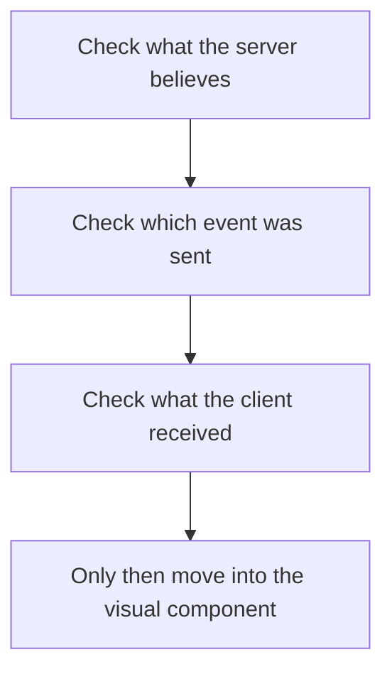

That is especially important in Madiao because a visual problem and a game-state
problem can look almost identical from the player's point of view.

For example:

```text
wrong pile count on screen
```

could mean:

```text
server pile is wrong
```

or it could simply mean:

```text
server pile is correct
but the client did not update/render it correctly
```

Those are two completely different bugs even though they look the same in the
browser.

!!! tip "Find the first layer which becomes wrong"
    Follow the value or event through the system until the first incorrect step
    appears. Avoid changing several client and server files at the same time,
    otherwise it becomes much harder to tell which change actually solved the
    problem.


## Website Does Not Load

If absolutely nothing appears when opening the production client, start outside
the React code.

The first check is:

```bash
docker ps --filter "name=madiao"
```

`madiao-client` should be running and should expose:

```text
host 3000 -> container 80
```

If it is missing, check stopped containers:

```bash
docker ps -a --filter "name=madiao"
```

and then:

```bash
docker logs madiao-client --tail 50
```


### Check the correct address

The production client is currently reached through:

```text
http://<server-address>:3000
```

If the wrong host or port is being used, the browser will never reach nginx.


### Check the network

If the container is running but the page cannot be opened externally, check
whether port `3000` is allowed through:

- server firewall;
- hosting-provider firewall;
- network/security rules.

If possible, test from the production machine itself.

A local response but no external response points much more strongly towards
network access than a React problem.


### If the page loads but looks broken

Once HTML and React appear, the problem is no longer:

```text
website does not load
```

Move towards:

- asset problem;
- React rendering problem;
- browser console error;
- old client build.

Check the browser developer console and the nginx/client logs before rebuilding
randomly.


## Client Loads but Cannot Connect to Server

This is one of the more useful distinctions in the whole deployment.

The client and server use different ports:

```text
client  -> 3000
server  -> 3001
```

The website can therefore load perfectly from nginx even while the multiplayer
server is completely unreachable.


### First check the server directly

Open:

```text
http://<server-address>:3001
```

The current server should return the simple health page.

If that fails, check:

```bash
docker ps --filter "name=madiao"
docker logs madiao-server --tail 50
```

and confirm port `3001` is open.


### If the server page works

If:

```text
client :3000 works
server :3001 works
Socket.IO does not
```

the next checks are:

```text
REACT_APP_SERVER_URL
CLIENT_ORIGIN
```

Both values are explained in
[Environment and Configuration](../technical/environment-configuration.md#build-time-vs-runtime-configuration), and
the event-level connection path is covered in
[Event Troubleshooting](../technical/socketio-events.md#event-troubleshooting).

The client uses:

```text
REACT_APP_SERVER_URL
```

to decide where it connects.

The server uses:

```text
CLIENT_ORIGIN
```

to decide which browser origin it accepts.


### Remember the build-time client variable

If `client/.env.production` was corrected after the image was already built,
restarting the client is not enough.

Use:

```bash
docker compose build client
docker compose up -d client
```

Then reload the browser.


### Browser console

CORS and Socket.IO connection errors often appear clearly in the browser
developer console.

If both HTTP endpoints work but lobby actions never reach the server, the
browser console and Network tab are usually worth checking before changing the
game logic.


## Lobby Cannot Be Created

Lobby creation begins in:

```text
JoinScreen.jsx
```

with:

```text
createLobby
```

and is handled in:

```text
server/index.js
```

by the matching Socket.IO handler.


### Check whether Socket.IO works at all

If pressing Create does absolutely nothing, first try the connection checks from the previous section.

A lobby cannot be created if the browser never connected to the server.


### Check the entered name

The server validates the player's name rather than relying only on the client.

The current server also limits player names to:

```text
20 characters
```

so a rejected name may be a validation problem rather than a lobby problem.


### Check for an existing lobby association

The server uses:

```js
socketLobbies
```

to prevent one socket from being inside several lobbies at once.

If the same socket is already associated with a lobby, the server should reject
another create/join attempt.

Refreshing is not currently a proper reconnect mechanism, so testing unusual
navigation paths can sometimes make this kind of state easier to reproduce.


### Expected successful path

A normal creation should be:

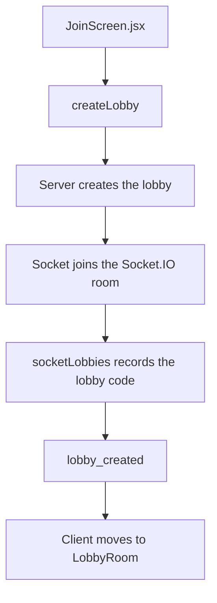

If the server logs prove the lobby was created but the browser stays on the Join
screen, follow the:

```text
lobby_created
```

listener on the client.


## Player Cannot Join a Lobby

Joining has more possible rejection reasons than creating.

The current server checks for conditions including:

- missing name/code;
- player name too long;
- lobby does not exist;
- game already started;
- lobby already full;
- socket already belongs to a lobby;
- socket already exists in that lobby.


### Check the code first

The server normalises the lobby code by:

```text
trimming spaces
converting to uppercase
```

so normal capitalisation mistakes should not matter.

If the result is:

```text
Lobby not found
```

confirm that the host is still connected and that the lobby was not destroyed.

Because lobbies are stored in memory, a server restart removes them immediately.


### Check whether the game already started

The server deliberately blocks mid-game joining.

If:

```js
lobby.gameStarted === true
```

a new player cannot enter that lobby.

This is expected behaviour rather than a connection problem.


### Check the player limit

Madiao currently allows:

```text
maximum 6 players
```

If six players are already in the lobby, the server returns:

```text
This lobby is full
```


### Host sees joiner but joiner does not enter

That points towards the client-side:

```text
lobby_joined
```

handling.

If the joining browser enters but the existing lobby does not update, check:

```text
broadcastLobby()
lobby_updated
LobbyRoom.jsx listener
```


## Game Cannot Be Started

The Start Game button belongs to the lobby screen, but the final decision is made
by the server.


### Confirm the sender is the host

Only:

```js
lobby.hostId
```

is allowed to start the match.

If a non-host somehow triggers the event, the server does not begin a game.


### Confirm enough players exist

The current minimum is:

```text
2 players
```

With only one player the server sends:

```text
You need at least 2 players to start the game
```


### Confirm the game was not already started

The server protects against duplicate Start Game requests with:

```js
lobby.gameStarted
```

If it is already true, another request is rejected.


### If the server starts the game but one client stays in the lobby

Follow:

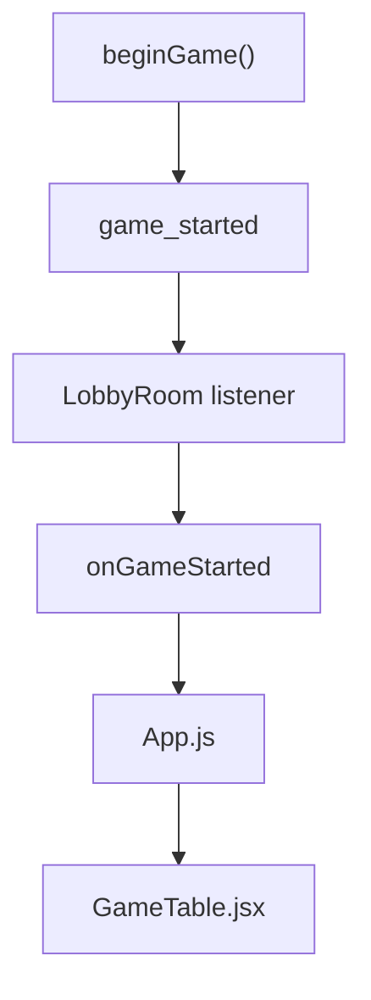

Also remember that `game_started` is sent individually because every player has
a different private hand.

If only one specific player fails, check whether that socket was still connected
when `beginGame()` emitted the event.


## Declaration Is Rejected

Declaration rejection is usually easier to troubleshoot because the server
performs explicit validation.

The full declaration path is documented in
[Declaring Cards](../technical/gameplay-code-paths.md#declaring-cards), while the
phase restrictions are explained in
[The `waiting` Phase](../technical/game-phase-and-turn-flow.md#the-waiting-phase)
and
[The `challenge_open` Phase](../technical/game-phase-and-turn-flow.md#the-challenge_open-phase).

The first thing to find is the rejection message rather than guessing.


### Check the current phase

Declarations are only accepted during:

```text
waiting
challenge_open
```

If the server is currently in:

```text
resolving_challenge
resolving_timeout
game_over
```

the declaration should be rejected.


### Check whose turn it is

The sender's socket must match:

```text
gameState.players[
    gameState.currentPlayerIndex
].id
```

If `currentPlayerIndex` is wrong, the rejection is only a symptom.

The actual turn-flow bug happened earlier.


### Check card selection

The server verifies:

- selection is not empty;
- IDs are valid strings;
- IDs are not duplicated;
- selection is not above the play limit;
- every selected card genuinely exists in the player's server hand.

A visual hand can therefore look correct while the submitted IDs are wrong.


### Check declared number

The opening declaration must be a valid number between:

```text
1 and 10
```

Later plays must match:

```js
roundDeclaredNumber
```

If the server says the wrong round number was declared, check whether the client
is using the current `roundDeclaredNumber` from the most recent
`game_state_updated`.


### Check acknowledgement handling

`GameTable` sends declarations with an acknowledgement.

If the server rejects the play, the client should restore/clear the temporary
submission state correctly.

If the server says:

```text
ok: false
```

but cards remain visually stuck in the pending area, the gameplay rejection is
working and the remaining bug is local UI cleanup.


## Challenge Does Not Work

A valid challenge only exists while:

```js
gameState.phase === 'challenge_open'
```

and while there is an actual:

```js
pendingPlay
```

The complete server path is documented in
[Resolving Challenges](../technical/gameplay-code-paths.md#resolving-challenges),
with the wider phase sequence in
[Resolving a Challenge](../technical/game-phase-and-turn-flow.md#resolving-a-challenge).


### Challenge button not available

Check the client conditions first:

- `phase`;
- `pendingPlay`;
- whether the player is eliminated;
- whether this player made the pending play.

A player cannot challenge their own declaration.


### Button works but server does nothing

Follow the event:

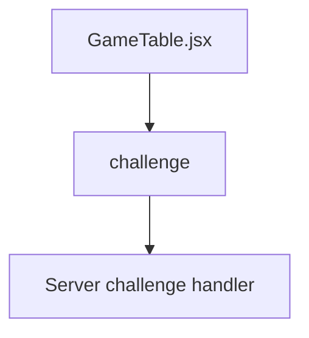

If the event reaches the server, check the phase and pending play there.


### Wrong challenge winner

This is a server/card-rule problem until proven otherwise.

Follow:

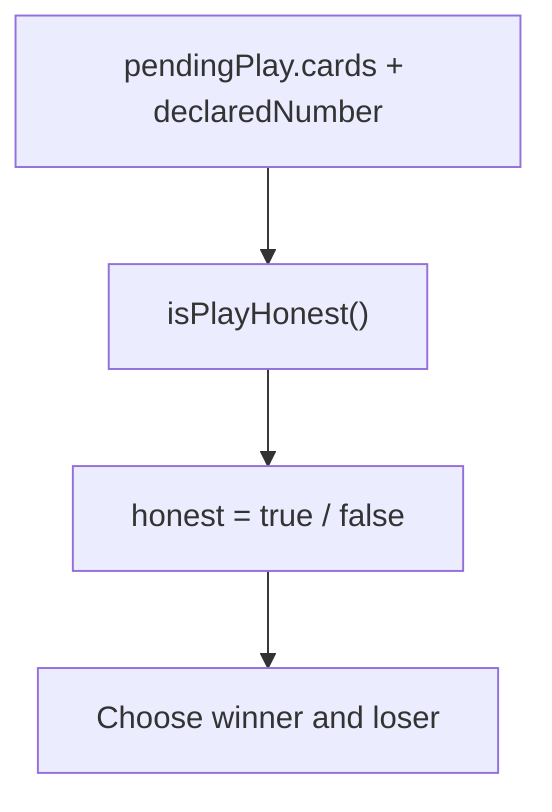

Wild-card matching belongs to:

```text
server/game/deck.js
```

not the visual challenge component.


### Correct result but wrong screen

If the server chooses the correct winner and the `challenge_result` payload is
correct, then check:

- `GameTable` challenge-result handling;
- `ChallengeNotification.jsx`;
- shared challenge timing constants.

At that point the game rule itself is probably fine.


## Turn Timer Is Wrong

There are two different timer problems:

```text
visible countdown wrong
```

and:

```text
server timeout wrong
```

Do not assume they have the same cause.

The technical timing model is covered in
[Timer System](../technical/timer-system.md#common-timer-problems), particularly
[The 40-Second Turn Timer](../technical/timer-system.md#the-40-second-turn-timer),
[`turnStartedAt`](../technical/timer-system.md#turnstartedat) and
[Client Countdown Display](../technical/timer-system.md#client-countdown-display).


### Visible countdown wrong

Check:

- `turnStartedAt`;
- `turnDurationMs`;
- `GameTable` countdown calculation.

The browser calculates the visible countdown locally from the server-provided
timestamp.


### Server timeout wrong

Check the server's:

```text
turnTimer
turnDurationMs
```

and whether an old timer was properly cleared.

A player being punished after already declaring usually suggests the previous
`turnTimer` survived when it should have been cancelled.


### Timer begins during challenge/drinking

During challenge and timeout resolution:

```js
turnStartedAt
```

should be:

```text
null
```

A fresh value should only be set when a genuine next turn begins.


### Auto-submit problems

For later-round plays, the client attempts to send selected cards roughly:

```text
650ms
```

before the server deadline.

Check:

- `selectedCards`;
- `isMyTurn`;
- `turnStartedAt`;
- `roundDeclaredNumber`;
- `submissionStartedRef`;
- `autoSubmitLeadMs`.

if it submits too early, twice, or not at all.


## Game Gets Stuck Between Turns

A game which freezes between turns is often a phase/timer problem.

Start by finding the server phase. The normal phase transitions are mapped in
[Game Phase and Turn Flow](../technical/game-phase-and-turn-flow.md#full-normal-flow), while the
timer callbacks and cleanup rules are covered in
[Timer System](../technical/timer-system.md#common-timer-problems).

The most interesting values are:

```text
cooldown
resolving_challenge
resolving_timeout
```


### Stuck in cooldown

Check:

- `cooldownTimer`;
- `cooldownMs`;
- the callback which changes to `challenge_open`.

The current cooldown is `0ms`, so remaining there for any noticeable time is
not expected.


### Stuck after challenge result

Check the sequence:

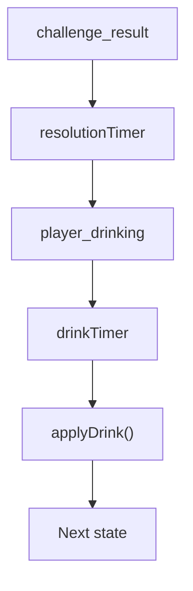

If `player_drinking` never arrives, the problem is probably before or inside the
resolution timer.

If drinking arrives but the next turn never begins, move further down towards
the drink timer and post-drink continuation.


### Stuck after timeout

Follow the equivalent route:

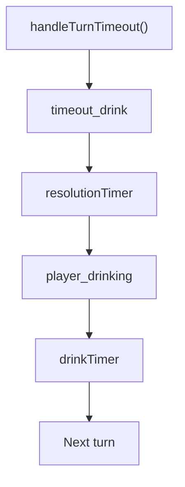


### Check server logs before changing React

If every browser is stuck in exactly the same place, it is much more likely that
the authoritative server flow stopped than that several clients independently
rendered the same wrong state.


## Drinking Sequence Is Out of Sync

The visible drinking sequence depends on both server timers and client
notifications.

The relevant technical timings are documented in
[Challenge Resolution Timer](../technical/timer-system.md#challenge-resolution-timer),
[Challenge Drink Timer](../technical/timer-system.md#challenge-drink-timer) and
[Timeout Resolution Timer](../technical/timer-system.md#timeout-resolution-timer).

The expected challenge order is:

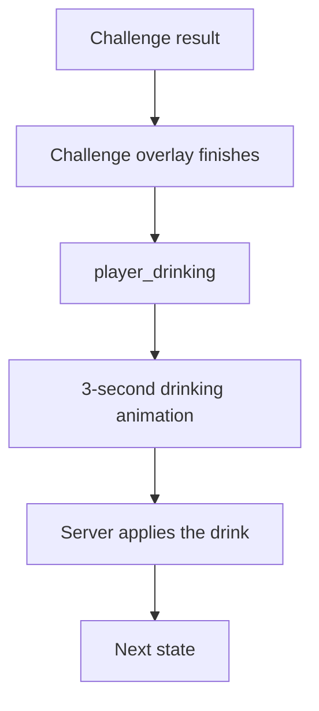

The timeout route is the same idea with a shorter first overlay.


### Drinking appears while challenge result is still open

Check:

- `challengeOverlayMs`;
- total `ChallengeNotification` duration;
- `resolutionTimer`.

Those totals should agree.


### Drinking disappears too early

`GameTable` clears the drinking notification when later server state reaches a
normal continuation phase such as:

```text
waiting
challenge_open
game_over
```

If the server broadcasts one of those too early, the UI may correctly remove the
indicator even though the intended animation has not finished.


### Drunkness value is wrong

The client does not calculate the actual drunkness rule.

Check:

- `applyDrink()`;
- server-side `player.drunkness`;
- `player_drinking` payload;
- next `game_state_updated`.

If the correct server value arrives but the cup display is wrong, then move into
`PlayerFrame.jsx` and its CSS/SVG.


## Player Is Not Eliminated Correctly

Elimination currently comes from the drinking rule.

The wider path is documented in
[Drinking and Drunkness](../technical/gameplay-code-paths.md#drinking-and-drunkness)
and
[Player Elimination](../technical/gameplay-code-paths.md#player-elimination).

The relevant code path is:

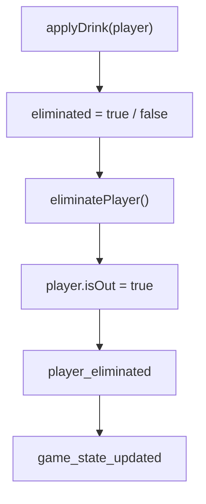


### Wrong probability/result

Check:

- `server/game/rules.js`;
- `applyDrink()`;
- `player.drunkness` before and after the drink.

The client does not decide the random elimination result.


### Player is eliminated but still gets a turn

Check:

- `player.isOut`;
- `getNextPlayerIndex()`;
- `currentPlayerIndex`.

Normal turn selection should skip players where:

```js
isOut === true
```


### Notification missing but state correct

If:

```js
isOut === true
```

is correctly visible in the public server state but the temporary elimination
message did not appear, follow:

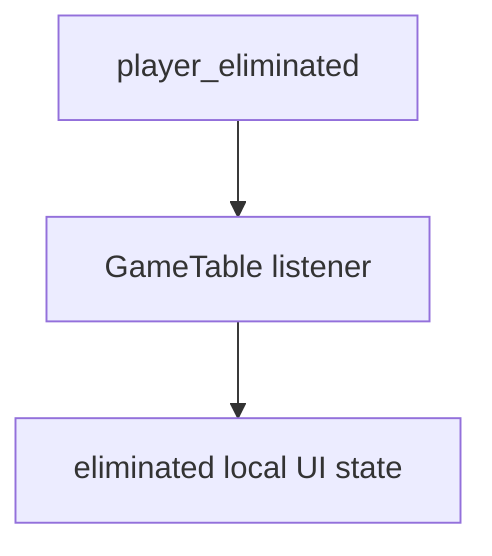

The permanent game state and the temporary notification are separate things.


## Game Over Happens at the Wrong Time

There are two main current win routes:

| Win route | Meaning |
| --- | --- |
| Empty hand | Final pending play survives its challenge opportunity |
| Last active player | Every other active player has been eliminated |

The normal game-over conditions are explained in
[The `game_over` Phase](../technical/game-phase-and-turn-flow.md#the-game_over-phase).


### Empty hand ends immediately

That would be wrong.

A player who plays their final cards still creates a pending play.

That play must first survive its challenge opportunity.

Check:

- `pendingPlay.isEmptyingHand`;
- previous pending-play check;
- next declaration;
- turn timeout;
- challenge result.

The winner should only become official once the final play can no longer be
successfully challenged.


### Empty-hand player never wins

Check whether the pending play is being removed or moved into the pile before
the empty-hand check runs.

Also check whether the player genuinely still has:

```text
hand.length === 0
```

on the server.


### Game ends before drinking finishes

For elimination-based endings, the server should only know the final
elimination result after the drink timer finishes and `applyDrink()` runs.

If the game-over overlay appears before the drinking sequence is complete, check
the order of:

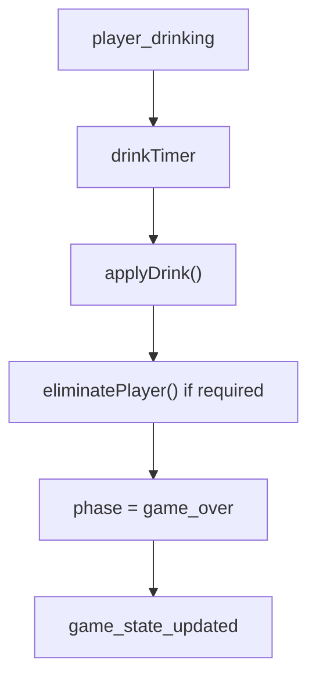


### Winner is wrong

Check the server state first:

- `winner`;
- `gameOverInfo`;
- `activePlayers`.

`GameOverNotification.jsx` displays the result; it should not be deciding the
winner itself.


## Rematch Does Not Start

Rematches only make sense after:

```js
phase === 'game_over'
```

The normal rematch path is documented in
[Rematch Flow](../technical/game-phase-and-turn-flow.md#rematch-flow) and
[Rematch and Leaving](../technical/gameplay-code-paths.md#rematch-and-leaving).


### Ready button does nothing

Check:

```text
toggleRematchReady
lobby.rematchReady
rematch_status
```

The server toggles the player's socket ID rather than always setting it to ready,
so pressing the button twice deliberately returns them to unready.


### Everybody looks ready but nothing happens

`tryStartRematch()` checks the current:

```text
lobby.players
```

roster.

A rematch requires:

- at least `2` remaining players;
- every remaining lobby player ready.

Check:

- `lobby.players.length`;
- `lobby.rematchReady.size`;
- `readyPlayerIds`;
- `playerCount`.


### Someone disconnected before the rematch

Disconnected players are removed from the lobby roster used for rematches.

They can still exist in the finished/current `gameState.players`, so make sure
the rematch logic is being compared against:

```text
lobby.players
```

rather than the original game-seat array.


### Rematch starts but old state remains

A rematch sends a fresh:

```text
game_started
```

while `GameTable` is still mounted.

Check `handleGameStarted()` and confirm it resets:

- players;
- hand;
- pile;
- pending play;
- winner;
- `gameOverInfo`;
- round number;
- notifications;
- local selected/pending cards;
- rematch-ready state.


## Disconnect Causes Problems

Reconnection is not currently implemented, so a disconnect is intentionally more
destructive than it would be in a finished account/session system.

The expected server behaviour is documented in
[Disconnect Handling](../technical/gameplay-code-paths.md#disconnect-handling),
while the limitation itself is explained in
[No Player Reconnection](../technical/limitations.md#no-player-reconnection).


### Player disappears from the current table

During an active game that is not the intended server behaviour.

The game player should remain inside:

```text
gameState.players
```

with:

```js
connected = false
```

so their existing seat is preserved.


### Player still counted for rematch

That is not intended.

The disconnected socket should be removed from:

```text
lobby.players
lobby.rematchReady
socketLobbies
```

because they cannot currently reconnect into the same session.


### Host disconnects

Before the game, the host should move to the first remaining lobby player.

During/after the game the lobby host information should also remain valid for
the players who are still connected.


### Last player disconnects

If no lobby players remain, the server should clear the game's timer handles and
remove:

```text
lobby
gameState
gameTimers entry
```

If callbacks appear later for an abandoned game, timer cleanup is the first place
to investigate.


### Refresh treated as a new player

That is currently expected.

A refreshed page creates a new Socket.IO connection and therefore a new:

```text
socket.id
```

There is no reconnection token/session system which links it back to the previous
seat.


## Player Hand Is Incorrect

A hand problem should always be checked on the server before the card rendering
component.


### Wrong starting hand

Check:

- `server/game/state.js`;
- deck size;
- hand-size calculation;
- dealing logic;
- private hand from `game_started`.

If the server generated the wrong hand, changing `CardHand.jsx` only changes how
the wrong data looks.


### Cards do not disappear after play

Follow:

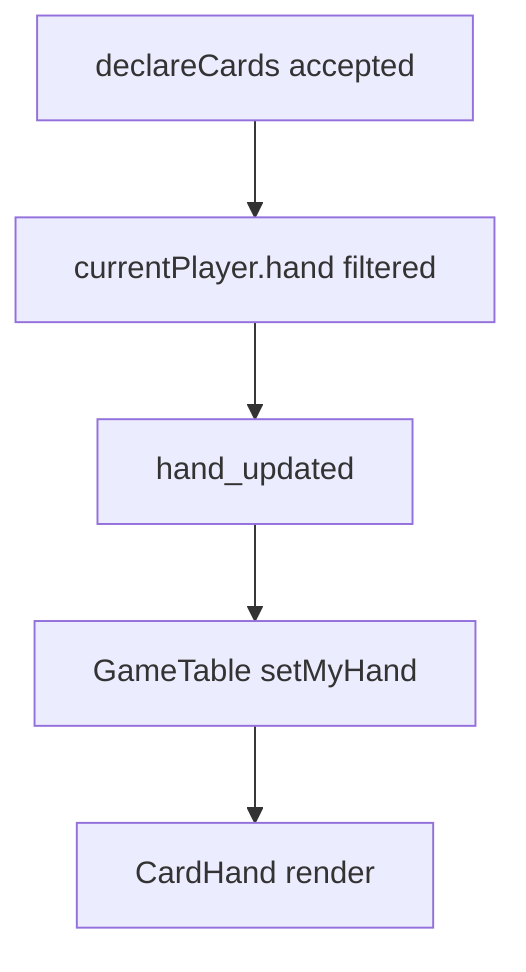


### Loser does not receive challenge pile

Follow:

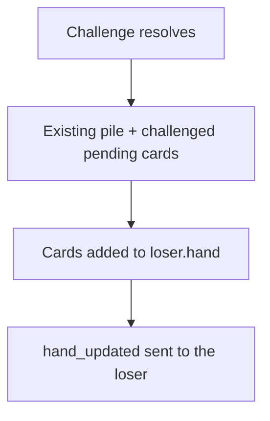

If the server hand is correct but the browser hand is not, check the private
`hand_updated` event.


### Duplicate or impossible cards

Check card IDs rather than only card values.

Multiple cards can legitimately share the same visible value, while their IDs
should still uniquely identify the individual card instances.


## Pending Cards or Pile Are Incorrect

The pending play and pile have different jobs.

The easiest reminder is:

| State | Meaning |
| --- | --- |
| `pendingPlay` | Most recent declaration; still challengeable |
| `pile` | Older plays which are already safe |


### Previous pending cards do not move to pile

That should happen when the next declaration is successfully accepted without a
challenge.

Check the declaration handler before it creates the new `pendingPlay`.


### Challenged cards remain pending afterwards

A challenge should clear:

```js
gameState.pendingPlay = null;
```

and reset:

```js
gameState.roundDeclaredNumber = null;
```

The challenged cards, together with the existing pile, should go to the loser.


### Timeout leaves old pending cards visible

After the timeout/drink sequence, the previous pending play should become safe
and move into the pile before the next turn.

The round number should remain unchanged.


### Server count correct but pile looks wrong

Then the issue is visual.

Check:

```text
Pile.jsx
Pile.css
```

The browser only receives:

```text
pile.count
```

rather than all of the actual pile cards.


### Own pending preview remains too long

`GameTable` keeps the local face-up preview only while:

```js
data.pendingPlay?.playerId === socket.id
```

If the server no longer reports that pending play but the preview remains, check
the local draft/pending cleanup functions.


## Client and Server Show Different State

This is the broadest problem in the chapter, but there is still a sensible order
for checking it.

For the underlying data model, see
[Server Runtime State](../technical/server-runtime-state.md#important-parts-of-gamestate). For the route by
which that state reaches React, see
[How Game State Reaches the Client](../technical/socketio-events.md#how-game-state-reaches-the-client).


### Decide which state should be authoritative

For game information, the server wins.

Examples include:

- players;
- card counts;
- pile count;
- pending declaration;
- current player;
- phase;
- winner;
- `roundDeclaredNumber`;
- `turnStartedAt`.

The client should update those values from:

```text
game_state_updated
```


### Check the payload

If the server state is correct, inspect what:

```js
buildPublicState(gameState)
```

actually produces.

Then check the emitted:

```text
game_state_updated
```

payload.


### Check the client listener

`GameTable` replaces its server-derived state inside:

```text
handleGameStateUpdated
```

If the event arrives with the correct information but the local values remain
old, the problem is in this layer.


### Separate server state from local UI state

Values such as:

- `selectedCards`;
- `playingCards`;
- `challengeNotif`;
- `timeoutNotif`;
- `drinkingNotif`;
- `pendingZoneCards`.

are local UI state.

The server does not necessarily know about them.

This means a browser can have stale visual state while still having a completely
correct authoritative game state underneath.


### Compare two clients

If:

```text
both clients show the same wrong game state
```

the server is immediately more suspicious.

If:

```text
one client is correct
one client is wrong
```

check the affected browser's:

- Socket.IO connection;
- event listener;
- React state;
- local draft state;
- rendering.


### Look for missed or duplicate listeners

`GameTable` currently registers named handlers and removes those same handlers
when it unmounts.

If future changes accidentally leave old listeners behind, the same server event
can be handled more than once.

Likewise, if a listener is removed too broadly or never registered, one browser
may stop receiving updates entirely.


## Quick Troubleshooting Reference

When the exact cause is not obvious, this table gives the most sensible starting
point.

| Symptom | Start checking |
| --- | --- |
| Nothing loads | `madiao-client`, port `3000`, nginx/network |
| Website loads but multiplayer does not | `madiao-server`, port `3001`, Socket.IO configuration |
| Cannot create lobby | `createLobby`, connection, name validation |
| Cannot join lobby | `joinLobby`, code, gameStarted, 6-player limit |
| Start Game fails | `hostId`, player count, `startGame` |
| Declaration rejected | `phase`, current player, card IDs, declared number |
| Challenge unavailable | `challenge_open`, `pendingPlay`, challenger identity |
| Challenge result wrong | `pendingPlay.cards`, `isPlayHonest()` |
| Timer visually wrong | `turnStartedAt`, client countdown |
| Server timeout wrong | `turnTimer`, `turnDurationMs`, timer cleanup |
| Game stuck after challenge | `resolutionTimer`, `drinkTimer`, post-drink continuation |
| Drinking mistimed | shared timing constants + `player_drinking` |
| Wrong elimination | `applyDrink()`, `eliminatePlayer()` |
| Game over too early | empty-hand challenge window / drink sequence |
| Rematch stuck | `lobby.players`, `rematchReady`, `tryStartRematch()` |
| Disconnect breaks seat layout | `gameState.players`, `connected` |
| Wrong private hand | server hand + `hand_updated` |
| Wrong pile/pending state | server `pendingPlay` / `pile.cards` |
| Only one browser is wrong | client listener/local UI state |
| Every browser is wrong | authoritative server state |


## Chapter Summary

Troubleshooting Madiao is generally easier when the symptom is traced back
towards the authoritative state rather than changing whichever component happens
to be visible.

For deployment-level problems:

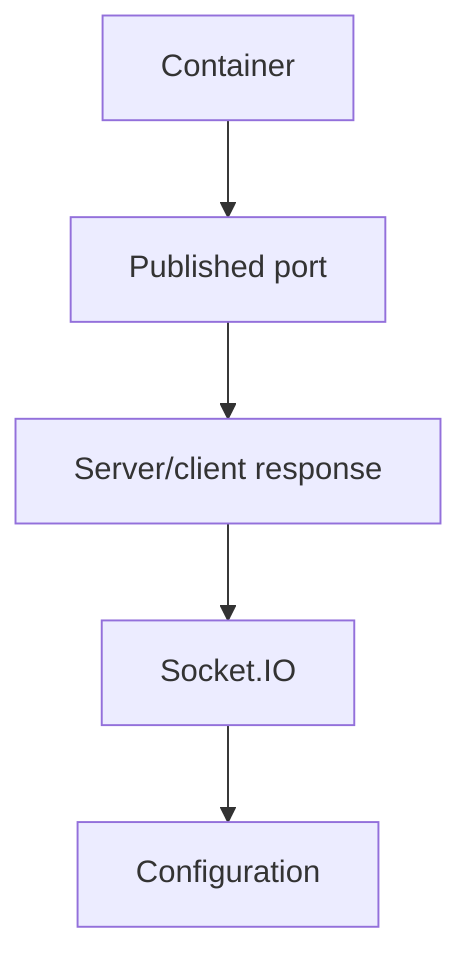

should be checked before game logic.

For gameplay problems:

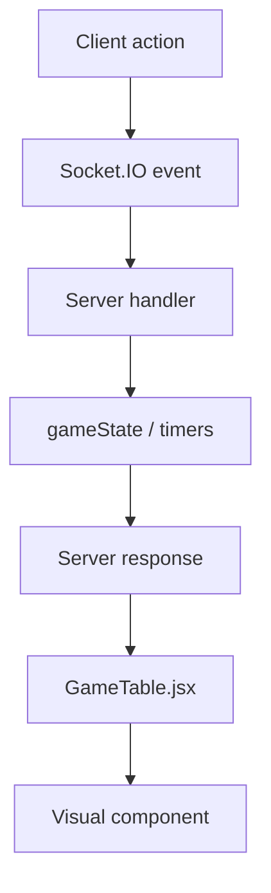

is usually the more useful direction.

The server remains responsible for things such as turns, hands, pending plays,
pile contents, challenge results, drunkness, elimination and game over.

The client remains responsible for displaying that state and managing temporary
interface details such as selected cards, result overlays and animations.

The most important practical habit is therefore to work out which side is
already correct.

If the server state is wrong, fix the code which created that state.

If the server state and Socket.IO payload are correct, stop changing the game
rules and move into the relevant client handler or visual component.

That distinction is what turns a fairly vague problem such as:

```text
"The game is stuck"
```

into a much smaller question such as:

```text
"The server is still in resolving_challenge because the drink timer callback
never moved it back to waiting."
```

Once the problem is that specific, the part of the code which needs attention is
usually much easier to find.
