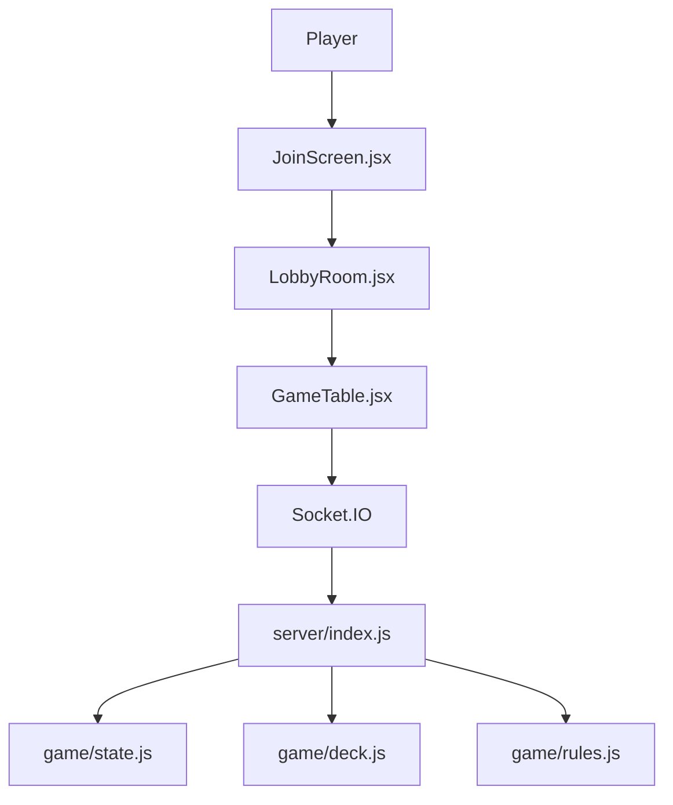
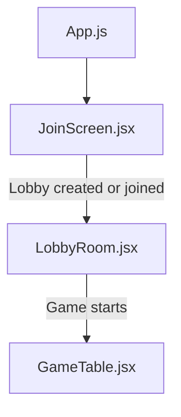
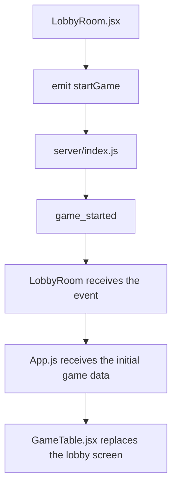
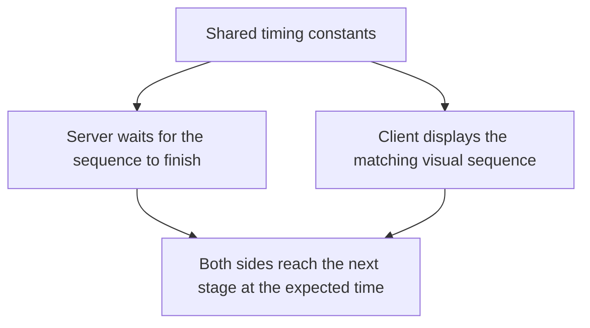

# Application Code Map

By this point the deployment side of Madiao should be fairly clear.

The next useful thing is being able to move through the application code without
having to rediscover the whole project every time something needs changing.

This chapter therefore acts as more of a map than a detailed explanation of the
game logic.

The aim is not to explain every function or every React component line by line.
The systems introduced here are covered in more detail in
[Server Runtime State](server-runtime-state.md),
[Game Phase and Turn Flow](game-phase-and-turn-flow.md),
[Timer System](timer-system.md) and
[Socket.IO Events](socketio-events.md).

For now, the important question is simply:

> If a certain part of Madiao is behaving incorrectly, which file is the most
> sensible place to start looking?

At the highest level the flow can be thought of as:



The React side mainly controls what the player sees and sends requests.

The server side receives those requests, checks whether they are allowed and
updates the authoritative game state.


## Server Entry Point

The main server file is:

```text
server/index.js
```

This is the central file for the multiplayer side of Madiao.

It creates the Express server, attaches Socket.IO, stores all active lobbies and
games, handles most client events and decides how the game moves from one stage
to the next.

The file begins by importing three smaller game modules:

```js title="server/index.js"
const { startGame } = require('./game/state');
const { isPlayHonest } = require('./game/deck');
const { applyDrink } = require('./game/rules');
```

These modules handle some self-contained parts of the rules, however,
`index.js` is still the file where the wider multiplayer sequence is coordinated.

It also imports the timing values used by the server:

```js title="server/shared/constants.js"
const {
    turnDurationMs,
    cooldownMs,
    drinkAnimationMs,
    challengeOverlayMs,
    timeoutOverlayMs
} = require('./shared/constants');
```


### Main in-memory collections

Near the top of the file are the four Maps which hold the live application
state:

```js title="server/index.js"
const lobbies = new Map();
const gameStates = new Map();
const gameTimers = new Map();
const socketLobbies = new Map();
```

A useful quick reminder is:

| Map | What it keeps |
| --- | --- |
| `lobbies` | Waiting-room information and lobby players |
| `gameStates` | The actual running game for each lobby |
| `gameTimers` | Server timers for active games |
| `socketLobbies` | Which lobby a particular socket belongs to |

If a problem involves the server losing track of a player, lobby or active game,
these structures and the functions which modify them are immediately relevant.


### Main helper functions

Before the Socket.IO event handlers begin, `index.js` defines a number of helper
functions.

The important ones currently include:

| Helper | Main job |
| --- | --- |
| `generateLobbyCode()` | Creates a new lobby code |
| `broadcastLobby()` | Sends the latest lobby roster and host information |
| `buildPublicState()` | Creates the safe public version of the game state |
| `broadcastGameState()` | Sends that public state to the lobby |
| `getNextPlayerIndex()` | Finds the next active player |
| `beginGame()` | Creates and stores a fresh game |
| `tryStartRematch()` | Checks whether a rematch can begin |
| `handleTurnTimeout()` | Resolves a missed turn deadline |
| `eliminatePlayer()` | Marks and broadcasts an eliminated player |
| `rollDrunkness()` | Coordinates the wider drinking sequence |

The sections below explain what each one is responsible for.


#### `generateLobbyCode()`

Creates the six-character lobby code used when a new waiting room is created.

Characters which are easy to confuse, such as `0`, `O` and `1`, are deliberately
left out.


#### `broadcastLobby()`

Sends the latest waiting-room player list and host information to everybody in
that lobby.

If players join or leave correctly on the server but the waiting room does not
update for everybody, this function and the related `lobby_updated` event are
useful places to check.


#### `buildPublicState()`

Creates the version of the game state which is safe to send to every browser.

It includes things such as:

- player names;
- card counts;
- drunkness;
- elimination state;
- connection state;
- pile count;
- the pending declaration;
- the current player;
- the game phase;
- the winner.

It deliberately does not expose the actual cards held by other players.

This is one of the most important server helper functions because most public
state updates pass through it.


#### `broadcastGameState()`

Takes the public state and sends it to everybody in the lobby.

This is closely connected to the client-side `game_state_updated` event.

If the server state is correct but clients are not receiving the change, this
part of the path becomes relevant.


#### `getNextPlayerIndex()`

Works out which active player should receive the next turn.

This is useful whenever turn order behaves incorrectly, especially around
eliminated or disconnected players.


#### `beginGame()`

Creates a fresh game using `startGame()`, stores it in `gameStates`, creates its
timer object and sends each player the information required to enter the table.

This function is used for both the first game and a fresh rematch.

A problem which exists immediately when a game starts is therefore likely to
pass through here.


#### `tryStartRematch()`

Checks whether the remaining lobby players are ready for another game.

When everybody required has marked themselves ready, this eventually leads back
into `beginGame()`.


#### `handleTurnTimeout()`

Handles the sequence which begins when the active player reaches the server turn
deadline without making a valid play.

This includes the timeout notification, penalty drink and moving the game onto
the next player afterwards.


#### `eliminatePlayer()`

Marks a player as out and broadcasts the elimination.

It is used by the drinking flow when a player's drink result knocks them out of
the game.


#### `rollDrunkness()`

Coordinates the wider drink sequence around `applyDrink()`.

`rules.js` decides the elimination result of the drink itself, while
`rollDrunkness()` handles how that result fits back into the active multiplayer
game.


## Main Server Socket.IO Handlers

After the helper functions, the server enters:

```js title="server/index.js"
io.on('connection', (socket) => {
    ...
});
```

Most actions sent from the browser are handled inside this block.

The current main handlers are:

- `createLobby`
- `joinLobby`
- `startGame`
- `toggleRematchReady`
- `leaveGame`
- `declareCards`
- `challenge`
- `disconnect`

These names are worth becoming familiar with because they make the server file
much easier to navigate.

For example, if the player cannot create a lobby, search for:

```js
socket.on('createLobby'
```

If the server rejects a declaration, search for:

```js
socket.on('declareCards'
```

and if challenge behaviour is wrong:

```js
socket.on('challenge'
```

There is little reason to read the entire server file from the top for every
problem.

Searching for the relevant event name will usually take us much closer to the
correct section immediately.


## Supporting Server Game Files

Three files underneath:

```text
server/game/
```

handle smaller pieces of game logic which do not need to live directly inside
the Socket.IO server.


### `game/state.js`

The main function is:

```js title="server/game/state.js"
startGame(lobbyPlayers)
```

This is responsible for building the initial state of a completely fresh game.

It:

- builds and shuffles the deck;
- calculates the hand size;
- deals the cards;
- creates the player game records;
- sets everyone to drunkness `0`;
- chooses a random starting player;
- creates an empty pile;
- sets `pendingPlay` to `null`;
- sets the starting phase;
- sets the first turn timestamp.

If the problem is already present the moment a match starts, `state.js` is one
of the first places worth checking.

Examples include:

- the wrong number of starting cards;
- incorrect initial player state;
- the wrong starting phase;
- the wrong first player.


### `game/deck.js`

This file handles card creation and card matching.

Its exported functions currently include `deckBuilding()`, `shuffle()`,
`cardAutoMatching()` and `isPlayHonest()`.

The most important ones from a troubleshooting point of view are:

```js title="server/game/deck.js"
deckBuilding()
```

for the actual makeup of the deck, and:

```js title="server/game/deck.js"
isPlayHonest(cards, declaredNumber)
```

for deciding whether the cards revealed during a challenge matched the
declaration.

If wild cards or challenge honesty behave incorrectly, this file is much more
likely to be responsible than one of the React card components.


### `game/rules.js`

This file currently contains the drink/elimination probability rule.

The main function is:

```js title="server/game/rules.js"
applyDrink(player)
```

It increases the player's drunkness and calculates whether that drink eliminates
them.

The current elimination chances are:

| Drink number | Elimination chance |
| --- | ---: |
| 1 | 25% |
| 2 | 50% |
| 3 | 75% |
| 4 | 100% |

This file answers:

> Did this drink knock the player out?

It does not control when the drink notification appears, how long the
animation lasts, when the next turn starts or which player takes the pile.

Those wider sequence decisions belong to the server flow in `index.js`.


## Client Entry Points

On the client side there are a few files which are especially useful for
understanding how the player moves through the application.

The main screen progression is:



`App.js` sits above the main screens and is responsible for switching between
them as the player progresses.

The screens themselves notify the parent when they have successfully reached
the next stage.

For example, `JoinScreen` receives:

```js
onLobbyJoined
```

and `LobbyRoom` receives:

```js
onGameStarted
```

Once the server confirms those actions, the data is passed upwards and the
application can replace one screen with the next.

This means that navigation is not really traditional page navigation.

The browser remains inside the React application while React changes which major
component is currently being displayed.


### `socket.js`

The shared Socket.IO client is kept in:

```text
client/src/socket.js
```

It creates one connection:

```js title="client/src/socket.js"
const socket = io(
    process.env.REACT_APP_SERVER_URL
);
```

and exports it for the rest of the React application.

The main screens therefore all use the same socket connection.

This file is particularly important if several unrelated parts of the client
suddenly stop communicating with the server at the same time.


## Lobby Components

Before the actual game table appears, the player moves through two main lobby
components.


### `JoinScreen.jsx`

The file is located under the client components and handles the first screen.

Its main jobs are:

- collecting the player name;
- collecting a lobby code when joining;
- creating a lobby;
- joining an existing lobby;
- showing create/join errors;
- passing successful lobby information upwards.

The important outgoing events are:

```js
socket.emit('createLobby', ...)
socket.emit('joinLobby', ...)
```

and it listens for `lobby_created`, `lobby_joined` and `lobby_error`.

This makes `JoinScreen.jsx` the correct client-side starting point when:

- the **Create Lobby** button behaves incorrectly;
- the **Join Lobby** button behaves incorrectly;
- the lobby-code input behaves incorrectly;
- the join/create loading state is stuck;
- server lobby errors are not shown.

If the button works visually but the server rejects the request, the matching
handler in `server/index.js` becomes the next step.


### `LobbyRoom.jsx`

Once a lobby has been created or joined, `LobbyRoom.jsx` becomes the waiting
screen.

It keeps track of the visible players, host, lobby code, copy-to-clipboard
feedback, start-game button and start-game errors.

The host starts the match using:

```js
socket.emit('startGame');
```

The component listens for `lobby_updated`, `game_started` and `game_error`.

`lobby_updated` keeps the visible player list and host information synchronised.

`game_started` passes the initial game data back upwards so the application can
replace the waiting room with `GameTable`.

If the lobby itself works but the game never moves to the table, this event
path is therefore worth checking:




## `GameTable.jsx`

The main gameplay component is:

```text
client/src/components/game/GameTable.jsx
```

This is the most important client-side file once the game has started.

It does not own the actual game rules, however, it sits in the middle of almost
everything the player sees during a match.

Its responsibilities include:

- keeping the browser copy of server game state;
- keeping local UI state;
- listening for game Socket.IO events;
- sending declarations and challenges;
- calculating the visible countdown;
- handling card selection;
- working out which actions are currently enabled;
- positioning opponents around the table;
- showing notifications;
- handling game over and rematch controls;
- passing state into smaller display components.

The file therefore acts as the client-side coordinator in much the same way
`server/index.js` acts as the server-side coordinator.


### Server-derived game state

Some of the main values received from the server include:

```js
players
myHand
pile
pendingPlay
currentPlayerIndex
phase
winner
gameOverInfo
roundDeclaredNumber
turnStartedAt
```

These describe what the current game actually is from the client's point of
view.


### Local interface state

Other values only exist to control the interface rather than representing the
authoritative game state.

The current local UI state in `GameTable.jsx` includes:

```js title="client/src/components/game/GameTable.jsx"
selectedCards
pendingZoneCards
showDeclare
playingCards
turnTimeLeft
error
challengeResult
timeoutPlayerName
drinkingNotif
eliminated
rematchReadyPlayerIds
rematchPlayerCount
```

There is also:

```js title="client/src/components/game/GameTable.jsx"
submissionStartedRef
submissionTimerRef
```

which is a React ref rather than normal state. It is used to guard against the
same play being submitted more than once while a declaration is already being
sent.

This distinction becomes very useful during debugging.

For example, if `selectedCards`, `challengeResult` or `pendingZoneCards` are
wrong while the server state is correct, that is probably a local React/UI
problem.

If `currentPlayerIndex`, `phase` or `pendingPlay` are already wrong in the data
coming from the server, changing CSS or card-selection logic will not fix the
underlying problem.


### Important incoming game events

`GameTable` currently listens for events including:

- `game_state_updated`
- `hand_updated`
- `challenge_result`
- `timeout_drink`
- `player_drinking`
- `player_eliminated`
- `game_error`
- `rematch_status`
- `game_started`

These events keep the table synchronised with the server and trigger temporary
UI states such as challenge or drinking notifications.


### Important outgoing actions

The table sends the main gameplay actions back to the server.

These include `declareCards`, `challenge`, `toggleRematchReady` and
`leaveGame`.

Declarations are slightly more involved because the client sends the selected
card IDs and declared number and waits for an acknowledgement from the server.

The important point is that `GameTable.jsx` is normally the first client file to
check whenever a problem happens during an active game rather than in the
waiting room.


## Main Game Display Components

`GameTable.jsx` coordinates the screen, but most individual visual areas are
split into smaller components.

This keeps the main table file from also having to contain every card layout,
avatar and overlay.


### `CardHand.jsx`

Controls the player's visible hand.

Its main job is to render the cards passed into it and report card clicks back
to `GameTable`.

The actual decision about whether the player is allowed to submit those cards is
not made here.


### `PlayerFrame.jsx`

Controls the visible player frame around the table.

It displays things such as:

- player name;
- card count;
- avatar;
- connection state;
- drunkness;
- current-turn indication;
- thinking dots;
- countdown;
- drinking state;
- pending declaration.

It also places an opponent's small face-down pending cards through
`PlayerPendingZone`.

If an individual player's HUD is visually wrong while the underlying player
data is correct, this is one of the first files worth checking.


### `PlayerPendingZone.jsx`

Displays the area where selected or recently declared cards are shown.

The local player's cards can remain face-up because that player already knows
what they played.

Opponent cards are represented without revealing their private values.

This component is therefore mainly concerned with presentation and layout rather
than deciding what is actually in the server's pending play.


### `Pile.jsx`

Displays the central shared pile.

The client only knows the public pile count rather than every private card stored
inside it.

If the number is wrong in the incoming server state, the problem is upstream.

If the number is correct but the stack looks wrong, `Pile.jsx` or `Pile.css` is
the more likely place to look.


### `DeclareModal.jsx`

Handles the declaration interface shown when the opening player needs to choose
the round number.

It collects the player's choice and sends it back to `GameTable` through its
callback.

The server still validates the final declaration afterwards.


### `ChallengeNotification.jsx`

Handles the challenge result overlay.

The same file also contains the timeout notification component.

It controls visual phases such as the initial challenge banner, transition,
revealed result, fade and timeout message, and uses the shared timing values to
keep those visual stages aligned with the server sequence.

If a challenge result is logically wrong, check the server.

If the correct result is displayed at the wrong time or in the wrong visual
phase, this component and the shared timing values are much more relevant.


### `GameOverNotification.jsx`

Displays the finished-game screen.

It receives information such as `winner`, `players`, `gameOverInfo` and
rematch readiness, and exposes the **Play Again** and **Main Menu** controls.

The component does not decide who won.

It displays the result already decided by the server and coordinates the user's
next action through callbacks supplied by `GameTable`.


## Shared Timing Constants

Timing values are kept under the `shared/constants` part of the client/server
code rather than scattering unexplained millisecond values through the game.

The current important constants include:

```js
turnDurationMs
autoSubmitLeadMs
drinkAnimationMs
notificationFadeMs

challengeFlashMs
challengeTransition
challengeResultMs
challengeOverlayMs

timeoutMessageMs
timeoutDrinkNoticeMs
timeoutOverlayMs

cooldownMs
```

The client imports the values it needs through its shared constants module.

The server imports its values through:

```js title="server/index.js"
require('./shared/constants');
```

These values are particularly important because some sequences are split across
both environments.

For example:



If the two sides disagree about the duration, the next server action can happen
before or after the user interface expects it.

This is why timing problems should usually be investigated as a shared sequence
rather than by randomly changing a `setTimeout()` in one component.


## Which File Controls What?

The quickest practical reference is the table below.

| Problem or feature | Start here |
| --- | --- |
| Create lobby | `JoinScreen.jsx` + `server/index.js` `createLobby` |
| Join lobby | `JoinScreen.jsx` + `server/index.js` `joinLobby` |
| Lobby player list | `LobbyRoom.jsx` + `broadcastLobby()` |
| Host/start button | `LobbyRoom.jsx` + `startGame` handler |
| Initial hands/game setup | `game/state.js` + `beginGame()` |
| Deck composition | `game/deck.js` |
| Wild card matching | `game/deck.js` |
| Challenge honesty | `game/deck.js` + server `challenge` handler |
| Active game state | `server/index.js` |
| Public state sent to players | `buildPublicState()` |
| Player's own hand on client | `GameTable.jsx` + server private hand events |
| Card selection | `GameTable.jsx` + `CardHand.jsx` |
| Declaration menu | `DeclareModal.jsx` |
| Declaration rejected | server `declareCards` handler |
| Challenge button | `GameTable.jsx` |
| Challenge result logic | server `challenge` handler |
| Challenge animation | `ChallengeNotification.jsx` |
| Timeout logic | `handleTurnTimeout()` |
| Timeout overlay | `ChallengeNotification.jsx` / `TimeoutNotification` |
| Drink elimination chance | `game/rules.js` |
| Drinking sequence | `rollDrunkness()` + `PlayerFrame.jsx` |
| Player HUD | `PlayerFrame.jsx` |
| Pending cards | `PlayerPendingZone.jsx` + `GameTable.jsx` |
| Pile display | `Pile.jsx` |
| Wrong pile state | `server/index.js` |
| Turn countdown display | `GameTable.jsx` |
| Turn deadline | server timers in `index.js` |
| Game-over decision | `server/index.js` |
| Game-over screen | `GameOverNotification.jsx` |
| Rematch readiness | `GameTable.jsx` + `toggleRematchReady` handler |
| Disconnect behaviour | server `disconnect` handler |
| Client/server connection address | `client/src/socket.js` |
| Challenge/timeout timing | shared `constants.js` files |

This does not mean the file in the right-hand column is guaranteed to contain
every bug of that type.

It simply gives the most sensible first place to look.


## Chapter Summary

Madiao has two main coordinator files:

| Side | Main coordinator | Responsibility |
| --- | --- | --- |
| Server | `server/index.js` | Multiplayer flow, Socket.IO handlers, runtime state, timers and progression |
| Client | `GameTable.jsx` | Active-game UI coordination, server listeners and passing state into display components |

The supporting server modules — `game/state.js`, `game/deck.js` and
`game/rules.js` — handle game creation, card logic and drink/elimination rules
respectively.

Before the game begins, `JoinScreen.jsx` and `LobbyRoom.jsx` handle
creating/joining a lobby and waiting for the host to start the match.

Afterwards, smaller components such as `CardHand.jsx`, `PlayerFrame.jsx`,
`PlayerPendingZone.jsx`, `Pile.jsx`, `DeclareModal.jsx`,
`ChallengeNotification.jsx` and `GameOverNotification.jsx` handle individual
visual areas of the table.

The main thing to remember is that a bug should normally be traced according to
where the information originates.

If the server sends the wrong state, fix the server path.

If the server state is correct but the browser displays it incorrectly, move
down into `GameTable` and the relevant visual component.

That simple distinction can save a considerable amount of time compared with
changing both sides at once without first working out which side is actually
wrong.
