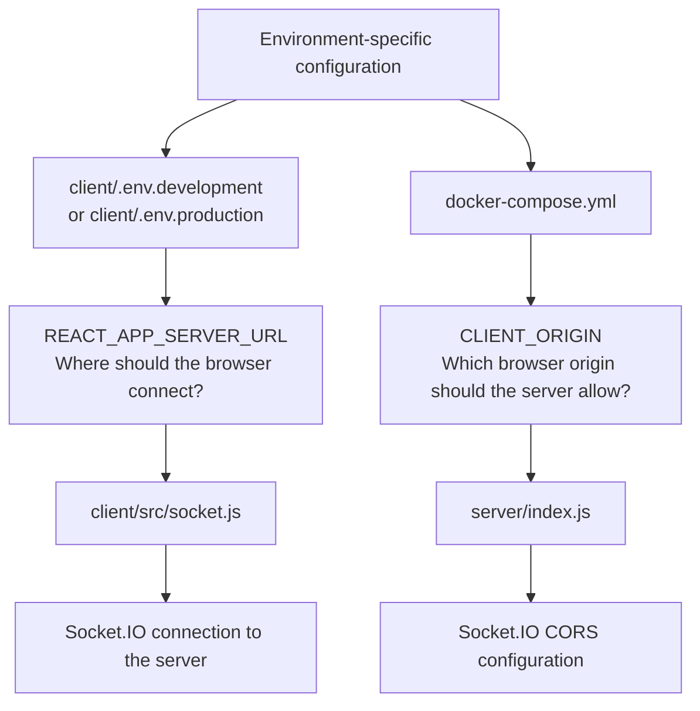
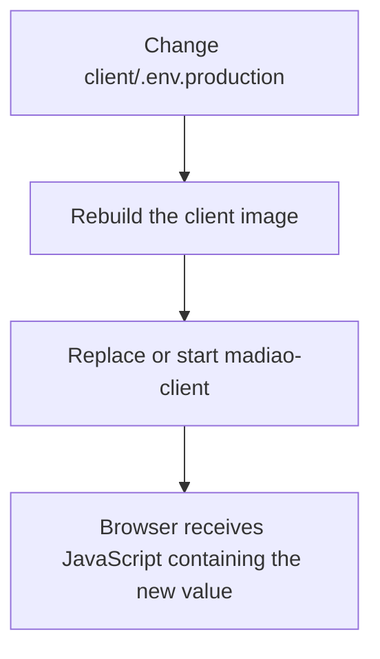

# Environment and Configuration

The project structure is fairly straightforward once the client and server are
looked at separately, however, there is another part sitting between the code and
the environment where the game is actually running.

That part is configuration.

The main reason configuration exists is that the same code needs to work in more
than one place. During development the client and server normally talk to each
other through `localhost`, while the production version needs to use the address
of the live server instead.

It would technically be possible to write those addresses directly into the
JavaScript files and change them by hand whenever the environment changes.
However, doing that would make it very easy to accidentally commit a development
address into production, or the other way around.

Instead, Madiao uses environment variables to provide the small amount of
information which changes depending on where the game is running.

There are currently two especially important values: `REACT_APP_SERVER_URL`
and `CLIENT_ORIGIN`.

They sound fairly similar, however, they are used on opposite sides of the
application and solve two different problems.


## The Current Configuration Setup

The current project does not use one single environment file for everything.

The configuration is split between the client and the production Docker setup.

The important pieces are:

```text
client/.env.development
client/.env.production

client/src/socket.js

server/index.js

docker-compose.yml
```

At a simplified level the relationship looks like this:



The client therefore needs to know **where it should connect**, while the server
needs to know **which client address it should allow to connect**.

Both are required for the production client and server to communicate properly.


## `REACT_APP_SERVER_URL`

The client creates its Socket.IO connection in:

```text
client/src/socket.js
```

The important part is:

```js title="client/src/socket.js"
const socket = io(
    process.env.REACT_APP_SERVER_URL
);
```

`REACT_APP_SERVER_URL` is therefore the address the browser will use when it
tries to connect to the Node.js game server.

The project currently has separate values for development and production.


### Development

The development environment uses:

```text
client/.env.development
```

with:

```env title="client/.env.development"
REACT_APP_SERVER_URL=http://localhost:3001
```

This makes sense when both sides of the game are running on the same development
computer.

The React application can simply connect back to `localhost:3001` because the
Node server is running on that same machine.


### Production

The production build uses:

```text
client/.env.production
```

This contains the address of the live game server rather than `localhost`.

It is worth remembering that the browser itself ultimately needs to reach this
address.

!!! warning "Do not use localhost in the public production client"
    Using `http://localhost:3001` in the production build would not mean
    **the production server**. It would mean port `3001` on the computer of
    whichever player opened the game.

That is one of those mistakes that can look perfectly reasonable at first,
because `localhost` works during development, however, once the game is opened
from another computer it would obviously be pointing at the wrong machine.


## Why the Client Variable Is a Build-Time Setting

One slightly unusual part of the React setup is that
`REACT_APP_SERVER_URL` is effectively decided when the client is built.

The production Dockerfile builds the React application using:

```dockerfile title="client/Dockerfile"
RUN npm run build
```

Create React App reads the `.env.production` values during that build and places
the required values into the generated JavaScript bundle.

Afterwards the build output is copied into nginx:

```dockerfile title="client/Dockerfile"
FROM nginx:alpine
COPY --from=build /app/build /usr/share/nginx/html
```

At that point nginx is only serving already-built static files.

It is no longer running the React build process.

This means that changing `client/.env.production` does not magically change a
client image which has already been built.

The client needs to be rebuilt before the new value becomes part of the
application.

In practical terms:



!!! note "Restarting nginx is not enough"
    nginx only serves the static React files which were already built. If the
    client was built with the wrong server address, the client image needs to be
    rebuilt before that value can change.


## `CLIENT_ORIGIN`

The opposite side of the connection is handled by the server.

Inside:

```text
server/index.js
```

the server reads:

```js title="server/index.js"
const CLIENT_ORIGIN =
    process.env.CLIENT_ORIGIN ||
    'http://localhost:3000';
```

The value is then used when Socket.IO is created:

```js title="server/index.js"
const io = new Server(server, {
    cors: {
        origin: CLIENT_ORIGIN,
        methods: ['GET', 'POST']
    }
});
```

The purpose of this setting is to tell the server which browser origin should be
allowed to connect.

During local development, if no value is provided, the fallback is
`http://localhost:3000`, which matches the normal React development server.

In production, Docker Compose supplies the live client origin to the server
container through:

```yaml title="docker-compose.yml"
environment:
  CLIENT_ORIGIN: <production-client-address>
```

This value is read when the Node process starts.

That makes `CLIENT_ORIGIN` different from the React variable covered above.

The client value is part of the build.

The server value is provided when the container runs.


## Build-Time vs Runtime Configuration

This difference is probably the most important thing to remember from this
chapter.

Both variables are environment settings, but they are not applied at the same
time.

| Variable | Used by | Applied when | Main purpose |
| --- | --- | --- | --- |
| `REACT_APP_SERVER_URL` | React client | Client build | Tells the browser where the game server is |
| `CLIENT_ORIGIN` | Node server | Server runtime | Tells Socket.IO which client origin to allow |

A simple way of remembering it is:

| Variable | Question to remember |
| --- | --- |
| `REACT_APP_SERVER_URL` | **Where is the browser connecting to?** |
| `CLIENT_ORIGIN` | **Which browser origin is the server allowing from?** |

This distinction also changes how a configuration problem should be fixed.

If `CLIENT_ORIGIN` is wrong, changing the value and recreating/restarting the
server container is enough because Node reads it when the server starts.

If `REACT_APP_SERVER_URL` is wrong, the React client needs to be rebuilt because
the value is already inside the production JavaScript files.


## Docker Compose Configuration

The production client and server are tied together through:

```text
docker-compose.yml
```

The current structure is roughly:

```yaml title="docker-compose.yml"
services:

  server:
    build:
      context: ./server

    container_name: madiao-server

    ports:
      - "3001:3001"

    environment:
      CLIENT_ORIGIN: <production-client-address>

    restart: unless-stopped


  client:
    build:
      context: ./client

    container_name: madiao-client

    ports:
      - "3000:80"

    restart: unless-stopped
```

There are a few useful things to take from this.

Firstly, both services are built from separate folders: `./server` and
`./client`. This means each service uses the Dockerfile inside its own build
context.

Secondly, the port mappings explain why the game is reached through `3000` and
`3001` from outside Docker:

| Host port | Container port | Service |
| ---: | ---: | --- |
| `3000` | `80` | `madiao-client` / nginx |
| `3001` | `3001` | `madiao-server` / Node.js |

Thirdly, `CLIENT_ORIGIN` is passed directly into the server container here.

At the moment the production client address is written directly into the Compose
file rather than being read from a separate root `.env` file.

For this project that works and the value itself is not a password or secret.
However, it is still worth knowing where it lives because changing the
production address would require updating this file.


## Checking the Final Docker Configuration

Docker Compose has a very useful command for checking what it thinks the final
configuration looks like:

```bash
docker compose config
```

This does not start the game.

It simply reads the Compose file, validates it and prints the resolved
configuration.

That makes it a fairly safe command to run whenever the Docker setup has been
edited.

It is especially useful for checking:

- port mappings;
- build contexts;
- container names;
- environment values;
- YAML structure.

For example, if the server is rejecting the browser and there is a suspicion
that `CLIENT_ORIGIN` is wrong, checking:

```bash
docker compose config
```

is much quicker than immediately rebuilding the entire application.

If Compose itself cannot understand the YAML, it will normally report that here
before any containers are touched.


## Development and Production Environments

The project currently has a fairly simple distinction between development and
production.

| Environment | React client | Node server |
| --- | --- | --- |
| Development | `http://localhost:3000` | `http://localhost:3001` |
| Production | Live client address | Live server address |

During development the client uses:

```env
REACT_APP_SERVER_URL=http://localhost:3001
```

and the server can use its built-in fallback:

```js
'http://localhost:3000'
```

During production, the same code is used but the addresses change to the live
server addresses.

This is the main reason environment configuration exists in Madiao.

The game logic itself should not need to know whether it is being played on a
development computer or on the live server.

Only the small amount of information describing how the two sides find each
other needs to change.


## Environment Files and Git

Environment files deserve a little bit of extra attention because the word
"environment" often gets associated with secrets.

That is not automatically the case.

For example, `REACT_APP_SERVER_URL` cannot really be treated as a secret
because the value is eventually delivered to every player's browser as part of
the React application.

Anybody using the website can ultimately discover which server the browser is
connecting to.

The same is true for a public-facing client address used by `CLIENT_ORIGIN`.

However, this does not mean every environment variable is safe to commit.

If the project later gains things such as database passwords, API secrets,
private tokens or session secrets, those should not be placed into a client-side
`REACT_APP_*` variable or committed into the repository.

!!! warning "Treat every REACT_APP_* value as public"
    Create React App places these values into browser-delivered JavaScript during
    the build. Environment-variable syntax makes configuration easier, but it
    does not hide the value from the player.

The wider repository rules for environment files and credentials are covered in
[Security and Repository Notes](security.md#environment-files).


## Changing the Production Address

If the server address changes in the future, there are currently two places
which are especially important.

The client needs its production server address updated in
`client/.env.production`.

For example:

```env title="client/.env.production"
REACT_APP_SERVER_URL=http://<new-server-address>:3001
```

Because this is a build-time value, rebuild the client afterwards.

The server also needs to allow the correct client address through the
`CLIENT_ORIGIN` value in `docker-compose.yml`.

For example:

```yaml
environment:
  CLIENT_ORIGIN: http://<new-client-address>:3000
```

After changing the configuration, the normal checks are:

```bash
docker compose config
docker compose build
docker compose up -d
```

The full process is covered in
[Normal Production Updates](../runbook/production-updates.md), so there is no
need to turn this section into another deployment guide.

!!! warning "The website can load even when Socket.IO is misconfigured"
    Changing the address on one side without updating the matching configuration
    on the other can leave the React site looking normal while multiplayer
    communication is completely broken.


## Chapter Summary

Madiao currently has two main pieces of environment-specific configuration.

The React client uses `REACT_APP_SERVER_URL` to decide where its Socket.IO
connection should go.

The Node server uses `CLIENT_ORIGIN` to decide which browser origin Socket.IO
should accept.

The biggest difference between them is when those values are applied:

| Variable | Applied when |
| --- | --- |
| `REACT_APP_SERVER_URL` | React client build time |
| `CLIENT_ORIGIN` | Node server runtime |

The development version uses `localhost`, while the production version uses the
live addresses.

The current client production address is kept in
`client/.env.production`, while Docker Compose supplies `CLIENT_ORIGIN` directly
to the server container.

Lastly, `docker compose config` is one of the easiest ways of checking the
resolved production Docker configuration before making larger changes.

The setup itself is fairly small, but understanding where these values come from
is important because a configuration problem can leave the visual website
working normally while the actual multiplayer connection is completely broken.
