# Game Phase and Turn Flow

[Server Runtime State](server-runtime-state.md) explains the data the server
keeps while a game is running. The next step is understanding how that state
moves from one stage to another.

This is probably one of the more important chapters in the runbook because quite
a few problems which appear to be about cards, buttons or timers are actually
problems with the wider game flow.

Madiao uses the `phase` value inside `gameState` to describe what the server is
currently allowing to happen.

The main phases are:

- `waiting`
- `cooldown`
- `challenge_open`
- `resolving_challenge`
- `resolving_timeout`
- `game_over`

A simplified view of the normal phase flow looks like this:

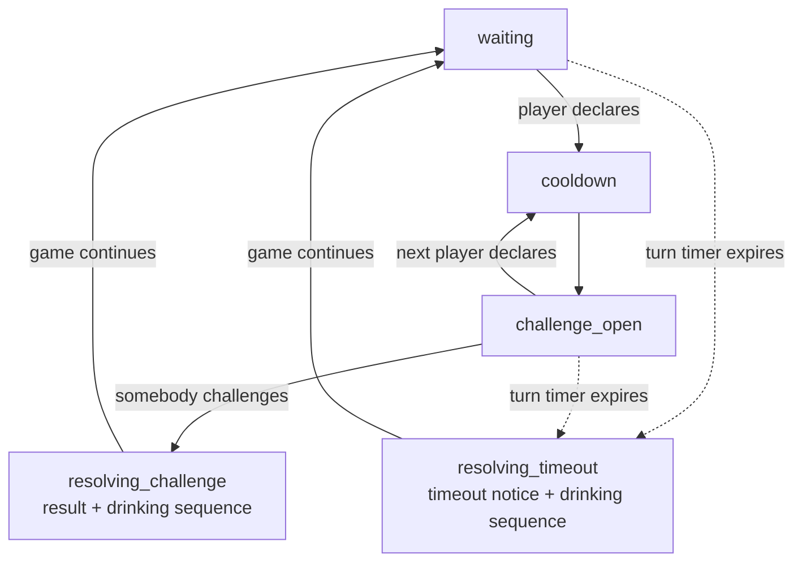

The solid arrows show the normal declaration/challenge route, while the dashed
arrows show the timeout route.

The `result + drinking sequence` and `timeout notice + drinking sequence` labels
are deliberately kept inside the corresponding resolution nodes. The visible
drinking animation is **not** a separate server phase; the server remains inside
`resolving_challenge` or `resolving_timeout` until that resolution has
finished.

The important part is that the server phase is not just a visual label.

The server actively checks it before accepting actions, which makes it one of the
main safeguards against two incompatible things happening at the same time.


## Why the Phase Exists

Without a server-side phase, the browser could potentially send actions while
the game was already in the middle of resolving something else.

For example, imagine that a challenge has already started and the real cards are
being revealed.

At that point the server should not also accept:

```text
another declaration
another challenge
a second turn action
```

The phase provides a simple lock.

The declaration handler currently allows declarations only when:

```js title="server/index.js"
gameState.phase === 'waiting'
```

or:

```js
gameState.phase === 'challenge_open'
```

The challenge handler is stricter and only allows a challenge when:

```js
gameState.phase === 'challenge_open'
```

As soon as a valid challenge arrives, the server changes the phase to:

```js
'resolving_challenge'
```

before doing the rest of the work.

That means another challenge arriving immediately afterwards will no longer pass
the phase check.

This is especially useful in a multiplayer game because two browser events can
arrive extremely close together.


## Starting a Fresh Game

A new game is created by:

```js title="server/game/state.js"
startGame(lobbyPlayers)
```

The starting phase is:

```js
phase: 'waiting'
```

The game also begins with:

```js
pendingPlay: null
roundDeclaredNumber: null
turnStartedAt: Date.now()
```

and a random:

```js
currentPlayerIndex
```

The first player's server turn timer starts immediately.

At this stage there is no previous play to challenge and no declared round
number yet.

The opening player therefore has three things to do:

- choose the cards they want to play;
- choose the number being declared for the round;
- submit the declaration before the turn timer expires.


## The `waiting` Phase

`waiting` basically means the current player is allowed to make a declaration
and there is no currently open challenge window.

It appears in several places, not only at the very beginning of the match.

The game returns to `waiting` after:

- a challenge has completely resolved;
- a timeout and drinking sequence has completely resolved;
- a fresh game or rematch begins.

A useful distinction is:

| Phase | Declaration | Challenge |
| --- | --- | --- |
| `waiting` | Allowed for the current player | Not currently open |
| `challenge_open` | Allowed for the current player | Previous pending play can also be challenged |

That second case is what allows the round to keep moving without needing a
completely separate challenge turn.


## Making a Declaration

The main server handler is:

```js title="server/index.js"
socket.on('declareCards', ...)
```

Before a declaration is accepted, the server checks quite a few things.

Among other checks, it confirms that:

- the game is in `waiting` or `challenge_open`;
- the sender is the current player;
- the player has not been eliminated;
- at least one card was selected;
- card IDs are valid and not duplicated;
- the player genuinely owns the cards;
- the declared number is between `1` and `10`;
- the play contains no more than the allowed number of cards;
- the declaration matches the current round number when one already exists.

This is worth remembering because the UI allowing somebody to click a card does
not make the play legal.

The server still validates the final action.


### The first declaration sets the round number

If:

```js
gameState.roundDeclaredNumber === null
```

the first accepted declaration sets it:

```js
gameState.roundDeclaredNumber = declaredNumber;
```

From that point onwards, later players in the same round have to keep declaring
that same number.

For example:

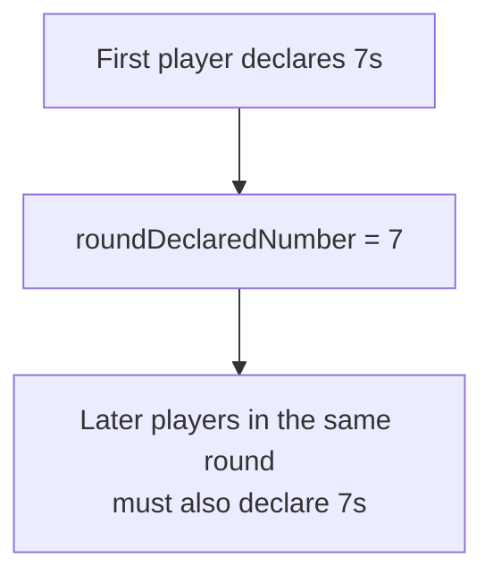

The actual cards can still be a bluff.

The number being declared simply stays fixed until the round ends through a
challenge.


## What Happens to a Previous Pending Play

After the first turn, a declaration can arrive while the game is in:

```text
challenge_open
```

At that moment there may already be a previous:

```js
gameState.pendingPlay
```

waiting to be challenged.

A successfully confirmed new declaration means the previous player's challenge
window has effectively ended.

The server therefore moves the previous hidden cards into the confirmed pile:

```js title="server/index.js"
gameState.pile.cards.push(
    ...gameState.pendingPlay.cards
);
```

The new declaration then becomes the new `pendingPlay`.

This creates the normal no-challenge flow:

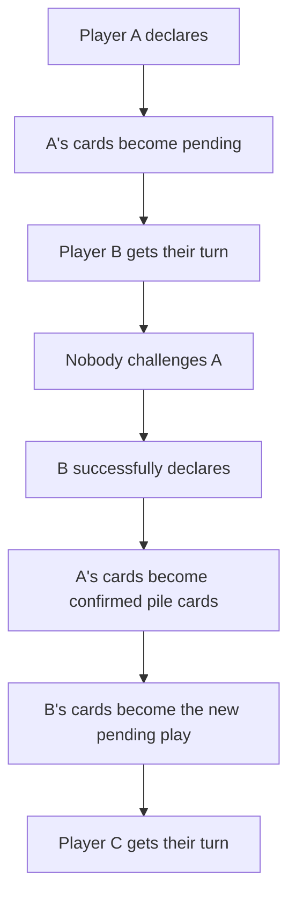

Only the most recent play remains challengeable.


## Empty-Hand Plays Are Still Challengeable

Removing the final cards from a player's hand does not make them win
immediately.

When the server creates the pending play it records:

```js title="server/index.js"
isEmptyingHand: currentPlayer.hand.length === 0
```

This matters because the final play still has to survive its challenge
opportunity.

There are three possible outcomes.


### The next player makes a declaration without challenging

Before accepting that new play, the server sees that the previous pending play
emptied the player's hand.

If the previous player's hand is still genuinely empty, the server declares
them the winner before processing the new declaration.

The game moves to:

```js
phase = 'game_over'
```


### The next player's timer expires without challenging

The timeout handler performs the same empty-hand check before penalising the
player who timed out.

If the previous empty-hand play is still pending and valid, the previous player
wins there.

This prevents somebody from delaying an empty-hand win simply by doing nothing
until their timer expires.


### Somebody challenges the final play

The cards are resolved normally.

If the empty-hand player was bluffing, they lose the challenge and take the pile
back, meaning their hand is no longer empty.

If the play was honest, the challenge winner is the empty-hand player. Once the
challenge loser has completed the drinking sequence, the server sees that the
winner still has no cards and ends the game.

So the final-card rule can be thought of as:

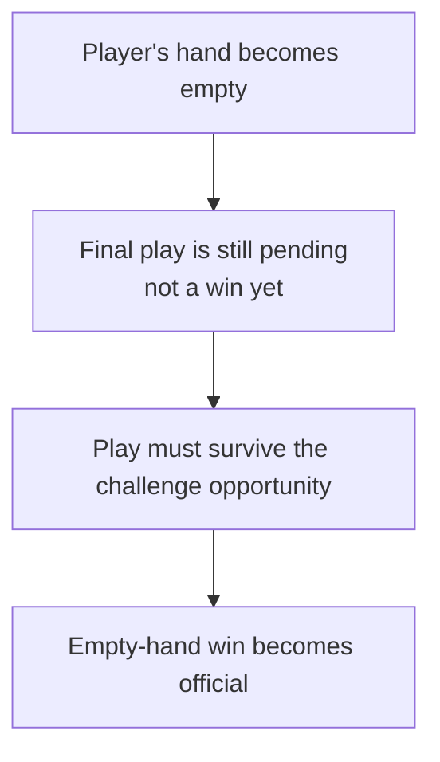


## The `cooldown` Phase

Once a declaration has been accepted, the server changes:

```js
gameState.phase = 'cooldown';
```

The current turn timer is cancelled because the player successfully acted in
time.

The server then broadcasts the new pending play.

After `cooldownMs`, it:

- opens the challenge window;
- moves `currentPlayerIndex` to the next active player;
- sets a new `turnStartedAt`;
- broadcasts the state;
- starts the next turn timer.

The next phase is:

```js
'challenge_open'
```

At the moment:

```js
cooldownMs = 0
```

so this phase is effectively immediate. The timer itself is explained in
[Cooldown Timer](timer-system.md#cooldown-timer).

It is still useful to keep it in the flow because it gives the project one clear
place where a delay can be introduced later without redesigning the whole turn
sequence.

It also explains why seeing `cooldown` in the code does not necessarily mean
players currently experience a visible waiting period.


## The `challenge_open` Phase

This is where the normal turn flow becomes slightly different from a traditional
one-action-at-a-time turn system.

During `challenge_open`, two things are true at the same time:

- the next player has their normal turn;
- the previous play is still challengeable.

The current player can make the next declaration.

At the same time, the server will accept a challenge from an active player who
is not challenging their own pending play.

If the next player successfully declares first, the previous pending cards
become safe and the round continues.

If a valid challenge reaches the server first, the game immediately switches to:

```js
'resolving_challenge'
```

and normal input is locked.

This creates the basic race:

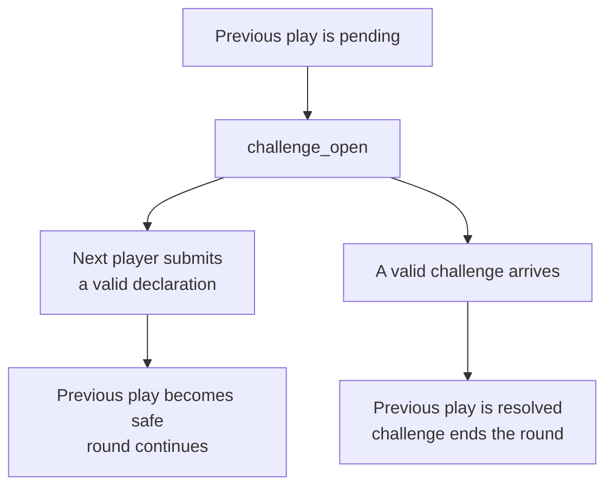


## Resolving a Challenge

When a challenge is accepted, the server first locks the game:

```js
gameState.phase = 'resolving_challenge';
gameState.turnStartedAt = null;
```

It also cancels any active cooldown or turn timer.

The server then takes a copy of the pending information before clearing it:

- the actual pending cards;
- the declared number;
- the accused player;
- the challenger.

The real cards are checked through:

```js title="server/game/deck.js"
isPlayHonest(pendingCards, declaredNumber)
```


### Honest play

If every card matches the declaration or is a valid wild card, the play is
honest and the challenger loses.

### Bluff caught

If the play was not honest, the accused player loses and the challenger wins.

The decision can be summarised as:

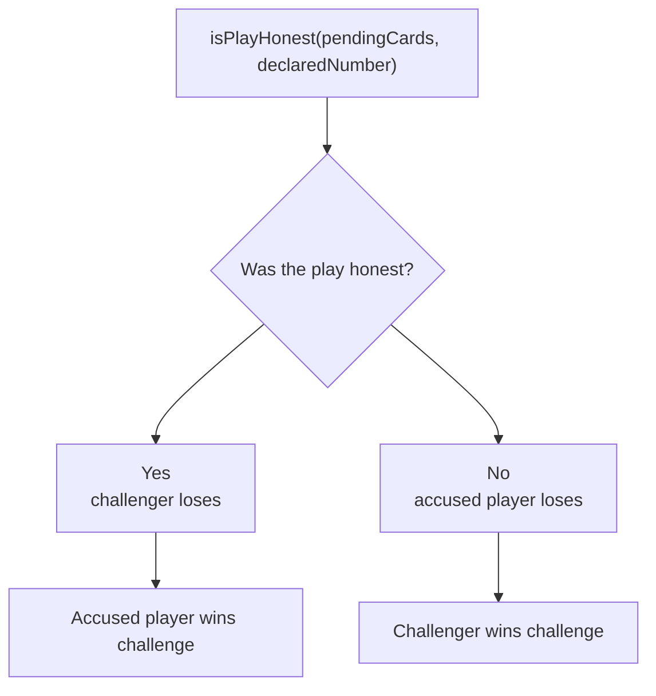


### The loser takes everything

The loser receives both:

- the existing confirmed pile;
- the cards from the challenged pending play.

The combined cards are added to the loser's hand and their updated hand is sent
to them privately.

The server then clears:

```js
gameState.pile.cards = [];
gameState.pendingPlay = null;
gameState.roundDeclaredNumber = null;
```

A challenge therefore ends the current round completely.

The next declaration starts a fresh round and can choose a new number.


## Challenge Result and Drinking Sequence

After deciding who won, the server emits:

```text
challenge_result
```

to everybody.

This is the point where the real pending cards are intentionally revealed.

The server does not immediately continue the game.

Instead, `rollDrunkness()` waits for the challenge result overlay to finish.
The individual delays which make up this sequence are covered in
[Challenge Resolution Timer](timer-system.md#challenge-resolution-timer) and
[Challenge Drink Timer](timer-system.md#challenge-drink-timer).

The sequence is:

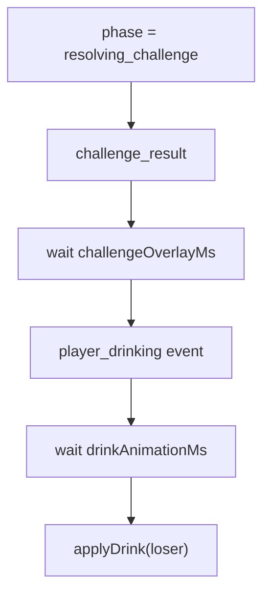

An important detail here is that there is no separate server phase called:

```text
drinking
```

The client displays the drinking animation through the `player_drinking` event,
while the server remains inside the wider challenge-resolution flow.

That is useful to remember when debugging because the UI may visibly say that
somebody is drinking even though:

```js
gameState.phase
```

still says:

```text
resolving_challenge
```


## What Happens After a Challenge Drink

Once the drink animation has finished, the server calls:

```js title="server/game/rules.js"
applyDrink(loser)
```

which increases drunkness and checks whether the player is eliminated.

There are then several possibilities.


### The drink ends the game through elimination

If the loser is eliminated and only one active player remains:

```text
phase = game_over
winner = last active player
```

The challenge flow stops there.


### The challenge winner has no cards

If the game did not already end through elimination, the server checks:

```js
winner.hand.length === 0
```

If true, the challenge winner wins by empty hand.

This is the honest-final-play case described earlier.


### Normal continuation

Otherwise, the challenge winner receives the next turn:

```js
gameState.currentPlayerIndex =
    gameState.players.findIndex(p => p.id === winner.id);

gameState.phase = 'waiting';
gameState.turnStartedAt = Date.now();
```

A new turn timer is started.

Because the challenge reset:

```js
roundDeclaredNumber = null
```

this next player begins a fresh round and chooses the new declared number.


## Turn Timeout

Every active turn has a server-side timer. The timer itself, the
`turnStartedAt` timestamp and the client-side countdown are covered in
[The 40-Second Turn Timer](timer-system.md#the-40-second-turn-timer).

If the player does not make a valid declaration before it expires,
`handleTurnTimeout()` runs.

As mentioned earlier, the first thing it checks is whether the previous pending
play was an empty-hand play which has now survived its challenge opportunity.

If so, the previous player wins and the timeout penalty never needs to continue.

Otherwise the current player is penalised.


## The `resolving_timeout` Phase

The timeout handler changes:

```js
gameState.phase = 'resolving_timeout';
gameState.turnStartedAt = null;
```

and broadcasts the locked state.

The server then emits:

```text
timeout_drink
```

which produces the timeout notification on the clients. The delay before the
drinking event is explained in
[Timeout Resolution Timer](timer-system.md#timeout-resolution-timer).

The sequence becomes:

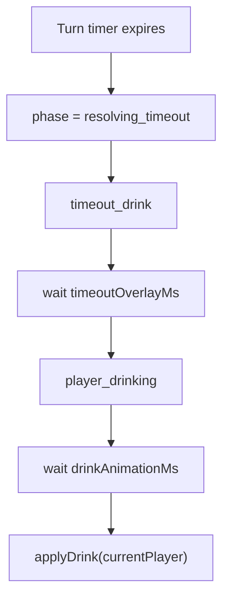

Just like challenge drinking, the visible drinking state is an event-driven UI
sequence rather than its own server phase.


## What Happens After a Timeout Drink

The timeout player receives a normal drink and can therefore be eliminated.

If that elimination leaves only one active player, the game ends immediately.

If the game continues, any previous pending play becomes safe because the timed
out player has lost their opportunity to challenge it.

The server moves those cards into the pile and clears:

```js
gameState.pendingPlay
```

It then moves to the next active player:

```js
gameState.currentPlayerIndex =
    getNextPlayerIndex(gameState);
```

and returns to:

```js
gameState.phase = 'waiting';
gameState.turnStartedAt = Date.now();
```

A new turn timer begins.


### The round number does not reset on timeout

One small but important detail is that a timeout does not end the round in the
same way as a challenge.

The previous pending cards become confirmed pile cards, but:

```js
roundDeclaredNumber
```

is left alone.

So if the round was being played as `7`s before the timeout, the next active
player still has to declare `7`s.

This gives the difference:

| Resolution | What happens to the round? | `roundDeclaredNumber` |
| --- | --- | --- |
| Challenge | Round ends and the pile goes to the loser | Reset to `null` |
| Timeout | Previous pending play becomes safe and the round continues | Stays the same |


## Player Elimination

A player can currently be eliminated through the drinking rule.

When that happens:

```js title="server/index.js"
player.isOut = true;
```

and the server emits:

```text
player_eliminated
```

The player remains inside the game state so the client can still show their seat
and status, but they are no longer part of normal turn selection.

`getNextPlayerIndex()` skips players where:

```js
isOut === true
```

After every elimination, the server checks how many active players remain.

If only one remains, that player wins through the last-standing condition.


## The `game_over` Phase

Once the game has a winner, the server sets:

```js
gameState.phase = 'game_over';
```

At that point normal gameplay actions are no longer accepted.

There are currently two main ways to reach this state:

- an empty-hand win;
- a last-standing win through elimination.

The server also stores:

```js title="server/index.js"
gameState.gameOverInfo
```

so the client can explain how the game ended.

Examples are:

```js
{ type: 'empty_hand' }
```

or an elimination result containing information about the player who was
knocked out.

`GameOverNotification.jsx` then displays the result to the players.


## Rematch Flow

After `game_over`, players who remain in the lobby can mark themselves ready for
another match.

The client sends:

```text
toggleRematchReady
```

and the server stores ready socket IDs inside:

```js
lobby.rematchReady
```

The server only accepts rematch readiness when:

```js
gameState.phase === 'game_over'
```

Once every remaining lobby player is ready, and at least two players remain,
`tryStartRematch()` calls:

```js
beginGame(...)
```

again.

This does not continue the old game state.

It creates a completely fresh game:

- a newly shuffled deck;
- new hands;
- drunkness reset;
- `isOut` reset;
- a new random starting player;
- an empty pile;
- no pending play;
- `roundDeclaredNumber = null`;
- `phase = waiting`.

The lobby itself remains the same, which means the players do not need to create
and join a new lobby code simply to play another match.


## Full Normal Flow

Putting everything together, a normal uninterrupted round can be viewed as:

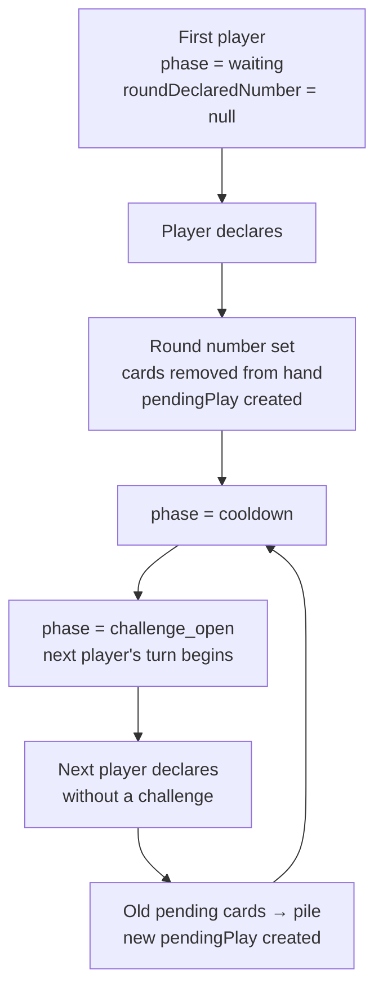

A challenge branches out of that flow:

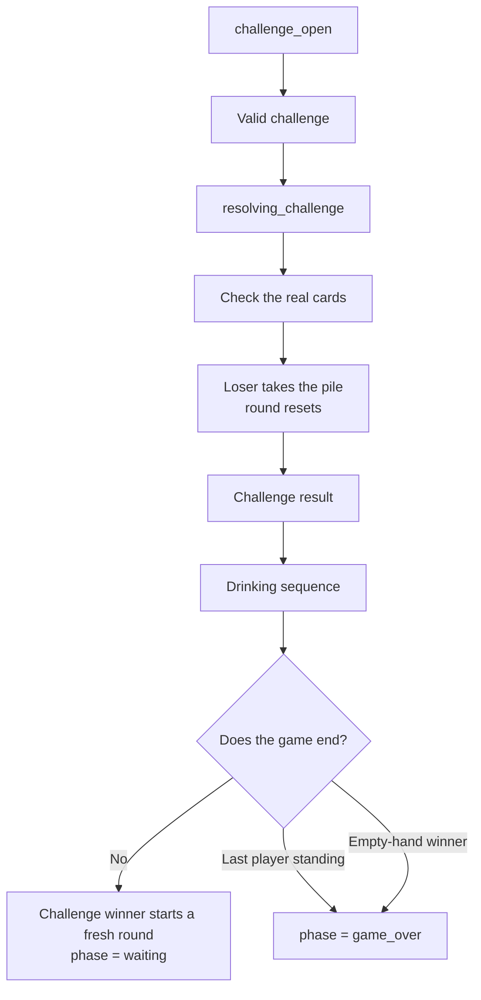

And a timeout follows:

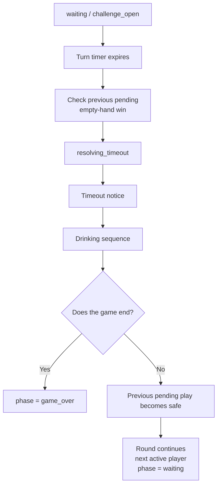


## Useful Phase Troubleshooting Questions

When the game appears stuck, the first useful question is often:

> What phase does the server think the game is in?

A rough guide is:

| Symptom | Phase/state worth checking |
| --- | --- |
| Player cannot declare on a normal turn | `waiting` / `challenge_open` |
| Challenge button should work but server rejects it | `challenge_open` |
| Two challenges seem to resolve | switch to `resolving_challenge` |
| Turn timer is visible during result screen | `turnStartedAt` should be `null` |
| Game continues while challenge overlay is showing | challenge resolution timing |
| Game continues while timeout notice is showing | timeout resolution timing |
| New round still uses old declared number after challenge | `roundDeclaredNumber` reset |
| Timeout incorrectly starts a fresh number | `roundDeclaredNumber` should remain |
| Eliminated player gets another turn | `getNextPlayerIndex()` / `isOut` |
| Empty-hand player wins before challenge opportunity | `isEmptyingHand` flow |
| Game accepts actions after winner is set | `phase` should be `game_over` |

This chapter describes the expected sequence.

If the state moves through those phases in the wrong order, the bug is usually
in the server flow rather than in the visual component which happens to expose
it.


## Chapter Summary

The server controls the wider Madiao game flow through:

```js
gameState.phase
```

The main phases are:

- `waiting`
- `cooldown`
- `challenge_open`
- `resolving_challenge`
- `resolving_timeout`
- `game_over`

`waiting` allows a normal declaration.

After a declaration the game briefly enters `cooldown`, then moves the turn to
the next active player and enters `challenge_open`.

During `challenge_open`, the next player can continue the round while the
previous pending play remains challengeable.

A successful next declaration makes the previous play safe and moves its cards
into the pile.

A challenge instead enters `resolving_challenge`, reveals the real cards, gives
the pile to the loser, resets the round and performs the drinking sequence. If
the game continues afterwards, the challenge winner starts a fresh round.

A timeout enters `resolving_timeout`, gives the current player a penalty drink
and then moves to the next active player. Unlike a challenge, a timeout does not
reset the declared round number.

Emptying the hand is also deliberately not an instant win. The final play must
first survive its challenge opportunity.

Lastly, the visible drinking animation is not a separate server phase. During
challenge and timeout drinks the server remains inside the corresponding
resolution flow until the animation has finished and the drink has actually
been applied.
