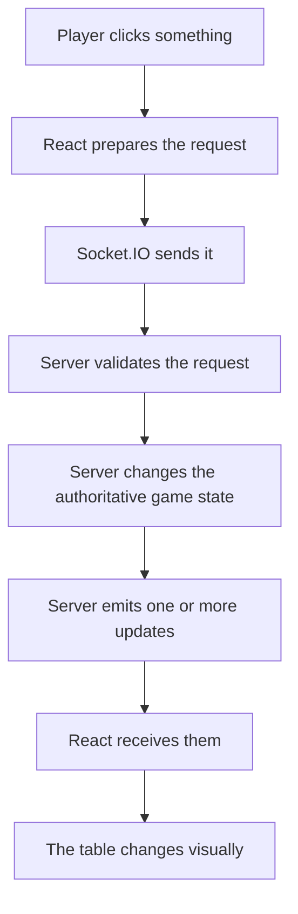
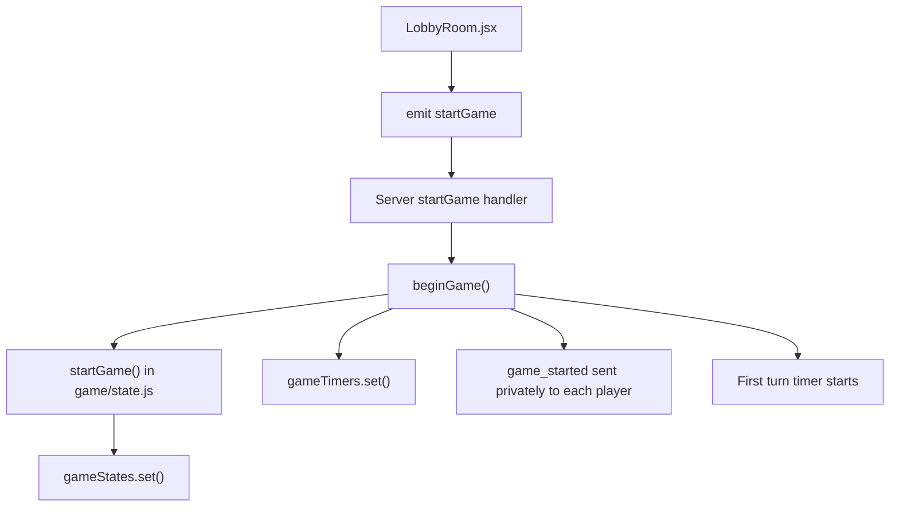
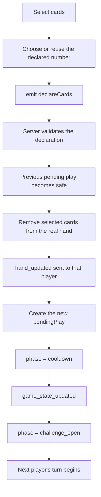
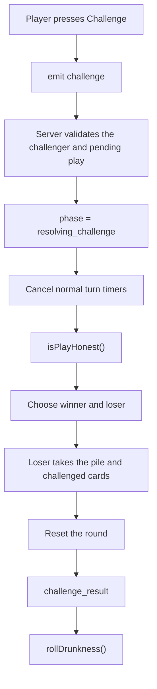
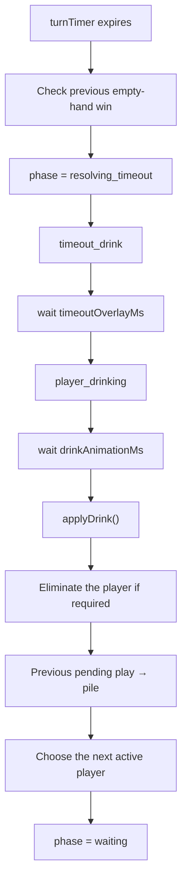
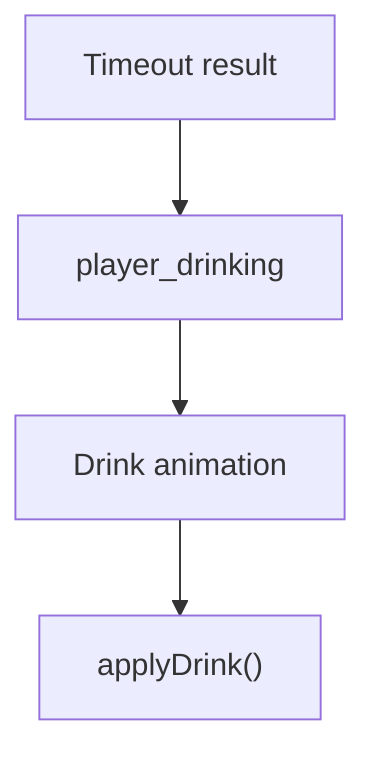
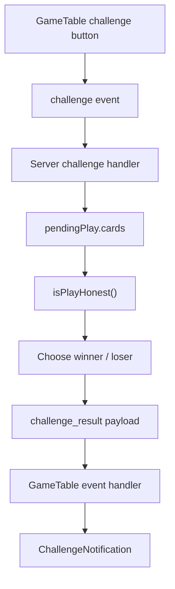
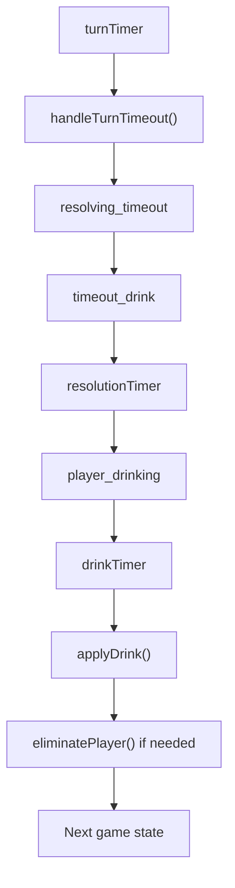
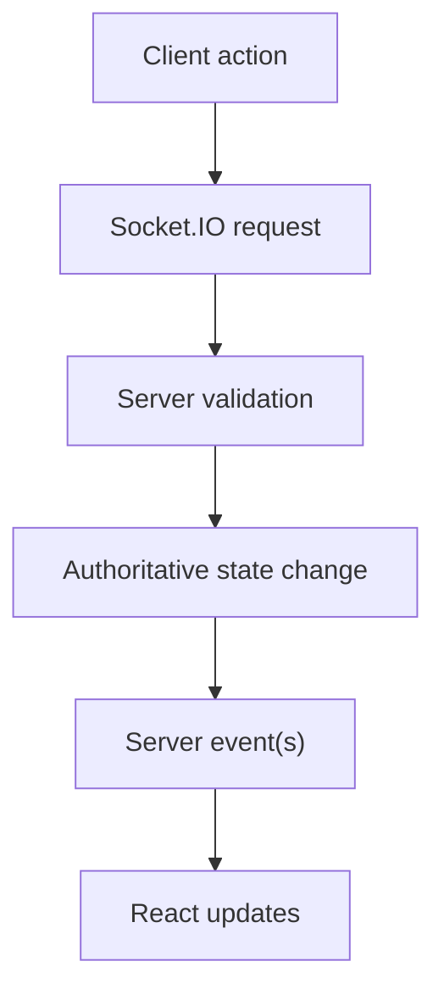

# Main Gameplay Code Paths

[Socket.IO Events](socketio-events.md) maps the events which move between the
client and server.

This chapter follows the main gameplay actions one step further and looks at the
actual code path those events take through the application.

This is useful because a bug rarely lives in only one function.

A normal action often travels through several stages:



Understanding that whole path makes it much easier to work out whether a problem
belongs to the client, server, timer sequence or one of the smaller game-rule
modules.

The main paths covered here are:

- starting a game;
- declaring cards;
- resolving a challenge;
- handling a timeout;
- drinking and drunkness;
- player elimination;
- disconnect handling;
- rematches and leaving.


## Starting a Game

The game begins from the waiting room.

The host presses the Start Game button in `LobbyRoom.jsx`, which sends:

```js title="client/src/components/LobbyRoom/LobbyRoom.jsx"
socket.emit('startGame');
```

The server receives that inside:

```js title="server/index.js"
socket.on('startGame', ...)
```

and begins by finding the sender's lobby through:

```js title="server/index.js"
const lobbyCode =
    socketLobbies.get(socket.id);
```

It then retrieves:

```js
const lobby =
    lobbies.get(lobbyCode);
```


### Server checks

Before anything is created, the server checks that:

- the socket belongs to a lobby;
- the lobby still exists;
- the sender is the host;
- there are at least two players;
- the game has not already started.

The host check is:

```js
if (lobby.hostId !== socket.id) return;
```

and a lobby with fewer than two players receives:

```text
You need at least 2 players to start the game
```

If the game was already started, another `startGame` request is also rejected.

This means pressing the button several times cannot create several overlapping
game states.


### Creating the game

Once the checks pass:

```js
lobby.gameStarted = true;
beginGame(io, lobbyCode, lobby);
```

`beginGame()` then calls:

```js title="server/game/state.js"
startGame(lobby.players);
```

from:

```text
server/game/state.js
```

That function builds the initial game itself.

At a high level it creates:

- a shuffled deck;
- dealt player hands;
- starting drunkness values;
- initial elimination and connection state;
- an empty pile;
- no pending play;
- a random starting player;
- `roundDeclaredNumber = null`;
- `phase = waiting`;
- the first `turnStartedAt` value.

The returned object becomes the authoritative state:

```js title="server/index.js"
gameStates.set(
    lobbyCode,
    gameState
);
```


### Creating the timers

The server also creates the timer slots for that particular game. The purpose of
all four slots is covered in [Server Timer Slots](timer-system.md#server-timer-slots),
while the first active turn is explained in
[The 40-Second Turn Timer](timer-system.md#the-40-second-turn-timer).

```js title="server/index.js"
gameTimers.set(lobbyCode, {
    turnTimer: null,
    cooldownTimer: null,
    resolutionTimer: null,
    drinkTimer: null
});
```

The first turn timer is started immediately:

```js
timers.turnTimer = setTimeout(() => {
    handleTurnTimeout(
        io,
        lobbyCode,
        gameState,
        timers
    );
}, turnDurationMs);
```


### Sending each player's private hand

The game cannot simply be broadcast as one object because each hand is private.

Instead:

```js
gameState.players.forEach(player => {
    io.to(player.id).emit('game_started', {
        ...buildPublicState(gameState),
        hand: player.hand
    });
});
```

Everybody receives the same public state.

Each player also receives a different private `hand` value.

The path is therefore:



On the first match, `LobbyRoom` receives `game_started` and the React application
moves to `GameTable`.

On a rematch, `GameTable` is already open and handles the same event itself.


## Declaring Cards

Declaring cards is the main normal-turn path and therefore one of the most
heavily validated server actions.

On the client, the process begins with card selection inside `GameTable.jsx`.

The browser keeps the selected card IDs in:

```js
selectedCards
```

The client itself already blocks obvious invalid actions such as:

- selecting cards when it is not your turn;
- selecting while eliminated;
- selecting outside `waiting` / `challenge_open`;
- selecting more than 10 cards.

!!! note "Client checks are mainly for user experience"
    The server performs all important validation again. A client-side check can
    make the interface easier to use, but it is not trusted as proof that a
    declaration is valid.


### Opening declaration vs later play

If:

```js
roundDeclaredNumber == null
```

the player is making the opening declaration of a round.

The client opens `DeclareModal` so they can choose the number.

Later players do not need that window because the round number is already fixed.

For them the play can simply use:

```js
roundDeclaredNumber
```


### Client submission

The final request contains:

```js
{
    cardIds,
    declaredNumber
}
```

and is sent through the `declareCards` event.

The client uses a Socket.IO acknowledgement so it knows whether the server
accepted or rejected the play.


### Server lookup

The server retrieves the `lobby`, `gameState` and `timers` using the sender's
lobby code.

If any of them are missing, there is no valid active game to modify.


### Phase and turn checks

A declaration is only accepted when:

```js
gameState.phase === 'waiting'
```

or:

```js
gameState.phase === 'challenge_open'
```

The server then checks the actual current player:

```js
const currentPlayer =
    gameState.players[
        gameState.currentPlayerIndex
    ];
```

The request is rejected if the current player is eliminated or if the socket
which sent the request is not the current player.


### Data checks

The server then validates the incoming payload itself.

It checks that:

- `data` is an object;
- `cardIds` is an array;
- at least one card was selected;
- every card ID is a string;
- there are no duplicate card IDs;
- `declaredNumber` is an integer from 1 to 10;
- the declaration matches the existing round number;
- no more than 10 cards were selected;
- the player actually owns every selected card.

The ownership check is particularly important:

```js
const declaredCards =
    uniqueIds.map(id =>
        currentPlayer.hand.find(
            card => card.id === id
        )
    );
```

If any selected ID cannot be found inside the player's real server-side hand,
the play is rejected.

The client therefore cannot invent a card ID and successfully play a card it
does not own.


### Confirming the previous pending play

If there is already a previous:

```js
gameState.pendingPlay
```

the new successful declaration means that previous challenge opportunity has
ended.

Before doing anything else, the server checks whether the previous player had
emptied their hand.

If so, and that player's hand is still genuinely empty, the previous play has
survived and the game ends with:

```js
gameState.winner = prevPlayer.id;
gameState.gameOverInfo = {
    type: 'empty_hand'
};
gameState.phase = 'game_over';
gameState.turnStartedAt = null;
```

The new declaration does not continue.

If there is no empty-hand win, the previous pending cards become confirmed pile
cards:

```js
gameState.pile.cards.push(
    ...gameState.pendingPlay.cards
);
```


### Setting the round number

If this is the first declaration of the round:

```js
if (
    gameState.roundDeclaredNumber === null
) {
    gameState.roundDeclaredNumber =
        declaredNumber;
}
```

Every later declaration must match this value until a challenge ends the round.


### Removing cards from the hand

The server removes the played cards from the player's real hand:

```js
currentPlayer.hand =
    currentPlayer.hand.filter(
        card =>
            !uniqueIds.includes(card.id)
    );
```

The player then receives their new hand privately:

```js
io.to(socket.id).emit(
    'hand_updated',
    {
        hand: currentPlayer.hand
    }
);
```


### Creating the pending play

The new play is kept as:

```js
gameState.pendingPlay = {
    playerId: socket.id,
    cards: declaredCards,
    declaredNumber,
    declaredCount:
        declaredCards.length,
    isEmptyingHand:
        currentPlayer.hand.length === 0
};
```

The actual cards remain server-side.

Other players only receive the safe public declaration data.


### Moving to the next turn

The server changes to:

```js
gameState.phase = 'cooldown';
```

clears the successful player's old turn timer and broadcasts the state.

After `cooldownMs`, the game enters `challenge_open`, the next active player
becomes current and a fresh turn timer begins.

The whole path is:




## Resolving Challenges

A challenge starts in `GameTable.jsx` with:

```js
socket.emit('challenge');
```

The browser does not send the cards, accused player's identity or expected
result.

The server already has all of that information.


### Challenge validation

The server first confirms that:

- the socket belongs to a lobby;
- the game exists;
- the timer state exists;
- the phase is `challenge_open`;
- there is a pending play;
- the challenger exists;
- the challenger is not eliminated;
- the challenger is not challenging their own play.

The phase check is particularly important.

As soon as a valid challenge is accepted:

```js
gameState.phase =
    'resolving_challenge';

gameState.turnStartedAt = null;
```

This means the first valid challenge locks the game before another challenge can
also be processed.


### Cancelling normal turn timers

The server clears `cooldownTimer` and `turnTimer` because normal gameplay is
paused while the challenge resolves. The wider
challenge timing sequence is covered in
[Challenge Resolution Timer](timer-system.md#challenge-resolution-timer) and
[Challenge Drink Timer](timer-system.md#challenge-drink-timer).


### Reading the hidden cards

The server saves:

```js
const pendingPlay =
    gameState.pendingPlay;

const pendingCards =
    pendingPlay.cards;

const declaredNumber =
    pendingPlay.declaredNumber;
```

It then finds the accused player and calls:

```js title="server/game/deck.js"
isPlayHonest(
    pendingCards,
    declaredNumber
);
```

from:

```text
server/game/deck.js
```


### Deciding winner and loser

The result can be summarised as:

| Result | Loser |
| --- | --- |
| The pending play was honest | Challenger |
| The pending play was a bluff | Accused player |

which becomes:

```js
const loser =
    honest
        ? challenger
        : accused;

const winner =
    honest
        ? accused
        : challenger;
```


### Giving the pile to the loser

The server combines the existing confirmed pile with the challenged pending
cards and adds all of them to the loser's hand.

The loser receives the new hand privately through `hand_updated`.


### Resetting the round

A challenge ends the entire round:

```js
gameState.pile.cards = [];
gameState.pendingPlay = null;
gameState.roundDeclaredNumber = null;
```

This is what allows the challenge winner to choose a completely new declaration
number when normal play resumes.


### Revealing the cards

The real pending cards are now intentionally public:

```js
io.to(lobbyCode).emit(
    'challenge_result',
    {
        ...
        honest,
        actualCards: pendingCards,
        declaredNumber,
        loserId: loser.id,
        loserName: loser.name
    }
);
```

That event opens the challenge result screen on every client.

The server then passes control to:

```js
rollDrunkness(
    io,
    lobbyCode,
    gameState,
    timers,
    winner,
    loser
);
```

So the challenge path is:




## Handling Timeouts

Timeouts are different because they are not requested by the client.

They begin when:

```js
timers.turnTimer
```

reaches the end and calls:

```js
handleTurnTimeout(...)
```


### Empty-hand check first

Before punishing the player who timed out, the server checks whether the
previous pending play belonged to somebody who emptied their hand.

If that previous hand is still empty, the challenge opportunity has now expired
without anyone challenging.

The previous player therefore wins.

This means a player cannot prevent an empty-hand win simply by refusing to take
their own turn.


### Locking the game

If there is no empty-hand winner, the current player receives a timeout penalty.

The server sets:

```js
gameState.phase =
    'resolving_timeout';

gameState.turnStartedAt = null;
```

and broadcasts that state.

The clients then receive `timeout_drink`, which shows the timeout message.


### Waiting for the timeout overlay

The server uses `timers.resolutionTimer` to wait for `timeoutOverlayMs` before
emitting `player_drinking`.

The individual timeout delays are explained in
[Timeout Resolution Timer](timer-system.md#timeout-resolution-timer).


### Waiting for the drinking animation

A second timer, `timers.drinkTimer`, waits for `drinkAnimationMs` before the
actual server-side drink is applied. The reason both challenge and
timeout paths reuse this final delay is covered in
[Why Challenge and Timeout Share the Drink Timer](timer-system.md#why-challenge-and-timeout-share-the-drink-timer).

Only after the visible animation finishes does:

```js title="server/game/rules.js"
applyDrink(currentPlayer);
```

run.


### After the drink

If the player is eliminated, `eliminatePlayer()` handles it.

If that elimination ended the whole game, the timeout path stops there.

Otherwise, the previous pending play becomes safe:

```js
gameState.pile.cards.push(
    ...gameState.pendingPlay.cards
);

gameState.pendingPlay = null;
```

The server then finds the next active player, returns to:

```js
phase = 'waiting'
```

sets a fresh:

```js
turnStartedAt
```

broadcasts the new state and starts another turn timer.


### Round number remains

Unlike a challenge, timeout handling does not reset:

```js
roundDeclaredNumber
```

The existing round therefore continues.

The timeout path is:




## Drinking and Drunkness

The actual drinking rule is deliberately separated from the wider multiplayer
sequence.

The probability logic lives in:

```text
server/game/rules.js
```

through:

```js
applyDrink(player)
```

The surrounding challenge/timeout sequence remains in:

```text
server/index.js
```

This separation is useful because there are really two separate questions:

- **When should the drink happen?** — handled by the wider server sequence and
  timers.
- **What does this drink do to the player?** — handled by `applyDrink(player)`.


### Challenge drinking

Challenges use:

```js
rollDrunkness(...)
```

The function first waits for `challengeOverlayMs` so the challenge result has
time to finish.

Then the server emits `player_drinking` and waits for `drinkAnimationMs` before
calling:

```js
applyDrink(loser);
```


### Timeout drinking

Timeouts use the same two-stage principle:



The main difference is only the first overlay duration.


### Why the server waits

It might be tempting to apply the drink immediately and only animate it
afterwards.

However, doing that could allow the server to move the game forward before the
player has even finished seeing the previous result.

The current order deliberately keeps the **visual sequence** and the **game
consequences** aligned.


## Player Elimination

After `applyDrink()` runs, it returns whether the player was eliminated.

If true:

```js
eliminatePlayer(
    io,
    lobbyCode,
    gameState,
    player.id,
    'drunkness'
);
```

is called.


### Marking the player out

The function finds the player and sets:

```js
player.isOut = true;
```

It then broadcasts `player_eliminated` with the player ID, player name and
elimination reason.

The player remains in `gameState.players`.

They are not deleted from the table.

Instead, they become a spectator-like seat which no longer receives normal
turns.


### Checking last standing

The server then calculates:

```js
const activePlayers =
    gameState.players.filter(
        player => !player.isOut
    );
```

If only one remains:

```js
gameState.winner =
    activePlayers[0].id;
```

and:

```js
gameState.gameOverInfo = {
    type: 'elimination',
    eliminatedPlayerId: player.id,
    eliminatedPlayerName: player.name,
    reason
};
```

The phase becomes `game_over` and the new public state is broadcast.


### Skipping eliminated players

Normal turn selection uses:

```js
getNextPlayerIndex()
```

which keeps moving through the player array until it reaches somebody where:

```js
isOut === false
```

So elimination does not require rearranging the original seat order.


## Disconnect Handling

Disconnect handling is slightly unusual because Madiao currently has no
reconnection system.

Socket.IO automatically triggers:

```js
socket.on('disconnect', ...)
```

when a player:

- closes the tab;
- refreshes;
- loses their connection;
- closes the browser.

The server first finds their lobby and removes their entry from:

```js
socketLobbies
```


### During an active game

If a game exists, the player's original seat remains inside:

```js
gameState.players
```

The server changes:

```js
player.connected = false;
```

and broadcasts the updated public state.

This is what causes the disconnected indicator to appear on the other clients.


### The game seat remains

Keeping the seat is important because the active game may still contain:

- their hand;
- their position;
- their drunkness;
- their pending play;
- their current-turn position.

Removing them from `gameState.players` in the middle of a match would change
array indexes and could break the turn order.


### They are removed from the future lobby roster

At the same time, the player is removed from:

```js
roomLobby.players
```

and from:

```js
roomLobby.rematchReady
```

because there is currently no way for that socket to reconnect and participate
in a future rematch.

This gives the intentional split:

| Current game | Future rematch |
| --- | --- |
| Seat remains in `gameState.players` | Player is removed from `lobby.players` |
| `connected = false` | Disconnected player cannot join the rematch through the old socket |


### Their current game can still continue

The disconnect itself does not automatically eliminate the player's game seat.

If their turn arrives, the normal server turn timer still governs that seat.

A disconnected player can therefore time out and receive the normal penalty
flow just as an inactive connected player would.


### Final connected player leaves

If the lobby roster reaches zero, there is nobody left to continue the game.

The server clears all four possible timer handles — `turnTimer`,
`cooldownTimer`, `resolutionTimer` and `drinkTimer` — then deletes the lobby,
game state and timer state for that lobby.


### Host transfer

If the disconnected player was the host, host ownership is moved to the first
remaining connected lobby player.

During an active game the server also updates `rematch_status` so any eventual
game-over screen uses the correct number of players.

If the game had already ended, the disconnect can even be the change which
makes every remaining player ready, so `tryStartRematch()` is checked again.


## Rematch and Leaving

Once:

```js
gameState.phase === 'game_over'
```

players have two main choices: **Play Again** or **Main Menu**.


### Play Again

The Play Again control sends:

```js
socket.emit(
    'toggleRematchReady'
);
```

The server checks that:

- the lobby exists;
- the game exists;
- the game is over;
- the player is still in the lobby roster.

It then toggles the player's socket ID inside `lobby.rematchReady` and
broadcasts `rematch_status`.


### Starting the rematch

After every ready/unready change:

```js
tryStartRematch(
    io,
    lobbyCode,
    lobby
);
```

runs.

A rematch requires:

- at least two remaining lobby players;
- every remaining player to be ready.

Once both conditions are true:

```js
lobby.rematchReady.clear();
beginGame(io, lobbyCode, lobby);
```

creates a completely fresh match.

The old game state is replaced with:

- a new deck;
- new hands;
- new drunkness values;
- new elimination state;
- a new random starting player;
- new timers;
- an empty pile;
- no pending declaration.

The lobby code itself remains the same.


### Main Menu

The Main Menu control sends `leaveGame` with an acknowledgement.

The server currently accepts this intentional leave only after the game has
ended.

It removes the player from:

- `lobby.players`;
- `lobby.rematchReady`;
- `socketLobbies`;
- the Socket.IO room.

If the host leaves, another remaining player becomes host.


### Leaving can trigger a rematch

Imagine three players finish a game where Alice and Bob are ready but Charlie
is not. If Charlie leaves instead of pressing ready, the lobby now contains only
Alice and Bob, and both remaining players are already ready.

The server therefore runs `tryStartRematch()` after a leave as well.

That can immediately begin the rematch for the players who stayed.


### Final player leaves

If nobody remains after `leaveGame`, the server clears all active timers,
deletes the `gameTimers` entry, deletes the `gameStates` entry and removes the
lobby before acknowledging the final player's request.


## Following a Bug Through a Code Path

The practical value of these paths is that each problem can be followed in one
direction.

For symptom-based production checks, [Troubleshooting by Problem](../runbook/troubleshooting.md#quick-troubleshooting-reference)
is the quicker place to start. This section is more useful once the problem has
already been narrowed down to a particular gameplay path.

For example, if a challenge displays the wrong result:



That immediately suggests several separate checks:

- Were the correct cards stored in `pendingPlay`?
- Was the correct `declaredNumber` stored?
- Did `isPlayHonest()` return the right result?
- Did the server choose the right loser?
- Did `challenge_result` contain the expected values?
- Did the client display those values correctly?

Likewise, a timeout problem can be followed as:



The idea is to follow the real execution order rather than changing several
unrelated files because they all happen to mention the same feature.


## Chapter Summary

The main gameplay code paths all follow the same general client/server pattern:



Starting a game flows through `startGame`, `beginGame()` and
`game/state.js`, after which each player receives the public state together with
their own private hand.

Declarations are heavily validated by the server. Once accepted, cards leave
the player's hand, the previous pending play becomes safe, a new pending play is
created and the next challenge window begins.

Challenges lock the game, verify the hidden cards through `isPlayHonest()`, give
the pile to the loser, reset the round and then enter the drinking sequence.

Timeouts begin from the server turn timer rather than a client event. The timed
out player receives a drink, the previous pending play becomes safe and the
round continues with the next active player.

Drinking itself is split between timing/orchestration in `server/index.js` and
the actual elimination roll inside `game/rules.js`.

Eliminated players remain in the game state but are skipped by future turn
selection.

Disconnected players also remain in the current game's player array so their
seat is not destroyed, but they are removed from the lobby roster used for
future rematches because reconnection is not currently implemented.

Finally, rematches reuse the existing lobby but create a completely fresh game
state through the same `beginGame()` path used for the first match.
