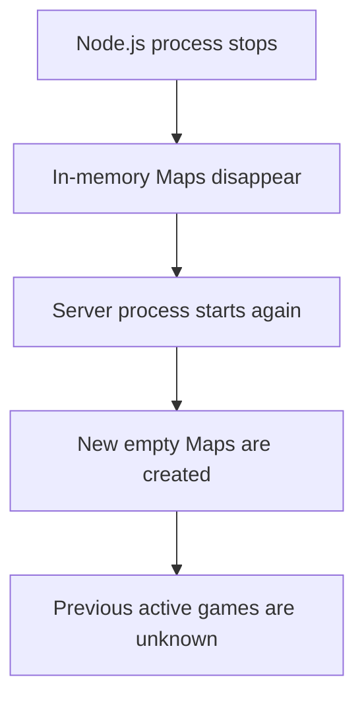
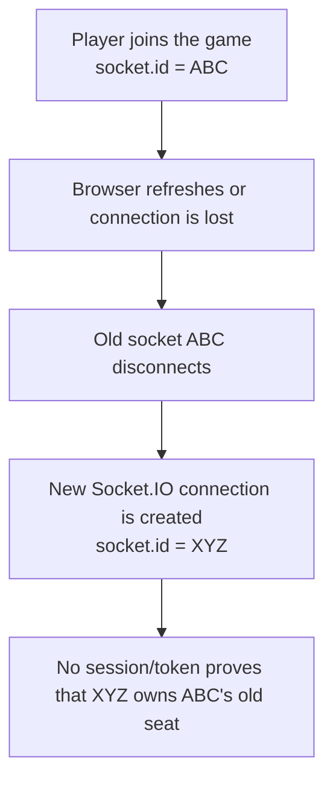
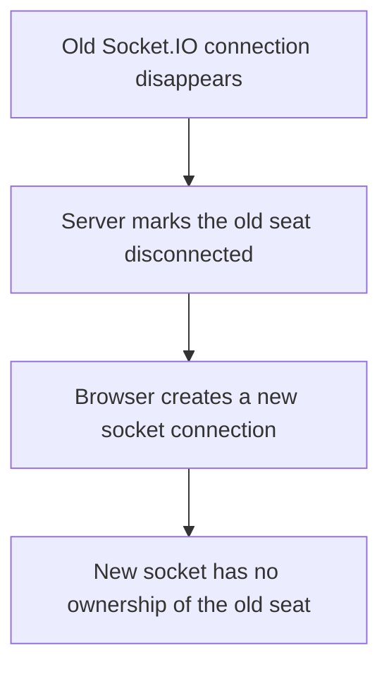
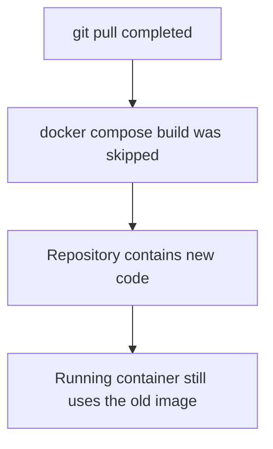
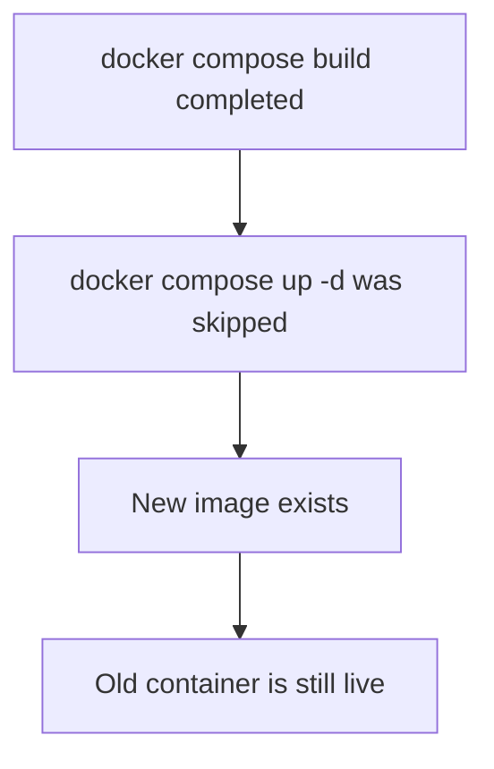
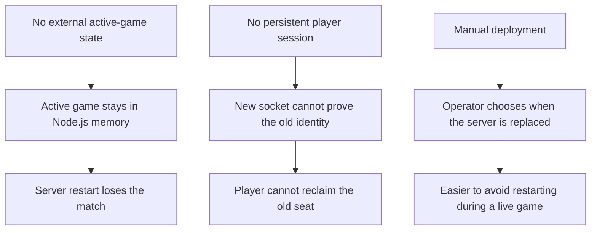

# Current Operational Limitations

Madiao is currently working as a complete multiplayer game, however, there are
still a few limitations around how the live version is operated.

These are not necessarily bugs.

Most of them are simply consequences of keeping the project reasonably small
and avoiding extra infrastructure which has not been needed yet.

The main limitations at the moment are:

| Limitation | Practical effect |
| --- | --- |
| Game state only exists in memory | Active matches disappear when the server process restarts |
| No player reconnection | A refreshed or reconnected browser cannot reclaim the old seat |
| No persistent database | Accounts, statistics and match history are not stored |
| Deployment is still manual | Production updates are applied deliberately through Git and Docker Compose |

These limitations also appear where they affect the rest of the system. The
underlying in-memory state is explained in
[Server Runtime State](server-runtime-state.md), disconnect behaviour is covered
in [Disconnect Handling](gameplay-code-paths.md#disconnect-handling), and the
effect of server replacement during deployment is covered in
[Normal Production Updates](../runbook/production-updates.md).

This page keeps them together in one place so it is easy to remember what the
current production version can and cannot recover from.


## In-Memory Game State

The most important limitation is that all active multiplayer state currently
lives inside the running Node.js process.

The server creates:

```js
const lobbies = new Map();
const gameStates = new Map();
const gameTimers = new Map();
const socketLobbies = new Map();
```

These Maps keep track of:

- lobbies;
- players;
- hands;
- pile state;
- pending plays;
- current turns;
- game phases;
- timers;
- rematch readiness;
- socket/lobby relationships.

Their individual responsibilities and the relationship between public and
private game state are explained in
[Server Runtime State](server-runtime-state.md).

This approach is perfectly reasonable for the current size of the project.

It keeps the implementation fairly easy to understand and means the game does
not need another service simply to keep a temporary match alive.

The downside is that JavaScript memory only exists while that Node process is
running.

If the server stops:



The new process has no knowledge of the previous games.


### What causes this reset?

Anything which stops or replaces the server process can clear active games.

Examples include:

- `docker compose restart server`;
- `docker compose stop server`;
- `docker compose up -d` recreating the server;
- a host/server restart;
- a Node.js process crash;
- a production rollback;
- a normal server deployment.

This is why server updates should preferably be done when nobody is playing.
The practical replacement step and its effect on active games are covered in
[Replacing the Running Containers](../runbook/production-updates.md#replacing-the-running-containers).


### What survives?

The project source naturally survives because it is stored in Git.

Docker images and configuration can also remain available.

What disappears is specifically the live runtime state of the game.

| Survives | Does not survive |
| --- | --- |
| Git repository and source code | Active match state |
| Docker configuration | Player hands held in memory |
| Existing built images, unless removed | Current phase and turn |
| Documentation and deployment files | Runtime timers and rematch state |


### Possible future improvement

If preserving active sessions across a restart ever becomes important, some part
of the live state would need to be stored outside the Node process.

That could eventually mean a database, Redis or another persistent state
service.

However, this would add considerably more complexity.

For the current project, losing active games during a planned server restart is
a known and acceptable limitation rather than something which needs to be solved
immediately.

!!! note "Known limitation rather than unfinished gameplay"
    The game itself does not require a database or Redis in order to function.
    External state would only become necessary if preserving matches across a
    server restart became an actual project requirement.


## No Player Reconnection

Madiao currently identifies connected players mainly through their Socket.IO:

```js
socket.id
```

This works well while the browser connection remains alive.

The problem is that a new connection receives a new socket ID.

For example:



The server has no account, session token or reconnection identifier which can
prove that the new connection belongs to the old seat.


### What happens after disconnect?

The complete disconnect path is covered in
[Disconnect Handling](gameplay-code-paths.md#disconnect-handling).

During an active game the old player seat remains inside
`gameState.players`, and the server marks:

```js
connected = false;
```

This allows the other players to still see that the seat existed and prevents
the game array from being rearranged unexpectedly.

At the same time, that player is removed from the lobby roster used for future
rematches because there is currently no supported way for them to reconnect to
the same seat.


### Refreshing is therefore not harmless

In many online games refreshing the page simply reconnects the player.

That is not currently true for Madiao.

Refreshing therefore follows this path:



!!! warning "Refreshing the browser is not a reconnect"
    The new connection cannot simply request the old hand because the server has
    no secure way of proving that it belongs to the same person.


### Why proper reconnection needs more than reusing a name

It might seem possible to reconnect somebody by matching the player name, but
names are not a reliable identity system.

Two people could use the same name, and a different browser could claim the name
of a disconnected player.

A proper reconnect system would need some form of trusted session identifier
which survives the Socket.IO connection itself.


### Possible future improvement

A future reconnection system could use something such as:

- a server-issued session ID;
- a secure reconnect token;
- an account/session system;
- a persistent player identity.

The browser could then reconnect and prove which old seat it belongs to.

Until something like that exists, losing the Socket.IO connection should be
treated as leaving the active session.


## No Persistent Database

Madiao currently does not use a database.

There is no deployed service storing things such as:

- user accounts;
- match history;
- statistics;
- active games;
- player profiles;
- persistent rankings.

The game itself only requires the `client` and `server` services. The production
Compose setup also includes a separate `docs` service for the MkDocs documentation.
There is currently no database container, migration process, database backup or
database connection string.


### Advantages of the current approach

For the current game this keeps deployment much simpler.

There is no need to think about schema migrations, database credentials,
backup schedules, database upgrades or persistent volumes as part of the current
deployment.

A new deployment can be rebuilt from the repository and Docker configuration
without also having to recover application data.


### Limitations of the current approach

Because nothing is persisted, Madiao also cannot currently remember anything
long-term.

Once a game finishes or the server restarts, there is no stored history which
can later answer questions such as:

- Who won the previous match?
- How many games has this player won?
- What was their previous drunkness?
- Which players have played together before?


### Database does not automatically mean active-game persistence

It is also worth separating two ideas.

Adding a database for accounts, statistics or match history would not
automatically solve the in-memory active-game problem.

The game would only survive a restart if the server deliberately stored enough
of the active match state and knew how to restore it afterwards.

So a future database could be used for several different purposes:

| Purpose | What it would store |
| --- | --- |
| Persistent user data | Accounts, profiles, preferences |
| Match history | Results, statistics, previous games |
| Active-game recovery | Enough live match state to reconstruct a game after restart |

Those should be designed separately rather than assuming one automatically
solves the others.


## Manual Deployment

The current production update process is still manual.

The full procedure is documented in
[Normal Production Updates](../runbook/production-updates.md). In practice, a
normal deployment is performed by connecting to the production server and
running commands such as:

```bash
cd ~/madiao

git status
git pull

docker compose config
docker compose build
docker compose up -d

docker ps --filter "name=madiao"

docker logs madiao-server --tail 50
docker logs madiao-client --tail 50
```

After that, the updated game is tested manually.


### What manual deployment means

At the moment there is no automated pipeline which watches the repository and
deploys every new commit automatically.

There is also no current CI/CD process which automatically:

- builds the production Docker images;
- connects to the production server;
- replaces the running containers;
- runs multiplayer health checks;
- rolls back a failed release.


### Manual does not necessarily mean bad

For a small project, manual deployment has some useful advantages.

It keeps the production process visible and understandable.

Before replacing the live server, there is an opportunity to check:

- Git status;
- Docker configuration;
- build output;
- whether anybody is currently playing.

This is particularly useful while the server cannot preserve active games across
a restart.

An automatic deployment triggered by every push could unexpectedly destroy a
live match unless additional safeguards were added.


### The disadvantage

The main weakness is that the deployment depends on remembering to perform the
steps correctly.

For example, two common manual-deployment mistakes are:



and:



This is one of the main reasons the deployment procedure is kept in
[Normal Production Updates](../runbook/production-updates.md), with the most
commonly used commands also collected in
[Quick Reference](../runbook/quick-reference.md).


### Possible future improvement

If deployments become frequent enough to justify automation, a future pipeline
could eventually handle things such as:

- running tests;
- building images;
- publishing/versioning images;
- deploying a known release;
- performing a health check.

However, it would also need to account for Madiao's current runtime limitation.

For example, an automated server deployment should ideally not restart an active
game without warning.

Until that becomes necessary, the manual process is simple enough and gives
better control over when the live Node server is replaced.


## How the Limitations Relate to Each Other

These limitations are not completely independent.

They form a fairly clear chain:



This is useful because it explains why fixing one limitation may affect several
other parts of the project.

For example, proper reconnection would probably need some form of session
identity.

Persistent active games would need external state storage.

Automated deployment would become safer if active sessions could survive a
server replacement.

They can therefore be improved gradually rather than treating them as four
completely unrelated missing features.


## Current Operational Expectations

Until those features are added, the production version should be operated with
the following expectations:

| Situation | Current expected behaviour |
| --- | --- |
| Server container restarts | Active games are lost |
| Production server reboots | Active games are lost |
| Player refreshes browser | Existing seat is not recovered |
| Player loses Socket.IO connection | Old seat becomes disconnected |
| Game finishes | No persistent match history is stored |
| New production version is ready | Deployment is performed manually |
| Client-only container replaced | Server-side active games can remain |
| Server container replaced | Active games reset |


## Chapter Summary

Madiao currently has four main operational limitations:

- in-memory game state;
- no player reconnection;
- no persistent database;
- manual deployment.

The server stores active games inside JavaScript Maps, which keeps the
multiplayer implementation straightforward but means every server restart starts
with empty runtime state.

Players are tied to their current Socket.IO connection. A refreshed or
reconnected browser receives a new `socket.id`, and there is currently no session
system which proves that new connection owns the old seat.

There is also no database storing accounts, game history, statistics or active
matches. This keeps the production environment small, but it means there is no
long-term application data to recover.

Lastly, deployments are still performed manually through Git and Docker Compose.

For the current size of the project these limitations are reasonable, and in
some cases they actually keep the system considerably easier to understand.

The important thing is simply to know they exist.

A server restart should not be expected to preserve a game, a browser refresh
should not be treated as a reconnect, and a production update should currently
be treated as a deliberate manual operation rather than something which happens
automatically after every commit.
