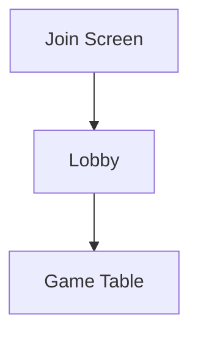
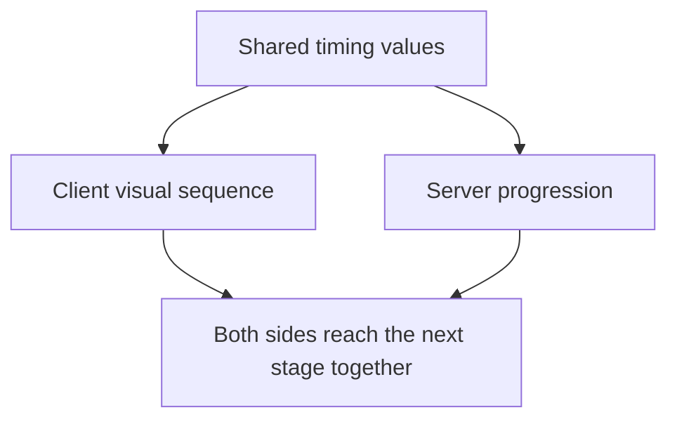

# Repository and File Structure

Now that the general client/server setup has been covered, the next useful thing
to go over is where everything actually lives inside the project.

This is one of those things that feels fairly obvious while working on the
project every day because most of the important folders become familiar very
quickly. After some time away from it however, remembering whether something
belongs to the client, server, deployment setup or documentation can become a
little less obvious than expected.

The purpose of this chapter is therefore not to list every single file inside
the repository. There are far too many CSS files, images and smaller assets for
that to be particularly useful.

Instead, the goal is to show the main structure of Madiao and explain what each
important area is responsible for. This should make it easier to know roughly
where to start looking before digging through individual files.


## Main Repository Layout

At the highest level, Madiao is split into a few fairly clear areas.

A simplified version of the repository looks like this:

```text title="Project root"
Madiao/
├── client/
├── server/
├── docs/
├── compose.yaml
├── Dockerfile
├── .dockerignore
├── mkdocs.yaml
├── CHANGELOG.md
└── .gitignore
```

There are other files around these, however, these are the main ones worth
remembering.

The easiest way of thinking about them is:

| Area | Purpose |
| --- | --- |
| `client/` | Everything needed for the browser version of the game |
| `server/` | Multiplayer game logic and Socket.IO server |
| `docs/` | Documentation website and runbook pages |
| `compose.yaml` | Runs the production client, server and documentation services together |
| `Dockerfile` | Builds the MkDocs documentation into its production nginx container |
| `mkdocs.yaml` | Controls the documentation website |
| `CHANGELOG.md` | Keeps track of notable changes between versions |
| `.gitignore` | Tells Git which local/generated files should not be tracked |

The first two folders contain the actual application.

The rest mostly exist around the application to make development, deployment and
maintenance easier.


## Client Files

The `client/` folder contains the React side of Madiao.

Its job is mainly to display the game, collect player input and react to
information coming back from the server.

A simplified view of the client looks roughly like this:

```text
client/
├── public/
│   └── assets/
│       ├── cards/
│       └── frames/
│
├── src/
│   ├── assets/
│   │   └── icons/
│   │
│   ├── components/
│   │   ├── lobby/
│   │   │   ├── JoinScreen.jsx
│   │   │   └── LobbyRoom.jsx
│   │   └── game/
│   │       ├── GameTable.jsx
│   │       ├── CardHand.jsx
│   │       ├── PlayerFrame.jsx
│   │       ├── PlayerPendingZone.jsx
│   │       ├── Pile.jsx
│   │       ├── DeclareModal.jsx
│   │       ├── ChallengeNotification.jsx
│   │       └── GameOverNotification.jsx
│   │
│   ├── shared/
│   │   └── constants.js
│   │
│   ├── App.js
│   └── socket.js
│
├── .env.development
├── Dockerfile
├── .dockerignore
├── package.json
└── package-lock.json
```

This is intentionally simplified. Most React components also have a matching
CSS file beside them and the asset folders contain a number of images and SVG
files which are not worth listing one by one here.


### `App.js`

`App.js` sits fairly high up on the client side and is responsible for moving
the player between the main parts of the application.

At a basic level the player moves through:



The smaller components underneath those screens do not need to know how the
whole application changes page. They mainly deal with their own part of the
interface and pass important information back upwards when necessary.

For example, `LobbyRoom.jsx` receives the initial game data from the
`game_started` Socket.IO event and passes it back up so the application can
replace the waiting room with the actual game screen.


### `socket.js`

The shared Socket.IO connection is kept in:

```text
client/src/socket.js
```

The file itself is intentionally very small:

```js title="client/src/socket.js"
import { io } from 'socket.io-client';

const socket = io(
    process.env.REACT_APP_SERVER_URL
);

export default socket;
```

Keeping this connection in one place means the different screens and components
can import the same socket instead of each creating their own connection to the
server.

This becomes particularly useful when troubleshooting Socket.IO problems. If
several completely different parts of the client suddenly stop receiving server
events, this file and the server address it is using are much more interesting
than any one individual component.


### Main screens

The three main client stages are represented by `JoinScreen`, `LobbyRoom`
and `GameTable`.

`JoinScreen` is the first screen the player sees. It is responsible for taking
their name, creating a lobby or allowing them to enter an existing lobby code.

`LobbyRoom` is the waiting area before a game starts. It keeps the visible
player list and host information up to date and allows the host to start the game
once enough players have joined.

`GameTable` is where most of the client-side game work takes place.

It receives the public game state from the server, keeps the local browser copy
of that state up to date and then passes smaller pieces of information to the
components responsible for actually displaying them.


### Game table components

`GameTable.jsx` would become unnecessarily difficult to work with if every card,
player frame and notification was written directly inside one file.

Because of that, the actual table is split into a number of smaller components.

Some of the most important ones are:

| File | Main purpose |
| --- | --- |
| `CardHand.jsx` | Displays the cards still held by the current player |
| `PlayerFrame.jsx` | Displays player name, card count, drunkness, turn status and disconnect state |
| `PlayerPendingZone.jsx` | Displays cards currently selected or waiting to be challenged |
| `Pile.jsx` | Displays the public pile count |
| `DeclareModal.jsx` | Lets the opening player choose the number being declared |
| `ChallengeNotification.jsx` | Handles challenge and timeout result screens |
| `GameOverNotification.jsx` | Displays the winner and rematch/main-menu controls |

Most of these components do not decide anything about the actual rules of the
game.

For example, `DeclareModal.jsx` can let the player choose a number from `1` to
`10`, however, whether that declaration is actually legal is still checked by
the server.

That distinction is worth keeping in mind whenever looking through the client.
A component may control what the player is allowed to click visually, but the
server still has the final say.


### Client assets

The client currently uses assets in two slightly different ways.

Some are referenced directly from the public assets folder:

```text
/assets/cards/
/assets/frames/
```

For example, cards can use paths such as:

```text
/assets/cards/card-template.svg
```

Other assets are imported directly into React components from inside `src/`.

An example of this is the sake-cup icon used by `PlayerFrame.jsx`:

```js title="client/src/components/game/PlayerFrame.jsx"
import { ReactComponent as SakeCups } from '../../assets/icons/sake-cups.svg';
```

There is nothing particularly unusual about this, but it is useful to remember
that an image not appearing on the table could therefore come from either the
public asset path or an imported React asset depending on which part of the UI
is being looked at.


### Client package files

The client has its own `package.json` and `package-lock.json`.

This is because the React application has its own dependencies, separate from
the Node server.

The main packages include React, React DOM, `react-scripts` and
`socket.io-client`.

`package-lock.json` is kept alongside `package.json` so that installs and Docker
builds use the same resolved dependency versions rather than potentially
choosing a slightly different version each time.


## Server Files

The `server/` folder contains the authoritative multiplayer side of Madiao.

A simplified version looks like this:

```text
server/
├── game/
│   ├── deck.js
│   ├── deck.test.js
│   ├── rules.js
│   ├── rules.test.js
│   ├── state.js
│   └── state.test.js
│
├── shared/
│   └── constants.js
│
├── index.js
├── Dockerfile
├── .dockerignore
├── package.json
└── package-lock.json
```

The server is smaller visually than the client, however, the files inside it
carry considerably more responsibility when it comes to deciding what is
actually allowed to happen during a game.


### `index.js`

The main server entry point is:

```text
server/index.js
```

This is by far the largest server file and acts as the central place where
Socket.IO, lobbies and the running game come together.

Among other things it:

- creates the Express and Socket.IO server
- creates and joins lobbies
- starts games
- stores active lobbies and games
- handles declarations
- handles challenges
- handles timeouts
- applies the wider drinking sequence
- manages rematches
- handles players leaving or disconnecting
- broadcasts updated state back to clients

Because so many things eventually pass through `index.js`, it is naturally one
of the first server files worth checking when a multiplayer action is being
rejected or when the game reaches the wrong phase.

At the same time, not every rule is written directly inside it. Some of the more
self-contained game logic has been split into the `game/` folder.


### `game/state.js`

`state.js` is responsible for building the starting state of a new game.

The main exported function is:

```js title="server/game/state.js"
startGame(lobbyPlayers)
```

This takes the players from the lobby, builds and shuffles the deck, works out
the hand size and creates the initial player/game state.

This is therefore a useful file to check if a problem exists from the very
beginning of a game, for example:

- the wrong starting hand;
- the wrong starting player;
- incorrect starting drunkness;
- the wrong initial game phase.

Once the game is running, most changes to that state are handled by
`server/index.js`.


### `game/deck.js`

`deck.js` contains the logic around creating and checking cards.

The current deck is built as:

| Card type | Count |
| --- | ---: |
| Numbered cards | 40 |
| Wild cards | 16 |
| **Total** | **56** |

The file also contains the shuffle logic and the function used by the server to
check whether a challenged play was honest:

```js title="server/game/deck.js"
isPlayHonest(cards, declaredNumber)
```

If something is wrong with deck composition, card values, wild cards or the
honest/bluff check itself, `deck.js` is therefore the more sensible place to
look rather than searching through the UI.


### `game/rules.js`

`rules.js` currently contains the drinking/elimination probability logic.

The main function is:

```js title="server/game/rules.js"
applyDrink(player)
```

It increases the player's drunkness and checks the elimination chance for the
new level.

This file decides whether the drink itself eliminates the player.

The wider sequence around that drink, such as when the notification appears,
when the animation starts and what happens to the game afterwards, is handled
elsewhere by the server.

### Game tests

The `game/` folder also contains the automated tests for the more
self-contained parts of the server logic:

```text
deck.test.js
rules.test.js
state.test.js
```

### Server package files

Just like the client, the server has its own `package.json` and
`package-lock.json`.

Its dependencies are much smaller because the server does not need React or any
of the browser-related packages. The main runtime packages are `express` and
`socket.io`.

`nodemon` is kept as a development dependency.


## Shared Timing Files

Timing is slightly unusual in Madiao because many sequences have both a server
side and a client side.

A challenge is a good example.

The client needs to know how long to display the challenge animation, while the
server needs to know how long it should wait before continuing into the drinking
sequence.



If those values disagree, the visual interface and the actual game can drift
apart even though both sides are technically working.

Because of that, timing values are grouped in `constants.js` modules under the
shared parts of the project.

The important values include things such as:

```js title="server/shared/constants.js"
turnDurationMs
autoSubmitLeadMs
drinkAnimationMs
challengeOverlayMs
timeoutOverlayMs
cooldownMs
```

The server imports its timing values through:

```js title="server/index.js"
require('./shared/constants')
```

and the game table/notification components use their shared timing module rather
than putting separate unexplained numbers throughout the React code.

The main point to remember here is not really the folder name itself.

It is that these timing values form a contract between the two sides of the
application. If a challenge or timeout sequence suddenly becomes visually out
of sync with the server, the timing constants are one of the first places worth
checking.

The individual values and the sequences they control are covered in more detail
in [Timer System](timer-system.md#shared-timing-values).


## Deployment and Documentation Files

Not everything important belongs directly to the client or server.

A few root-level files control how the project is deployed and how the
documentation itself is built.


### `compose.yaml`

The root Compose file is:

```text
compose.yaml
```

Its job is to describe the production Docker services together.

At the moment these are:

```text
server
client
docs
```

It tells Docker where each service should be built from, what its container
should be called, which ports should be mapped and any environment settings
which need to be passed in.

This is why deployment commands are normally run from the project root rather
than from inside `client/` or `server/`.


### Dockerfiles

The client and server folders both have their own `Dockerfile` and `.dockerignore`.

The documentation is slightly different because its build needs access to both
`mkdocs.yaml` and the complete `docs/` directory. Its `Dockerfile` therefore lives
at the project root.

The documentation build uses MkDocs to generate the static site and then copies
the generated files into an nginx image which becomes the `madiao-docs`
container.

The `.dockerignore` file is slightly different from `.gitignore`.

`.gitignore` decides what Git should track.

`.dockerignore` decides what Docker should leave out when it sends a folder into
the image build context.

For example, there is no reason to send the existing local `node_modules`
folder into a Docker build when the Dockerfile is going to install the packages
itself anyway.


### `CHANGELOG.md`

`CHANGELOG.md` is not used by the application while it is running.

Its job is simply to keep a readable record of notable changes made between
versions.

This is useful when trying to work out when a feature appeared or when a certain
behaviour changed without having to inspect every individual Git commit.


### Documentation files

The documentation website is kept alongside the application.

Most of the site documents Madiao and is split between technical documentation
and the production runbook. A smaller, separate section is also included for the
PoE Tracker project, covering its normal operation and troubleshooting procedures.

```text
mkdocs.yaml

docs/
├── index.md
│
├── stylesheets/
│   └── extra.css
│
├── technical/
│   ├── runtime-overview.md
│   ├── repository-structure.md
│   ├── environment-configuration.md
│   ├── application-code-map.md
│   ├── server-runtime-state.md
│   ├── game-phase-and-turn-flow.md
│   ├── timer-system.md
│   ├── socketio-events.md
│   ├── gameplay-code-paths.md
│   ├── security.md
│   └── limitations.md
│
├── runbook/
│   ├── server-setup-and-administration.md
│   ├── first-time-setup.md
│   ├── production-updates.md
│   ├── docker-operations.md
│   ├── health-checks.md
│   ├── troubleshooting.md
│   ├── build-problems.md
│   ├── git-problems.md
│   ├── rollback.md
│   ├── https-and-reverse-proxy.md
│   ├── changes-after-https.md
│   └── quick-reference.md
│
└── poe-tracker/
    ├── index.md
    ├── operations.md
    └── troubleshooting.md

```

`mkdocs.yaml` controls the Material for MkDocs site itself, including the site
name, theme and navigation order.

The Markdown files under `technical/` explain how the application is structured
and how its main systems work. The files under `runbook/` focus more on
deployment, maintenance, troubleshooting and recovery.

The files under `poe-tracker/` belong to the separate PoE Tracker project. That
section is intentionally smaller and focuses on operating and troubleshooting
its Docker-based data pipeline.

The `stylesheets/` directory contains the custom CSS used to adjust the
appearance of the documentation site.

Keeping both parts inside the same `docs/` directory means the documentation
remains part of the same Git repository as the application. Code and the
documentation which describes it can therefore be updated in the same commit
rather than relying on a separate external wiki which could slowly fall behind
the project.


## Files Kept Outside Git

There are also a number of files and folders which may exist on a development
machine but do not belong in the repository.

The root `.gitignore` handles most of these.

Typical examples include:

- `node_modules/`
- `build/`
- `dist/`
- `logs/`
- `coverage/`
- `.vscode/`
- `.idea/`

It also excludes private or local environment files and common key/certificate
formats.

For the documentation setup we have additionally created `.venv-docs/`.

This is only the local Python environment used to run MkDocs.

It can contain a large number of installed Python files, but none of those need
to be committed because the environment can simply be recreated on another
machine.

!!! note "Ignored does not mean unimportant"
    Some ignored files, particularly environment files, may still be essential
    for a particular development machine or deployment. `.gitignore` only means
    they should not be stored in the shared repository.

The important distinction here is therefore between **needed locally** and
**appropriate to commit**.

The same idea applies to generated files.

A React production build can always be created again from the source code, so
there is usually little benefit in keeping that generated build output in Git.


## Chapter Summary

The repository is mainly split into a React client and a Node.js server, with
deployment and documentation files sitting around them at the project root.

The easiest high-level map to remember is:

| Area | What to remember |
| --- | --- |
| `client/` | What the player sees and interacts with |
| `server/` | What the game actually decides |
| `docs/` | How the project is explained and maintained |
| `compose.yaml` | How the production client, server and documentation services are managed together |
| `mkdocs.yaml` | How the documentation website is organised |

Inside the client, `GameTable.jsx` acts as the main game screen and delegates
visual jobs to smaller components such as the hand, player frames, pending
cards, challenge screen and game-over screen.

Inside the server, `index.js` ties the multiplayer game together, while
`state.js`, `deck.js` and `rules.js` keep some of the more self-contained game
logic separate.

Lastly, files such as `.gitignore`, `.dockerignore`, package lockfiles and the
documentation environment may not directly change how a card is played, but
they still have an important role in keeping the project predictable and easier
to maintain.
