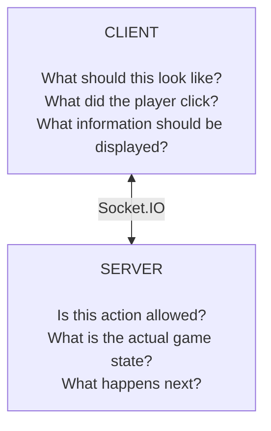
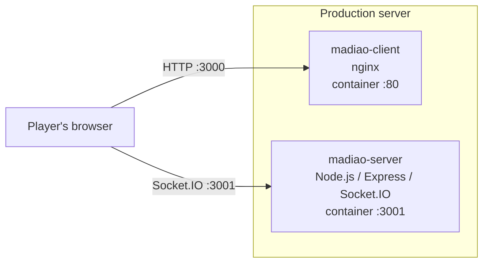
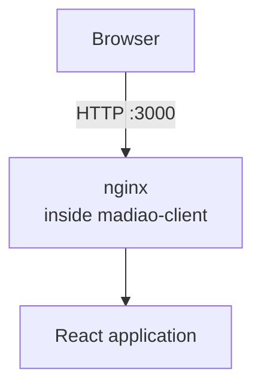
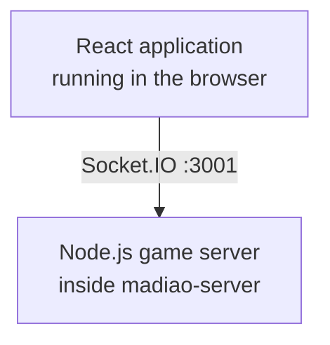
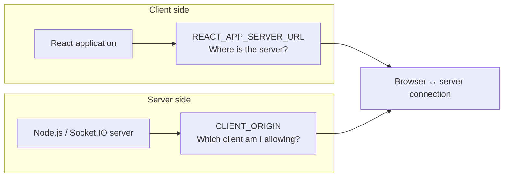
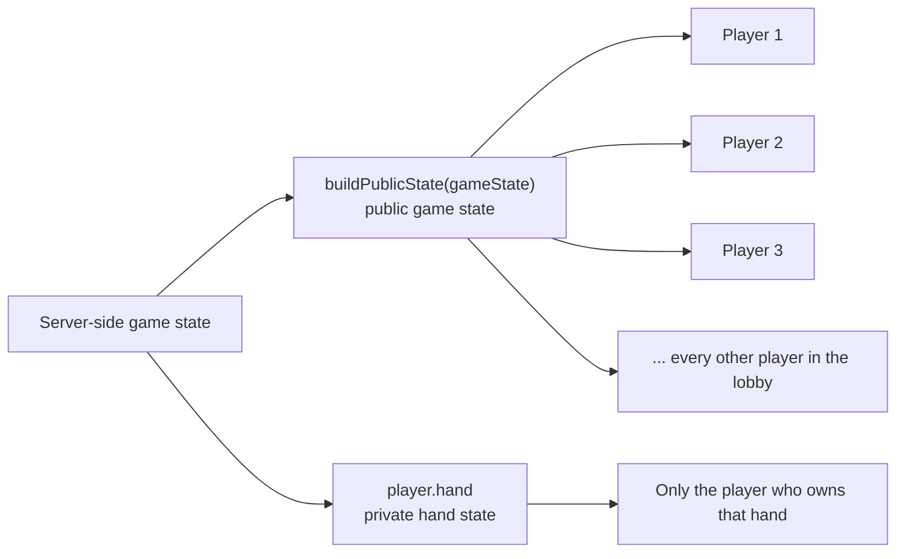
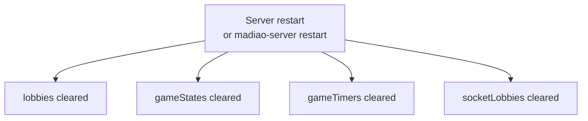

# Project and Runtime Overview

Before getting into things such as deployment, Docker commands or individual
problems that can happen during a game, it is probably worth first going over
how Madiao is actually put together.

The project itself is not particularly complicated from an architectural point
of view, however, there are a few different parts that depend on each other and
it can become quite easy to mix up which side is responsible for what after
spending some time away from the project.

The easiest way of looking at it is that Madiao is made out of two main
applications: the client and the server.

The client is responsible for what the player sees and interacts with, while the
server is responsible for deciding what is actually happening in the game.

That distinction is important because, even though both sides keep some form of
state, the server is the side that should ultimately be trusted when it comes to
the game itself.


## Client and Server Structure

Madiao is split into two main folders:

```text
client/
server/
```

The client contains the React application and everything related to displaying
the game in the browser.

This includes things such as:

- the join screen
- lobby screen
- game table
- player frames
- cards
- declaration menu
- challenge notifications
- drinking animations
- game-over screen

The server on the other hand is responsible for running the actual multiplayer
game.

Some of its main responsibilities include:

- creating and managing lobbies
- keeping track of connected players
- creating games
- storing player hands
- deciding whose turn it is
- validating declarations
- resolving challenges
- handling turn timeouts
- applying drinks
- eliminating players
- deciding when somebody has won
- managing the timers used throughout the game

This split is useful because the browser does not need to be trusted with
important game decisions.

For example, the client can decide how a selected card should look or where a
notification should appear on the screen. It should not however be able to
decide whether a player really owns a card they are trying to play or whether a
challenge was successful.

Those decisions belong to the server.

A simplified way of looking at the responsibility split is:



This does not mean the client has no state of its own.

For example, `GameTable.jsx` keeps information such as:

```js title="client/src/components/GameTable/GameTable.jsx"
const [players, setPlayers] = useState(initialGameData.players);
const [myHand, setMyHand] = useState(initialGameData.hand);
const [pile, setPile] = useState(initialGameData.pile);
const [phase, setPhase] = useState(initialGameData.phase);
```

These values are basically the client's current copy of information received
from the server.

At the same time, the component also has state which exists purely for the user
interface:

```js title="client/src/components/GameTable/GameTable.jsx"
const [selectedCards, setSelectedCards] = useState([]);
const [showDeclare, setShowDeclare] = useState(false);
const [playingCards, setPlayingCards] = useState(false);
```

The difference is fairly important.

Whether a declaration window is open is a local UI concern. Whether it is
actually the player's turn is not.

This becomes useful to remember when troubleshooting because not every visual
problem means the server state is wrong, and similarly, a perfectly normal
looking interface does not necessarily mean the server agrees with what the
client is showing.


## How the Production Version Runs

During normal development the two sides can be started separately. The React
client normally runs through its development server, while the backend is run
as the Node.js server directly.

The production version works slightly differently.

Rather than manually starting both applications every time, the project packages
them into two separate Docker containers.

These are:

```text
madiao-client
madiao-server
```

The client container does not run the React development server used while
working on the project.

Instead, React is built into normal static production files and those files are
served using nginx.

The server container runs the Node.js game server normally.

At a basic level, the production setup looks like this:



One small thing worth pointing out here is that the Socket.IO traffic does not
need to travel through the client container.

The client container is basically there to give the browser the React
application. Once that application has loaded, the JavaScript running inside the
player's browser creates its own connection directly to the game server.

This distinction is quite useful because it explains how the website itself can
still load even when the actual multiplayer server is unavailable.

In that situation nginx may be doing its job perfectly fine and serving the
React files, while the separate Node server is either stopped or unreachable.


## Docker Containers

Docker is mainly being used here to make the production environment more
predictable and easier to manage.

We could technically install Node, npm, nginx and all of the required
dependencies directly onto the production server and then start everything
manually.

There is nothing necessarily wrong with doing that for a small project, however,
it would mean that more of the setup depends on whatever happens to be installed
on that particular machine.

Instead, the project defines the environments needed by the client and server
inside their Dockerfiles.

The two containers currently have separate jobs:

| Container | Main purpose | Host Port | Container Port |
| --- | --- | --- | --- |
| `madiao-client` | Serves the built React application through nginx | `3000` | `80` |
| `madiao-server` | Runs the Node.js, Express and Socket.IO server | `3001` | `3001` |

Docker Compose then gives us one place from which both containers can be built
and managed together.

That is why commands such as:

```bash
docker compose build
```

and:

```bash
docker compose up -d
```

can deal with the entire application instead of us having to manually remember
how both containers were originally created.

The practical Docker commands and container-management tasks are covered in
[Docker Operations](../runbook/docker-operations.md), so there is not much point
going too far into them here.

For now, the important thing to remember is simply that the production version
of Madiao consists of two separate containers.

If one stops working, the other one does not automatically stop with it.


## Ports and Network Flow

The production version currently exposes two ports:

```text
3000 - client
3001 - server
```

On the production server, port `3000` is forwarded to port `80` inside the
client container, which is where nginx serves the React application.

Port `3001` is where the Node server listens for HTTP and Socket.IO connections.

The server itself defines its port here:

```js title="server/index.js"
const PORT = 3001;

server.listen(PORT, () => {
    console.log(`Server running on http://localhost:${PORT}`);
});
```

There is also a basic route on the Node server which exists mostly as a quick
way of checking whether the server is alive:

```js title="server/index.js"
app.get('/', (req, res) => {
    res.send(`
        ...
        <p>Madiao server is alive again</p>
        ...
    `);
});
```

This is intentionally very simple.

The actual game does not use this page, however, it gives us a useful health
check later because opening or requesting the server address can tell us whether
Express is actually responding.

The normal network flow can therefore be thought of as two separate steps.

Firstly, the browser needs to get the website:



Secondly, once React is running in the browser, it needs to connect to the game
server:



This is one of those fairly simple things that becomes very useful later when
something goes wrong.

If nothing loads at all, the client side is probably worth checking first.

If the website loads but multiplayer functionality does not work, the server or
the connection between the browser and server becomes much more interesting.


## Client and Server Communication

Most of the communication between both sides of the game is handled through
Socket.IO.

The client creates one shared socket connection in:

```text
client/src/socket.js
```

The important part of that file is:

```js title="client/src/socket.js"
const socket = io(
    process.env.REACT_APP_SERVER_URL
);
```

`REACT_APP_SERVER_URL` tells the browser where the game server can be found.

This is deliberately not permanently written into the JavaScript code because
the address used during local development is different from the address used by
the production version.

On the server side, Socket.IO is attached to the same HTTP server used by
Express:

```js title="server/index.js"
const server = http.createServer(app);

const io = new Server(server, {
    cors: {
        origin: CLIENT_ORIGIN,
        methods: ['GET', 'POST']
    }
});
```

`CLIENT_ORIGIN` tells the server which client address should be allowed to
connect.

The two values are explained properly in
[Environment and Configuration](environment-configuration.md#build-time-vs-runtime-configuration), including the
separate sections for
[`REACT_APP_SERVER_URL`](environment-configuration.md#react_app_server_url) and
[`CLIENT_ORIGIN`](environment-configuration.md#client_origin). They are worth
introducing here because together they form a fairly important part of the
connection:



Once connected, both sides communicate using Socket.IO events.

For example, the server can broadcast:

```js title="server/index.js"
io.to(lobbyCode).emit(
    'game_state_updated',
    buildPublicState(gameState)
);
```

and the client listens for that same event:

```js title="client/src/components/GameTable/GameTable.jsx"
socket.on('game_state_updated', handleGameStateUpdated);
```

The purpose of `game_state_updated` is basically to make sure everybody receives
the latest public version of the game after something important changes.

The server does not however send every piece of information to every player.

This is obviously important in a card game because another player's cards are
supposed to remain private.

The server therefore builds a safe public version of the game state using:

```js title="server/index.js"
buildPublicState(gameState)
```

This includes information everybody is allowed to know, such as:

- player names
- card counts
- drunkness
- who is eliminated
- pile size
- pending declaration
- current player
- current phase
- winner

Actual private card values are deliberately left out.

When a game begins, each player receives the shared public state together with
only their own hand:

```js title="server/index.js"
gameState.players.forEach(player => {
    io.to(player.id).emit('game_started', {
        ...buildPublicState(gameState),
        hand: player.hand
    });
});
```

This is a fairly important part of how the game has been designed.

The browser does not secretly receive everybody's cards and then hide them with
CSS. The cards genuinely remain on the server and only the player who owns a
hand receives those values.

Apart from being the correct way of handling hidden information, this also helps
when troubleshooting strange state issues because there is a clear distinction
between:




## Important Runtime Limitations

There are a few limitations in the current version of Madiao which are worth
knowing about from the beginning.

They are collected properly in
[Current Operational Limitations](limitations.md#current-operational-expectations), however, they affect enough
parts of the project that it makes sense to introduce them here first.


### Game state is stored in memory

The server currently creates a number of JavaScript Maps to store everything
that is happening while the application is running:

```js title="server/index.js"
const lobbies = new Map();
const gameStates = new Map();
const gameTimers = new Map();
const socketLobbies = new Map();
```

These are useful because they provide a fairly simple and quick way of keeping
track of a small multiplayer game.

For the current project there has not really been a need for something more
complicated.

The downside is that all of this information only exists while the Node process
is running.

If the server container is restarted, these Maps are created again from scratch.

In practice, that means:



Any game being played at that moment is therefore lost.

This is probably the most important thing to keep in mind before restarting or
replacing the production server.


### Player reconnection is not implemented

Players are identified mainly through their Socket.IO connection and its
`socket.id`.

There is currently no account or session system which allows a new socket to
prove that it belongs to somebody who was previously sitting in a game.

As a result, losing the connection or refreshing the page does not simply put
the player back into the same game.

The server can mark an existing player as disconnected so everybody else knows
that they have left, however, reconnecting to that exact game session is not
currently supported.

This is worth remembering when testing disconnect problems because refreshing
the browser is not the same thing as temporarily hiding and reopening the game
screen.


### There is currently no persistent database

Madiao does not currently store accounts, game history or active matches inside
a database.

From one side, this makes the project significantly simpler to run because there
is no database service that needs to be deployed, migrated or backed up.

On the other hand, it also means that nothing about an active game survives a
server restart.

For the current scope of the game this is a reasonable limitation, however, it
would obviously have to be reconsidered if features such as user accounts,
persistent statistics, match history or proper reconnection were added later.


## Chapter Summary

At this point the most important thing to remember is that Madiao is built
around a fairly simple client/server structure.

The React client is responsible mainly for interaction and presentation, while
the Node.js server remains responsible for the actual game.

In production, both sides run inside their own Docker containers:

```text
madiao-client :3000
madiao-server :3001
```

The browser first receives the React application from nginx and then the React
application creates a separate Socket.IO connection to the Node server.

The server remains the main source of truth for game state, while clients receive
a safe public copy of that state and their own private cards separately.

Lastly, all live game information currently exists in server memory. This keeps
the implementation fairly straightforward, however, it also means restarting
the server clears active games and players cannot currently reconnect to a
session after losing their Socket.IO connection.
