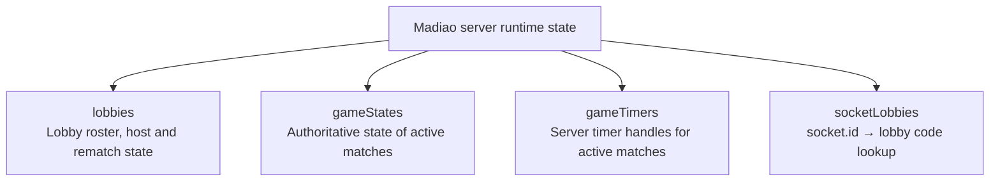
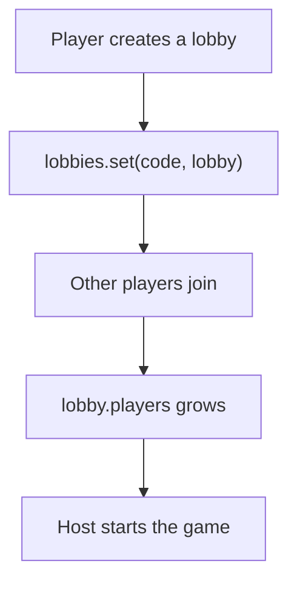
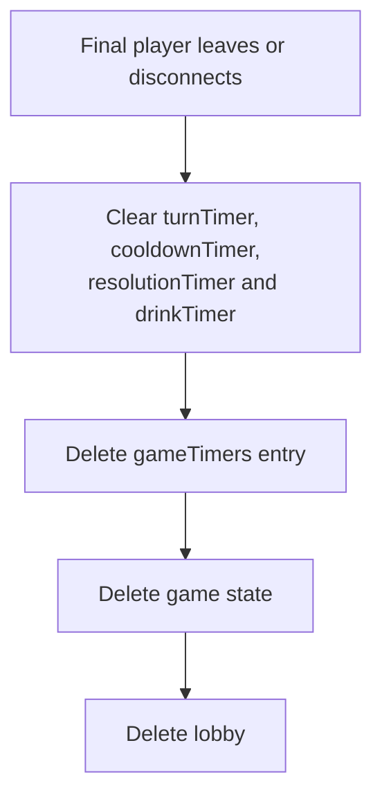
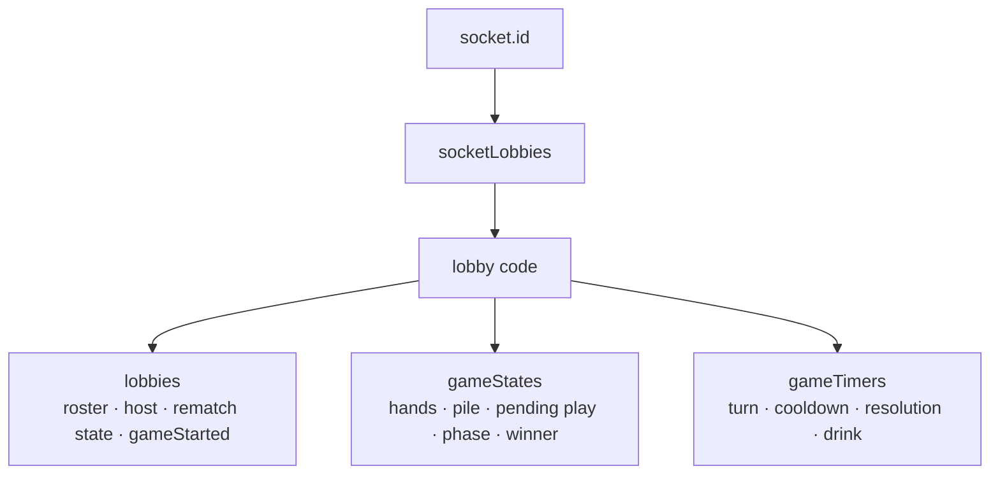
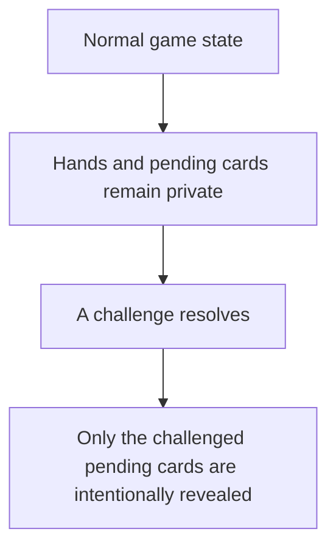
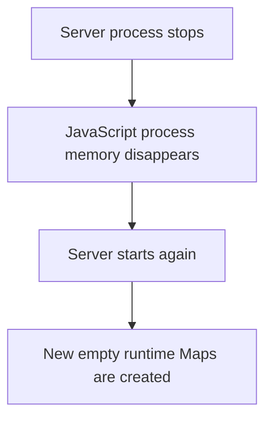
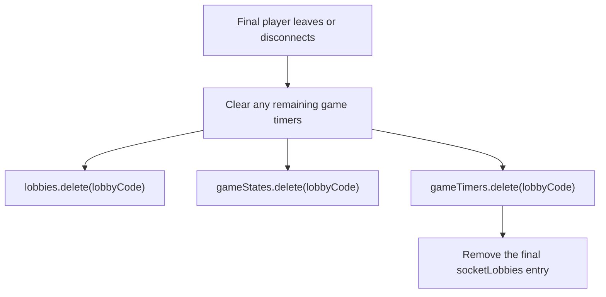

# Server Runtime State

[Application Code Map](application-code-map.md#which-file-controls-what) shows where the main pieces of
code live. The next useful step is understanding what the server is actually
keeping in memory while Madiao is running.

This is particularly important because the server does not use a database for
active games. Instead, the running Node.js process keeps the current lobbies,
games, timers and socket lookups inside JavaScript Maps.

At the top of `server/index.js` the main runtime collections are:

```js title="server/index.js"
const lobbies = new Map();
const gameStates = new Map();
const gameTimers = new Map();
const socketLobbies = new Map();
```

These four Maps are related, but they are not storing the same thing.

A simplified way of looking at them is:



Most of the multiplayer server can be understood as reading from and updating
these four collections.


## Why the State Is Split Up

It would technically be possible to put everything about a lobby and game into
one very large object.

For example, the players, cards, timers, lobby code, host and rematch state
could all live together.

However, not all of that information has the same purpose.

The lobby needs to know things such as:

- who is waiting;
- who the host is;
- whether the game has started;
- who is ready for a rematch.

The game needs considerably more information, including player hands, pile
cards, the pending play, current player, drunkness, phase and winner.

Timers are different again.

A JavaScript timer handle is only useful to the server process. It should never
be included in a game-state update sent to a browser.

Lastly, looking up a player's lobby should be quick. There is no reason to scan
every lobby every time a socket performs an action if the relationship can be
stored directly.

This is why the state is split into four Maps rather than one large collection.


## `lobbies`

The `lobbies` Map stores the waiting-room and rematch side of the application.

Its key is the six-character lobby code.

Conceptually, the lobby code is the key:

| Lobby code | Stored value |
| --- | --- |
| `"ABC123"` | Lobby object |
| `"XYZ789"` | Another lobby object |

When a lobby is first created, its object looks roughly like:

```js title="server/index.js"
{
    code,
    hostId: socket.id,

    players: [
        {
            id: socket.id,
            name: playerName
        }
    ],

    gameStarted: false,
    rematchReady: new Set()
}
```

The main fields therefore are:

| Field | Purpose |
| --- | --- |
| `code` | The six-character code players use to join |
| `hostId` | Socket ID of the current host |
| `players` | Players currently belonging to the lobby roster |
| `gameStarted` | Prevents new players joining after the match begins |
| `rematchReady` | Set of players currently ready for another game |

The lobby version of a player is deliberately small:

```js
{
    id,
    name
}
```

It does not contain a hand, drunkness or elimination state.

Those only become relevant after a game has been created.


### Lobby state before the game

Before the match starts, `lobbies` is effectively the main state for that group
of players.

For example:



The server broadcasts changes to the waiting room through `broadcastLobby()`.

At this point there may be no entry in `gameStates` for that lobby yet because
the actual game has not been created.


### Lobby state after the game starts

When the host starts the game:

```js
lobby.gameStarted = true;
beginGame(io, lobbyCode, lobby);
```

The lobby object remains in memory.

It is not replaced by the game state.

This is important because the lobby still has jobs after gameplay begins,
especially:

- keeping the surviving connected roster;
- tracking rematch readiness;
- remembering the host;
- supporting leave and rematch behaviour.

The lobby and game state therefore continue to exist beside each other.


## `gameStates`

The `gameStates` Map stores the authoritative live game for each lobby.

Like `lobbies`, it is keyed by lobby code. For example, `"ABC123"` can point
to the authoritative `gameState` for that lobby.

A fresh game is created by:

```js title="server/index.js"
const gameState = startGame(lobby.players);

gameStates.set(lobbyCode, gameState);
```

The initial game state currently contains:

```js
{
    players,

    pile: {
        cards: []
    },

    pendingPlay: null,
    currentPlayerIndex,
    turnStartedAt: Date.now(),
    phase: 'waiting',
    winner: null,
    roundDeclaredNumber: null
}
```

Other values such as `gameOverInfo` are added later when they become relevant.


### Game players are different from lobby players

Once `startGame()` runs, the simple lobby players are turned into full game
players.

A game player looks roughly like:

```js
{
    id,
    name,
    hand,
    drunkness: 0,
    isOut: false,
    connected: true
}
```

This is a very important distinction.

The lobby player list answers:

> Who currently belongs to the lobby/rematch roster?

The game player list answers:

> What is the state of each seat in this particular running match?

Those two lists usually begin with the same players, but they do not always stay
identical.


## Why Lobby Players and Game Players Can Differ

The most obvious example is a disconnect during an active game.

When somebody disconnects, the server finds their game player and does:

```js
player.connected = false;
```

The player stays inside `gameState.players` so the current match still knows
that their seat existed.

However, because proper reconnection is not implemented, the same socket is
removed from `lobby.players` so that disconnected player does not count towards
a future rematch.

The result can therefore be:

| Current match: `gameState.players` | Future lobby/rematch: `lobby.players` |
| --- | --- |
| Alice | Alice |
| Bob | Bob |
| Charlie (`connected: false`) | — |

That difference is intentional.

It allows the current game state to keep its original player layout while the
future lobby/rematch roster only contains players who are still actually
connected.

This is one of the more useful things to remember when debugging disconnect or
rematch behaviour.

Looking only at `lobby.players` does not necessarily tell us who still exists in
the current `gameState.players` array.


## Important Parts of `gameState`

The full state changes constantly during a match, but a few sections are worth
understanding separately.


### `players`

This contains every game player's private and public information.

For example, a full game player contains values such as `id`, `name`, `hand`,
`drunkness`, `isOut` and `connected`.

The complete version stays on the server.

Clients only receive a filtered public version of other players.


### `pile`

The server stores the actual cards in:

```js
gameState.pile.cards
```

For example, `gameState.pile.cards` contains the real card objects currently
in the pile.

The browsers do not receive this actual array.

They only receive the number of cards currently in the pile.


### `pendingPlay`

A declaration which is still available to challenge is stored separately from
the confirmed pile.

The current server-side structure is:

```js title="server/index.js"
gameState.pendingPlay = {
    playerId: socket.id,
    cards: declaredCards,
    declaredNumber,
    declaredCount: declaredCards.length,
    isEmptyingHand: currentPlayer.hand.length === 0
};
```

This contains information with different visibility:

| Information | Visibility |
| --- | --- |
| `playerId` | Public |
| `declaredNumber` | Public |
| `declaredCount` | Public |
| `cards` | Private until challenged |
| `isEmptyingHand` | Server-only gameplay detail |

Keeping the pending cards separate from the pile is important because they can
still be challenged.

Once the next valid declaration goes through without a challenge, the previous
pending cards become safe and are moved into the pile.


### `roundDeclaredNumber`

The first declaration of a round sets `roundDeclaredNumber`.

Later declarations in the same round must continue using that number.

When a challenge ends the round, the server resets it to:

```js
null
```


### `currentPlayerIndex`

This points into `gameState.players` and identifies whose turn it currently
is.

The server moves this index rather than copying a separate current-player object.


### `turnStartedAt`

This is a server timestamp representing when the current turn began.

The browser uses that timestamp together with the shared turn duration to
calculate the visible countdown.

This means the client does not independently decide when a turn started.


### `phase`

`phase` is effectively the server's current game-mode lock.

Examples include:

- `waiting`
- `cooldown`
- `challenge_open`
- `resolving_challenge`
- `resolving_timeout`
- `game_over`

Handlers check the current phase before accepting many actions.

This prevents a declaration or challenge being accepted while the game is
already resolving something else.


### `winner` and `gameOverInfo`

`winner` remains `null` until somebody has won.

When the game ends, the server can also attach `gameOverInfo` describing how the
result happened.

For example, the result may have happened through an empty-hand win or
elimination.

The client then uses that information when building the game-over screen.


## `gameTimers`

The `gameTimers` Map stores the timers belonging to each active game.

When `beginGame()` creates a game, it also creates:

```js title="server/index.js"
gameTimers.set(lobbyCode, {
    turnTimer: null,
    cooldownTimer: null,
    resolutionTimer: null,
    drinkTimer: null
});
```

These timer handles are deliberately outside `gameState`.

That is useful for two reasons.

Firstly, timers are not meaningful game information for the browser.

Secondly, the server needs to be able to cancel and replace them independently.

The current timer slots are:

| Timer | Main job |
| --- | --- |
| `turnTimer` | Fires if the current player does not act in time |
| `cooldownTimer` | Moves a completed declaration into the challenge-open stage |
| `resolutionTimer` | Waits for challenge/timeout result UI before drinking begins |
| `drinkTimer` | Waits for the drinking animation before applying the result |

The individual timer values and the sequences they control are covered in more
detail in [Timer System](timer-system.md#shared-timing-values).

For this chapter the important thing is simply that the timer handles are kept
separate from the game data.


## Why Timers Must Be Cleaned Up

A timer can still fire even if the user who originally caused it has left.

Because of that, when the final player disappears and the lobby is being deleted,
the server first clears any remaining timers.

Conceptually:



Without this cleanup, a delayed callback could run later against a game which no
longer exists.

That kind of bug can be especially confusing because it may happen several
seconds after the lobby itself was already removed.


## `socketLobbies`

The final Map is:

```js title="server/index.js"
const socketLobbies = new Map();
```

This is a reverse lookup from a socket ID to a lobby code.

For example:

| Socket ID | Lobby code |
| --- | --- |
| `"socket-123"` | `"ABC123"` |
| `"socket-456"` | `"ABC123"` |
| `"socket-789"` | `"XYZ789"` |

This Map does not contain game state.

Its purpose is simply speed and convenience.

Whenever a socket sends something such as `startGame`, `declareCards`,
`challenge`, `toggleRematchReady` or `leaveGame`, the server first needs to know
which lobby that socket belongs to.

Rather than scanning every lobby, the server can simply do:

```js
const lobbyCode = socketLobbies.get(socket.id);
```

and immediately use that code with the other Maps:

```js
const lobby = lobbies.get(lobbyCode);
const gameState = gameStates.get(lobbyCode);
const timers = gameTimers.get(lobbyCode);
```

This pattern appears throughout `server/index.js`.


## The Lobby Code Connects Most Runtime State

Three of the four Maps are connected through the same lobby code.

A useful way of looking at the relationship is:



Once this relationship is understood, a large amount of the server code becomes
much easier to follow.


## Public and Private Game State

The full `gameState` cannot safely be sent to every browser.

It contains private card information such as every player's hand, the actual
pending cards and the actual pile cards.

Instead, the server uses:

```js
buildPublicState(gameState)
```

to build a safe version.


### Public player information

Each player becomes:

```js
{
    id,
    name,
    cardCount,
    drunkness,
    isOut,
    connected
}
```

The browser therefore knows how many cards an opponent has without knowing what
those cards are.


### Public pile information

The full server state has:

```js
pile: {
    cards: [...]
}
```

The public version only contains:

```js
pile: {
    count: gameState.pile.cards.length
}
```


### Public pending play

The full server pending play contains the actual cards.

The public version only sends:

```js
{
    playerId,
    declaredNumber,
    declaredCount
}
```

The real cards therefore stay hidden until the play is challenged.


## Private Hand Updates

When a game begins, every player receives the same public state but only their
own hand:

```js
io.to(player.id).emit('game_started', {
    ...buildPublicState(gameState),
    hand: player.hand
});
```

Later, if a player's hand changes, the server can send:

```js
io.to(player.id).emit('hand_updated', {
    hand: player.hand
});
```

This is used, for example, when a player successfully declares cards or when
a challenge loser takes the pile.

The hand update goes to that player rather than the whole lobby.


## When Private Cards Are Intentionally Revealed

There is one important exception to the hidden pending-card rule.

When somebody challenges a play, the server must reveal the cards so everybody
can see whether the declaration was honest.

The challenge result therefore includes:

```js
actualCards: pendingCards
```

At this point the cards are no longer meant to be secret.

This gives the server a fairly clear information model:



The browser never needs to secretly hold everybody's hand in advance.


## What Happens When the Server Restarts

All four Maps exist only inside the running Node process.

They are not written to disk and they are not stored in a database.

Therefore:



That means the server loses:

- all lobbies;
- all active games;
- all hands;
- all pile state;
- all current phases;
- all active timers;
- all rematch readiness;
- all socket/lobby lookups.

The browser may still be open, but the new server process has no knowledge of
that previous game.

!!! warning "A server restart resets every active game"
    None of the four runtime Maps are persistent. Restarting or replacing the
    Node.js server therefore removes every active lobby and game, even though
    the deployed application files themselves remain available.


### Docker does not change this

This remains true whether the server stops because of:

- `docker compose restart server`;
- `docker compose up -d` recreating the server;
- a host restart;
- a Node process crash;
- a manual container stop/start.

Docker can preserve images and container configuration.

It does not preserve the JavaScript heap of a process which stopped.


## What Happens When the Final Player Leaves

There is a smaller form of cleanup which can happen without restarting the whole
server.

If the final player leaves or disconnects from a lobby, there is no longer any
reason to keep that game's runtime state.

The server clears its timers and removes the relevant Map entries.

Conceptually:



The final player's `socketLobbies` entry is also removed as part of leaving or
disconnecting.

This means individual abandoned games can disappear cleanly while the Node
server continues running for everybody else.


## Useful State Troubleshooting Questions

When a state-related bug appears, a few questions help narrow it down quickly.

| Question | Most relevant state |
| --- | --- |
| Does the lobby still exist? | `lobbies` |
| Is the correct host stored? | `lobbies` |
| Is a disconnected player still counted for a rematch? | `lobbies.players` |
| Does their old seat still exist in the current match? | `gameState.players` |
| Is the player's hand correct on the server? | `gameState.players[].hand` |
| Are the wrong cards in the pile? | `gameState.pile.cards` |
| Is the current declaration wrong? | `gameState.pendingPlay` |
| Is the wrong player getting the turn? | `currentPlayerIndex` |
| Is the server accepting actions at the wrong time? | `phase` |
| Did an old timeout fire unexpectedly? | `gameTimers` |
| Can the server find the sender's lobby? | `socketLobbies` |
| Are opponents receiving private cards? | `buildPublicState()` / private emits |

The purpose is not necessarily to inspect the Maps directly in production every
time.

It is to understand which piece of runtime state the relevant code should be
reading or changing.


## Chapter Summary

Madiao keeps its active multiplayer state in four main JavaScript Maps:
`lobbies`, `gameStates`, `gameTimers` and `socketLobbies`.

`lobbies` stores the lobby/rematch roster and host information.

`gameStates` stores the authoritative running match, including hands, pile,
pending play, current player, phase and winner.

`gameTimers` keeps the server's timeout handles separately from normal game
state.

`socketLobbies` gives the server a fast way to turn a `socket.id` into the lobby
code used by the other Maps.

The lobby player list and the game player list are related but not identical.
An active-game disconnect is the clearest example: the player stays in
`gameState.players` with `connected: false`, while being removed from the lobby
roster used for future rematches.

The full game state always remains on the server.

Clients receive a filtered public version through `buildPublicState()` and their
own private hand separately. Actual pending cards are only revealed to everybody
when a challenge resolves.

Lastly, none of this state is persistent.

Restarting the Node server creates all four Maps again from scratch, which is why
a server restart or replacement clears every active Madiao game.
