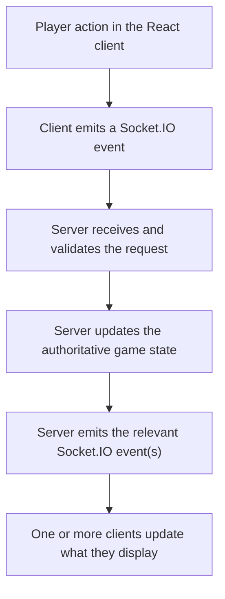
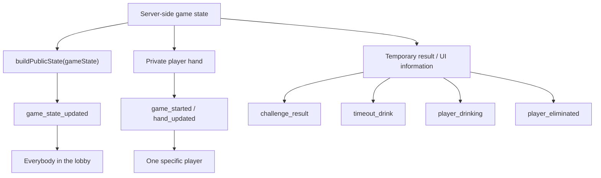
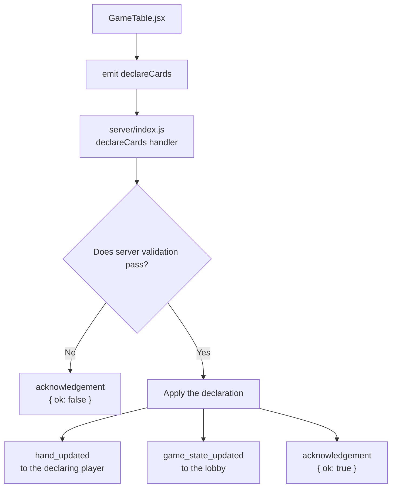
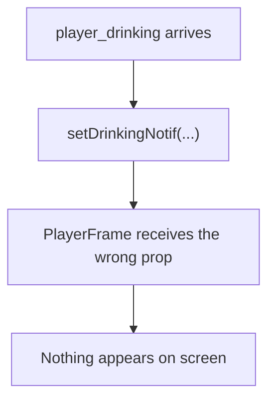

# Socket.IO Events

Most of the communication between the Madiao client and server happens through
Socket.IO events.

This is what allows the game to behave like one shared table rather than a set
of separate browser pages which only update after being refreshed.

A player can press a button in one browser, the client sends an event to the
server, the server decides whether that action is allowed, updates the real game
state and then sends the relevant result back to everybody who needs it.

At a very simple level:



The important thing to remember is that Socket.IO is only the communication
layer. The data being moved through that layer is explained in
[Server Runtime State](server-runtime-state.md), while the main gameplay paths
which cause those events are covered in
[Main Gameplay Code Paths](gameplay-code-paths.md).

Receiving an event does not automatically make the request valid.

The server still checks things such as:

- which lobby the socket belongs to;
- whose turn it is;
- what phase the game is in;
- whether the player owns the cards;
- whether the player has been eliminated.

The event is basically the message which asks the server to do something.


## Client to Server Events

The current client sends a relatively small number of main events.

They can broadly be grouped into lobby actions, gameplay actions and
end-of-game actions.

The main client-to-server events are:

| Event | Sent from | Main purpose |
| --- | --- | --- |
| `createLobby` | `JoinScreen.jsx` | Create a new lobby |
| `joinLobby` | `JoinScreen.jsx` | Join an existing lobby |
| `startGame` | `LobbyRoom.jsx` | Ask the server to begin the game |
| `declareCards` | `GameTable.jsx` | Commit selected cards and a declaration |
| `challenge` | `GameTable.jsx` | Challenge the current pending play |
| `toggleRematchReady` | `GameTable.jsx` | Toggle ready/unready after game over |
| `leaveGame` | `GameTable.jsx` | Leave a finished game and return to the menu |

There is also Socket.IO's built-in disconnect handling on the server, which is
triggered automatically when a browser connection disappears rather than being
sent manually by the React code.


### `createLobby`

The create screen sends:

```js title="client/src/components/JoinScreen/JoinScreen.jsx"
socket.emit('createLobby', {
    name: cleanName
});
```

The payload is deliberately small.

The client only needs to tell the server the player's name.

The server creates everything else, including:

- the lobby code;
- the host ID;
- the player list;
- the rematch-ready set;
- the `gameStarted` flag.

The player who creates the lobby automatically becomes its host.


### `joinLobby`

Joining sends:

```js title="client/src/components/JoinScreen/JoinScreen.jsx"
socket.emit('joinLobby', {
    name: cleanName,
    code: cleanCode
});
```

The server does not simply trust those values.

It cleans them again and checks things such as:

- whether the lobby exists;
- whether the game has already started;
- whether the lobby is full;
- whether this socket is already in a lobby.

This is a useful example of the general client/server rule.

Client validation makes the interface nicer.

Server validation decides whether the action actually happens.


### `startGame`

The host sends:

```js title="client/src/components/LobbyRoom/LobbyRoom.jsx"
socket.emit('startGame');
```

There is no payload because the server already knows which player sent it from:

```js
socket.id
```

and can use:

```js
socketLobbies.get(socket.id)
```

to find their lobby.

The server then verifies that:

- the lobby exists;
- the sender is the host;
- there are at least two players;
- the game has not already started.

If everything is valid, `beginGame()` creates the actual game.


### `declareCards`

This is the main gameplay request.

The client sends:

```js
{
    cardIds,
    declaredNumber
}
```

using:

```js title="client/src/components/GameTable/GameTable.jsx"
socket.timeout(3000).emit(
    'declareCards',
    {
        cardIds,
        declaredNumber
    },
    acknowledgement
);
```

`cardIds` contains the IDs of the selected cards.

`declaredNumber` is the number the player claims those cards represent.

The server then performs the full declaration validation before changing the
hand or pending play.

This event uses an acknowledgement callback, which is slightly different from
most of the other game events and is covered in more detail below.


### `challenge`

The client sends:

```js title="client/src/components/GameTable/GameTable.jsx"
socket.emit('challenge');
```

There is very little information needed from the browser.

The server already knows:

- who sent the challenge;
- which lobby they are in;
- which play is currently pending;
- who made that pending play;
- what the real cards were.

Keeping that information server-side is important.

The browser is only saying:

> I want to challenge the current play.

It is not telling the server who should lose or whether the play was honest.


### `toggleRematchReady`

After game over:

```js title="client/src/components/GameTable/GameTable.jsx"
socket.emit('toggleRematchReady');
```

toggles the player's socket ID inside:

```js
lobby.rematchReady
```

Pressing once makes the player ready.

Pressing again removes their ready state.

The server then tells everybody in the lobby which players are currently ready.


### `leaveGame`

The Main Menu button uses:

```js
socket
    .timeout(3000)
    .emit(
        'leaveGame',
        acknowledgement
    );
```

This event is only intended for leaving a finished game.

The client waits for the server to confirm the leave before changing back to
the main menu.

This matters because moving the React screen first could leave the browser
looking as though it left while the server still believes that socket belongs
to the lobby.


## Server to Client Events

The server sends more event types than the client because one player action can
produce several different updates.

For example, resolving a challenge can cause several different events,
including `game_state_updated`, `challenge_result`, `hand_updated`,
`player_drinking` and `player_eliminated`. A later state change can then cause
another `game_state_updated`.

depending on the result.

The main server-to-client events are:

| Event | Main receiver | Purpose |
| --- | --- | --- |
| `lobby_created` | `JoinScreen.jsx` | Confirms a newly created lobby |
| `lobby_joined` | `JoinScreen.jsx` | Confirms joining an existing lobby |
| `lobby_error` | `JoinScreen.jsx` | Explains why create/join was rejected |
| `lobby_updated` | `LobbyRoom.jsx` | Updates waiting-room players and host |
| `game_started` | `LobbyRoom.jsx` / `GameTable.jsx` | Sends a fresh game and private hand |
| `game_error` | `LobbyRoom.jsx` / `GameTable.jsx` | Reports rejected game actions |
| `game_state_updated` | `GameTable.jsx` | Main public game-state synchronisation |
| `hand_updated` | `GameTable.jsx` | Replaces one player's private hand |
| `challenge_result` | `GameTable.jsx` | Reveals and displays a resolved challenge |
| `timeout_drink` | `GameTable.jsx` | Starts the timeout-result notification |
| `player_drinking` | `GameTable.jsx` | Starts the player's drinking animation |
| `player_eliminated` | `GameTable.jsx` | Announces an elimination |
| `rematch_status` | `GameTable.jsx` | Updates rematch readiness |


### `lobby_created`

After creating a lobby, the server replies directly to that socket with:

```js
{
    code,
    players,
    hostId
}
```

`JoinScreen.jsx` then adds its own local information such as `isHost: true`
and `playerName`.

before passing the result up to the rest of the React application.


### `lobby_joined`

Joining successfully produces a very similar payload:

```js
{
    code,
    players,
    hostId
}
```

The difference is mainly what the client already knows about the action.

`JoinScreen` marks the player with `isHost: false`.

because this player joined somebody else's lobby rather than creating it.


### `lobby_error`

Lobby creation/join problems are returned as:

```js
{
    message
}
```

For example:

- `Lobby not found`
- `The game has already started`
- `This lobby is full`
- `You are already in a lobby`

The Join screen displays the message and allows the player to try again.


### `lobby_updated`

Whenever the waiting-room roster or host changes, the server broadcasts:

```js
{
    players,
    hostId
}
```

to the whole Socket.IO room for that lobby.

`LobbyRoom.jsx` then replaces its local `players` and `hostId` values.

with the latest values.

This is why somebody joining from another browser can appear immediately in the
existing host's waiting room.


### `game_started`

This is one of the more important events because it contains both public and
private information.

The server sends it individually to every player:

```js title="server/index.js"
io.to(player.id).emit('game_started', {
    ...buildPublicState(gameState),
    hand: player.hand
});
```

Every player receives the same public game state.

The `hand` part is different for each socket.

This event is used when the first game begins and when a rematch begins.

During the first game, `LobbyRoom.jsx` receives it and the application moves to
`GameTable`.

During a rematch, `GameTable` is already mounted, so it listens for the same
event and replaces the finished game with the fresh state.


### `game_state_updated`

This is the main general-purpose game synchronisation event.

The server sends:

```js title="server/index.js"
io.to(lobbyCode).emit(
    'game_state_updated',
    buildPublicState(gameState)
);
```

The payload contains the public state, including:

- players;
- pile count;
- pending play metadata;
- round declared number;
- current player index;
- turn start timestamp;
- phase;
- winner;
- game-over information.

It does not contain anybody's private hand.

`GameTable.jsx` uses this event to keep its browser copy of the game aligned with
the server.


### `hand_updated`

Private hand changes are sent directly to the affected player's socket:

```js title="server/index.js"
io.to(player.id).emit('hand_updated', {
    hand: player.hand
});
```

Typical causes include the player successfully playing cards or losing a
challenge and taking the pile.

This is deliberately separate from `game_state_updated`.

Broadcasting the full hand through the public game-state event would expose it
to everybody in the lobby.


### `challenge_result`

When a challenge resolves, the server sends information such as:

```js
{
    challengerId,
    challengerName,
    accusedId,
    accusedName,
    honest,
    actualCards,
    declaredNumber,
    loserId,
    loserName
}
```

This is the point where the previously hidden cards are intentionally revealed.

`GameTable` uses the payload to display the challenge result overlay.


### `timeout_drink`

When the server turn timer expires it emits:

```js
{
    playerId,
    playerName
}
```

The client uses this to show the **did not play in time** notification.

part of the timeout sequence.

The drink animation itself starts later through a separate event.


### `player_drinking`

After the challenge or timeout result overlay has finished, the server emits:

```js
{
    playerId,
    playerName,
    drunkness
}
```

The client removes the previous result screen and shows the drinking state around
the correct player's frame.

Separating this from `timeout_drink` or `challenge_result` is useful because the
result and the drinking animation happen at different points in time.


### `player_eliminated`

If a drink knocks somebody out, the server broadcasts:

```js
{
    playerId,
    playerName,
    reason
}
```

The current elimination reason is normally `drunkness`.

The client briefly displays the elimination notification.

The actual permanent eliminated state still comes through the normal public game
state as:

```js
isOut: true
```


### `rematch_status`

When rematch readiness changes, the server sends:

```js
{
    readyPlayerIds,
    readyCount,
    playerCount
}
```

The client mainly uses `readyPlayerIds` and `playerCount`.

to show who is ready and how many players are still being waited on.

If everybody remaining in the lobby becomes ready, the server starts a fresh game
and sends another `game_started` event.


## How Game State Reaches the Client

One of the easiest mistakes when first looking at Socket.IO code is to assume
that every server change requires its own event.

Madiao does not work like that.

Most persistent game information comes through one main event:
`game_state_updated`.

Temporary or private information uses smaller specialised events around it.

A useful way of looking at the communication is:



This split avoids turning every small state field into a separate Socket.IO
event.


### Public state is authoritative

When `GameTable` receives `game_state_updated`, it replaces values such as:

```js
players
pile
pendingPlay
currentPlayerIndex
phase
winner
gameOverInfo
roundDeclaredNumber
turnStartedAt
```

with the server's latest version.

That means a client which locally guessed something different should eventually
be corrected by the next server state update.


### Temporary UI events do not replace game state

Something such as:

```text
challenge_result
```

exists mainly to tell the interface:

> Show this result now.

It does not replace the normal server state.

Likewise:

```text
player_drinking
```

starts a visual sequence, while later `game_state_updated` confirms the state
the game ended up in after the drink.


### Socket.IO rooms

When a player creates or joins a lobby, the server places their socket inside a
Socket.IO room:

```js title="server/index.js"
socket.join(code);
```

That allows the server to send something only to one game:

```js
io.to(lobbyCode).emit(...);
```

rather than broadcasting every event to every browser connected to the Madiao
server.

So:

```text
io.to(lobbyCode)
```

means:

> Send this to everybody currently inside this lobby's Socket.IO room.

while:

```text
io.to(player.id)
```

targets one player's socket specifically.


## Acknowledgements and Missing or Mismatched Events

Most Madiao events are one-way messages.

For example:

```js
socket.emit('challenge');
```

does not wait for an acknowledgement callback.

The server either resolves the challenge or sends a `game_error` if it is not
allowed.

Two current actions are slightly different: `declareCards` and `leaveGame`.

because the client needs to know directly whether the requested action completed.


### Declaration acknowledgement

The declaration client uses:

```js
socket.timeout(3000).emit(...)
```

with a callback.

If the server accepts the declaration it responds with:

```js
{
    ok: true
}
```

If validation fails it can respond with:

```js
{
    ok: false,
    message: '...'
}
```

This is particularly useful because the client temporarily moves the selected
cards into its local pending animation before the server has finished checking
them.

If the server rejects the declaration, the client can restore those selected
cards rather than leaving the interface stuck.


### Socket.IO acknowledgement timeout

The:

```js
.timeout(3000)
```

part is also important.

It means the browser does not wait forever if the server connection disappears
while the request is being sent.

After three seconds the callback receives a timeout error and the client can show
a useful failure message.


### Event names must match exactly

Socket.IO event names are strings.

That means:

```text
game_state_updated
```

and:

```text
game-state-updated
```

are completely different events.

So are:

```text
lobby_error
```

and:

```text
lobby error
```

There is no automatic warning on the receiving side saying:

> You were probably trying to listen for this other spelling.

The sender can emit successfully while the intended component never hears it.

This is one of the first things worth checking when:

```text
the server log proves something happened
but the browser does absolutely nothing
```


### Payload shape must also agree

The event name can be correct while the data is wrong.

For example, `GameTable` expects a normal public state to contain an array at:

```js
data.players
```

If the server accidentally sends:

```js
{
    playerList: [...]
}
```

instead, the event itself arrived correctly but the client still cannot use it.

The event contract therefore depends on **both** the correct event name and
the correct payload shape.


### Listener cleanup

React components register listeners when they mount.

For example:

```js
socket.on(
    'game_state_updated',
    handleGameStateUpdated
);
```

When that component leaves the screen, it should remove the same listener:

```js title="client/src/components/GameTable/GameTable.jsx"
socket.off(
    'game_state_updated',
    handleGameStateUpdated
);
```

This prevents an old component from continuing to react to events after a new
screen has replaced it.

It also helps avoid the same event being processed multiple times because
duplicate listeners were accidentally left behind.


## Event Troubleshooting

When a Socket.IO feature stops working, it is usually easier to trace one event
from beginning to end than to immediately read the whole server.

For production symptoms rather than event-level tracing, the most useful related
sections are
[Client Loads but Cannot Connect to Server](../runbook/troubleshooting.md#client-loads-but-cannot-connect-to-server),
[Declaration Is Rejected](../runbook/troubleshooting.md#declaration-is-rejected),
[Challenge Does Not Work](../runbook/troubleshooting.md#challenge-does-not-work)
and
[Client and Server Show Different State](../runbook/troubleshooting.md#client-and-server-show-different-state).

For example, a declaration can be followed as:



That gives several places where the failure could occur.


### Step 1 — Did the client emit the event?

Check the function attached to the button/action.

For example:

| Component | Typical outgoing events |
| --- | --- |
| `JoinScreen.jsx` | `createLobby`, `joinLobby` |
| `LobbyRoom.jsx` | `startGame` |
| `GameTable.jsx` | `declareCards`, `challenge` |

If the click handler never runs, Socket.IO is not the first problem.


### Step 2 — Did the server receive it?

Find the matching handler in:

```text
server/index.js
```

For example:

```js
socket.on('declareCards', ...)
```

Temporary logging can confirm whether execution reaches the handler.

If the browser emitted but the handler never runs, check:

- the socket connection;
- event spelling;
- the server address;
- CORS/origin configuration;
- whether the browser is still connected.


### Step 3 — Did the server reject it?

A received event can still be invalid.

For declarations especially, check the server validation reason.

Useful values include:

- `phase`
- `currentPlayerIndex`
- `socket.id`
- `cardIds`
- `declaredNumber`
- `roundDeclaredNumber`

A server rejection is different from a missing Socket.IO event.


### Step 4 — What did the server emit afterwards?

If the server accepted the action, follow the next event.

For example:

| Server-side situation | Event(s) worth following |
| --- | --- |
| Challenge resolves | `challenge_result` |
| Turn times out | `timeout_drink` → `player_drinking` |
| Persistent game state changes | `game_state_updated` |

Check whether the correct target is used:

| Target | Meaning |
| --- | --- |
| `socket.emit(...)` | Send to the current socket |
| `io.to(player.id).emit(...)` | Send to one specific player/socket |
| `io.to(lobbyCode).emit(...)` | Send to everybody in that lobby room |


### Step 5 — Does the client have a listener?

Find:

```js
socket.on('event_name', ...)
```

in the relevant component.

The main listener locations are:

| Component | Main incoming events |
| --- | --- |
| `JoinScreen.jsx` | `lobby_created`, `lobby_joined`, `lobby_error` |
| `LobbyRoom.jsx` | `lobby_updated`, `game_started`, `game_error` |
| `GameTable.jsx` | `game_state_updated`, `hand_updated`, `challenge_result`, `timeout_drink`, `player_drinking`, `player_eliminated`, `game_error`, `rematch_status`, `game_started` |


### Step 6 — Did the handler update the expected state?

If the listener definitely runs but nothing visible changes, Socket.IO may have
already done its job.

The remaining problem may simply be React state or rendering.

For example:



At that point changing the server event will not solve the real problem.


### Quick event map

A useful short reference is:

| Feature | Client sends | Server normally answers/updates with |
| --- | --- | --- |
| Create lobby | `createLobby` | `lobby_created` or `lobby_error` |
| Join lobby | `joinLobby` | `lobby_joined`, `lobby_updated` or `lobby_error` |
| Start game | `startGame` | `game_started` or `game_error` |
| Declare cards | `declareCards` | acknowledgement, `hand_updated`, `game_state_updated` |
| Challenge | `challenge` | `game_state_updated`, `hand_updated`, `challenge_result`, later drinking/state events |
| Turn timeout | No client event | `game_state_updated`, `timeout_drink`, `player_drinking` |
| Elimination | No client event | `player_eliminated`, `game_state_updated` |
| Rematch ready | `toggleRematchReady` | `rematch_status`, eventually `game_started` |
| Main menu | `leaveGame` | acknowledgement, remaining players may receive `rematch_status` |
| Disconnect | Automatic | remaining clients receive updated lobby/game state where applicable |


## Chapter Summary

Madiao uses Socket.IO as the communication layer between the React client and
the authoritative Node.js server.

The main client requests are `createLobby`, `joinLobby`, `startGame`,
`declareCards`, `challenge`, `toggleRematchReady` and `leaveGame`.

The server decides whether those requests are valid and sends information back
through events such as `lobby_created`, `lobby_joined`, `lobby_updated`,
`game_started`, `game_state_updated`, `hand_updated`, `challenge_result`,
`timeout_drink`, `player_drinking`, `player_eliminated`, `rematch_status` and
`game_error`.

The most important persistent update is `game_state_updated`.

which carries the public version of the authoritative server state.

Private hands are deliberately sent separately to individual sockets.

Temporary visual sequences such as challenge results and drinking use their own
events because they happen at specific points between normal state updates.

`declareCards` and `leaveGame` also use Socket.IO acknowledgements so the client
can tell whether the server actually handled the request rather than assuming
that sending an event automatically meant success.

Lastly, event names and payload shapes form a contract between both sides.

If either one stops matching, the sender may appear to work perfectly while the
receiver silently waits for an event or field which never arrives. Tracing one
event from the client action, through the server handler and back into the React
listener is usually the quickest way of finding where that communication chain
broke.
