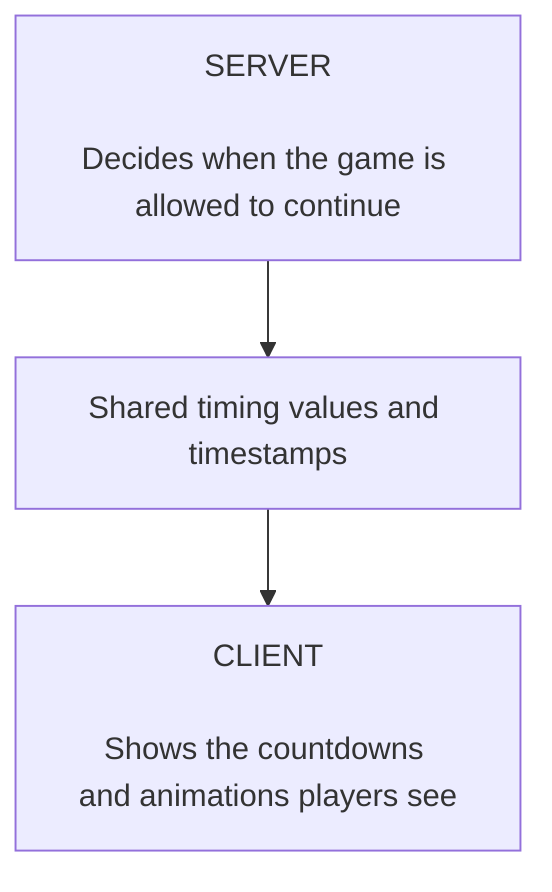
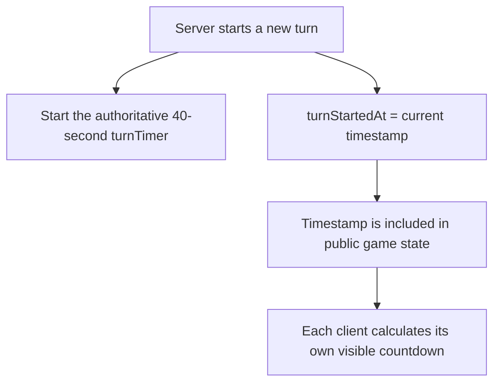
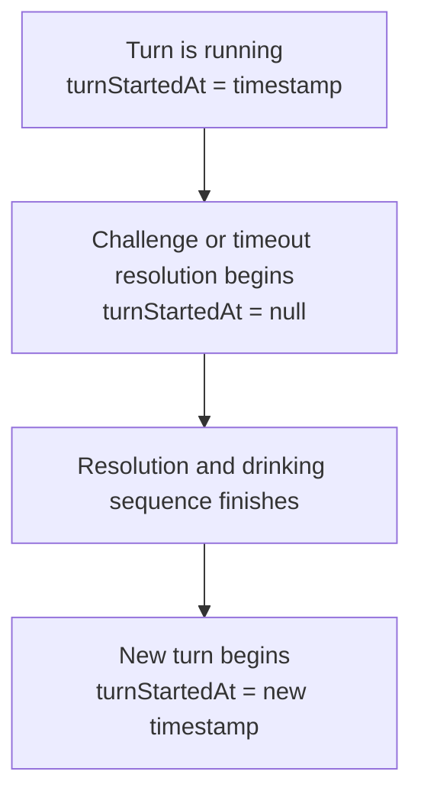
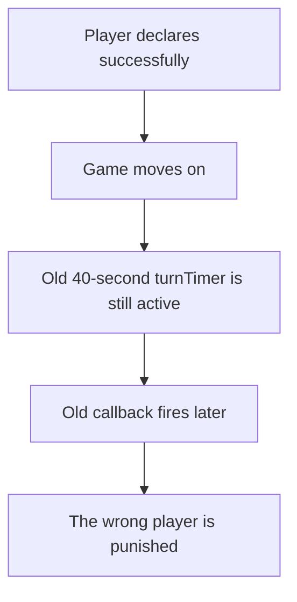
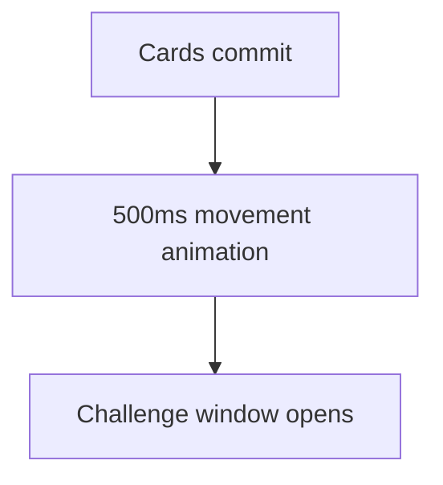
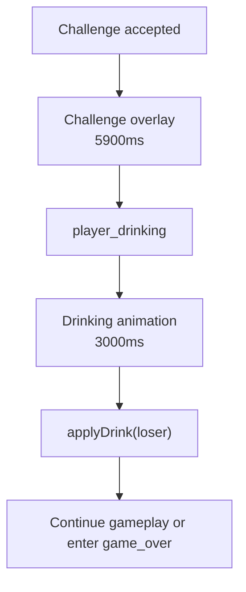
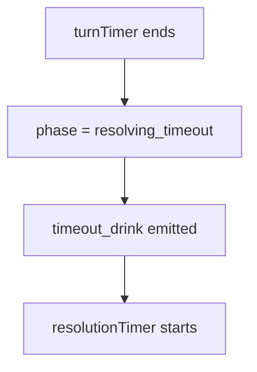
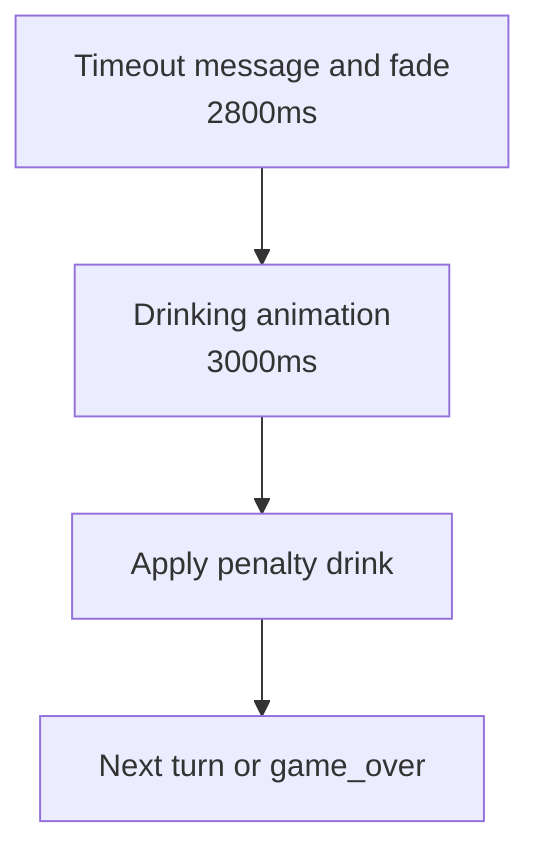
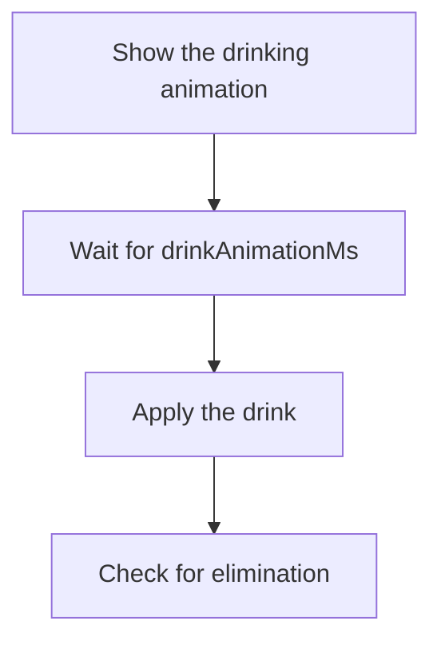
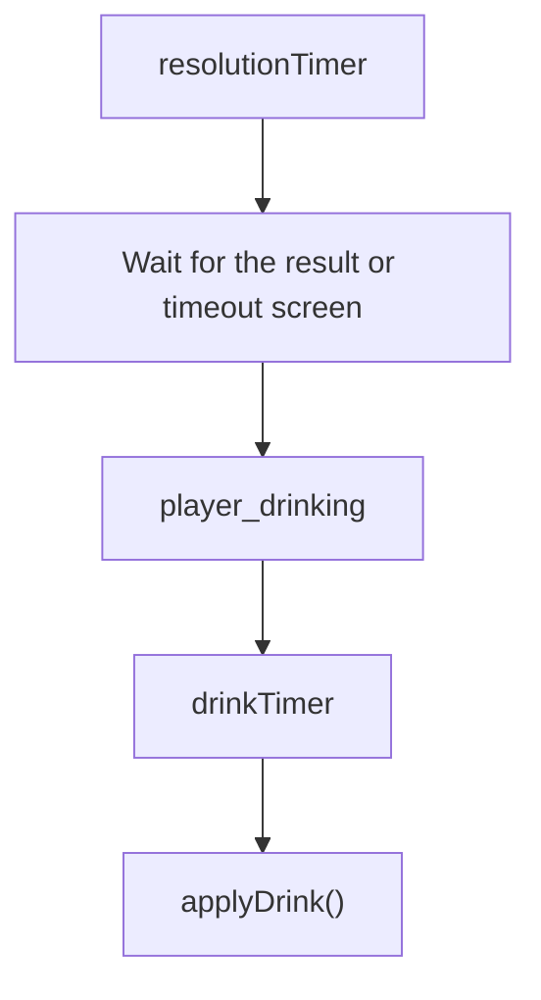

# Timer System

[Game Phase and Turn Flow](game-phase-and-turn-flow.md) explains the order in
which Madiao moves through its game phases.

The next thing worth separating out is the timing system which controls when
those phase changes actually happen.

Timers are slightly more important in Madiao than they might first appear
because the game has two different things which need to stay synchronised:



For something simple such as a turn deadline, the server needs to know when the
player has run out of time while the client needs to show roughly how much time
is left.

For a challenge or timeout sequence, the relationship is even more obvious.
The server has to wait long enough for the result screen and drinking animation
to finish before it starts the next turn.

The current timing system is therefore split between:

- server timer handles;
- shared timing values;
- client display timers;
- server timestamps.

Most timing problems come from one of those pieces no longer agreeing with the
others.


## Server Timer Slots

Every running game receives its own timer object inside:

```js
gameTimers
```

When a game begins, the server creates:

```js title="server/index.js"
gameTimers.set(lobbyCode, {
    turnTimer: null,
    cooldownTimer: null,
    resolutionTimer: null,
    drinkTimer: null
});
```

The four slots each have a different job:

| Timer | Purpose |
| --- | --- |
| `turnTimer` | Penalises the active player when their turn expires |
| `cooldownTimer` | Moves a completed play into the next player's challenge window |
| `resolutionTimer` | Waits for a challenge or timeout result screen to finish |
| `drinkTimer` | Waits for the drinking animation before applying the drink and continuing |

The timer handles are stored separately from `gameState` because they are not
really game information.

A browser needs to know whose turn it is, when the turn started and what
phase the game is in.

It does not need the internal Node.js object returned by `setTimeout()`.


## Shared Timing Values

The important durations are kept together in the shared timing constants rather
than writing separate numbers throughout the client and server.

The current values are:

| Constant | Current value | Purpose |
| --- | ---: | --- |
| `turnDurationMs` | `40000` | Full turn duration |
| `autoSubmitLeadMs` | `650` | Sends a prepared later-round play shortly before the server deadline |
| `drinkAnimationMs` | `3000` | Time given to the drinking animation |
| `notificationFadeMs` | `500` | Standard result/notification fade |
| `challengeFlashMs` | `1200` | Large opening CHALLENGE title |
| `challengeTransition` | `700` | Moves the challenge title into the result layout |
| `challengeResultMs` | `3500` | Time for players to inspect the challenge result |
| `challengeOverlayMs` | `5900` | Full challenge overlay duration |
| `timeoutMessageMs` | `1600` | Main timeout message |
| `timeoutDrinkNoticeMs` | `700` | Additional timeout display time before fading |
| `timeoutOverlayMs` | `2800` | Full timeout overlay duration |
| `cooldownMs` | `0` | Delay before the next challenge window opens |

Some of the larger values are calculated from the smaller ones.

For example:

```js title="server/shared/constants.js"
const challengeOverlayMs =
    challengeFlashMs +
    challengeTransition +
    challengeResultMs +
    notificationFadeMs;
```

which currently gives:

```text
1200 + 700 + 3500 + 500
= 5900ms
```

The timeout overlay works in the same way:

```js title="server/shared/constants.js"
const timeoutOverlayMs =
    timeoutMessageMs +
    timeoutDrinkNoticeMs +
    notificationFadeMs;
```

which gives:

```text
1600 + 700 + 500
= 2800ms
```

Keeping those totals calculated rather than typing another independent number is
important.

If the challenge result is later increased by half a second, the server's full
wait automatically increases as well.


## The 40-Second Turn Timer

The authoritative turn deadline lives on the server.

When a fresh game begins:

```js title="server/index.js"
timers.turnTimer = setTimeout(() => {
    handleTurnTimeout(
        io,
        lobbyCode,
        gameState,
        timers
    );
}, turnDurationMs);
```

With the current value, `turnDurationMs = 40000`, the player has 40 seconds.

The same pattern is used whenever a new normal turn begins after:

- a declaration;
- a challenge and drinking sequence;
- a timeout and drinking sequence.

The important thing here is that the server owns the actual deadline.

The countdown shown by React is useful feedback for the player, but the browser
does not get to decide whether the turn officially timed out.


## `turnStartedAt`

Although the server owns the actual `setTimeout()`, it also sends a timestamp to
the clients:

```js
gameState.turnStartedAt = Date.now();
```

That value becomes part of the public state.

The React client uses it to calculate the visible countdown.

Conceptually:



This is better than simply telling every browser to **start counting down
from 40 now**, because network messages do not reach every player at exactly
the same moment.

Instead, each browser can compare the server-provided timestamp with its current
time and work out approximately where the turn already is.


## Client Countdown Display

`GameTable.jsx` converts the shared millisecond value into seconds:

```js title="client/src/components/game/GameTable.jsx"
const TURN_DURATION_SECONDS =
    turnDurationMs / 1000;
```

It then updates the visible time roughly once per second.

The important calculation is effectively:

```js title="client/src/components/game/GameTable.jsx"
const elapsed = Math.floor(
    (Date.now() - turnStartedAt) / 1000
);

const remaining = Math.max(
    0,
    TURN_DURATION_SECONDS - elapsed
);
```

This means `turnTimeLeft` is local UI state.

It is not another authoritative timer on the server.

If:

```js
turnStartedAt === null
```

the client removes the countdown.

That happens during periods where there is deliberately no active turn, such as
challenge and timeout resolution.


## Why `turnStartedAt` Becomes `null`

When something interrupts the normal turn, the server does not simply leave the
old timestamp running.

For example, when a challenge begins:

```js
gameState.phase = 'resolving_challenge';
gameState.turnStartedAt = null;
```

and a timeout does the same when it moves into `resolving_timeout`.

This is useful for two reasons.

Firstly, the player should not see an old countdown continuing behind a result
screen.

Secondly, a new turn must not accidentally look as though it started 10 seconds
earlier because the client reused the previous timestamp.

The expected pattern is therefore:




## Successful Play and Turn Timer Cleanup

When a player successfully declares cards, the turn timeout which was waiting to
penalise them is no longer needed.

The server therefore clears it:

```js
if (timers.turnTimer) {
    clearTimeout(timers.turnTimer);
    timers.turnTimer = null;
}
```

This is a very important bit of timer hygiene.

Without it the following could happen:



The same principle appears throughout the timing code.

Once a timer no longer represents something which is allowed to happen, it
should be cancelled rather than simply left in the background.


## Cooldown Timer

After a valid declaration the game enters `cooldown`.

and the server creates:

```js
timers.cooldownTimer = setTimeout(() => {
    ...
}, cooldownMs);
```

When that timer fires, the server:

- clears the cooldown timer slot;
- moves to `challenge_open`;
- chooses the next active player;
- sets a new `turnStartedAt`;
- broadcasts the new state;
- starts the next `turnTimer`.

At the moment, `cooldownMs = 0`, so the change happens almost immediately.

That might make the timer look unnecessary, however, keeping the phase and timer
still has some value.

It gives the game one clear place to add a delay later if the visual design
changes.

For example, a future visual delay could work like this:



That could be introduced by changing the shared value rather than redesigning
the turn flow.


## Auto-Submit

The client also has a small timer intended to protect a player who has already
selected their cards but waits until the very end of the turn.

For later plays, where the round number is already known, the client calculates:

```js title="client/src/components/game/GameTable.jsx"
const autoSubmitAt =
    turnStartedAt +
    turnDurationMs -
    autoSubmitLeadMs;
```

With the current values:

| Value | Duration |
| --- | ---: |
| `turnDurationMs` | `40000ms` |
| `autoSubmitLeadMs` | `650ms` |
| Auto-submit point | approximately `39.35s` |

the prepared play is sent shortly before the authoritative server deadline.

That gives the Socket.IO message a small amount of time to reach the server
before the authoritative 40-second timeout fires.


### Why it does not wait for visible `0`

The browser countdown only updates in whole seconds.

Waiting for the displayed number to become `0` would therefore be fairly crude
and could easily be too late once network delay is included.

The auto-submit timer instead uses the original `turnStartedAt` timestamp and
the millisecond constants directly.


### Opening declaration

The current auto-submit logic does not automatically choose the first declared
number for the player.

The opening play needs an explicit declaration number, so if that opening action
has not been properly declared before the server deadline, the normal timeout
penalty is allowed to happen.

That avoids the client inventing a declaration on the player's behalf.


## Preventing Double Submission

Manual submission and auto-submit can happen very close together.

For example, a player could manually press **Play** at roughly `39.2s` while
the automatic submission is due at roughly `39.35s`.

Without protection, both paths could try to send the same cards.

`GameTable.jsx` therefore uses:

```js title="client/src/components/game/GameTable.jsx"
submissionStartedRef
```

to remember that a submission is already underway.

Both the manual and automatic path check that flag.

This is a small client-side detail, but it matters because timer bugs are not
always caused by a duration being wrong.

Sometimes the timing is correct and two separate actions simply race each other.


## Challenge Resolution Timer

When a challenge is accepted, the normal turn timer is cancelled and the game
moves into `resolving_challenge`.

The server sends the challenge result and then `rollDrunkness()` starts:

```js title="server/index.js"
timers.resolutionTimer = setTimeout(
    ...
    challengeOverlayMs
);
```

The current challenge overlay lasts `5900ms`.

The client spends that time roughly as follows:

| Stage | Duration |
| --- | ---: |
| Large **CHALLENGE** intro | `1200ms` |
| Layout transition | `700ms` |
| Result and revealed cards | `3500ms` |
| Fade | `500ms` |
| **Total** | **`5900ms`** |

Only after that full period does the server emit `player_drinking`.

This is the key synchronisation point.

The server is deliberately waiting for the user-facing result screen rather than
immediately applying the drink in the background.


## Challenge Drink Timer

Once the result overlay is finished, the server emits `player_drinking` and
starts:

```js title="server/index.js"
timers.drinkTimer = setTimeout(
    ...
    drinkAnimationMs
);
```

The current duration is `3000ms`.

Only when that timer finishes does the server call:

```js
applyDrink(loser)
```

and then decide whether:

- the loser was eliminated;
- the game ended;
- the challenge winner won by empty hand;
- the challenge winner gets the next turn.

The complete challenge timing can therefore be viewed as:



The full time from the challenge result starting to the server continuing is
roughly **8.9 seconds**, assuming no unrelated delay.


## Timeout Resolution Timer

The timeout sequence uses the same basic timer structure but a shorter first
overlay.

When the 40-second turn timer fires:



That resolution timer uses `timeoutOverlayMs = 2800ms`.

The client shows the timeout notification and fades it away during that period.

Afterwards the server emits `player_drinking` and starts the same `3000ms`
`drinkTimer` used by the challenge sequence.

So the timeout flow is approximately:



The whole post-timeout sequence is therefore around **5.8 seconds** before
normal gameplay resumes.


## Why Challenge and Timeout Share the Drink Timer

Both challenge and timeout penalties eventually need to do the same fundamental
thing:



Using the same `drinkAnimationMs` on both paths means the UI does not suddenly
animate drinking for three seconds after a challenge but only one second after a
timeout.

The cause of the drink changes.

The duration of the physical drinking animation does not.


## Client Challenge Timers

The server only needs the total `challengeOverlayMs` because it does not care
about every visual stage inside the overlay.

The React `ChallengeNotification` component does.

It uses the shared values to step through the visual stages:

| Client stage | Timing |
| --- | --- |
| Opening challenge title | `challengeFlashMs` |
| Move into result layout | after `challengeFlashMs` |
| Begin the final result state | after `challengeFlashMs + challengeTransition` |
| Keep result/revealed cards visible | `challengeResultMs` |
| Fade and remove the component | `notificationFadeMs` |
| **Full client lifetime** | **`challengeOverlayMs`** |

The final total is deliberately the same `challengeOverlayMs` value the server
uses for its `resolutionTimer`.

This is the main reason those timing values need to remain shared.


## Client Timeout Timers

The timeout screen is simpler.

The client begins fading it after
`timeoutMessageMs + timeoutDrinkNoticeMs` and removes it after adding
`notificationFadeMs`.

That gives the same `timeoutOverlayMs = 2800ms`

which the server waits before emitting `player_drinking`.

Again, the client owns the visual stages while the server owns the game
progression.


## Timer Cleanup During Challenge

A challenge can arrive while the next player's normal turn timer is running.

The server immediately locks the game and clears any timers which should no
longer be able to fire:

```js
if (timers.cooldownTimer) {
    clearTimeout(timers.cooldownTimer);
    timers.cooldownTimer = null;
}

if (timers.turnTimer) {
    clearTimeout(timers.turnTimer);
    timers.turnTimer = null;
}
```

This prevents a challenge from resolving while the turn timeout independently
fires in the middle of it.

That is exactly the kind of problem the phase system and timer cleanup are meant
to prevent together.


## Cleaning Timers When a Game Is Deleted

When the final player leaves or disconnects, the game itself is deleted.

Before doing that, the server clears any timer which is still active:

```js
if (timers.turnTimer) {
    clearTimeout(timers.turnTimer);
}

if (timers.cooldownTimer) {
    clearTimeout(timers.cooldownTimer);
}

if (timers.resolutionTimer) {
    clearTimeout(timers.resolutionTimer);
}

if (timers.drinkTimer) {
    clearTimeout(timers.drinkTimer);
}
```

Then the timer object can be removed from:

```js
gameTimers
```

This prevents an abandoned game's callback from waking up several seconds later
and trying to modify state which has already been deleted.


## Common Timer Problems

Timer issues normally show up in a few recognisable ways.

For a more symptom-focused production checklist, see
[Turn Timer Is Wrong](../runbook/troubleshooting.md#turn-timer-is-wrong),
[Game Gets Stuck Between Turns](../runbook/troubleshooting.md#game-gets-stuck-between-turns)
and
[Drinking Sequence Is Out of Sync](../runbook/troubleshooting.md#drinking-sequence-is-out-of-sync).


### Countdown is visually wrong but timeout happens correctly

Check `turnStartedAt`, the `GameTable` countdown calculation and the client
copy of `turnDurationMs`.

This suggests the server deadline may be fine and only the visible countdown is
wrong.


### Server times out earlier or later than the client expects

Check:

- the shared `turnDurationMs`;
- whether both client and server use the same constants;
- whether the deployed client was rebuilt;
- whether the deployed server is the same Git version.


### Next turn starts while challenge result is still visible

Check `challengeOverlayMs`, the total lifetime of `ChallengeNotification`,
`resolutionTimer` and the shared constants.


### Drinking indicator appears too early or too late

Check the boundary between `resolutionTimer`, the `player_drinking` event and
`drinkAnimationMs`.


### Player gets a timeout after already playing

Check whether the old `turnTimer` was cleared when the declaration was
accepted.


### Two declarations are sent near the deadline

Check the auto-submit timer, `submissionStartedRef` and the manual submit
path.


### Old callback fires after everybody left

Check cleanup of `turnTimer`, `cooldownTimer`, `resolutionTimer` and
`drinkTimer`.


## Timing Change Checklist

Changing a timing value is usually simple, but it is worth checking the whole
sequence afterwards.

For example, if `challengeResultMs` is changed, verify that:

- the challenge screen lasts the expected amount of time;
- cards remain visible long enough;
- the fade still finishes normally;
- `player_drinking` starts after the overlay disappears;
- the server does not start the next turn early;
- game-over still waits for the drink where required.

Similarly, changing `drinkAnimationMs` affects both challenge and timeout drink
sequences.

!!! tip "Change the shared timing value first"
    Avoid introducing a second hard-coded duration somewhere else. Keeping the
    client animation and server progression tied to the same shared value makes
    timing changes much easier to reason about.

That keeps the client animation and server progression tied to the same source.


## Chapter Summary

Madiao currently gives each active game four server-side timer slots:
`turnTimer`, `cooldownTimer`, `resolutionTimer` and `drinkTimer`.

The `turnTimer` enforces the authoritative 40-second deadline.

The client does not own that deadline. Instead, it receives `turnStartedAt` and
uses it with the shared turn duration to calculate the countdown players see.

A successful declaration clears the current turn timer and briefly enters the
cooldown path before the next player's turn timer begins.

The current cooldown is `0ms`, so the challenge window opens immediately.

Challenge and timeout sequences use two stages:



The current challenge overlay is `5900ms`, the timeout overlay is `2800ms`, and
the drinking animation is `3000ms`.

The client also uses `autoSubmitLeadMs = 650` to send an already prepared
later-round play shortly before the server's deadline, while a submission guard
prevents the automatic and manual paths from sending the same play twice.

Lastly, timer cleanup is just as important as timer creation.

Any timer which no longer represents a valid future action should be cancelled.
Otherwise an old callback can fire against the wrong turn, during a challenge,
or even after the game it belonged to has already been deleted.
